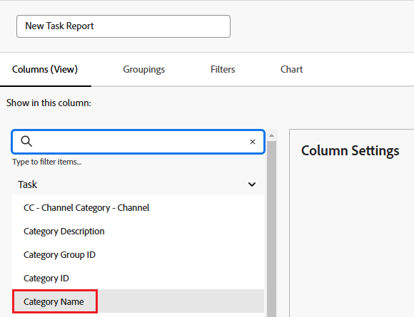

# 在報表中參考自訂表單

<!-- Audited: 11/2024 -->

您可以在報表的檢視、篩選和群組中，參照物件的自訂表單。

您可以參考要納入報表的自訂表單內容，也可以參考要納入報表的自訂表單本身相關資訊。

## 存取需求

+++ 展開以檢視本文中功能的存取需求。

您必須具有下列存取權才能執行本文中的步驟：

<table style="table-layout:auto"> 
 <col> 
 <col> 
 <tbody> 
  <tr> 
   <td role="rowheader">Adobe Workfront計畫*</td> 
   <td> 
任何
 </td> 
  </tr> 
  <tr> 
   <td role="rowheader">Adobe Workfront授權*</td> 
      <td> 
      
新增：

         <ul>
         <li>
標準
</li>
         </ul>
      
目前：

         <ul>
         <li>
規劃
</li>
         </ul>
   </td>
  </tr> 
  <tr> 
   <td role="rowheader">存取層級設定*</td> 
   <td> 
編輯報告、儀表板、行事曆的存取權
 
編輯對篩選器、檢視、群組的存取權
</td> 
  </tr> 
  <tr> 
   <td role="rowheader">物件許可權</td> 
   <td> 
管理報表的許可權
</td> 
  </tr> 
 </tbody> 
</table>

*如需詳細資訊，請參閱Workfront檔案中的[存取需求](/help/quicksilver/administration-and-setup/add-users/access-levels-and-object-permissions/access-level-requirements-in-documentation.md)。

+++

## 先決條件

自訂表單必須存在，您才能在報表中參照。

如需建立自訂表單的詳細資訊，請參閱[建立自訂表單](/help/quicksilver/administration-and-setup/customize-workfront/create-manage-custom-forms/form-designer/design-a-form/design-a-form.md)。

## 參考自訂表單的內容

您可以參考自訂表單中的欄位。 將自訂表單套用至物件後，與該自訂表單相關聯的所有欄位都可在報表中參照，就像該物件上的任何其他欄位一樣。

>[!NOTE]
>
>對於具有多個選項的欄位，報表的篩選和提示中會提供所有選項，包括隱藏的選項。\
>如需有關隱藏具有多個選項之自訂欄位中的選項的詳細資訊，請參閱文章[建立自訂表單](/help/quicksilver/administration-and-setup/customize-workfront/create-manage-custom-forms/form-designer/design-a-form/design-a-form.md)。

建立報表時，只要使用表單的物件型別作為欄位來源，並使用自訂欄位名稱作為欄位名稱即可。

例如，您可能會將自訂表單套用至包含自訂欄位&#x200B;**顧問**&#x200B;的所有專案。 若要建立列出Olivia Kim擔任顧問之所有專案的報告，請使用&#x200B;**Project**&#x200B;物件型別做為欄位來源，並使用&#x200B;**Consultant**&#x200B;做為欄位名稱。 將篩選限定詞設為&#x200B;**等於**，然後輸入Olivia Kim。

如需有關建立報告的詳細資訊，請參閱文章[建立自訂報告](../../../reports-and-dashboards/reports/creating-and-managing-reports/create-custom-report.md)。

## 自訂表格的相關參考資訊

您可以參考自訂表單的相關資訊，例如與物件相關聯的任何自訂表單名稱。

根&#x200B;據元素（檢視、篩選或分組），您可以參照：

* 套用至物件的主要自訂表單：

  此表單會先出現在物件的「詳細資訊」頁面上。

* 所有自訂表單（如果多個自訂表單套用至物件）

您可以在檢視、篩選器和分組上參考自訂表單：

* [在報告檢視（欄）中參考自訂表單](#reference-custom-forms-in-a-report-view-column)
* [在報告篩選器中參考自訂表單](#reference-custom-forms-in-a-report-filter)
* [在報告分組中參考自訂表單](#reference-custom-forms-in-a-report-grouping)

### 在報表檢視（欄）中參考自訂表單 {#reference-custom-forms-in-a-report-view-column}

若要顯示與物件相關聯的所有自訂表單：

1. 開始建立報告，如文章[建立自訂報告](../../../reports-and-dashboards/reports/creating-and-managing-reports/create-custom-report.md)中所述。
1. 在&#x200B;**資料行**&#x200B;標籤上，展開要套用參考之自訂表單的物件型別，然後按一下&#x200B;**類別名稱**。\
   例如，若要顯示與任務相關的所有自訂表單，請展開&#x200B;**任務**&#x200B;欄位來源，然後按一下&#x200B;**類別名稱**&#x200B;欄位名稱。\
   

若只要顯示與物件相關聯的主要自訂表單：

1. 開始建立報告，如文章[建立自訂報告](../../../reports-and-dashboards/reports/creating-and-managing-reports/create-custom-report.md)中所述。
1. 在&#x200B;**欄**&#x200B;標籤上，展開&#x200B;**類別**&#x200B;欄位來源，然後按一下&#x200B;**名稱**&#x200B;欄位名稱。\
   

### 在報表篩選器中參考自訂表單 {#reference-custom-forms-in-a-report-filter}

若要篩選與物件型別相關的所有自訂表單：

1. 開始建立報告，如文章[建立自訂報告](../../../reports-and-dashboards/reports/creating-and-managing-reports/create-custom-report.md)中所述。
1. 在&#x200B;**篩選器**&#x200B;標籤上，展開&#x200B;**類別**，然後按一下&#x200B;**名稱**。\
   

1. 選取您要使用的條件限定詞：

   * 空白
   * 不為空白
   * 包含
   * 不包含
   * 等於
   * 不等於

   如需每個限定詞的詳細資訊，請參閱文章[篩選和條件修飾詞](../../../reports-and-dashboards/reports/reporting-elements/filter-condition-modifiers.md)。

   >[!NOTE]
   >
   >如果您要篩選的欄位有多個選項，而您使用&#x200B;**不等於**&#x200B;或&#x200B;**不包含**&#x200B;限定詞，這會篩選出僅包含您指定之選項的結果。 如果欄位包含其他選項（包括指定的選項），則不會從報表中篩選這些結果。 這包括篩選多個自訂Forms （如果附加到相同物件）。

1. 開始輸入您要篩選的自訂表單名稱，然後按一下該名稱（當它出現在下拉式清單中時）。
1. （選擇性）按一下&#x200B;**新增其他篩選規則**，然後重複步驟2至4以建立其他篩選規則。
1. 按一下&#x200B;**儲存+關閉**。

若要僅篩選與物件型別相關的主要自訂表單：

1. 開始建立報告，如文章[建立自訂報告](../../../reports-and-dashboards/reports/creating-and-managing-reports/create-custom-report.md)中所述。
1. 在&#x200B;**篩選器**&#x200B;標籤上，展開&#x200B;**類別**&#x200B;欄位來源，然後按一下&#x200B;**名稱**&#x200B;欄位名稱。\
   

1. 選取您要使用的條件限定詞：

   * 空白
   * 不為空白
   * 包含
   * 不包含
   * 等於
   * 不等於

   如需每個限定詞的詳細資訊，請參閱文章[篩選和條件修飾詞](../../../reports-and-dashboards/reports/reporting-elements/filter-condition-modifiers.md)。

1. 開始輸入您要篩選的自訂表單名稱，然後按一下該名稱（當它出現在下拉式清單中時）。
1. （選擇性）按一下&#x200B;**新增其他篩選規則**，然後重複步驟2至4以建立其他篩選規則。
1. 按一下&#x200B;**儲存+關閉**。

### 在報告分組中參考自訂表單 {#reference-custom-forms-in-a-report-grouping}

>[!NOTE]
>
>您只能依照與物件相關聯的主要自訂表單來群組專案；不能依照與物件相關聯的所有表單來群組專案。

1. 開始建立報告，如文章[建立自訂報告](../../../reports-and-dashboards/reports/creating-and-managing-reports/create-custom-report.md)中所述。
1. 在&#x200B;**群組**&#x200B;標籤上，展開&#x200B;**類別**，然後按一下&#x200B;**名稱**。\
   
