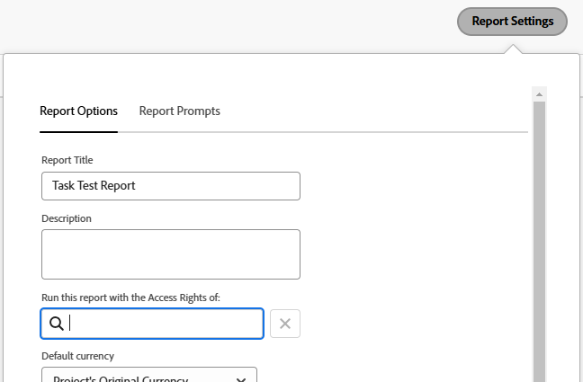

# 執行並傳遞具有其他使用者存取許可權的報告

<!-- Audited: 11/2024 -->

依預設，使用者只能在他們有權檢視的報告中檢視物件。

您可以允許所有使用者在報表中看到與其他使用者相同的結果，無論他們對於報表中物件的存取層級或許可權層級為何。

如果您透過其他擁有較高存取許可權的使用者的存取許可權(例如，Adobe Workfront管理員的存取許可權)來執行報表，則所有擁有檢視報表許可權的使用者，都可以以Report Builder中指定的使用者身分，檢視報表中的資訊。 您可以為使用者在Workfront介面中找到的兩個報表，或是以電子郵件附件形式傳遞給使用者的報表，設定此專案。

>[!TIP]
>
>您應該將&#x200B;**以：**&#x200B;的存取許可權執行此報告欄位取代為作用中使用者，但前提是您想要以該使用者的存取許可權顯示報告。 例如，工作授權使用者可能沒有許可權檢視計畫授權使用者或系統管理員建立的報告中的所有專案，除非報告顯示時具有供需規劃員或系統管理員的存取許可權。\
>如果報告與具有類似存取許可權的使用者共用，該存取許可權在&#x200B;**執行此報告時具有：**&#x200B;欄位，您可以將此欄位保留空白。

## 存取需求

+++ 展開以檢視本文中功能的存取需求。 

<table style="table-layout:auto"> 
 <col> 
 <col> 
 <tbody> 
  <tr> 
   <td role="rowheader">Adobe Workfront套件</td> 
   <td> <p>任何</p> </td> 
  </tr> 
  <tr> 
   <td role="rowheader">Adobe Workfront授權</td> 
   <td> 
      <p>標準</p>
      <p>規劃</p>
   </td>
  </tr> 
  <tr> 
   <td role="rowheader">存取層級設定</td> 
   <td> <p>編輯報告、儀表板、行事曆的存取權</p> <p>編輯對篩選器、檢視、群組的存取權</p></td> 
  </tr> 
  <tr> 
   <td role="rowheader">物件許可權</td> 
     <td> <p>檢視許可權報表以檢視傳遞的報表</p>
     <p>管理執行報告的報告許可權</p></td> 
  </tr> 
 </tbody> 
</table>

如需有關此表格的詳細資訊，請參閱Workfront檔案中的[存取需求](/help/quicksilver/administration-and-setup/add-users/access-levels-and-object-permissions/access-level-requirements-in-documentation.md)。

+++

## 顯示具有其他使用者存取許可權的報告

將&#x200B;**存取許可權為**&#x200B;的欄位填入此報表中，可確保報表包含相同的資料，無論存取報表的使用者為何。 報表會依指定使用者的顯示方式顯示。

存取報告的使用者必須至少具有報告的檢視許可權，才能看到報告。 如果&#x200B;**執行此報告時列出的具有：**&#x200B;存取許可權欄位的使用者已停用，則報告不再顯示給共用該報告的任何其他使用者。

若要以其他使用者的存取許可權執行報告：

1. 按一下Adobe Workfront右上角的&#x200B;**[!UICONTROL 主功能表]**&#x200B;圖示，或（如果有的話）按一下左上角的&#x200B;**[!UICONTROL 主功能表]**&#x200B;圖示，然後按一下&#x200B;**[!UICONTROL 報表]**。

1. 選取您要以其他使用者的存取許可權顯示的報告。
1. 按一下&#x200B;**報告動作**，然後按一下&#x200B;**編輯**。

1. 按一下&#x200B;**報表設定**。

1. 在&#x200B;**使用：**&#x200B;的存取許可權執行此報告欄位中，開始輸入您希望報告顯示為的使用者名稱，然後在清單中看到報告時選取它。\
   以

   >[!NOTE]
   >
   >具有較低存取層級、可建置報表的使用者無法為&#x200B;**以**&#x200B;欄位的存取許可權執行此報表。

1. 按一下「**完成**」。
1. 按一下「**儲存並關閉**」。\
   現在，與共用報告的所有使用者都會顯示該報告，就好像該報告是由&#x200B;**以**&#x200B;欄位的存取許可權執行此報告中指定的使用者檢視過一樣。

>[!IMPORTANT]
>
>如果報表包含使用萬用字元的篩選器，指出登入使用者為&#x200B;**執行此報告的存取許可權為：**&#x200B;欄位，則輸入使用者以外的使用者將會影響報告中顯示的資訊。 報告會根據&#x200B;**使用**&#x200B;欄位的存取許可權執行此報告中指定的值顯示，而不是根據萬用字元篩選器中定義的值顯示。
>
>如需使用者欄位萬用字元的詳細資訊，請參閱[萬用字元篩選變數概觀](../../../reports-and-dashboards/reports/reporting-elements/understand-wildcard-filter-variables.md)中的「使用者型變數」一節。

## 傳送具有其他使用者存取許可權的報告

您可以設定要作為電子郵件附件傳送的報表。 您可以設定這些傳送的報表在針對較高存取層級的使用者顯示時顯示，讓所有使用者都可以在傳送的報表中看到相同的資訊。 將會看到以電子郵件傳送之報表的使用者，必須新增至報表傳送內的「傳送至」收件者清單。 如需設定報表以進行傳送的詳細資訊，請參閱文章[報表傳送概覽](../../../reports-and-dashboards/reports/creating-and-managing-reports/set-up-report-deliveries.md)。

若要傳送具有其他使用者存取許可權的報告：

1. 按一下Workfront右上角的&#x200B;**主功能表**&#x200B;圖示，然後按一下&#x200B;**報表**。

1. 選取您要傳送且有其他使用者存取許可權的報告。
1. 按一下報表名稱以將其選取。
1. 按一下&#x200B;**報告動作**。
1. 按一下&#x200B;**傳送報告**。

1. 在&#x200B;**傳送此報告並具有：**&#x200B;存取許可權的欄位中，開始輸入您想要報告在電子郵件中傳送時顯示的使用者名稱，然後在清單中看到報告時選取它。 預設值為建立報表的使用者名稱。\
   的報告

   >[!NOTE]
   >
   >具有較低存取層級、可建置報表的使用者，無法為&#x200B;**傳遞此報表（存取許可權為：**&#x200B;欄位）選取除自己以外的使用者。

1. 選取您要在電子郵件中顯示報告的&#x200B;**格式**：

   * HTML
   * PDF
   * Excel
   * Excel (.xlsx)
   * TSV

1. 按一下&#x200B;**立即傳送**&#x200B;以立即傳送。\
   或\
   按一下&#x200B;**重複傳遞**&#x200B;以排程報告的重複傳遞。\
   如需報告傳送的詳細資訊，請參閱文章[報告傳送概觀](../../../reports-and-dashboards/reports/creating-and-managing-reports/set-up-report-deliveries.md)。

## 具有Source欄的報表限制

下列報表會顯示Source欄，您可在其中檢視有關父物件的資訊：

* 問題報告
* 小時報告
* 檔案報表

如果使用者沒有問題、小時或檔案的父物件許可權，即使報告已設定為顯示，或已透過其他使用者的存取許可權傳送，報告的Source欄也會顯示空白。

為了在報告中顯示有關父物件的資訊，我們建議為父物件新增一欄，您可以在其中顯示父物件的名稱。

例如，您可以將下列任何專案新增至具有Source欄的報表：

* 專案名稱、任務名稱或問題名稱欄到檔案或小時報告。
* 問題報告的「專案名稱」或「任務名稱」欄。
* 使用參照所有三個物件的文字模式運算式的欄。 以下是時數報告的範例：

  ```
  displayname=Custom Source
  
  linkedname=opTask
  
  namekey=view.relatedcolumn
  
  namekeyargkey.0=opTask
  
  namekeyargkey.1=name
  
  textmode=true
  
  valueexpression=IF(!ISBLANK({opTaskID}),{opTask}.{name},IF(!ISBLANK({taskID}),{task}.{name},IF(!ISBLANK({projectID}),{project}.{name},IF(!ISBLANK({timesheetID}),CONCAT({owner}.{name}," ",{timesheet}.{startDate}," - ",{timesheet}.{endDate}),""))))
  
  valueformat=HTML
  ```

  如需文字模式檢視的相關資訊，請參閱[使用文字模式編輯檢視](../text-mode/edit-text-mode-in-view.md)。
