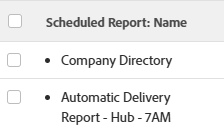

# 報表傳送概覽

<!-- Audited: 11/2024 -->

<!--

(NOTE: This is linked to the UI in the Send Report box inside the Preview sandbox. If you change title, log bug for Dev to fix the link) 

-->

您可以排程報表，以按照定義的排程自動傳送給使用者，或者您可以手動傳送一次性報表。 當您從Adobe Workfront傳送報告時，使用者會收到一封電子郵件，其中包含個別附件中的Workfront報告。

如需設定報表傳送的相關資訊，請參閱文章[排程自動報表傳送](../../../reports-and-dashboards/reports/creating-and-managing-reports/set-up-automatic-report-delivery.md)。

您無法排程報表進行傳送，也無法在「預覽Sandbox」環境中手動傳送。 如需有關預覽沙箱的詳細資訊，請參閱文章[Adobe Workfront預覽沙箱環境](../../../administration-and-setup/set-up-workfront/workfront-testing-environments/wf-preview-sandbox-environment.md)。\
如需有關在預覽Sandbox環境中傳送報告的詳細資訊，請參閱文章[在預覽Sandbox環境中傳送報告](../../../reports-and-dashboards/reports/creating-and-managing-reports/send-report-preview-sandbox-environment.md)。

## 報告傳遞限制

<!--

(NOTE: [! This information is shared between "Exporting Data" and "Setting Up Report Deliveries."])

-->

排程報表傳送時，請考量下列事項：

* 您最多可以為任何指定報告排程10個重複報告傳遞。
* 只有當您是報表的建立者時，才能排程報表傳送。 如果您需要傳送未建立的報表，可以手動傳送。

## 匯出限制

有數個大小限制會影響報表在Workfront中的顯示方式，以及透過手動匯出、傳送報表或透過API匯出的方式：

* **10MB檔案大小：**&#x200B;任何排定傳送之匯出報告的檔案大小限制。 如果附加至電子郵件的匯出檔案大於5MB，則會以電子郵件傳送可下載該檔案的連結，而非附加的匯出報告。

  >[!NOTE]
  >
  >大於10MB的Excel .xlsx檔案不會產生電子郵件。 您可以手動將報表匯出為此格式。 如需有關匯出報告的資訊，請參閱[匯出資料](../../../reports-and-dashboards/reports/creating-and-managing-reports/export-data.md)。

* **50,000列：**&#x200B;報表匯出中允許用於.pdf和Tab分隔檔案的資料列數。

  若是Excel .xls檔案，此限製為&#x200B;**65,000列**。

  若為Excel .xlsx檔案，此限製為&#x200B;**100,000列**。

  這些限制會排除欄標題，以及報表中分組的列。 例如，如果報表中有6個群組，且有50,000列資料，則匯出的檔案會有50,000列。

  如果報告的專案數超過這些限制，您會收到報告匯出和傳送不成功的錯誤。 將您在畫面上看到的專案數減少到小於或等於這些限制的數字，以便能夠傳送結果。 如果要匯出所有資料，我們建議您使用篩選器來取得較小的資料負載，然後執行多個匯出。 如需詳細資訊，請參閱[篩選器總覽](../../../reports-and-dashboards/reports/reporting-elements/filters-overview.md)。

  這些限制適用於：

   * 手動匯出報告。
   * 排程報告。
   * 透過API整合的匯出。
   * 透過Kick-Start匯出的資料。

     如需有關透過Kick-Starts匯出資料的詳細資訊，請參閱文章[透過Kick-Starts從Adobe Workfront匯出資料](../../../administration-and-setup/manage-workfront/using-kick-starts/export-data-from-wf-via-kick-starts.md)。

     >[!NOTE]
     >
     >您可以在快速啟動檔案中匯出50,000列，但只能匯出為Excel格式檔案。

   * 匯出專案的利用資訊。

     如需有關匯出專案使用率資訊的詳細資訊，請參閱[資源使用率報告概述](../../../reports-and-dashboards/reports/using-built-in-reports/resource-utilization-report.md)。

* **65,530個超連結：**&#x200B;這是Excel對包含超過65,530個超連結的檔案所強加的限制。 以手動方式匯出或以傳送的報表傳送檔案時，無法開啟這些檔案。 請注意，一個Excel檔案可能只有200列資料，但如果檔案中有超過65,530個連結，則檔案不會開啟。 此限制僅存在於Excel檔案中，不存在於其他支援的格式中。
* **256欄**：這是Excel對包含超過256欄的檔案所施加的限制。 這些檔案無法手動匯出，或以傳送的報告傳送。 此限制僅存在於Excel檔案中，不存在於其他支援的格式中。

如果您嘗試匯出超過限制的資料，您可能無法收到匯出中預期的所有資料。 而是會在限制內產生修改後的報表。

此外，需要超過60分鐘才能執行的報表將會暫停。

如果您對限額有任何顧慮或問題，請聯絡Workfront技術支援。

## 瞭解已傳送報表的時間戳記

<!--

(NOTE: Note about if this is delivered at a time based on the user's time zone settings?)

-->

以電子郵件接收報表時，如果您要在傳送報表的同時在Workfront中檢視報表，則報表上的時間戳記和時間格式可能會不符合Workfront中的時間戳記和時間格式。

請考量下列事項：

* 在瀏覽器中檢視報表時，報表上的時間戳記和格式會符合瀏覽器的地區設定和時區，如瀏覽器的設定中所定義。
* 以電子郵件傳送報表時，報表會傳送具有時間戳記和格式的報告，且符合在Workfront設定檔中指定的使用者地區設定和時區。\
  如需Workfront中使用者地區設定和時區的詳細資訊，請參閱文章[編輯使用者設定檔](../../../administration-and-setup/add-users/create-and-manage-users/edit-a-users-profile.md)。

## 具有特殊檢視的報告 {#reports-with-a-special-view}

當您將特殊檢視套用至報表時，特殊檢視會顯示在Workfront中報表的詳細資訊索引標籤中。

當您排程具有特殊檢視的報告傳送時，詳細資訊索引標籤會傳送在已傳送電子郵件的附件中，而不是在特殊檢視中。

下列是特殊檢視：

* 專案報告上的里程碑檢視
* 專案或任務報告的甘特圖
* 以圖表作為預設標籤的報告

>[!NOTE]
>
>如果除了具有特殊檢視的預設標籤之外，報表上也有Matrix標籤，則報表會以其顯示在Matrix標籤上的方式傳送。

如需如何將特殊檢視套用至報告的詳細資訊，請參閱文章[建立自訂報告](../../../reports-and-dashboards/reports/creating-and-managing-reports/create-custom-report.md)。

## 使用傳遞的檔案

當您從Workfront傳送報告時，使用者會收到一封電子郵件，其中包含單獨附件中的報告。

* [主旨列、附件名稱和報告標題](#subject-line-attachment-name-and-report-title)
* [時間戳記](#timestamps)
* [品牌](#branding)
* [正在格式化](#formatting)
* [連結](#links)

### 主旨列、附件名稱和報告標題 {#subject-line-attachment-name-and-report-title}

如需已傳送報表電子郵件主旨行的詳細資訊，請參閱[排程自動報表傳送](../../../reports-and-dashboards/reports/creating-and-managing-reports/set-up-automatic-report-delivery.md)。

附加報告的名稱是： *The_Name_Of_The_Report*，後面跟著匯出的檔案格式。

如果您排程將傳送的報表格式化為PDF或HTML檔案，報表標題將為：

*報告的名稱。*

排程以Excel、Excel (.xlsx)或TSV格式傳送的報表沒有標題。

>[!NOTE]
>
>如果報告有說明，如果檔案格式為PDF或HTML檔案，則會將其包含在匯出的檔案中。

### 時間戳記 {#timestamps}

僅當檔案格式為.pdf時，附加檔案才會顯示時間戳記。 時間戳記位於附加檔案的頁尾中。

時間戳記包括：

* 日期
* 時間
* 傳送報告的時區

### 品牌化 {#branding}

如果您的Workfront管理員已將自訂品牌新增至您的Workfront執行個體，則以.pdf格式傳送的報告也會包含您的個人化標誌。

以所有其他格式傳送的報告無法以您的標誌進行個人化。

如需有關品牌化Workfront執行個體的詳細資訊，請參閱文章[品牌化Adobe Workfront執行個體](../../../administration-and-setup/customize-workfront/brand-workfront/brand-your-workfront-instance.md)。

### 格式設定 {#formatting}

除非報表有特殊檢視，否則在傳送或排程傳送報表時，您一律會收到報表的詳細資訊標籤。

如果您的報表在Web應用程式中具有特殊格式，則僅針對.pdf和Excel檔案傳送「詳細資料」和「矩陣」標籤時，應使用特殊格式傳送報表。

報告的篩選、檢視或分組不包含在傳遞的檔案中。 只有在以PDF檔案傳送報表時，才會包含報表說明。

如需以特殊檢視接收報告的詳細資訊，請參閱文章[以特殊檢視的報告](#reports-with-a-special-view)。\
如需有關選取報表預設標籤以及特殊格式的詳細資訊，請參閱[建立自訂報表](../../../reports-and-dashboards/reports/creating-and-managing-reports/create-custom-report.md)。

### 連結 {#links}

當您從Workfront將報表傳送到PDF或Excel格式時，原始檔案中存在的任何有效連結都會保留在傳送的檔案中。 連結可以指向Workfront中支援連結的任何物件。

電子郵件訊息中的報告名稱也是連結。

## 報告排程報告

您可以透過建立下列專案，檢視報表是否已設定為傳送：

* 在報表的清單或報表中針對報表物件建立&#x200B;**檢視**：在報表的清單或報表中建立檢視，並將下列欄新增至檢視：\
  *排程報表名稱。\
  *針對該報告排程的所有傳送的名稱會列在專案符號清單的欄中。\
  

* **報表物件的篩選器**：在報表清單或報表的報表中建立篩選器，其陳述如下： *排程報表ID不是空白的*。\
  這只會顯示已在您的清單或報告中排程的報告。\
  \
  如需建立報告的詳細資訊，請參閱[建立自訂報告](../../../reports-and-dashboards/reports/creating-and-managing-reports/create-custom-report.md)。 如需有關建立報告的相關資訊，請參閱[建立報告活動的報告](../../../reports-and-dashboards/reports/report-usage/create-report-reporting-activities.md)。

<!--
<h2 data-mc-conditions="QuicksilverOrClassic.Draft mode">Scheduling a Repeating Report Delivery</h2>
-->

<!--

You can schedule up to 10 repeating report deliveries for any given report.

-->

<!--

You can schedule a report to be delivered only if you are the creator of the report. If you need to send a report that you did not create, you can send it on a manual basis.

-->

<!--

To schedule a report for automatic delivery or to edit an existing report delivery: ​

-->

<!--
   <li value="1" data-mc-conditions="QuicksilverOrClassic.Draft mode">Navigate to and click the name of the report for which you want to schedule delivery. </li>
   -->

<!--
   <li value="2" data-mc-conditions="QuicksilverOrClassic.Draft mode">Click <strong>Report Actions</strong>, then <strong>Send Report</strong>.  The <strong>Send Report</strong> dialog box is displayed.</li>
   -->

<!--
   <li value="3" data-mc-conditions="QuicksilverOrClassic.Draft mode">Select the <strong>Repeating Deliveries</strong> tab. </li>
   -->

<!--
   <li value="4" data-mc-conditions="QuicksilverOrClassic.Draft mode">(Conditional) To modify an existing repeating report delivery, select the report delivery in the <strong>Repeating Deliveries</strong> section.</li>
   -->

<!--
   <li value="5" data-mc-conditions="QuicksilverOrClassic.Draft mode">Specify the following information:
   <ul>
   <li data-mc-conditions="QuicksilverOrClassic.Draft mode"><strong>Send to:</strong> Begin typing the name of the user, group, team, or role who you want to send the report to, then click the name when it appears in the drop-down list. Or Specify the email address of a person external to the Workfront system who you want to have access to the report.  Repeat this process to send the report to multiple users, groups, teams, or roles.</li>
   <li data-mc-conditions="QuicksilverOrClassic.Draft mode"><strong>Email Subject:</strong> Specify a subject for the email notification.  By default, the email subject is: <em>Workfront Report: <Name of the report> Date of the Export</em>.<strong></strong></li>
   <li data-mc-conditions="QuicksilverOrClassic.Draft mode"><strong>Email Message:</strong> Specify a message to include in the email. By default, the email message is: <em>Attached is the <report frequency> report <Name of the report> generated by Workfront on <Date>.</em> 
   <note type="note">
   For reports delivered as an Excel file only, the following message is also added to the email: "Please be aware that with MS Excel (XLS) file types, there is a limit (65,530) on the number of hyperlinks these file types support. If you exceed those limits, your file will not open and it is recommended to resend without the hyperlinks. Please go back to the report scheduler to remove hyperlinks and resend the report." The "please go back to the report scheduler" phrase is a link back to the report. 
   </note>
   </li>
   <li data-mc-conditions="QuicksilverOrClassic.Draft mode"><strong>Deliver this report with the Access Rights of:</strong> Begin typing the name of a user who has access to the report, then click the name when it appears in the drop-down list. Users who receive the report will be granted the same level of access to the report as the user that you specify here.  For more information, see <a href="../../../reports-and-dashboards/reports/creating-and-managing-reports/run-deliver-report-access-rights-another-user.md" class="MCXref xref">Run and deliver a report with the access rights of another user</a>
   <note type="note">
   This field does not support wildcards. For example, using the wildcard $$User.ID does not run the report with the access rights of the user who is receiving the report.
   </note>
   </li>
   <li data-mc-conditions="QuicksilverOrClassic.Draft mode"><strong>Format:</strong> Select in which of the following formats you want the report to be delivered:
   <ul>
   <li data-mc-conditions="QuicksilverOrClassic.Draft mode"> HTML</li>
   <li data-mc-conditions="QuicksilverOrClassic.Draft mode">PDF</li>
   <li data-mc-conditions="QuicksilverOrClassic.Draft mode">MS Excel</li>
   <li data-mc-conditions="QuicksilverOrClassic.Draft mode">MS Excel (.xlsx)</li>
   <li data-mc-conditions="QuicksilverOrClassic.Draft mode">TSV  </li>
   </ul></li>
   <li data-mc-conditions="QuicksilverOrClassic.Draft mode"><strong>Include Links:</strong> This option is available only when <strong>MS Excel</strong> is selected in the <strong>Format</strong> drop-down menu. When this option is enabled, any hyperlinks are included in the exported Excel document.  Documents that contain more than 65,530 links cannot be opened. If the exported document will contain more than 65,530 links, deselect this option. This option is enabled by default. </li>
   <li data-mc-conditions="QuicksilverOrClassic.Draft mode"><strong>Summary:</strong> Displays a summary of when the delivery repeats.</li>
   <li data-mc-conditions="QuicksilverOrClassic.Draft mode"><strong>Repeats:</strong> Select whether the report should be delivered daily, weekly, monthly, or yearly.</li>
   <li data-mc-conditions="QuicksilverOrClassic.Draft mode"><strong>Repeats Every:</strong> Select the frequency with which you want the delivery to repeat. The value you select for this option is based on the option that is selected in the <strong>Repeats</strong> drop-down list.</li>
   <li data-mc-conditions="QuicksilverOrClassic.Draft mode"><strong>Time:</strong> Select the time of day for the delivery to be sent.</li>
   
<strong>Repeats On:</strong> This option is available when the <strong>Repeats</strong> option is set to either <strong>Weekly</strong> or <strong>Monthly</strong>.

   <li data-mc-conditions="QuicksilverOrClassic.Draft mode">When the <strong>Repeats</strong> option is set to <strong>Weekly</strong>: Select the days of the week that the delivery is sent.</li>
   <li data-mc-conditions="QuicksilverOrClassic.Draft mode">When the <strong>Repeats</strong> option is set to <strong>Monthly</strong>: Select whether the delivery is sent on the day of the month, day of the week, or last day of the month (these options leverage the date that you select in the <strong>Starts On</strong> field).</li>
   <li data-mc-conditions="QuicksilverOrClassic.Draft mode"><strong>Starts On:</strong> Select the date for the scheduled delivery to begin.</li>
   <li data-mc-conditions="QuicksilverOrClassic.Draft mode"><strong>Ends On:</strong> Select a date for the scheduled delivery to end.  Or</li>
   <li data-mc-conditions="QuicksilverOrClassic.Draft mode">Select <strong>Never</strong> if you want the scheduled delivery to last indefinitely.</li>
   -->

<!--
   <li value="6" data-mc-conditions="QuicksilverOrClassic.Draft mode">Click <strong>Save</strong> to save the report delivery.  The report is saved in the <strong>Repeating Deliveries</strong> section (in the <strong>Send Report</strong> dialog box).  The report will be sent at the schedule time Or To manually send the report, click <strong>Send Now</strong>. For more information about sending the report instantly or manually, see .</li>
   -->

<!--
<h2 data-mc-conditions="QuicksilverOrClassic.Draft mode">Deleting a Scheduled Report Delivery</h2>
-->

<!--
   <li value="1" data-mc-conditions="QuicksilverOrClassic.Draft mode">Go to the report with the delivery you want to delete.</li>
   -->

<!--
   <li value="2" data-mc-conditions="QuicksilverOrClassic.Draft mode">Click <strong>Report Actions</strong>, then <strong>Send Report</strong>. </li>
   -->

<!--
   <li value="3" data-mc-conditions="QuicksilverOrClassic.Draft mode">Click <strong>Repeating Deliveries</strong>. </li>
   -->

<!--
   <li value="4" data-mc-conditions="QuicksilverOrClassic.Draft mode">Click the name of the scheduled delivery you want to delete, then click <strong>Delete</strong>. The report is no longer set up for the scheduled delivery. </li>
   -->

<!--
<h2 data-mc-conditions="QuicksilverOrClassic.Draft mode">Sending a Report Manually, on a One-Time Basis</h2>
-->

<!--

You can manually send a report that has been previously scheduled, or you can create a single-use report delivery.​

-->

<!--
  <li data-mc-conditions="QuicksilverOrClassic.Draft mode"><a title="Setting Up Report Deliveries" href="#sending-a-scheduled-report-now" class="MCXref xref">Sending a Scheduled Report Now</a> </li>
  -->

<!--
  <li data-mc-conditions="QuicksilverOrClassic.Draft mode"><a title="Setting Up Report Deliveries" href="#sending-a-report-one-time-only" class="MCXref xref">Sending a Report (One Time Only)</a> </li>
  -->

<!--
<h3 data-mc-conditions="QuicksilverOrClassic.Draft mode" id="sending-a-scheduled-report-now">Sending a Scheduled Report Now</h3>
-->

<!--

After a scheduled report has been set up, you can manually send the report rather than waiting until the scheduled time.

-->

<!--
   <li value="1" data-mc-conditions="QuicksilverOrClassic.Draft mode">Navigate to and click the name of the report that you want to send now.</li>
   -->

<!--
   <li value="2" data-mc-conditions="QuicksilverOrClassic.Draft mode">Click <strong>Report Actions</strong>, then <strong>Send Report</strong>.  The Send Report dialog box is displayed.</li>
   -->

<!--
   <li value="3" data-mc-conditions="QuicksilverOrClassic.Draft mode">Click the <strong>Repeating Deliveries</strong> tab.</li>
   -->

<!--
   <li value="4" data-mc-conditions="QuicksilverOrClassic.Draft mode">In the <strong>Repeating Deliveries</strong> section, select the report delivery that was previously created. </li>
   -->

<!--
   <li value="5" data-mc-conditions="QuicksilverOrClassic.Draft mode">Click <strong>Send Now</strong>.  The report is sent to all users identified in the scheduled delivery.</li>
   -->

<!--
<h3 data-mc-conditions="QuicksilverOrClassic.Draft mode" id="sending-a-report-one-time-only">Sending a Report (One Time Only)</h3>
-->

<!--

You can manually send a report at any time. When you send a report in this way, delivery information (such as the users you are sending to and the email subject) are not saved. If you want to create a report delivery that you can save for later use, create a repeating scheduled report. 

-->

<!--

To send a report to users (one time only):

-->

<!--
   <li value="1" data-mc-conditions="QuicksilverOrClassic.Draft mode">Navigate to and click the name of the report that you want to send now.</li>
   -->

<!--
   <li value="2" data-mc-conditions="QuicksilverOrClassic.Draft mode">Click <strong>Report Actions</strong>, then <strong>Send Report</strong>.  The <strong>Send Report</strong> dialog box is displayed. </li>
   -->

<!--
   <li value="3" data-mc-conditions="QuicksilverOrClassic.Draft mode">On the <strong>Send Now</strong> tab, specify the following information:
   <ul>
   <li data-mc-conditions="QuicksilverOrClassic.Draft mode"><strong>Send to:</strong> Begin typing the name of the user, group, team, or role who you want to send the report to, then click the name when it appears in the drop-down list. Or, specify the email address of a person external to the Workfront system who you want to have access to the report.  Repeat this process to send the report to multiple users, groups, teams, or roles.</li>
   <li data-mc-conditions="QuicksilverOrClassic.Draft mode"><strong>Email Subject:</strong> Specify a subject for the email notification.  By default, the email subject is: <em>Workfront Report: <Name of the report> Date of the Export</em>.</li>
   <li data-mc-conditions="QuicksilverOrClassic.Draft mode"><strong>Email Message:</strong> Specify a message to include in the email. By default, the email message is: <em>Attached is the <report frequency> report <Name of the report> generated by Workfront on <Date>.</em> 
   <note type="note">
   For reports delivered as an Excel file only, the following message is also added to the email: "Please be aware that with MS Excel (XLS) file types, there is a limit (65,530) on the number of hyperlinks these file types support. If you exceed those limits, your file will not open and it is recommended to resend without the hyperlinks. Please go back to the report scheduler to remove hyperlinks and resend the report." The "please go back to the report scheduler" phrase is a link back to the report. 
   </note>
   </li>
   <li data-mc-conditions="QuicksilverOrClassic.Draft mode"><strong>Deliver this report with the Access Rights of:</strong> Begin typing the name of a user who has access to the report, then click the name when it appears in the drop-down list. Users who receive the report will be granted the same level of access to the report as the user that you specify here.  For more information, see <a href="../../../reports-and-dashboards/reports/creating-and-managing-reports/run-deliver-report-access-rights-another-user.md" class="MCXref xref">Run and deliver a report with the access rights of another user</a>.
   <note type="note">
   This field does not support wildcards. For example, using the wildcard $$User.ID does not run the report with the access rights of the user who is receiving the report.
   </note>
   </li>
   <li data-mc-conditions="QuicksilverOrClassic.Draft mode"><strong>Format:</strong> Select in which of the following formats you want the report to be delivered:
   <ul>
   <li data-mc-conditions="QuicksilverOrClassic.Draft mode"> HTML</li>
   <li data-mc-conditions="QuicksilverOrClassic.Draft mode">PDF</li>
   <li data-mc-conditions="QuicksilverOrClassic.Draft mode">MS Excel</li>
   <li data-mc-conditions="QuicksilverOrClassic.Draft mode">MS Excel (.xlsx)</li>
   <li data-mc-conditions="QuicksilverOrClassic.Draft mode">TSV</li>
   </ul></li>
   <li data-mc-conditions="QuicksilverOrClassic.Draft mode"><strong>Include Links:</strong> This option is available only when <strong>MS Excel</strong> is selected in the <strong>Format</strong> drop-down menu. When this option is enabled, any hyperlinks are included in the exported Excel document.  Documents that contain more than 65,000 links cannot be opened. If the exported document will contain more than 65,000 links, deselect this option. This option is enabled by default.</li>
   </ul></li>
   -->

<!--
   <li value="4" data-mc-conditions="QuicksilverOrClassic.Draft mode">Click <strong>Send Now</strong>.  The report is sent to all users that you identified.  Or  Click <strong>Make Repeating Delivery</strong> if you want to set up a scheduled delivery with this same information, then complete the additional information regarding the frequency of when the report is sent.</li>
   -->
