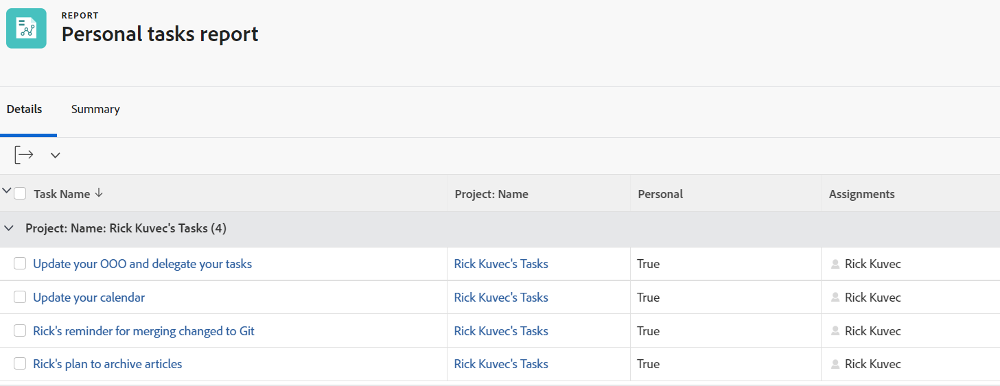

# 篩選器：個人任務

<!--Audited: 10/2024-->

此任務篩選器會傳回傳送給使用者的臨時工作請求，或使用者在其首頁區域中新增的待辦事項。

臨時工作請求和待辦事項會儲存到Adobe Workfront作為個人任務。

個人任務未連線至專案，但如果需要，可將其移至專案。

## 存取需求

+++ 展開以檢視本文中功能的存取需求。

您必須具有下列存取權才能執行本文中的步驟：

<table style="table-layout:auto"> 
 <col> 
 <col> 
 <tbody> 
  <tr> 
   <td role="rowheader">Adobe Workfront計畫</td> 
   <td> 
任何
 </td> 
  </tr> 
  <tr> 
   <td role="rowheader">Adobe Workfront授權*</td> 
   <td> 
    
新增：

   <ul><li>
修改篩選器的貢獻者 
</li>
   <li>
用於修改報告的標準
</li> </ul>

目前：

   <ul><li>
請求修改篩選器 
</li>
   <li>
計畫修改報表
</li> </ul></td> 
  </tr> 
  <tr> 
   <td role="rowheader">存取層級設定</td> 
   <td> 
編輯報告、儀表板、行事曆的存取權以修改報告
 
編輯篩選器、檢視和群組的存取權以修改篩選器
 </td> 
  </tr> 
  <tr> 
   <td role="rowheader">物件許可權</td> 
   <td> 
管理報表的許可權
  </td> 
  </tr> 
 </tbody> 
</table>

*如需詳細資訊，請參閱Workfront檔案中的[存取需求](/help/quicksilver/administration-and-setup/add-users/access-levels-and-object-permissions/access-level-requirements-in-documentation.md)。

+++

## 篩選個人任務

若要建立此篩選：

1. 前往工作清單或工作報告。
1. 從&#x200B;**篩選器**&#x200B;下拉式功能表，按一下&#x200B;**新增篩選器**。
1. （視條件而定）按一下&#x200B;**新增篩選器規則**，您正在從報表存取篩選器；或者，如果您正在從清單存取篩選器，請在第一個欄位中開始選取您的篩選器條件。
1. （視條件而定）選取下列篩選條件：

   * 從清單篩選器： **工作** > **個人** **為True**
   * 從報表篩選器： **任務** > **個人** > **等於** > **真**。
1. 儲存篩選。

   此清單只會顯示不在任何專案中的個人任務。
