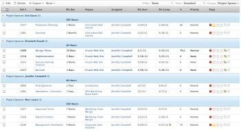

# 分組：任務清單的項目贊助商

此任務分組允許您按項目發起人對任務進行分組。



## 訪問要求

您必須具有以下訪問權限才能執行本文中的步驟：

<table style="table-layout:auto"> 
 <col> 
 <col> 
 <tbody> 
  <tr> 
   <td role="rowheader">Adobe Workfront計畫</td> 
   <td> <p>任何</p> </td> 
  </tr> 
  <tr> 
   <td role="rowheader">Adobe Workfront許可證*</td> 
   <td> <p>請求修改分組 </p>
   <p>計畫修改報表</p> </td> 
  </tr> 
  <tr> 
   <td role="rowheader">訪問級別配置*</td> 
   <td> <p>編輯對報表、儀表板、日曆的訪問以修改報表</p> <p>編輯對篩選器、視圖、分組的訪問以修改分組</p> <p><b>附註</b>

如果您仍然沒有訪問權限，請詢問您的Workfront管理員是否在您的訪問級別設定了其他限制。 有關Workfront管理員如何修改您的訪問級別的資訊，請參見 <a href="../../../administration-and-setup/add-users/configure-and-grant-access/create-modify-access-levels.md" class="MCXref xref">建立或修改自定義訪問級別</a>。</p> </td>
</tr>  
  <tr> 
   <td role="rowheader">對象權限</td> 
   <td> <p>管理對報表的權限</p> <p>有關請求附加訪問的資訊，請參見 <a href="../../../workfront-basics/grant-and-request-access-to-objects/request-access.md" class="MCXref xref">請求訪問對象 </a>。</p> </td> 
  </tr> 
 </tbody> 
</table>

&#42;要瞭解您擁有的計畫、許可證類型或訪問權限，請與您的Workfront管理員聯繫。

## 按項目發起人分組以查看任務清單

要應用此分組，請執行以下操作：

1. 轉到任務清單。
1. 在 **分組** 下拉菜單，選擇 **新建分組**。

1. 按一下 **切換到文本模式**。
1. 刪除在文本編輯窗口中看到的文本。
1. 在文本編輯窗口中複製並貼上以下代碼：

   ```
   group.0.name=Project Sponsor<br>group.0.valuefield=project:sponsor:name<br>group.0.valueformat=string
   ```

1. 按一下 **保存分組**。
