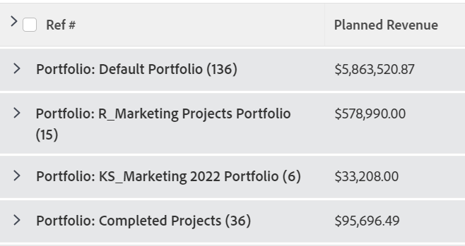

# 分組：編輯分組中的顯示名稱

<!--Audited: 01/2024-->

您可以將群組重新命名為使用者更熟悉的名稱。

例如，當您套用標準Portfolio名稱群組至專案清單時，群組的名稱會顯示為&#x200B;*Portfolio：名稱：`<name of portfolio>`*。

您可以使用文字模式來修改此群組，以顯示較容易閱讀的名稱。

## 存取需求

您必須具有下列存取權才能執行本文中的步驟：

<table style="table-layout:auto"> 
 <col> 
 <col> 
 <tbody> 
  <tr> 
   <td role="rowheader">Adobe Workfront計畫*</td> 
   <td> 
任何
 </td> 
  </tr> 
  <tr> 
   <td role="rowheader">Adobe Workfront授權*</td> 
   <td>

新增： 

   <ul>
   <li> 
修改群組的參與者 
</li>
   <li>
用於修改報告的標準
</li></ul>

 目前：

   <ul>  
   <li>
請求修改分組 
</li>
   <li>
計畫修改報表
</li> </td> 
  </tr> 
  <tr> 
   <td role="rowheader">存取層級設定*</td> 
   <td> 
編輯報告、儀表板、行事曆的存取權以修改報告
 
編輯對篩選器、檢視、群組的存取權以修改群組
 
<b>附註</b>

如果您還是沒有存取權，請詢問您的Workfront管理員，他們是否在您的存取層級中設定其他限制。 如需Workfront管理員如何修改存取層級的詳細資訊，請參閱<a href="../../../administration-and-setup/add-users/configure-and-grant-access/create-modify-access-levels.md" class="MCXref xref">建立或修改自訂存取層級</a>。
 </td>
</tr>  
  <tr> 
   <td role="rowheader">物件許可權</td> 
   <td> 
管理報表的許可權
 
如需請求其他存取權的資訊，請參閱<a href="../../../workfront-basics/grant-and-request-access-to-objects/request-access.md" class="MCXref xref">請求物件</a>的存取權。
 </td> 
  </tr> 
 </tbody> 
</table>

&#42;若要瞭解您擁有的計畫、授權型別或存取權，請連絡您的Workfront管理員。

## 編輯群組中的顯示名稱

若要變更專案群組中的顯示名稱：

1. 前往專案清單。
1. 從&#x200B;**群組**&#x200B;下拉式功能表中，選取&#x200B;**新群組**。

1. 按一下&#x200B;**新增群組**，然後開始在&#x200B;**第一者：**&#x200B;欄位中輸入「Portfolio名稱」，然後當它顯示在清單中時選取它。

1. 按一下&#x200B;**切換到文字模式**。
1. 執行下列任一項作業：

   * 將下列程式碼新增至&#x200B;**將您的報告分組**&#x200B;方塊中可用的現有文字：

     `group.0.displayname=Your Value`

     或者，在此案例中：

     `group.0.displayname=Portfolio`

   * 移除群組文字模式介面中所有含有「名稱」字樣的行，然後新增該行：

     `group.0.name=Your Value`

     或者，在此案例中：

     `group.0.name=Portfolio`

     >[!TIP]
     >
     >您也可以將`group.0.name=`與`group.0.displayname=`行保留為空白，在這種情況下，分組會顯示您正在依據的值。

     

1. 按一下&#x200B;**完成**，然後按一下&#x200B;**儲存群組**。

   根據您的文字模式資訊修改分組的預設名稱。
