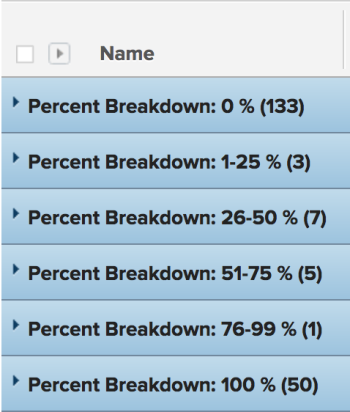

# 群組：任務百分比劃分1

<!--Audited: 10/2024-->

在此自訂專案分組中，您可以顯示按專案完成百分比值範圍分組的專案。 劃分會以25%的增量顯示完成百分比值：0-25%、25-50%等。

下列群組會依完成百分比值將工作組織為6個不同的群組：

* 0%
* 1-25%
* 26-50%
* 51-75%
* 76-99%
* 100%



## 存取需求

+++ 展開以檢視本文中功能的存取需求。 

<table style="table-layout:auto"> 
 <col> 
 <col> 
 <tbody> 
  <tr> 
   <td role="rowheader">Adobe Workfront套件</td> 
   <td> <p>任何</p> </td> 
  </tr> 
  <tr> 
   <td role="rowheader">Adobe Workfront授權</td> 
   <td> 
   <p>修改篩選器的貢獻者或請求 </p>
   <p>要修改報告的標準或計畫</p>
  </tr> 
  <tr> 
   <td role="rowheader">存取層級設定</td> 
   <td> <p>編輯報告、儀表板、行事曆的存取權以修改報告</p> <p>編輯篩選器、檢視和群組的存取權以修改篩選器</p> </td> 
  </tr> 
  <tr> 
   <td role="rowheader">物件許可權</td> 
   <td> <p>管理報表的許可權</p>  </td> 
  </tr> 
 </tbody> 
</table>

如需有關此表格的詳細資訊，請參閱Workfront檔案中的[存取需求](/help/quicksilver/administration-and-setup/add-users/access-levels-and-object-permissions/access-level-requirements-in-documentation.md)。

+++

## 依任務百分比劃分分組

若要套用此群組：

1. 前往工作清單。
1. 從&#x200B;**群組**&#x200B;下拉式功能表中，選取&#x200B;**新群組**。
1. 按一下&#x200B;**新增群組**。

1. 按一下&#x200B;**切換到文字模式**。
1. 移除&#x200B;**依**&#x200B;分組區域中的文字。
1. 將文字取代為下列程式碼：

   ```
   group.0.linkedname=direct
   group.0.name=Percent Breakdown
   group.0.notime=false
   group.0.valueexpression=IF({percentComplete}=0,"0 %",IF({percentComplete}<=26,"0-25 %",IF({percentComplete}<=51,"26-50 %",IF({percentComplete}<=76,"51-75 %",IF({percentComplete}<100,"76-99 %","100 %")))))
   group.0.valueformat=string
   ```

1. 按一下&#x200B;**完成** > **儲存群組**。
1. （選擇性）更新群組名稱，然後按一下&#x200B;**儲存群組**。
