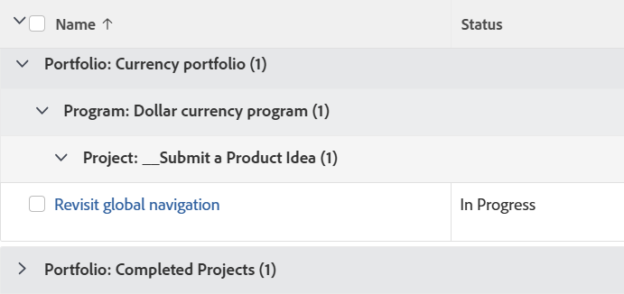

# 分組：按投資組合、方案和專案任務

使用此任務群組可依投資組合、依方案，然後依其關聯的專案來群組任務。

## 存取需求

您必須具有下列存取權才能執行本文中的步驟：

<table style="table-layout:auto"> 
 <col> 
 <col> 
 <tbody> 
  <tr> 
   <td role="rowheader">Adobe Workfront計畫*</td> 
   <td> 
任何
 </td> 
  </tr> 
  <tr> 
   <td role="rowheader">Adobe Workfront授權*</td> 
   <td> 
請求修改分組 

   
計畫修改報表
 </td> 
  </tr> 
  <tr> 
   <td role="rowheader">存取層級設定*</td> 
   <td> 
編輯報告、儀表板、行事曆的存取權以修改報告
 
編輯對篩選器、檢視、群組的存取權以修改群組
 
<b>附註</b>

如果您還是沒有存取權，請詢問您的Workfront管理員，他們是否在您的存取層級中設定其他限制。 如需Workfront管理員如何修改存取層級的詳細資訊，請參閱<a href="../../../administration-and-setup/add-users/configure-and-grant-access/create-modify-access-levels.md" class="MCXref xref">建立或修改自訂存取層級</a>。
 </td>
</tr>  
  <tr> 
   <td role="rowheader">物件許可權</td> 
   <td> 
管理報表的許可權
 
如需請求其他存取權的資訊，請參閱<a href="../../../workfront-basics/grant-and-request-access-to-objects/request-access.md" class="MCXref xref">請求物件</a>的存取權。
 </td> 
  </tr> 
 </tbody> 
</table>

&#42;若要瞭解您擁有的計畫、授權型別或存取權，請連絡您的Workfront管理員。

## 依投資組合、方案和專案將任務分組

若要套用此群組：

1. 前往工作清單。
1. 從&#x200B;**群組**&#x200B;下拉式功能表中，選取&#x200B;**新群組**。

1. 按一下&#x200B;**切換到文字模式**。
1. 移除&#x200B;**將您的報告分組**&#x200B;區域中的文字。
1. 將文字取代為下列程式碼：
   <pre>group.0.linkedname=project group.0.namekey=portfolio group.0.notime=false group.0.valuefield=project:portfolio:name group.0.valueformat=string group.1.linkedname=project group.1.namekey=program group.1.notime=false group.1.valuefield=project group.1.valueformat=string:program:group.2.name=Project{12.valuefield=Project 群組：name group.2.valueformat=HTML textmode=true  </pre>

1. 按一下&#x200B;**儲存群組**。
