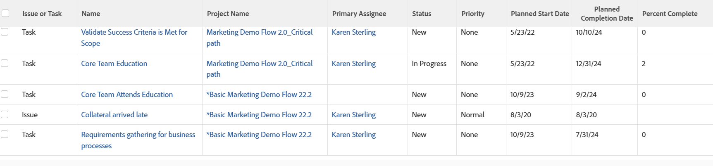

# 報告：合併的任務和問題檢視和分組

此工作專案報告顯示使用者已接受在一個報告中處理的任務和問題。 最好與自訂分組結合。

此報告在檢視中使用`sharecol=true`來合併相同欄標題下的多個欄位。 如需`sharecol`標籤的詳細資訊，請參閱[檢視：合併一個共用資料行中多個資料行的資訊](../../../reports-and-dashboards/reports/custom-view-filter-grouping-samples/view-merge-columns.md)。

>[!TIP]
>
> 「工作專案」檢視只會顯示指派給他們的使用者所接受的任務和問題。 此報告不顯示尚未從「工作請求」或「團隊請求」清單移入使用者「正在處理」清單的工作專案。



## 存取需求

您必須具有下列存取權才能執行本文中的步驟：

<table style="table-layout:auto"> 
 <col> 
 <col> 
 <tbody> 
  <tr> 
   <td role="rowheader">Adobe Workfront計畫*</td> 
   <td> <p>任何</p> </td> 
  </tr> 
  <tr> 
   <td role="rowheader">Adobe Workfront授權*</td> 
   <td> <p>計劃 </p> </td> 
  </tr> 
  <tr> 
   <td role="rowheader">存取層級設定*</td> 
   <td> <p>編輯報告、儀表板、行事曆的存取權</p> <p>編輯對篩選器、檢視、群組的存取權</p> <p><b>附註</b>

如果您還是沒有存取權，請詢問您的Workfront管理員，他們是否在您的存取層級中設定其他限制。 如需Workfront管理員如何修改存取層級的詳細資訊，請參閱<a href="../../../administration-and-setup/add-users/configure-and-grant-access/create-modify-access-levels.md" class="MCXref xref">建立或修改自訂存取層級</a>。</p> </td>
</tr> 
  <tr> 
   <td role="rowheader">物件許可權</td> 
   <td> <p>管理報表的許可權</p> <p>如需請求其他存取權的資訊，請參閱<a href="../../../workfront-basics/grant-and-request-access-to-objects/request-access.md" class="MCXref xref">請求物件</a>的存取權。</p> </td> 
  </tr> 
 </tbody> 
</table>

&#42;若要瞭解您擁有的計畫、授權型別或存取權，請連絡您的Workfront管理員。

## 建立包含合併任務和問題的報告檢視和分組

若要使用此檢視建立報表：

1. 從&#x200B;**主功能表** ，按一下&#x200B;**報表**。

1. 按一下&#x200B;**新報告**，然後從下拉式功能表中選取物件&#x200B;**工作專案**。

1. 在&#x200B;**欄預覽**&#x200B;區域中，按一下唯一顯示的欄標題。
1. 按一下&#x200B;**切換到文字模式**。
1. 將滑鼠移到文字模式區域上，然後按一下&#x200B;**按一下以編輯文字**。
1. 移除您在&#x200B;**文字模式**&#x200B;方塊中找到的文字，並取代為下列程式碼：

   ```
   column.0.description=Task or Issue 
   column.0.name=Issue or Task
   column.0.shortview=false
   column.0.stretch=0
   column.0.textmode=true
   column.0.type=image
   column.0.valueexpression=IF(ISBLANK({opTaskID}),'Task','Issue')
   column.0.valueformat=
   column.0.width=40
   column.1.description=Task or Issue Name
   column.1.isInlineEditable=false
   column.1.link.linkproperty.0.name=ID
   column.1.link.linkproperty.0.valuefield=task:ID
   column.1.link.linkproperty.0.valueformat=string
   column.1.link.lookup=link.view
   column.1.link.valuefield=task:objCode
   column.1.link.valueformat=val
   column.1.listsort=nested(task).string(name)
   column.1.name=Name
   column.1.sharecol=true
   column.1.shortview=false
   column.1.stretch=50
   column.1.textmode=true
   column.1.valuefield=task:name
   column.1.valueformat=HTML
   column.1.width=120
   column.2.isInlineEditable=false
   column.2.link.linkproperty.0.name=ID
   column.2.link.linkproperty.0.valuefield=opTask:ID
   column.2.link.linkproperty.0.valueformat=string
   column.2.link.lookup=link.view
   column.2.link.valuefield=opTask:objCode
   column.2.link.valueformat=val
   column.2.linkedname=opTask
   column.2.listsort=nested(opTask).string(name)
   column.2.shortview=false
   column.2.stretch=0
   column.2.textmode=true
   column.2.valuefield=opTask:name
   column.2.valueformat=HTML
   column.2.width=120
   column.3.description=Project Name
   column.3.isInlineEditable=false
   column.3.link.linkproperty.0.name=ID
   column.3.link.linkproperty.0.valuefield=task:projectID
   column.3.link.linkproperty.0.valueformat=string
   column.3.link.lookup=link.view
   column.3.link.valuefield=task:project:objCode
   column.3.link.valueformat=val
   column.3.listsort=nested(task).nested(project).string(name)
   column.3.name=Project Name
   column.3.sharecol=true
   column.3.shortview=false
   column.3.stretch=50
   column.3.textmode=true
   column.3.valuefield=task:project:name
   column.3.valueformat=HTML
   column.3.width=120
   column.4.isInlineEditable=false
   column.4.link.linkproperty.0.name=ID
   column.4.link.linkproperty.0.valuefield=opTask:projectID
   column.4.link.linkproperty.0.valueformat=string
   column.4.link.lookup=link.view
   column.4.link.valuefield=opTask:project:objCode
   column.4.link.valueformat=val
   column.4.linkedname=opTask
   column.4.listsort=nested(opTask).nested(project).string(name)
   column.4.shortview=false
   column.4.stretch=0
   column.4.textmode=true
   column.4.valuefield=opTask:project:name
   column.4.valueformat=HTML
   column.4.width=120
   column.5.displayname=Primary Assignee
   column.5.linkedname=assignment
   column.5.namekey=view.relatedcolumn
   column.5.namekeyargkey.0=assignment
   column.5.namekeyargkey.1=assignedToID
   column.5.querysort=assignment:assignedToID
   column.5.textmode=true
   column.5.valuefield=assignment:assignedTo:name
   column.5.valueformat=HTML
   column.6.displayname=Status
   column.6.enumclass=com.attask.common.constants.OpTaskStatusEnum
   column.6.enumtype=OPTASK
   column.6.linkedname=opTask
   column.6.namekey=view.relatedcolumn
   column.6.namekeyargkey.0=opTask
   column.6.namekeyargkey.1=status
   column.6.querysort=opTask:status
   column.6.sharecol=true
   column.6.textmode=true
   column.6.type=enum
   column.6.valuefield=opTask:status
   column.6.valueformat=val
   column.7.displayname=
   column.7.enumclass=com.attask.common.constants.TaskStatusEnum
   column.7.enumtype=TASK
   column.7.linkedname=task
   column.7.namekey=view.relatedcolumn
   column.7.namekeyargkey.0=task
   column.7.namekeyargkey.1=status
   column.7.querysort=task:status
   column.7.textmode=true
   column.7.type=enum
   column.7.valuefield=task:status
   column.7.valueformat=val
   column.8.displayname=Priority
   column.8.enumclass=com.attask.common.constants.TimelinePriorityEnum
   column.8.enumtype=OPTASK
   column.8.linkedname=opTask
   column.8.namekey=view.relatedcolumn
   column.8.namekeyargkey.0=opTask
   column.8.namekeyargkey.1=priority
   column.8.querysort=opTask:priority
   column.8.sharecol=true
   column.8.textmode=true
   column.8.type=enum
   column.8.valuefield=opTask:priority
   column.8.valueformat=val
   column.9.displayname=
   column.9.enumclass=com.attask.common.constants.TimelinePriorityEnum
   column.9.enumtype=TASK
   column.9.linkedname=task
   column.9.namekey=view.relatedcolumn
   column.9.namekeyargkey.0=task
   column.9.namekeyargkey.1=priority
   column.9.querysort=task:priority
   column.9.type=enum
   column.9.valuefield=task:priority
   column.9.valueformat=val
   column.10.isInlineEditable=false
   column.10.linkedname=task
   column.10.listsort=nested(task).atDateAsAtDate(plannedStartDate)
   column.10.name=Planned Start Date
   column.10.sharecol=true
   column.10.shortview=false
   column.10.stretch=0
   column.10.textmode=true
   column.10.valuefield=task:plannedStartDate
   column.10.valueformat=atDate
   column.10.width=100
   column.11.isInlineEditable=false
   column.11.linkedname=opTask
   column.11.listsort=nested(opTask).atDateAsAtDate(plannedStartDate)
   column.11.shortview=false
   column.11.stretch=0
   column.11.textmode=true
   column.11.valuefield=opTask:plannedStartDate
   column.11.valueformat=atDate
   column.11.width=1
   column.12.isInlineEditable=false
   column.12.linkedname=task
   column.12.listsort=nested(task).atDateAsAtDate(projectedCompletionDate)
   column.12.name=Planned Completion Date
   column.12.sharecol=true
   column.12.shortview=false
   column.12.stretch=0
   column.12.textmode=true
   column.12.valuefield=task:projectedCompletionDate
   column.12.valueformat=atDate
   column.12.width=100
   column.13.isInlineEditable=false
   column.13.linkedname=opTask
   column.13.listsort=nested(opTask).atDateAsAtDate(projectedCompletionDate)
   column.13.shortview=false
   column.13.stretch=0
   column.13.textmode=true
   column.13.valuefield=opTask:projectedCompletionDate
   column.13.valueformat=atDate
   column.13.width=1
   column.14.isInlineEditable=false
   column.14.linkedname=task
   column.14.listsort=nested(task).double(percentComplete)
   column.14.name=Percent Complete
   column.14.sharecol=true
   column.14.shortview=false
   column.14.stretch=0
   column.14.textmode=true
   column.14.valueexpression=IF(ISBLANK({taskID}),"",{task}.{percentComplete})
   column.14.valueformat=HTML
   column.14.width=100
   column.15.textmode=true
   column.15.value=
   column.15.valueformat=HTML
   column.15.width=1
   ```

1. （選用）按一下「**群組**」，將群組新增至報表。
1. （選擇性）如果您正在新增群組，請按一下&#x200B;**切換到文字模式**。
1. （可選）將分組文字模式區域中的文字取代為下列程式碼：

   ```
   group.0.name=
   group.0.valueexpression=IF(ISBLANK({opTaskID}),'Task','Issue')
   group.0.valueformat=string
   textmode=true
   ```

   此分組將所有任務和問題分組在一起。

1. 按一下「**儲存並關閉**」。
