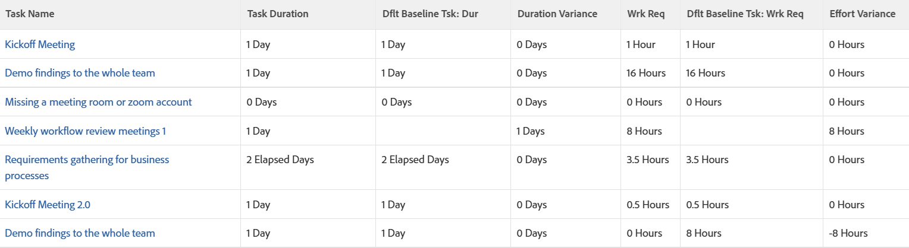

# 檢視：任務檢視中「工期」與「計畫工時」的比較基準差異

<!--Audited: 11/2024-->

此檢視會在工作檢視中顯示下列專案：

* 包含基準線任務資訊的任務資訊。
* 「持續時間」與「預設基準線持續時間」之間的差異。
* 計畫工時與預設比較基準計畫工時之間的差異。

>[!NOTE]
>
>下列檢視表中顯示的資料會將實際作業值與與「預設基準線」作業相關的值進行比較。



## 存取需求

+++ 展開以檢視本文中功能的存取需求。

您必須具有下列存取權才能執行本文中的步驟：

<table style="table-layout:auto"> 
 <col> 
 <col> 
 <tbody> 
  <tr> 
   <td role="rowheader">Adobe Workfront計畫</td> 
   <td> <p>任何</p> </td> 
  </tr> 
  <tr> 
   <td role="rowheader">Adobe Workfront授權*</td> 
   <td> 
    <p>新增：</p>
   <ul><li><p>修改篩選器的貢獻者 </p></li>
   <li><p>用於修改報告的標準</p></li> </ul>

<p>目前：</p>
   <ul><li><p>請求修改篩選器 </p></li>
   <li><p>計畫修改報表</p></li> </ul></td> 
  </tr> 
  <tr> 
   <td role="rowheader">存取層級設定</td> 
   <td> <p>編輯報告、儀表板、行事曆的存取權以修改報告</p> <p>編輯篩選器、檢視和群組的存取權以修改篩選器</p> </td> 
  </tr> 
  <tr> 
   <td role="rowheader">物件許可權</td> 
   <td> <p>管理報表的許可權</p>  </td> 
  </tr> 
 </tbody> 
</table>

*如需詳細資訊，請參閱Workfront檔案中的[存取需求](/help/quicksilver/administration-and-setup/add-users/access-levels-and-object-permissions/access-level-requirements-in-documentation.md)。

+++

## 在任務檢視中檢視工期和計畫工時的比較基準差異

1. 前往工作清單。
1. 在&#x200B;**檢視**&#x200B;下拉式功能表中，選取&#x200B;**新檢視**&#x200B;或編輯現有檢視。
1. 移除檢視中的所有欄（第一個欄除外）。
1. 選取第一欄後，按一下&#x200B;**切換到文字模式**，然後按一下&#x200B;**編輯文字檢視**。
1. 複製下方的文字，並貼到檢視的第一欄：

   ```
   column.0.descriptionkey=name
   column.0.link.linkproperty.0.name=ID
   column.0.link.linkproperty.0.valuefield=ID
   column.0.link.linkproperty.0.valueformat=int
   column.0.link.lookup=link.view
   column.0.link.valuefield=objCode
   column.0.link.valueformat=val
   column.0.linkedname=direct
   column.0.listsort=string(name)
   column.0.namekey=name.abbr
   column.0.querysort=name
   column.0.shortview=false
   column.0.stretch=100
   column.0.valuefield=name
   column.0.valueformat=HTML
   column.0.width=150
   column.0.displayname=Task Name
   column.1.descriptionkey=duration
   column.1.linkedname=direct
   column.1.listsort=intAsInt(durationMinutes)
   column.1.namekey=duration.abbr
   column.1.querysort=durationMinutes
   column.1.shortview=false
   column.1.stretch=0
   column.1.valuefield=durationFieldLong
   column.1.valueformat=compound
   column.1.viewalias=duration
   column.1.width=100
   column.1.displayname=Task Duration
   column.2.descriptionkey=view.relatedcolumn
   column.2.descriptionkeyargkey.0=defaultbaselinetask
   column.2.descriptionkeyargkey.1=duration
   column.2.linkedname=defaultBaselineTask
   column.2.listsort=intAsInt(durationMinutes)
   column.2.namekey=duration
   column.2.namekeyargkey.0=defaultbaselinetask.abbr
   column.2.namekeyargkey.1=duration.abbr
   column.2.querysort=defaultBaselineTask:durationMinutes
   column.2.shortview=false
   column.2.stretch=0
   column.2.valuefield=defaultBaselineTask:durationFieldLong
   column.2.valueformat=compound
   column.2.viewalias=defaultBaselineTask:duration
   column.2.width=100
   column.2.displayname=Dflt Baseline Tsk: Dur
   column.2.durationunitfield=durationUnit.value
   column.3.description=Duration Variance"column.3.linkedname=direct
   column.3.listsort=intAsInt(durationMinutes)
   column.3.name=Duration Variance
   column.3.querysort=durationMinutes
   column.3.shortview=false
   column.3.stretch=0
   column.3.valueexpression=CONCAT(SUB({duration},{defaultBaselineTask}.{duration})/480," Days")
   column.3.valueformat=HTML
   column.3.viewalias=duration
   column.3.width=100
   column.3.displayname=Duration Variance
   column.4.descriptionkey=workrequired
   column.4.linkedname=direct
   column.4.listsort=doubleAsDouble(workRequired)
   column.4.namekey=workrequired.abbr
   column.4.querysort=workRequired
   column.4.shortview=false
   column.4.stretch=0
   column.4.valuefield=workFieldLong
   column.4.valueformat=compound
   column.4.viewalias=workrequired
   column.4.width=100
   column.4.displayname=Wrk Req
   column.5.descriptionkey=view.relatedcolumn
   column.5.descriptionkeyargkey.0=defaultbaselinetask
   column.5.descriptionkeyargkey.1=workrequired
   column.5.linkedname=defaultBaselineTask
   column.5.listsort=doubleAsDouble(workRequired)
   column.5.namekey=view.relatedcolumn
   column.5.namekeyargkey.0=defaultbaselinetask.abbr
   column.5.namekeyargkey.1=workrequired.abbr
   column.5.querysort=defaultBaselineTask:workRequired
   column.5.shortview=false
   column.5.stretch=0
   column.5.valuefield=defaultBaselineTask:workFieldLong
   column.5.valueformat=compound
   column.5.viewalias=defaultBaselineTask:workrequired
   column.5.width=100
   column.5.displayname=Dflt Baseline Tsk: Wrk Req
   column.6.descriptionkey=workrequired
   column.6.linkedname=direct
   column.6.listsort=doubleAsDouble(workRequired)
   column.6.name=Effort Variance
   column.6.querysort=workRequired
   column.6.shortview=false
   column.6.stretch=0
   column.6.valueexpression=CONCAT(SUB({workRequired},{defaultBaselineTask}.{workRequired})/60," Hours")
   column.6.valueformat=HTML
   column.6.viewalias=workrequired
   column.6.width=100
   column.6.displayname=Effort Variance
   ```

1. 按一下「**儲存視圖**」。