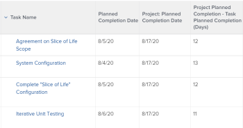

# 檢視：計算時間和日期差異

>[!IMPORTANT]
>
>您無法在Adobe Workfront中計算相同型別的兩個不同物件之間的時間和日期差異。 例如，您無法計算兩個不同專案、任務或問題中兩個日期之間的時間和日期差異。

您可以計算下列專案之間的差異：

* 相同物件上兩個日期欄位之間的時間和日期差異
* 物件上的欄位與父物件上的另一個欄位之間的時間和日期差異

>[!TIP]
>
>這些計算會顯示兩個日期之間的天數。 結果以天為單位顯示。 日期欄位上的時間戳記也會納入考量，如果時間戳記不符，天數可能會後跟小數。 如果任務延遲完成，天數會顯示為負值。

## 存取需求

您必須具有下列存取權才能執行本文中的步驟：

<table style="table-layout:auto"> 
 <col> 
 <col> 
 <tbody> 
  <tr> 
   <td role="rowheader">Adobe Workfront計畫*</td> 
   <td> <p>任何</p> </td> 
  </tr> 
  <tr> 
   <td role="rowheader">Adobe Workfront授權*</td> 
   <td> <p>請求修改檢視 </p>
   <p>計畫修改報表</p> </td> 
  </tr> 
  <tr> 
   <td role="rowheader">存取層級設定*</td> 
   <td> <p>編輯報告、儀表板、行事曆的存取權以修改報告</p> <p>編輯對篩選器、檢視、群組的存取權以修改檢視</p> <p><b>附註</b>

如果您還是沒有存取權，請詢問您的Workfront管理員，他們是否在您的存取層級中設定其他限制。 如需有關Workfront管理員如何修改您的存取層級的資訊，請參閱 <a href="../../../administration-and-setup/add-users/configure-and-grant-access/create-modify-access-levels.md" class="MCXref xref">建立或修改自訂存取層級</a>.</p> </td>
</tr>  
  <tr> 
   <td role="rowheader">物件許可權</td> 
   <td> <p>管理報表的許可權</p> <p>如需請求其他存取許可權的詳細資訊，請參閱 <a href="../../../workfront-basics/grant-and-request-access-to-objects/request-access.md" class="MCXref xref">要求物件的存取權 </a>.</p> </td> 
  </tr> 
 </tbody> 
</table>

&#42;若要瞭解您擁有的計畫、授權型別或存取權，請聯絡您的Workfront管理員。

## 計算相同物件上兩個日期欄位之間的時間和日期差異

例如，您可以計算任務的計畫完成日期與實際完成日期之間的差異。


1. 前往工作清單。
1. 從 **檢視** 下拉式功能表，按一下 **新檢視**.

1. 按一下 **新增欄** 並開始在「 」中輸入「規劃完成日期」 **顯示在此欄中** 欄位，然後在清單中顯示時選取它。

1. 按一下 **新增欄** 並開始在 **顯示在此欄中** 欄位，然後在清單中顯示時選取它。

1. 按一下 **新增欄**，然後按一下 **切換到文字模式**.

1. 暫留在文字模式區域上，然後按一下 **按一下以編輯文字**.
1. 移除您在「 」中找到的文字 **文字模式** 方塊，並以下列程式碼取代：

   ```
   displayname=Planned-Actual Completion Date<br>linkedname=direct<br>querysort=plannedCompletionDate<br>textmode=true<br>valueexpression=ROUND(DATEDIFF({plannedCompletionDate},{actualCompletionDate}),2)<br>valueformat=HTML
   ```

1. 按一下 **儲存**，然後 **儲存檢視**.

## 計算物件上的欄位與父物件上其他欄位之間的時間和日期差異

如需物件及其父項的清單，請參閱下列章節中的「瞭解物件的相互相依性和階層」 [瞭解Adobe Workfront中的物件](../../../workfront-basics/navigate-workfront/workfront-navigation/understand-objects.md).\
例如，您可以計算任務的計畫完成日期與其父系任務或任務所在專案計畫完成日期之間的差異。



1. 前往工作清單。
1. 從 **檢視** 下拉式功能表，按一下 **新檢視**.

1. 按一下 **新增欄** 並開始輸入「專案計畫完成日期」或「父級完成日期」 **顯示在此欄中** 欄位，然後在清單中顯示時選取它。

1. 按一下 **新增欄** 並開始在「 」中輸入「規劃完成日期」 **顯示在此欄中** 欄位，然後在清單中顯示時選取它。

1. 按一下 **新增欄**，然後按一下 **切換到文字模式**.

1. 暫留在文字模式區域上，然後按一下 **按一下以編輯文字**.
1. 移除您在「 」中找到的文字 **文字模式** 方塊，然後以下列其中一個程式碼取代：

   * 若要顯示專案與任務之計畫完成日期之間的差異：

     ```
     displayname=Project Planned Completion - Task Planned Completion (Days)<br>textmode=true<br>valueexpression=ROUND(DATEDIFF({project}.{plannedCompletionDate},{plannedCompletionDate}),2)<br>valueformat=HTML
     ```

   * 若要顯示父系任務與任務計畫完成日期之間的差異：

     ```
     valueexpression=ROUND(DATEDIFF({parent}.{plannedCompletionDate},{plannedCompletionDate}),2)<br>textmode=true<br>valueformat=HTML<br>displayname=Parent Planned Completion - Planned Completion (Days)
     ```

1. 按一下 **儲存**，然後 **儲存檢視**.
