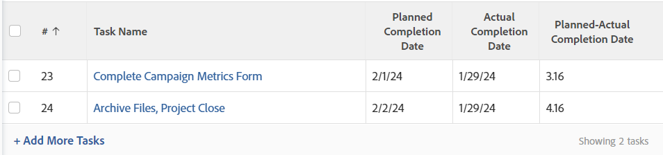

# 檢視：計算時間和日期差異

<!-- Audited: 11/2024 -->

>[!IMPORTANT]
>
>您無法在Adobe Workfront中計算相同型別的兩個不同物件之間的時間和日期差異。 例如，您無法計算兩個不同專案、任務或問題中兩個日期之間的時間和日期差異。

您可以計算下列專案之間的差異：

* 相同物件上兩個日期欄位之間的時間和日期差異
* 物件上某個欄位與父物件上另一個欄位之間的時間和日期差異

>[!TIP]
>
>這些計算會顯示兩個日期之間的天數。 結果以天為單位顯示。 日期欄位上的時間戳記也會納入考量，如果時間戳記不符，天數可能會後跟小數。 如果任務延遲完成，天數會顯示為負值。

## 存取需求

+++ 展開以檢視本文中功能的存取需求。

<table style="table-layout:auto"> 
 <col> 
 <col> 
 <tbody> 
  <tr> 
   <td role="rowheader">Adobe Workfront套件</td> 
   <td> <p>任何</p> </td> 
  </tr> 
  <tr> 
   <td role="rowheader">Adobe Workfront授權</td> 
   <td> 
   <p>修改篩選器的貢獻者或請求 </p>
   <p>要修改報告的標準或計畫</p>
  </tr> 
  <tr> 
   <td role="rowheader">存取層級設定</td> 
   <td> <p>編輯報告、儀表板、行事曆的存取權以修改報告</p> <p>編輯篩選器、檢視和群組的存取權以修改篩選器</p> </td> 
  </tr> 
  <tr> 
   <td role="rowheader">物件許可權</td> 
   <td> <p>管理報表的許可權</p>  </td> 
  </tr> 
 </tbody> 
</table>

如需有關此表格的詳細資訊，請參閱Workfront檔案中的[存取需求](/help/quicksilver/administration-and-setup/add-users/access-levels-and-object-permissions/access-level-requirements-in-documentation.md)。

+++

## 計算相同物件上兩個日期欄位之間的時間和日期差異

例如，您可以計算任務的計畫完成日期與實際完成日期之間的差異。



1. 前往工作清單。
1. 從&#x200B;**檢視**&#x200B;下拉式功能表，按一下&#x200B;**新增檢視**。

1. 按一下&#x200B;**新增欄**&#x200B;並開始在&#x200B;**顯示在此欄**&#x200B;欄位中輸入「規劃完成日期」，然後當它顯示在清單中時選取它。

1. 按一下&#x200B;**新增欄**&#x200B;並開始在&#x200B;**顯示在此欄**&#x200B;欄位中輸入「實際完成日期」，然後當它顯示在清單中時選取它。

1. 按一下&#x200B;**新增資料行**，然後按一下&#x200B;**切換到文字模式**。

1. 暫留在文字模式區域上，然後按一下&#x200B;**按一下以編輯文字**。
1. 移除您在&#x200B;**文字模式**&#x200B;方塊中找到的文字，並取代為下列程式碼：

   ```
    displayname=Planned-Actual Completion Date
    linkedname=direct
    querysort=plannedCompletionDate
    textmode=true
    valueexpression=ROUND(DATEDIFF({plannedCompletionDate},{actualCompletionDate}),2)
    valueformat=HTML
   ```

1. 按一下&#x200B;**儲存**，然後按一下&#x200B;**儲存檢視**。

## 計算物件上的欄位與父物件上其他欄位之間的時間和日期差異

如需物件及其父項的清單，請參閱[瞭解Adobe Workfront中的物件](../../../workfront-basics/navigate-workfront/workfront-navigation/understand-objects.md)中的「瞭解物件的相依性和階層」一節。\
例如，您可以計算任務的計畫完成日期與其父系任務或任務所在專案計畫完成日期之間的差異。


1. 前往工作清單。
1. 從&#x200B;**檢視**&#x200B;下拉式功能表，按一下&#x200B;**新增檢視**。

1. 按一下&#x200B;**新增欄**，並在&#x200B;**顯示在此欄**&#x200B;欄位中開始輸入「專案計畫完成日期」或「父級完成日期」，然後在其顯示在清單中時選取它。

1. 按一下&#x200B;**新增欄**&#x200B;並開始在&#x200B;**顯示在此欄**&#x200B;欄位中輸入「規劃完成日期」，然後當它顯示在清單中時選取它。

1. 按一下&#x200B;**新增欄**，然後按一下&#x200B;**切換到文字模式** > **編輯文字模式**。
1. 移除您在&#x200B;**編輯文字模式**&#x200B;方塊中找到的文字，並以下列其中一個程式碼取代：

   * 若要顯示專案與任務之計畫完成日期之間的差異：

     ```
      displayname=Project Planned Completion - Task Planned Completion (Days)
      textmode=true
      valueexpression=ROUND(DATEDIFF({project}.{plannedCompletionDate},{plannedCompletionDate}),2)
      valueformat=HTML
     ```

   * 若要顯示父系任務與任務計畫完成日期之間的差異：

     ```
      valueexpression=ROUND(DATEDIFF({parent}.{plannedCompletionDate},{plannedCompletionDate}),2)
      textmode=true<br>valueformat=HTML
      displayname=Parent Planned Completion - Planned Completion (Days)
     ```

1. 按一下&#x200B;**完成**，然後按一下&#x200B;**儲存檢視**。
