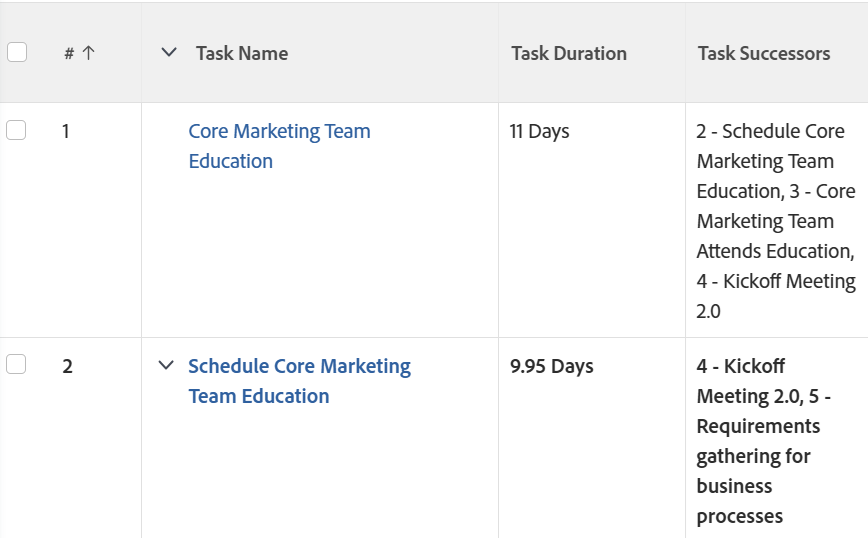

# 視圖：在列中添加任務後續任務清單

您可以向任務視圖添加列以顯示任務後續任務的清單。 的 **任務後續任務** 列包括後繼路由器的編號以及名稱。

## 訪問要求

您必須具有以下訪問權限才能執行本文中的步驟：

<table style="table-layout:auto"> 
 <col> 
 <col> 
 <tbody> 
  <tr> 
   <td role="rowheader">Adobe Workfront計畫</td> 
   <td> 
任何
 </td> 
  </tr> 
  <tr> 
   <td role="rowheader">Adobe Workfront許可證*</td> 
   <td> 
請求修改視圖 

   
計畫修改報表
 </td> 
  </tr> 
  <tr> 
   <td role="rowheader">訪問級別配置*</td> 
   <td> 
編輯對報表、儀表板、日曆的訪問以修改報表
 
編輯對篩選器、視圖、分組的訪問以修改視圖
 
<b>附註</b>

如果您仍然沒有訪問權限，請詢問您的Workfront管理員是否在您的訪問級別設定了其他限制。 有關Workfront管理員如何修改您的訪問級別的資訊，請參見 <a href="../../../administration-and-setup/add-users/configure-and-grant-access/create-modify-access-levels.md" class="MCXref xref">建立或修改自定義訪問級別</a>。
 </td>
</tr> 
  <tr> 
   <td role="rowheader">對象權限</td> 
   <td> 
管理對報表的權限
 
有關請求附加訪問的資訊，請參見 <a href="../../../workfront-basics/grant-and-request-access-to-objects/request-access.md" class="MCXref xref">請求訪問對象 </a>。
 </td> 
  </tr> 
 </tbody> 
</table>

&#42;要瞭解您擁有的計畫、許可證類型或訪問權限，請與您的Workfront管理員聯繫。

## 在列中添加任務後續任務清單

要將此列添加到任務視圖：

1. 轉到現有任務視圖。
1. 展開「視圖」(View)下拉菜單，然後選擇 **自定義視圖**。
1. 按一下 **添加列**。
1. 按一下 **切換到文本模式**。
1. 滑鼠懸停在 **在此列中顯示** ，然後按一下 **按一下可編輯文本**。

1. 刪除「文本模式」框中的所有文本，並用以下代碼替換它：

   <pre>displayname=任務後續任務 清單分隔符=  listmethod=nested（後繼者）。lists textmode=true 類型=迭代 valueexpression=CONCAT({後繼}。{taskNumber},' — 「，{後繼者}。{name}) valueformat=HTML</pre>

1. 按一下 **保存視圖**。
