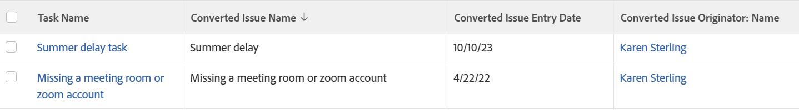

# 檢視：顯示任務和專案清單上的原始問題資訊

當問題已轉換為清單中的任務和專案後，您可以在任務和專案清單的檢視上顯示原始問題的以下資訊：

* 已轉換問題的名稱
* 已轉換問題的輸入日期
* 轉換的問題建立者名稱

如需使用標準Report Builder建立檢視的相關資訊，請參閱[Adobe Workfront中的檢視總覽](../../../reports-and-dashboards/reports/reporting-elements/views-overview.md)。

如需將其他問題資訊包含在專案與工作清單中的詳細資訊，另請參閱[檢視：工作與專案的原始問題詳細資訊](../../../reports-and-dashboards/reports/custom-view-filter-grouping-samples/view-originating-issue-details-tasks-projects.md)。

<!--

(NOTE: no longer needed - all fields are now in the UI

Applying this view is identical for tasks and projects.

To apply this view to a task list:

<ol>
<li value="1">Go to a list of tasks which have been converted from issues</li>
<li value="2">From the <strong>View</strong> drop-down menu, select <strong>New View</strong>.</li>
<li value="3">In the<strong>Column Preview</strong> area, eliminate all columns except for one.</li>
<li value="4">Click the header of the remaining column, then click<strong>Switch to Text Mode</strong>.</li>
<li value="5">Mouse over the text mode area, and click <strong>Click to edit text</strong>.</li>
<li value="6"> 
Remove the text you find in the <strong>Text Mode</strong> box, and replace it with the following code:

<a class="codeSnippetCopyButton" role="button">Copy</a>

<pre><code>column.0.descriptionkey=name column.0.isInlineEditable=false column.0.link.linkproperty.20.name=ID column.0.link.linkproperty.0.valuefield=ID column.0.link.linkproperty.0.valueformat=int column.0.link.linkproperty.0.valueformat=int column.0.link.lookup=link.view column.0.link.valuefield=objCode column.0.link.valueformat=val column.0.linkedname=direct column.0.listsort=string(name) column.0.querysort=name column.0.section=0 column.0.shortview=false column.0.stretch=100 column.0.valuefield=name column.0.valueformat=HTML column.0.width=150 column.1.displayname=Converted Issue Name column.1.linkedname=convertedOpTask column.1.textmode=true column.1.valuefield=convertedOpTaskName column.1.valueformat=HTML column.2.displayname=Converted Issue Entry Date column.2.textmode=true column.2.valuefield=convertedOpTaskEntryDate column.2.valueformat=HTML column.3.displayname=Originator Name column.3.textmode=true column.3.valuefield=convertedOpTaskOriginator:name column.3.valueformat=HTML</code></pre>

 </li>
<li value="7"> Click <strong>Save View</strong>. </li>
</ol>

-->
