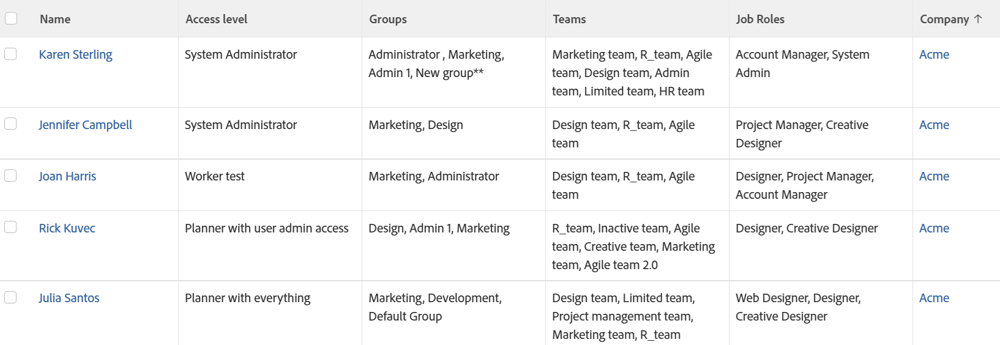

# 檢視：展開的使用者詳細資訊

<!--Audited: 11/2024-->

此「使用者」檢視會顯示有關使用者的資訊。 除了其名稱、存取層級和公司之外，它還會顯示其群組、團隊和工作角色的清單。



## 存取需求

+++ 展開以檢視本文中功能的存取需求。

您必須具有下列存取權才能執行本文中的步驟：

<table style="table-layout:auto"> 
 <col> 
 <col> 
 <tbody> 
  <tr> 
   <td role="rowheader">Adobe Workfront計畫</td> 
   <td> <p>任何</p> </td> 
  </tr> 
  <tr> 
   <td role="rowheader">Adobe Workfront授權</td> 
   <td> <p>新增：<ul><li>修改檢視的貢獻者</li><li>用於修改報告的標準</li></ul></p><p>或</p>目前：<ul><li>請求修改檢視</li><li>計畫修改報表</li></ul></p> </td> 
  </tr> 
  <tr> 
   <td role="rowheader">存取層級設定</td> 
   <td> <p>編輯報告、儀表板、行事曆的存取權以修改報告</p> <p>編輯對篩選器、檢視、群組的存取權以修改檢視</p> </td> 
  </tr>  
  <tr> 
   <td role="rowheader">物件許可權</td> 
   <td> <p>管理報表的許可權</p> </td> 
  </tr> 
 </tbody> 
</table>

如需有關此表格的詳細資訊，請參閱Workfront檔案中的[存取需求](/help/quicksilver/administration-and-setup/add-users/access-levels-and-object-permissions/access-level-requirements-in-documentation.md)。

+++

## 檢視展開的使用者詳細資訊

若要套用此檢視：

1. 前往使用者清單。
1. 從&#x200B;**檢視**&#x200B;下拉式功能表中，選取&#x200B;**新增檢視**。

1. 在&#x200B;**資料行預覽**&#x200B;區域中，排除除一個資料行以外的所有資料行。
1. 按一下剩餘欄的標題，然後按一下&#x200B;**切換到文字模式** > **編輯文字模式**。
1. 移除您在&#x200B;**編輯文字模式**&#x200B;方塊中找到的文字，並取代為下列程式碼：

   ```
   column.0.descriptionkey=name 
   column.0.link.linkproperty.0.name=ID
   column.0.link.linkproperty.0.valuefield=ID
   column.0.link.linkproperty.0.valueformat=int
   column.0.link.lookup=link.view
   column.0.link.valuefield=objCode
   column.0.link.valueformat=val
   column.0.linkedname=direct
   column.0.listsort=string(name)
   column.0.namekey=name.abbr
   column.0.querysort=name
   column.0.shortview=false
   column.0.stretch=0
   column.0.valuefield=name
   column.0.valueformat=HTML
   column.0.width=150
   column.1.descriptionkey=accesslevel
   column.1.link.linkproperty.0.name=ID
   column.1.link.linkproperty.0.valuefield=accessLevel:ID
   column.1.link.linkproperty.0.valueformat=int
   column.1.link.lookup=link.view
   column.1.link.valuefield=accessLevel:objCode
   column.1.link.valueformat=val
   column.1.linkedname=accessLevel
   column.1.listsort=string(displayName)
   column.1.namekey=accesslevel
   column.1.querysort=name
   column.1.shortview=false
   column.1.stretch=0
   column.1.valuefield=accessLevel:displayName
   column.1.valueformat=HTML
   column.1.viewalias=accessLevel:displayName
   column.1.width=100
   column.2.link.linkproperty.0.name=ID
   column.2.link.linkproperty.0.valuefield=ID
   column.2.link.linkproperty.0.valueformat=int
   column.2.link.lookup=link.view
   column.2.link.value=val(objCode)
   column.2.listdelimiter=
   column.2.listmethod=nested(userGroups).lists
   column.2.namekey=group.plural
   column.2.stretch=50
   column.2.type=iterate
   column.2.valuefield=group:name
   column.2.valueformat=HTML
   column.2.width=150
   column.3.displayname=Teams
   column.3.listdelimiter=
   column.3.listmethod=nested(teams).lists
   column.3.textmode=true
   column.3.type=iterate
   column.3.valueexpression={name}
   column.3.valueformat=HTML
   column.4.link.linkproperty.0.name=ID
   column.4.link.linkproperty.0.valuefield=ID
   column.4.link.linkproperty.0.valueformat=int
   column.4.link.lookup=link.view
   column.4.link.value=val(objCode)
   column.4.listdelimiter=
   column.4.listmethod=nested(userRoles).lists
   column.4.namekey=jobrole.plural
   column.4.stretch=50
   column.4.type=iterate
   column.4.valuefield=role:name
   column.4.valueformat=HTML
   column.4.width=150
   column.5.descriptionkey=company
   column.5.link.linkproperty.0.name=ID
   column.5.link.linkproperty.0.valuefield=company:ID
   column.5.link.linkproperty.0.valueformat=int
   column.5.link.lookup=link.view
   column.5.link.valuefield=company:objCode
   column.5.link.valueformat=val
   column.5.linkedname=company
   column.5.listsort=nested(company).string(name)
   column.5.namekey=company
   column.5.querysort=company:name
   column.5.shortview=false
   column.5.stretch=0
   column.5.valuefield=company:name
   column.5.valueformat=HTML
   column.5.width=150
   ```

1. 按一下&#x200B;**完成** > **儲存檢視**。
