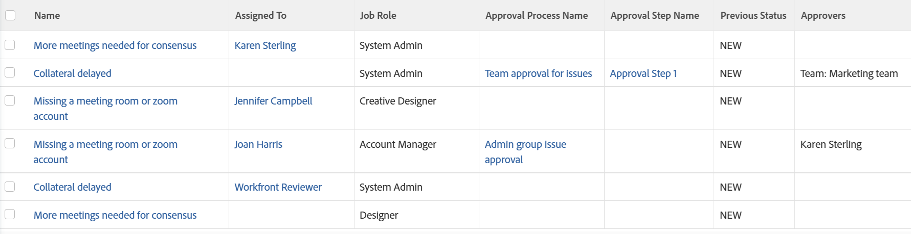

# 檢視：核准資訊的問題

<!--Audited: 11/2024-->

以下問題檢視顯示核准流程、步驟、核准者名稱和授予核准前問題的狀態。 有些欄位無法透過標準介面產生器存取。



## 存取需求

+++ 展開以檢視本文中功能的存取需求。

<table style="table-layout:auto"> 
 <col> 
 <col> 
 <tbody> 
  <tr> 
   <td role="rowheader">Adobe Workfront套件</td> 
   <td> <p>任何</p> </td> 
  </tr> 
  <tr> 
   <td role="rowheader">Adobe Workfront授權</td> 
   <td> 
   <p>投稿人或請求修改檢視 </p>
   <p>要修改報告的標準或計畫</p>
  </tr> 
  <tr> 
   <td role="rowheader">存取層級設定</td> 
   <td> <p>編輯報告、儀表板、行事曆的存取權以修改報告</p> <p>編輯對篩選器、檢視、群組的存取權以修改檢視</p> </td> 
  </tr> 
  <tr> 
   <td role="rowheader">物件許可權</td> 
   <td> <p>管理報表的許可權</p>  </td> 
  </tr> 
 </tbody> 
</table>

如需有關此表格的詳細資訊，請參閱Workfront檔案中的[存取需求](/help/quicksilver/administration-and-setup/add-users/access-levels-and-object-permissions/access-level-requirements-in-documentation.md)。


+++

## 檢視核准資訊的問題

1. 前往問題清單。
1. 從&#x200B;**檢視**&#x200B;下拉式功能表中，選取&#x200B;**新增檢視**。

1. 在&#x200B;**資料行預覽**&#x200B;區域中，排除除一個資料行以外的所有資料行。
1. 按一下剩餘欄的標題，然後按一下&#x200B;**切換到文字模式**，然後按&#x200B;**編輯文字模式**。
1. 移除您在&#x200B;**編輯文字模式**&#x200B;方塊中找到的文字，並取代為下列程式碼：

   ```
   column.0.descriptionkey=name
   column.0.link.linkproperty.0.name=ID
   column.0.link.linkproperty.0.valuefield=ID
   column.0.link.linkproperty.0.valueformat=int
   column.0.link.lookup=link.view
   column.0.link.valuefield=objCode
   column.0.link.valueformat=val
   column.0.linkedname=direct
   column.0.listsort=string(name)
   column.0.namekey=name.abbr
   column.0.querysort=name
   column.0.shortview=false
   column.0.stretch=40
   column.0.valuefield=name
   column.0.valueformat=HTML
   column.0.width=220
   column.1.descriptionkey=assignedto
   column.1.linkedname=assignedTo
   column.1.listsort=nested(assignedTo).string(name)
   column.1.namekey=assignedto
   column.1.querysort=assignedTo:name
   column.1.shortview=true
   column.1.stretch=0
   column.1.valuefield=assignedTo:name
   column.1.valueformat=HTML
   column.1.width=150
   column.2.descriptionkey=role
   column.2.linkedname=role
   column.2.listsort=nested(role).string(name)
   column.2.namekey=role
   column.2.querysort=role:name
   column.2.shortview=false
   column.2.stretch=25
   column.2.valuefield=role:name
   column.2.valueformat=HTML
   column.2.width=150
   column.3.description=Approval Process Name
   column.3.linkedname=direct
   column.3.listsort=string(name)
   column.3.name=Approval Process Name
   column.3.querysort=name
   column.3.shortview=false
   column.3.stretch=35
   column.3.valuefield=approvalProcess:name
   column.3.valueformat=HTML
   column.3.width=220
   column.4.description=Approval Step Name
   column.4.linkedname=direct
   column.4.listsort=string(name)
   column.4.name=Approval Step Name
   column.4.querysort=name
   column.4.shortview=false
   column.4.stretch=0
   column.4.valuefield=currentApprovalStep:name
   column.4.valueformat=HTML
   column.4.width=220
   column.5.description=Previous Status
   column.5.linkedname=direct
   column.5.listsort=string(name)
   column.5.name=Previous Status
   column.5.querysort=name
   column.5.shortview=false
   column.5.stretch=0
   column.5.valuefield=previousStatus
   column.5.valueformat=HTML
   column.5.width=220
   column.6.linkedname=direct
   column.6.listsort=HTML(approversString)
   column.6.namekey=approver.plural.abbr
   column.6.querysort=approversString
   column.6.shortview=false
   column.6.stretch=0
   column.6.valuefield=approversString
   column.6.valueformat=HTML
   column.6.viewalias=approver.plural
   column.6.width=200
   ```

1. 按一下&#x200B;**完成** > **儲存檢視**。
1. （選擇性）更新檢視名稱，然後按一下&#x200B;**儲存檢視**。
