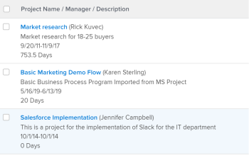

# 視圖：多行項目視圖

在此項目視圖中，您可以：

* 以多行格式顯示項目資訊。\
   視圖使用

   ```
   sharecol=true
   ```

   標籤，以在同一列標題下組合多個欄位。 要瞭解有關此標籤的詳細資訊，請參閱 [視圖：從一個共用列中的多個列合併資訊](../../../reports-and-dashboards/reports/custom-view-filter-grouping-samples/view-merge-columns.md)。

* 使用保存HTML換行標籤的佔位符列(

   ```
   <br>
   ```

   )以強制「說明」顯示在項目名稱下方。
* 在項目名稱后的括弧中顯示項目所有者。
* 將項目名稱顯示為項目連結。



## 訪問要求

您必須具有以下訪問權限才能執行本文中的步驟：

<table style="table-layout:auto"> 
 <col> 
 <col> 
 <tbody> 
  <tr> 
   <td role="rowheader">Adobe Workfront計畫</td> 
   <td> <p>任何</p> </td> 
  </tr> 
  <tr> 
   <td role="rowheader">Adobe Workfront許可證*</td> 
   <td> <p>請求修改視圖 </p>
   <p>計畫修改報表</p> </td> 
  </tr> 
  <tr> 
   <td role="rowheader">訪問級別配置*</td> 
   <td> <p>編輯對報表、儀表板、日曆的訪問以修改報表</p> <p>編輯對篩選器、視圖、分組的訪問以修改視圖</p> <p><b>附註</b>

如果您仍然沒有訪問權限，請詢問您的Workfront管理員是否在您的訪問級別設定了其他限制。 有關Workfront管理員如何修改您的訪問級別的資訊，請參見 <a href="../../../administration-and-setup/add-users/configure-and-grant-access/create-modify-access-levels.md" class="MCXref xref">建立或修改自定義訪問級別</a>。</p> </td>
</tr> 
  <tr> 
   <td role="rowheader">對象權限</td> 
   <td> <p>管理對報表的權限</p> <p>有關請求附加訪問的資訊，請參見 <a href="../../../workfront-basics/grant-and-request-access-to-objects/request-access.md" class="MCXref xref">請求訪問對象 </a>。</p> </td> 
  </tr> 
 </tbody> 
</table>

&#42;要瞭解您擁有的計畫、許可證類型或訪問權限，請與您的Workfront管理員聯繫。

## 構建多行項目視圖

1. 新建項目視圖。 有關如何建立新視圖的詳細資訊，請參閱 [Adobe Workfront視圖概述](../../../reports-and-dashboards/reports/reporting-elements/views-overview.md)。
1. 在構建視圖時，請刪除除一列之外的所有列。
1. 選擇剩餘列，然後按一下 **切換到文本模式**。
1. 複製並貼上列內下面的文本模式：
   <pre>column.0.linkedname=direct<br>column.0.link.valueformat=val<br>column.0.link.linkproperty.0.name=ID<br>column.0.link.linkproperty.0.valuefield=ID<br>column.0.link.linkproperty.0.valueformat=int<br>column.0.link.valuefield=objCode<br>column.0.link.lookup=link.view<br>column.0.sharecol=true<br>column.0.descriptionkey=name<br>column.0.width=150<br>column.0.querysort=name<br>column.0.valuefield=name<br>column.0.name=項目名稱/經理/說明<br>column.0.shortview=false<br>column.0.stretch=100<br>column.0.textmode=true<br>column.0.listsort=string(name)<br>column.0.valueformat=HTML<br>column.1.valueexpression=CONCAT("(",{owner})。{name},")<br>column.1.listsort=nested(owner)。string(name)<br>column.1.width=1<br>column.1.linkedname=direct<br>column.1.querysort=owner:name<br>column.1.textmode=true<br>column.1.shortview=false<br>column.1.stretch=0<br>column.1.valueformat=HTML<br>column.1.sharecol=true<br>column.2.width=1<br>column.2.value=<br><br>column.2.shortview=false<br>column.2.sharecol=true<br>column.2.strt.0<br>column.2.textmode=true<br>column.2.valueformat=HTML<br>column.3.styledef.style=font color:#ccc;<br>column.3.descriptionkey=description<br>column.3.linkedname=direct<br>column.3.valuefield=description<br>column.3.listsort=string(description)<br>column.3.querysort=說明<br>column.3.namekey=description.abbr<br>column.3.textmode=true<br>column.3.sharecol=true<br>column.3.strt.0<br>column.3.shortview=false<br>column.3.valueformat=HTML<br>column.3.width=1<br>column.4.shortview=false<br>column.4.value=<br><br>column.4.sharecol=true<br>column.4.width=1<br>column.4.textmode=true<br>column.4.valueformat=HTML\<br>column.4.stretch=0<br>column.5.name=計畫日期/工期<br>column.5.width=150<br>column.5.querysort=planedStartDate<br>column.5.sharecol=true<br>column.5.strt.0<br>column.5.textmode=true<br>column.5.shortview=false<br>column.5.linkedname=direct<br>column.5.listsort=atDateAsAtDate(planedStartDate)<br>column.5.valuefield=planedStartDate<br>column.5.valueformat=atDate<br>column.6.sharecol=true<br>column.6.strt.0<br>column.6.width=1<br>column.6.textmode=true<br>column.6.value=-<br>column.6.valueformat=HTML<br>column.6.shortview=false<br>column.7.namekey=plannecompletiondate.abbr<br>column.7.width=1<br>column.7.sharecol=true<br>column.7.shortview=false<br>column.7.stretch=0<br>column.7.listsort=atDateAsAtDate(planedCompletionDate)<br>column.7.linkedname=direct<br>column.7.descriptionkey=plannedcompletiondate<br>column.7.textmode=true<br>column.7.querysort=planedCompletionDate<br>column.7.valueformat=atDate<br>column.7.valuefield=planedCompletionDate<br>column.8.value=<br><br>column.8.width=1<br>column.8.textmode=true<br>column.8.sharecol=true<br>column.8.valueformat=HTML<br>column.8.strt.0<br>column.9.textmode=true<br>column.9.listsort=intAsInt(durationMinutes)<br>column.9.strt.0<br>column.9.valuefield=durationFieldLong<br>column.9.descriptionkey=duration<br>column.9.viewalias=duration<br>column.9.querysort=durationMinutes<br>column.9.sharecol=true<br>column.9.width=100<br>column.9.shortview=false<br>column.9.namekey=duration.abbr<br>column.9.linkedname=direct<br>column.9.valueformat=複合<br>column.10.textmode=true<br>column.10.stretch=0</pre>

1. 按一下 **保存視圖**。
