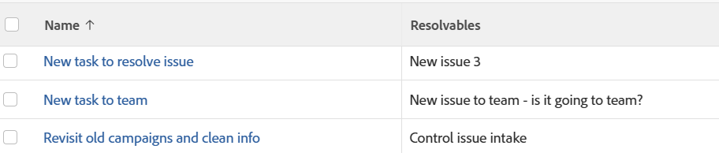

# 查看：任務或項目報表中的可解析對象

您可以在項目或任務視圖或報告中顯示所有可解析對象的清單。

有關可解析對象的詳細資訊，請參閱文章 [解析和可解析對象概述](../../../manage-work/issues/convert-issues/resolving-and-resolvable-objects.md).

對任務和項目應用此視圖是相同的。

## 存取需求

您必須具備下列存取權，才能執行本文中的步驟：

<table style="table-layout:auto"> 
 <col> 
 <col> 
 <tbody> 
  <tr> 
   <td role="rowheader">Adobe Workfront計畫*</td> 
   <td> 
任何
 </td> 
  </tr> 
  <tr> 
   <td role="rowheader">Adobe Workfront授權*</td> 
   <td> 
計劃 
 </td> 
  </tr> 
  <tr> 
   <td role="rowheader">訪問級別配置*</td> 
   <td> 
編輯對報表、控制面板、日曆的存取
 
編輯對篩選器、檢視、群組的存取
 
注意：如果您仍無權存取，請洽詢您的Workfront管理員，他們是否在您的存取層級設定其他限制。 如需Workfront管理員如何修改您的存取層級的詳細資訊，請參閱 <a href="../../../administration-and-setup/add-users/configure-and-grant-access/create-modify-access-levels.md" class="MCXref xref">建立或修改自訂存取層級</a>.
 </td> 
  </tr> 
  <tr> 
   <td role="rowheader">物件權限</td> 
   <td> 
管理報表權限
 
有關請求其他訪問的資訊，請參閱 <a href="../../../workfront-basics/grant-and-request-access-to-objects/request-access.md" class="MCXref xref">請求對對象的訪問 </a>.
 </td> 
  </tr> 
 </tbody> 
</table>

&#42;若要了解您擁有的計畫、授權類型或存取權，請聯絡您的Workfront管理員。

## 在任務或項目報表中查看可解析對象

1. 移至已從問題轉換的任務清單。
1. 從 **檢視** 下拉式功能表，選取 **新建視圖**.

1. 在&#x200B;**欄預覽** 按一下 **添加列**.

1. 按一下新欄的標題，然後按一下 **切換到文本模式**.
1. 將滑鼠移到文字模式區域上，然後按一下 **按一下「 」以編輯文字**.
1. 移除您在 **文字模式** 框中，並將其替換為以下代碼：

   <pre>displayname=Resolupables listdelimeter=  listmethod=nested(resolubles)。lists textmode=true type=iterate valuefield=name valueformat=HTML </pre>

1. 按一下 **保存視圖**.\
   新列中顯示所有可解析對象的清單。 清單中對象的名稱不能直接連結到對象。
