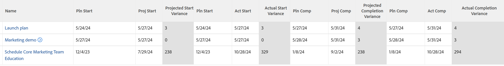

# 檢視：具有所有日期差異的任務

<!--Audited: 11/2024-->

此任務檢視類似於您的Adobe Workfront帳戶隨附的「所有日期」檢視。 此特定檢視包含&#x200B;*差異*&#x200B;欄，可計算下列日期之間的天數差異：

* 計畫與預計開始日期
* 計畫和實際開始日期
* 計畫與預計完成日期
* 計畫和實際完成日期

此檢視表代表計算資料行的範例，您可以在其中從兩個不同的資料行取得值，然後透過計算將它們連線起來，以取得第三個值。 在此情況下，您會從日期2減去日期1。

如需有關在檢視中使用計算的詳細資訊，請參閱下列[文字模式常見使用概述](../../../reports-and-dashboards/reports/text-mode/understand-common-uses-text-mode.md)一節：  [文字模式的常見使用概述](../../../reports-and-dashboards/reports/text-mode/understand-common-uses-text-mode.md)。



## 存取需求

+++ 展開以檢視本文中功能的存取需求。

您必須具有下列存取權才能執行本文中的步驟：

<table style="table-layout:auto"> 
 <col> 
 <col> 
 <tbody> 
  <tr> 
   <td role="rowheader">Adobe Workfront計畫</td> 
   <td> <p>任何</p> </td> 
  </tr> 
  <tr> 
   <td role="rowheader">Adobe Workfront授權</td> 
   <td> <p> 目前： 
   <ul>
   <li>請求修改檢視</li> 
   <li>計畫修改報表</li>
   </ul>
     </p>
     <p> 新增： 
   <ul>
   <li>修改檢視的貢獻者</li> 
   <li>用於修改報告的標準</li>
   </ul>
     </p>
    </td> 
  </tr> 
  <tr> 
   <td role="rowheader">存取層級設定*</td> 
   <td> <p>編輯報告、儀表板、行事曆的存取權以修改報告</p> <p>編輯對篩選器、檢視、群組的存取權以修改檢視</p> </td> 
  </tr> 
  <tr> 
   <td role="rowheader">物件許可權</td> 
   <td> <p>管理報表的許可權</p> </td> 
  </tr> 
 </tbody> 
</table>

如需有關此表格的詳細資訊，請參閱Workfront檔案中的[存取需求](/help/quicksilver/administration-and-setup/add-users/access-levels-and-object-permissions/access-level-requirements-in-documentation.md)。

+++

## 檢視具有所有日期差異的任務

1. 前往工作清單。
1. 從&#x200B;**檢視**&#x200B;下拉式功能表中，選取&#x200B;**新增檢視**。

1. 在&#x200B;**資料行預覽**&#x200B;區域中，排除除一個資料行以外的所有資料行。
1. 按一下剩餘欄的標題，然後按一下&#x200B;**切換到文字模式** > **編輯文字模式**。
1. 移除您在&#x200B;**編輯文字模式**&#x200B;方塊中找到的文字，並取代為下列程式碼：

   ```
   column.1.descriptionkey=name
   column.1.link.linkproperty.0.name=ID
   column.1.link.linkproperty.0.valuefield=ID
   column.1.link.linkproperty.0.valueformat=int
   column.1.link.lookup=link.view
   column.1.link.valuefield=objCode
   column.1.link.valueformat=val
   column.1.linkedname=direct
   column.1.listsort=string(name)
   column.1.namekey=name.abbr
   column.1.querysort=name
   column.1.shortview=false
   column.1.stretch=95
   column.1.styledef.case.0.comparison.attribute=css
   column.1.styledef.case.0.comparison.isrowcase=true
   column.1.styledef.case.0.comparison.leftmethod=intAsInt(numberOfChildren)
   column.1.styledef.case.0.comparison.lefttext=numberOfChildren
   column.1.styledef.case.0.comparison.operator=gt
   column.1.styledef.case.0.comparison.operatortype=int
   column.1.styledef.case.0.comparison.righttext=0
   column.1.styledef.case.0.comparison.trueproperty.0.name=fontstyle
   column.1.styledef.case.0.comparison.trueproperty.0.value=bold
   column.1.styledef.case.0.comparison.truetext=
   column.1.styledef.case.0.comparison.usefield=false
   column.1.valuefield=name
   column.1.valueformat=HTML
   column.1.width=150
   column.2.descriptionkey=plannedstartdate
   column.2.linkedname=direct
   column.2.listsort=atDateAsAtDate(plannedStartDate)
   column.2.namekey=plannedstartdate.abbr
   column.2.querysort=plannedStartDate
   column.2.shortview=false
   column.2.stretch=0
   column.2.valuefield=plannedStartDate
   column.2.valueformat=atDate
   column.2.width=75
   column.3.descriptionkey=projectedstartdate
   column.3.linkedname=direct
   column.3.listsort=atDateAsAtDate(projectedStartDate)
   column.3.namekey=projectedstartdate.abbr
   column.3.querysort=projectedStartDate
   column.3.shortview=false
   column.3.stretch=0
   column.3.valuefield=projectedStartDate
   column.3.valueformat=atDate
   column.3.width=75
   column.4.descriptionkey=plannedstartdate
   column.4.displayname=Projected Start Variance
   column.4.linkedname=direct
   column.4.listsort=atDateAsAtDate(plannedStartDate)
   column.4.namekey=plannedstartdate.abbr
   column.4.querysort=plannedStartDate
   column.4.shortview=false
   column.4.stretch=0
   column.4.styledef.case.0.comparison.attribute=css
   column.4.styledef.case.0.comparison.isrowcase=false
   column.4.styledef.case.0.comparison.leftmethod=atDateAsAtDate(plannedStartDate)
   column.4.styledef.case.0.comparison.lefttext=plannedStartDate
   column.4.styledef.case.0.comparison.operator=notnull
   column.4.styledef.case.0.comparison.operatortype=date
   column.4.styledef.case.0.comparison.righttext=
   column.4.styledef.case.0.comparison.trueproperty.0.name=bgcolor
   column.4.styledef.case.0.comparison.trueproperty.0.value=E1E1E1
   column.4.styledef.case.0.comparison.truetext=
   column.4.styledef.case.0.comparison.usefield=false
   column.4.valueexpression=ROUND(DATEDIFF({projectedStartDate},{plannedStartDate}))
   column.4.valueformat=HTML
   column.4.width=75
   column.5.descriptionkey=plannedstartdate
   column.5.linkedname=direct
   column.5.listsort=atDateAsAtDate(plannedStartDate)
   column.5.namekey=plannedstartdate.abbr
   column.5.querysort=plannedStartDate
   column.5.shortview=false
   column.5.stretch=0
   column.5.valuefield=plannedStartDate
   column.5.valueformat=atDate
   column.5.width=75
   column.6.descriptionkey=actualstartdate
   column.6.linkedname=direct
   column.6.listsort=atDateAsAtDate(actualStartDate)
   column.6.namekey=actualstartdate.abbr
   column.6.querysort=actualStartDate
   column.6.shortview=false
   column.6.stretch=0
   column.6.valuefield=actualStartDate
   column.6.valueformat=atDate
   column.6.width=75
   column.7.descriptionkey=plannedstartdate
   column.7.displayname=Actual Start Variance
   column.7.linkedname=direct
   column.7.listsort=atDateAsAtDate(plannedStartDate)
   column.7.namekey=plannedstartdate.abbr
   column.7.querysort=plannedStartDate
   column.7.shortview=false
   column.7.stretch=0
   column.7.styledef.case.0.comparison.attribute=css
   column.7.styledef.case.0.comparison.isrowcase=false
   column.7.styledef.case.0.comparison.leftmethod=atDateAsAtDate(plannedStartDate)
   column.7.styledef.case.0.comparison.lefttext=plannedStartDate
   column.7.styledef.case.0.comparison.operator=notnull
   column.7.styledef.case.0.comparison.operatortype=date
   column.7.styledef.case.0.comparison.righttext=
   column.7.styledef.case.0.comparison.trueproperty.0.name=bgcolor
   column.7.styledef.case.0.comparison.trueproperty.0.value=E1E1E1
   column.7.styledef.case.0.comparison.truetext=
   column.7.styledef.case.0.comparison.usefield=false
   column.7.valueexpression=ROUND(DATEDIFF({actualStartDate},{plannedStartDate}))
   column.7.valueformat=HTML
   column.7.width=75
   column.8.descriptionkey=plannedcompletiondate
   column.8.linkedname=direct
   column.8.listsort=atDateAsAtDate(plannedCompletionDate)
   column.8.namekey=plannedcompletiondate.abbr
   column.8.querysort=plannedCompletionDate
   column.8.shortview=false
   column.8.stretch=0
   column.8.valuefield=plannedCompletionDate
   column.8.valueformat=atDate
   column.8.width=75
   column.9.descriptionkey=projectedcompletiondate
   column.9.linkedname=direct
   column.9.listsort=atDateAsAtDate(projectedCompletionDate)
   column.9.namekey=projectedcompletiondate.abbr
   column.9.querysort=projectedCompletionDate
   column.9.shortview=false
   column.9.stretch=0
   column.9.valuefield=projectedCompletionDate
   column.9.valueformat=atDate
   column.9.width=75
   column.10.descriptionkey=plannedcompletiondate
   column.10.displayname=Projected Completion Variance
   column.10.linkedname=direct
   column.10.listsort=atDateAsAtDate(plannedCompletionDate)
   column.10.namekey=plannedcompletiondate.abbr
   column.10.querysort=plannedCompletionDate
   column.10.shortview=false
   column.10.stretch=0
   column.10.styledef.case.0.comparison.attribute=css
   column.10.styledef.case.0.comparison.isrowcase=false
   column.10.styledef.case.0.comparison.leftmethod=atDateAsAtDate(plannedCompletionDate)
   column.10.styledef.case.0.comparison.lefttext=plannedCompletionDate
   column.10.styledef.case.0.comparison.operator=notnull
   column.10.styledef.case.0.comparison.operatortype=date
   column.10.styledef.case.0.comparison.righttext=
   column.10.styledef.case.0.comparison.trueproperty.0.name=bgcolor
   column.10.styledef.case.0.comparison.trueproperty.0.value=E1E1E1
   column.10.styledef.case.0.comparison.truetext=
   column.10.styledef.case.0.comparison.usefield=false
   column.10.valueexpression=ROUND(DATEDIFF({projectedCompletionDate},{plannedCompletionDate}))
   column.10.valueformat=HTML
   column.10.width=75
   column.11.descriptionkey=plannedcompletiondate
   column.11.linkedname=direct
   column.11.listsort=atDateAsAtDate(plannedCompletionDate)
   column.11.namekey=plannedcompletiondate.abbr
   column.11.querysort=plannedCompletionDate
   column.11.shortview=false
   column.11.stretch=0
   column.11.valuefield=plannedCompletionDate
   column.11.valueformat=atDate
   column.11.width=75
   column.12.descriptionkey=actualcompletiondate
   column.12.linkedname=direct
   column.12.listsort=atDateAsAtDate(actualCompletionDate)
   column.12.namekey=actualcompletiondate.abbr
   column.12.querysort=actualCompletionDate
   column.12.shortview=false
   column.12.stretch=0
   column.12.valuefield=actualCompletionDate
   column.12.valueformat=atDate
   column.12.width=75
   column.13.descriptionkey=plannedcompletiondate
   column.13.displayname=Actual Completion Variance
   column.13.linkedname=direct
   column.13.listsort=atDateAsAtDate(plannedCompletionDate)
   column.13.namekey=plannedcompletiondate.abbr
   column.13.querysort=plannedCompletionDate
   column.13.shortview=false
   column.13.stretch=0
   column.13.styledef.case.0.comparison.attribute=css
   column.13.styledef.case.0.comparison.isrowcase=false
   column.13.styledef.case.0.comparison.leftmethod=atDateAsAtDate(plannedCompletionDate)
   column.13.styledef.case.0.comparison.lefttext=plannedCompletionDate
   column.13.styledef.case.0.comparison.operator=notnull
   column.13.styledef.case.0.comparison.operatortype=date
   column.13.styledef.case.0.comparison.righttext=
   column.13.styledef.case.0.comparison.trueproperty.0.name=bgcolor
   column.13.styledef.case.0.comparison.trueproperty.0.value=E1E1E1
   column.13.styledef.case.0.comparison.truetext=
   column.13.styledef.case.0.comparison.usefield=false
   column.13.valueexpression=ROUND(DATEDIFF({actualCompletionDate},{plannedCompletionDate}))
   column.13.valueformat=HTML
   column.13.width=75
   row.0.styledef.applyallcases=true
   row.0.styledef.case.0.comparison.attribute=css
   row.0.styledef.case.0.comparison.isrowcase=true
   row.0.styledef.case.0.comparison.leftmethod=intAsInt(numberOfChildren)
   row.0.styledef.case.0.comparison.lefttext=numberOfChildren
   row.0.styledef.case.0.comparison.operator=gt
   row.0.styledef.case.0.comparison.operatortype=int
   row.0.styledef.case.0.comparison.righttext=0
   row.0.styledef.case.0.comparison.trueproperty.0.name=fontstyle
   row.0.styledef.case.0.comparison.trueproperty.0.value=bold
   row.0.styledef.case.0.comparison.truetext=
   row.0.styledef.case.0.comparison.usefield=false
   ```

1. 按一下&#x200B;**完成** > **儲存檢視**。
