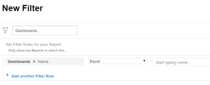

# 瞭解如何在控制面板上組織報表

## 存取報告清單中的儀表板資訊

您可以檢視報表是否已新增至Adobe Workfront中的儀表板。 在決定您可以保留哪些報告以及可從系統中刪除哪些報告時，這可能很有用。 如果報表位於控制面板上，使用者可能仍會依賴這些報表。 建議不要刪除使用者正在使用的控制面板上列出的報表。\
如需有關新增報表到儀表板的詳細資訊，請參閱文章[新增報表到儀表板](../../../reports-and-dashboards/dashboards/creating-and-managing-dashboards/add-report-dashboard.md)。

您可以執行下列任一項作業，檢視報表是否已新增至控制面板：

* 建立報表清單的檢視，並在欄中包含儀表板資訊
* 依您知道正在主動使用的一或多個特定控制面板篩選報告清單
* 為報表物件建立報表，並使用包含儀表板資訊的檢視或篩選器

任何人都可以建立檢視或篩選器，但您必須在存取層級中擁有「編輯報表」存取權，才能建立報表。\
如需有關存取報告的詳細資訊，請參閱文章[授予報告、儀表板和行事曆的存取權](../../../administration-and-setup/add-users/configure-and-grant-access/grant-access-reports-dashboards-calendars.md)。\
如需有關建立報告的詳細資訊，請參閱文章[建立自訂報告](../../../reports-and-dashboards/reports/creating-and-managing-reports/create-custom-report.md)。

## 存取需求

您必須具有下列存取權才能執行本文中的步驟：

<table style="table-layout:auto"> 
 <col> 
 <col> 
 <tbody> 
  <tr> 
   <td role="rowheader">Adobe Workfront計畫*</td> 
   <td> 
任何
 </td> 
  </tr> 
  <tr> 
   <td role="rowheader">Adobe Workfront授權*</td> 
   <td> 
計劃 
 </td> 
  </tr> 
  <tr> 
   <td role="rowheader">存取層級設定*</td> 
   <td> 
編輯報告、儀表板、行事曆的存取權
 
編輯對篩選器、檢視、群組的存取權
 
注意：如果您還是沒有存取權，請詢問您的Workfront管理員，他們是否在您的存取層級中設定其他限制。 如需Workfront管理員如何修改存取層級的詳細資訊，請參閱<a href="../../../administration-and-setup/add-users/configure-and-grant-access/create-modify-access-levels.md" class="MCXref xref">建立或修改自訂存取層級</a>。
 </td> 
  </tr> 
  <tr> 
   <td role="rowheader">物件許可權</td> 
   <td> 
管理報表的許可權
 
如需請求其他存取權的資訊，請參閱<a href="../../../workfront-basics/grant-and-request-access-to-objects/request-access.md" class="MCXref xref">請求物件</a>的存取權。
 </td> 
  </tr> 
 </tbody> 
</table>

&#42;若要瞭解您擁有的計畫、授權型別或存取權，請連絡您的Workfront管理員。

## 在報告清單的檢視中顯示儀表板資訊

>[!WARNING]
>
>在報表清單中包含儀表板欄可能會顯著增載入入時間，尤其是針對長報表清單。

若要使用報告清單的控制面板資訊建立檢視：

1. 按一下Workfront右上角的&#x200B;**主要功能表**&#x200B;圖示，然後按一下&#x200B;**報表**。
1. 在報表清單中，按一下&#x200B;**檢視**&#x200B;下拉式功能表。
1. 按一下&#x200B;**新檢視**。
1. 按一下「**新增欄**」。
1. 開始在&#x200B;**開始輸入欄位名稱**&#x200B;欄位中輸入「儀表板」。
1. 在&#x200B;**報表**&#x200B;物件下，選取&#x200B;**儀表板**。

1. 按一下「**儲存視圖**」。\
   報表所顯示的儀表板會顯示在報表清單的儀表板欄中。\
   

## 依控制面板資訊篩選報表清單

若要依控制面板資訊篩選報表清單：

1. 按一下Workfront右上角的&#x200B;**主要功能表**&#x200B;圖示，然後按一下&#x200B;**報表**。

1. 在報表清單中，按一下&#x200B;**篩選器**&#x200B;下拉式功能表。
1. 按一下&#x200B;**新增篩選器**，然後按一下&#x200B;**新增篩選器規則**。

1. 開始在&#x200B;**開始輸入欄位名稱**&#x200B;欄位中輸入「儀表板」。

1. 在&#x200B;**儀表板**&#x200B;物件下，選取&#x200B;**名稱**。

1. 在修飾元下拉式選單中選取&#x200B;**等於**，然後開始輸入您要作為篩選依據的儀表板名稱。 您可以為篩選器選取多個控制面板。\
   

1. 按一下「**儲存並關閉**」。\
   這會顯示僅列在指定控制面板上的報告清單。\
   您也可以為報表物件建立報表，並在報表中使用此篩選器。
