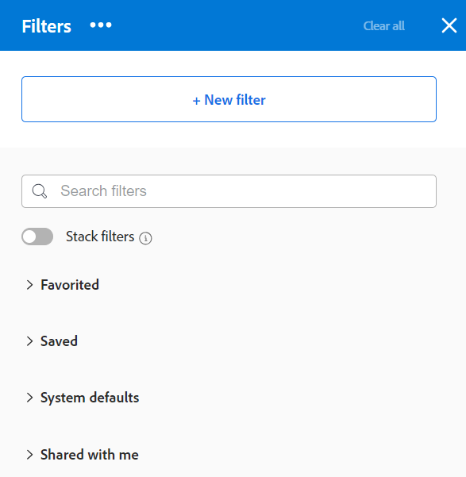

# 在Adobe Workfront中建立或編輯篩選器

<!--Audited: 12/2023-->

您可以透過篩選條件限制在專案清單中熒幕顯示的資訊量。 您可以根據物件的特定資訊來定義特定條件，並僅顯示符合這些條件的物件。

您可以在Adobe Workfront中套用下列型別的篩選器：

* 在物件清單中快速篩選，以使用關鍵字尋找專案。 這些是暫時的篩選器，您無法儲存以供日後使用。

  如需快速篩選的詳細資訊，請參閱 [將快速篩選套用至清單](../../../workfront-basics/navigate-workfront/use-lists/apply-quick-filter-list.md).

* 永久篩選器，可多次儲存和使用在多個清單和報告上。 本文會說明如何建立永久篩選器，或編輯清單或報表中的現有篩選器。

* Workfront其他區域中的篩選器，在清單和報告之外。

  如需Workfront中所有篩選器的清單，以及可套用篩選器的區域，請參閱 [Adobe Workfront中的篩選器概觀](../../../reports-and-dashboards/reports/reporting-elements/filters-overview.md).

## 存取需求

您必須具有下列存取權才能執行本文中的步驟：

<table style="table-layout:auto"> 
 <col> 
 <col> 
 <tbody> 
  <tr> 
   <td role="rowheader"><strong>Adobe Workfront計畫*</strong></td> 
   <td> 
任何
 </td> 
  </tr> 
  <tr> 
   <td role="rowheader"><strong>Adobe Workfront授權*</strong></td> 
   <td> 
新增：投稿人或更高版本

或

目前：要求或以上

<b>注意：</b>

若要編輯報告中的篩選器，您必須擁有下列授權：

新增：計畫

或

目前：標準

</td> 
  </tr> 
  <tr> 
   <td role="rowheader"><strong>存取層級設定*</strong></td> 
   <td> <ul><li>
編輯對篩選器、檢視和群組的存取權
</li></ul>
    
<b>注意：</b>

   若要編輯報告中的篩選器，您除了要編輯篩選器、檢視和群組的存取許可權之外，還必須有下列存取層級設定：

<ul><li>
編輯報告、儀表板和行事曆的存取權
</li></ul>

<b>注意：</b>
 
 如果您沒有存取權，請洽詢Workfront管理員，瞭解他們是否在您的存取層級設定其他限制。 如需有關Workfront管理員如何修改您的存取層級的資訊，請參閱 <a href="../../../administration-and-setup/add-users/configure-and-grant-access/create-modify-access-levels.md" class="MCXref xref">建立或修改自訂存取層級</a>.
 </td> 
  </tr> 
  <tr> 
   <td role="rowheader"><strong>物件許可權</strong></td> 
   <td> 
管理篩選器的許可權
 
如需請求其他存取許可權的詳細資訊，請參閱 <a href="../../../workfront-basics/grant-and-request-access-to-objects/request-access.md" class="MCXref xref">要求物件的存取權 </a>.
 </td> 
  </tr> 
 </tbody> 
</table>

&#42;若要瞭解您擁有的計畫、授權型別或存取權，請聯絡您的Workfront管理員。

## 篩選建置介面的型別

您可以使用下表所述的篩選產生器型別來建立篩選器：

<table style="table-layout:auto">
<col>
<col>
<col>
<tbody>
<tr>
<td><strong>產生器型別</strong></td>
<td><strong>篩選物件</strong></td>
<td><strong>可用時</strong></td>
</tr>
<tr>
<td>標準產生器</td>
<td>
<ul>
<li> 
專案
 </li>
<li> 
任務 
 </li>
<li> 
問題
 </li>
<li> 
專案組合
 </li>
<li> 
計劃
 </li>
<li> 
使用者
 </li>
<li> 
範本
 </li>
<li> 
群組
 </li>
</ul>
</td>
<td>
<ul>
<li> 
清單 
 </li>
</ul>
<ul>
<li> 
情境規劃工具中的專案清單
 
Scenario Planner需要額外的授權。 如需Workfront Scenario Planner的相關資訊，請參閱 <a href="../../../scenario-planner/scenario-planner-overview.md">情境規劃工具概觀</a>. 
 </li>
</ul>

<b>注意：</b>
 
報表中沒有篩選的標準產生器。
</td>
</tr>
<tr>
<td>舊版產生器</td>
<td>所有物件 </td>
<td>清單與報告</td>
</tr>
</tbody>
</table>

如需Workfront物件的相關資訊，請參閱 [瞭解Adobe Workfront中的物件](/help/quicksilver/workfront-basics/navigate-workfront/workfront-navigation/understand-objects.md).

使用不同介面建立篩選器時，請考量下列事項：

* 您可在上表所列區域的舊版篩選器介面的相同位置找到標準產生器。
* 標準產生器是所有可用區域的預設體驗。 若要切換至舊版篩選產生器，請按一下 **更多** 選單旁邊 [!UICONTROL **篩選器**] 並選取 [!UICONTROL **返回舊版篩選器**].

  

* 無論您最初使用哪個體驗建置篩選器，儲存的篩選器都可在兩個建置器中使用。 例如，如果您使用舊版產生器建立篩選器，您也可以在標準產生器介面中找到並修改它。

  >[!TIP]
  >
  >「全部」篩選器未包含在標準產生器中，因為未套用篩選器時會顯示所有清單專案。 按一下 [!UICONTROL **全部清除**] ，可清除任何作用中的篩選器並顯示所有專案。 如果 [!UICONTROL **全部清除**] 變暗，則不會套用任何篩選器。

* 在建置結合AND和OR運運算元的多陳述式篩選器時，標準和舊版建置器的語法稍有不同。 因此，當您從一個產生器切換到另一個產生器時，這些篩選器的顯示可能會不同。

  >[!INFO]
  >
  >下列情況存在：
  >
  >1. 使用標準產生器建立具有下列語法的篩選器：
  >
  >      `(A OR B) AND C`
  >
  >1. 切換到舊版產生器，並使用舊版產生器的語法來編輯篩選器，如區段中所述 [在舊版產生器中建立或編輯篩選器](#create-filter-in-legacy-builder) 本文章內容。 舊版產生器的語法會顯示篩選陳述式，如下所示：
  >
  >      `A AND C`
  >      `OR`
  >      `B AND C`
  >
  >1. 變更舊版介面中的篩選器。
  >1. 切換回標準產生器。 如上所述，篩選陳述式會根據舊版產生器中支援的邏輯而顯示。
  >
  >      篩選器在標準產生器介面中顯示如下：
  >  
  >      `A AND C`
  >      `OR`
  >      `B AND C`
  > 
  >      發生此情況是因為已在舊版介面中修改篩選器。

## 在標準產生器中建立或編輯篩選器

您可以使用標準產生器介面，透過下列方式建立篩選器：

* 從頭開始
* 編輯現有篩選器
* 複製現有篩選器
* 複製現有的篩選器，編輯它，然後儲存為新篩選器

使用標準產生器介面建立篩選器：

1. 移至您要建立篩選的清單，或包含您要自訂的篩選的清單。
1. 按一下 **篩選** 圖示  以開啟產生器介面。

   

1. 檢閱下列篩選器清單：

   <table style="table-layout:auto">
   <col>
   <col>
   <tbody>
   <tr>
   <td role="rowheader"><strong>已新增至最愛</strong></td>
   <td>您標示為我的最愛的篩選器。 當您最愛某個篩選器時，其原始位置會顯示在篩選器名稱下方，且除非您將其移除為最愛，否則會隱藏在原始清單中。</td>
   </tr>
   <tr>
   <td role="rowheader"><strong>已儲存</strong></td>
   <td>您自行建立和儲存的篩選器。 依預設，此清單會以最近儲存的順序顯示已儲存的篩選器，但您可拖曳篩選器名稱以手動方式重新排序清單。</td>
   </tr>
   <tr>
   <td role="rowheader"><strong>系統預設值</strong></td>
   <td>Workfront系統預設篩選器，以及Workfront管理員新增至您的篩選器清單中的篩選器，這些篩選器可在系統層級或版面配置範本中進行。</td>
   </tr>
   <tr>
   <td role="rowheader"><strong>與我共用</strong></td>
   <td>其他人建立並與您共用或全系統共用的篩選器。</td>
   </tr>
   </tbody>
   </table>

1. 執行下列其中一項：

   * 按一下 **新增篩選器** 從頭開始建立篩選。
   * 將游標停留在您有權管理的現有篩選器上，然後按一下 **編輯** 圖示  以編輯它。

     或

     將游標停留在您有權檢視的現有篩選器上，按一下 **更多** 功能表 ，然後按一下 **複製** 複製現有篩選器並編輯副本。

   

1. （視條件而定）根據您是否要尋找符合篩選群組中所有陳述式或任一陳述式的物件，從下列選項中選取：

   <table style="table-layout:auto">
   <col>
   <col>
   <tbody>
   <tr>
   <td role="rowheader"><strong>全部為 True 時包含</strong></td>
   <td>篩選找到的物件必須符合篩選群組中的所有篩選條件。 在這種情況下，篩選器陳述式會由AND運運算元連線。 這是預設選取範圍。</td>
   </tr>
   <tr>
   <td role="rowheader"><strong>任一項為 True 時包含</strong></td>
   <td>篩選找到的物件必須符合篩選群組中的所有篩選條件。 在這種情況下，篩選器陳述式會由OR運運算元連線。</td>
   </tr>
   </tbody>
   </table>

   

   如需篩選器運運算元的詳細資訊，請參閱 [Adobe Workfront中的篩選器概觀](/help/quicksilver/reports-and-dashboards/reports/reporting-elements/filters-overview.md).

1. 按一下欄位下拉式功能表，以檢視最近使用之欄位的清單，以及篩選依據的建議欄位。 建議的欄位目前顯示在您正在篩選的清單中。

   您也可以選取 **瀏覽欄位** 以檢視所有可篩選的欄位清單。 進階搜尋中的欄位會依物件類別分組。

   

1. 按一下修正因子下拉式功能表，以選取修正因子。 預設修飾元為「等於」。

   如需詳細資訊，請參閱 [篩選和條件修飾元](/help/quicksilver/reports-and-dashboards/reports/reporting-elements/filter-condition-modifiers.md).

   >[!TIP]
   >
   >當您建立篩選器時，結果會立即顯示在清單中。 如果篩選器面板覆蓋清單，您可以將其關閉以檢視顯示內容。 當您再次開啟面板時，您輸入的資訊會保留在產生器中。

1. 開始輸入您要作為篩選依據的欄位值。 例如，如果要依據以下條件篩選，請開始輸入問題的名稱 `Issue:Name`. 選取顯示在清單中的值。

   >[!TIP]
   >
   >視您選取的修飾元而定，您可以選取多個值。

1. 按一下 **新增篩選器** 若要選取其他欄位，請將篩選條件新增至篩選陳述式。
1. （可選）按一下 **刪除** 圖示  以移除現有的篩選陳述式。

   或

   按一下 **全部清除** 以清除所有篩選條件。

1. （選用）按一下 **新增篩選器群組** 以新增另一組篩選條件。 集合之間的預設運運算元為 **和**. 按一下運運算元以變更為 **或**.

   >[!TIP]
   >
   >當您希望群組由篩選陳述式中的運運算元以外的其他運運算元連線時，您可能想要使用另一個篩選群組。

   >[!INFO]
   >
   >當您篩選名稱中包含未完成且未保留的專案「行銷」時，您可以使用下列多個篩選群組：
   >`(Project: Name Contains Marketing AND Project: Percent Complete Does not equal 100)`
   >`OR`
   >`(Project: Name Contains Marketing AND Project: Status Does not equal On Hold)`
   >在這種情況下，每個篩選陳述式都使用AND連結，而篩選群組則使用OR連結。

1. （選用）按一下 **文字模式** 以使用文字模式繼續建立篩選器。

   

   文字模式介面隨即開啟。

   

   >[!TIP]
   >
   >建議您使用標準產生器介面，並在必須修改僅支援文字模式的篩選器時，才使用文字模式，來儘可能建立篩選器。

   如需有關使用文字模式介面建立篩選的詳細資訊，請參閱 [使用文字模式編輯篩選器](/help/quicksilver/reports-and-dashboards/reports/text-mode/edit-text-mode-in-filter.md).

1. 按一下 **退出文字模式** 以返回標準產生器介面。

   >[!WARNING]
   >
   >標準產生器或舊版介面不支援某些文字模式陳述式。 建立這些型別的陳述式後退出文字模式可能會產生警告訊息。

1. （選用）按一下 **套用** 將篩選套用至清單並檢視結果。

   如果篩選器未產生任何結果，則清單為空白。

1. 按一下 **另存新檔** 以儲存篩選器以供日後使用。

   

1. 選取 **未命名的篩選器** 並輸入新篩選器的名稱。

   >[!TIP]
   >
   >請務必為篩選器命名，以便您稍後可以尋找。 如果您未命名該篩選器，則在系統中將其稱為「未命名的篩選器」。

1. 從中選擇新篩選的圖示 **圖示** 下拉式功能表。

   

1. （選用）新增篩選器的說明，以指明其獨特之處。 說明會顯示在篩選器清單中的篩選器名稱下。

   >[!TIP]
   >
   >按一下 **取消** 您隨時可以返回篩選器建立區域。

1. 按一下 **儲存**. 篩選器會儲存在「已儲存」清單中，並套用至專案清單。
1. （可選）若要將篩選器移至「已收藏」清單，請將滑鼠游標移至篩選器抽屜中的任意篩選器上，然後按一下 **我的最愛** 圖示 .

   或

   將滑鼠懸停在篩選器抽屜中的任何篩選器上，按一下「更多」功能表 ，然後按一下 **我的最愛**.

1. （可選）按一下 **棧疊篩選器** 按鈕以啟用棧疊篩選器。 此選項可讓您套用多個已儲存的篩選器。 篩選規則會依照您選取它們的順序套用。

   >[!TIP]
   >
   >可選取的篩選器數量沒有限制。
   >
   >選取多個篩選器時，必須同時符合其所有條件才能顯示相符的結果。

   

   您選取的篩選器數會顯示在專案清單頂端的篩選器圖示旁。

   

1. （可選）執行下列任一項作業：

   * 與其他人共用篩選，或使其在整個系統內可用。 如需詳細資訊，請參閱 [共用篩選、檢視或分組](/help/quicksilver/reports-and-dashboards/reports/reporting-elements/share-filter-view-grouping.md).

   * 如果篩選器不再有效或重複，請將其刪除。 您只能刪除擁有的篩選器。 您可以移除已與您共用的篩選器。 如需詳細資訊，請參閱 [移除篩選器、檢視和群組](/help/quicksilver/reports-and-dashboards/reports/reporting-elements/remove-filters-views-groupings.md).

## 在舊版產生器中建立或編輯篩選器 {#create-filter-in-legacy-builder}

您可以透過下列方式，在清單與報表中建立舊版篩選器：

* 從頭開始
* 編輯現有篩選器並將其儲存為新篩選器

無論您使用何種方法來建立濾鏡，從頭開始或從現有濾鏡建立濾鏡都是類似的。

1. 移至包含您要自訂之篩選器的清單或報表。
1. 按一下 **篩選** 圖示 .

   >[!TIP]
   >
   >報告建立者必須允許編輯篩選器，才能在報告中檢視篩選器下拉式清單。 預設情況下，「報表預設」篩選器會套用至報表。 「報表預設」篩選器只有在您編輯報表時才能自訂。

   

1. 按一下 **新增篩選器** 位於篩選器清單頂端。

   或

   將游標停留在您要修改的篩選器上，然後按一下 **編輯** 圖示 .

   自訂篩選的產生器啟動。

1. 執行下列任一項作業：

   * 按一下現有規則並選取新選項，即可修改現有篩選規則。
   * 按一下「 」以新增篩選規則 **新增另一個篩選器規則**，開始輸入要在其中新增規則的選項名稱 **開始輸入欄位名稱** 方塊，然後在其出現在下拉式清單中時按一下它。

     與篩選物件相關的欄位會列在 **開始輸入欄位名稱** 方塊。

   * 按一下 **和** 或 **或** 新增篩選規則時。\
     新增篩選規則時，請使用篩選修飾元來建立您的篩選條件。 如需篩選修飾元的詳細資訊，請參閱 [篩選和條件修飾元](../../../reports-and-dashboards/reports/reporting-elements/filter-condition-modifiers.md).

     >[!NOTE]
     >
     >當使用多個OR陳述式連線一組AND陳述式時，您必須對每個陳述式群組重複不會在OR陳述式之間變更的欄位。
     >
     >
     >
     >當您針對包含「行銷」一詞，且位於狀態為「目前」或「計畫」專案中的任務建立篩選時，您必須有下列篩選規則：
     >
     >`Task: Name Contains Marketing`
     >`AND`
     >`Project: Status Equals Current`
     >`OR`
     >`Task: Name Contains Marketing`
     >`AND`
     >`Project: Status Equals Planning`
     >
     >雖然任務：名稱包含「行銷」不會在兩個AND篩選群組之間變更，但在第二個群組必須重複該動作。

   * 按一下「X」圖示即可刪除現有的篩選規則。

1. （選用）按一下 **切換到文字模式** 使用「文字模式」介面來新增篩選器。

   如需有關使用文字模式介面建立篩選的詳細資訊，請參閱 [使用文字模式編輯篩選器](../../../reports-and-dashboards/reports/text-mode/edit-text-mode-in-filter.md).

1. 按一下 **儲存篩選器** 建立篩選器，或將選取的篩選器取代為您所做的變更。

   或

   按一下 **另存為新篩選器** 以從選取的篩選器建立篩選器。

   新篩選器會顯示在篩選器清單中，並自動套用至您選取的清單或報表。

1. （可選）執行下列任一項作業：

   * 與其他使用者共用您建立的篩選器，或讓這些篩選器在整個系統內都可用。 如需詳細資訊，請參閱 [共用篩選、檢視或分組](/help/quicksilver/reports-and-dashboards/reports/reporting-elements/share-filter-view-grouping.md).
   * 移除您不再想要顯示在清單中的篩選器。 如需詳細資訊，請參閱 [移除篩選器、檢視和群組](/help/quicksilver/reports-and-dashboards/reports/reporting-elements/remove-filters-views-groupings.md).

