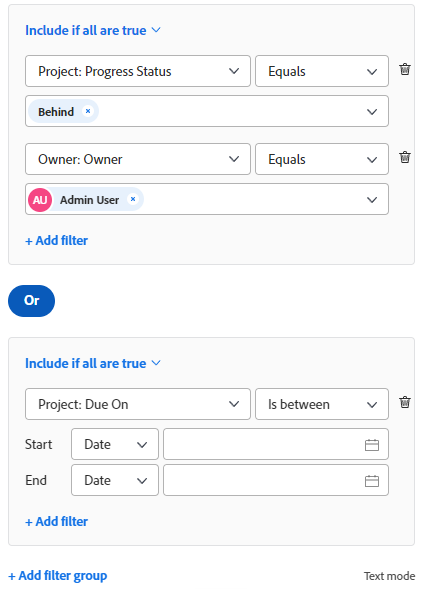

# 篩選器概觀

<!-- Audited: 11/2024 -->

您可以使用Adobe Workfront中的篩選器，來減少在清單、報告或其他區域的畫面上顯示的資訊量。

>[!NOTE]
>
>本文說明您可以在Workfront中套用篩選器的所有區域，以及有關清單和報表中篩選器的一般資訊。 請參閱以下連結的文章，瞭解清單和報告以外特定區域中篩選器的相關資訊。

## Workfront篩選器的型別

Workfront中有多種型別的篩選器。 所有篩選器都符合限制熒幕上顯示資訊量的相同目的。

以下是您可以在Workfront中使用的篩選器型別：

<table style="table-layout:auto"> 
 <col> 
 <col> 
 <tbody> 
  <tr> 
   <td><strong>臨時篩選器</strong></td> 
   <td> 
根據關鍵字搜尋的一次性快速篩選，快速尋找清單中的專案。 
 </td> 
  </tr> 
  <tr> 
   <td><strong>清單和報告的永久篩選器</strong></td> 
   <td>由Workfront建置或由您或其他使用者自訂。 您可以多次使用它們。 如果您擁有正確的存取權和許可權，則可以在多個區域命名、儲存和重複使用它們。 您也可以與其他使用者共用這些篩選器。 它們可在物件清單或報表中使用。 </td> 
  </tr> 
  <tr> 
   <td><strong>特殊區域的暫時或永久篩選器</strong></td> 
   <td>由Workfront建置或由您或其他使用者自訂。 您可以儲存永久篩選器並使用多次，也可以暫時套用篩選器以滿足您的即時需求，而無需儲存。 無法共用或刪除未儲存的篩選器。 它們可用於特殊區域，如本文中特殊區域的<a href="#workfront-filters-for-special-areas" class="MCXref xref">Workfront篩選器</a>一節所述。 </td> 
  </tr> 
 </tbody> 
</table>

## Workfront臨時篩選器

快速篩選可讓您使用關鍵字在畫面上搜尋專案。 重新整理頁面後，會清除暫時的快速篩選。 您無法儲存暫存篩選器以供重複使用。

如需快速篩選的資訊，請參閱[將快速篩選套用至清單](../../../workfront-basics/navigate-workfront/use-lists/apply-quick-filter-list.md)。

## 清單和報告的Workfront永久篩選器

您可以使用您、其他人或Workfront在物件清單或報表中建立的永久篩選器。

如需Workfront中物件的相關資訊，以及您可以為哪些物件建置報表，請參閱[Adobe Workfront物件概觀](../../../workfront-basics/navigate-workfront/workfront-navigation/understand-objects.md)。

如需清單與報表中篩選器的詳細資訊，請參閱下列文章：

* [在Adobe Workfront中建立或編輯篩選器](../../../reports-and-dashboards/reports/reporting-elements/create-filters.md)
* [移除篩選器、檢視和群組](../../../reports-and-dashboards/reports/reporting-elements/remove-filters-views-groupings.md)
* [共用篩選、檢視或分組](../../../reports-and-dashboards/reports/reporting-elements/share-filter-view-grouping.md)

## 適用於特殊區域的Workfront篩選器 {#workfront-filters-for-special-areas}

您可以在Workfront的下列使用內建篩選器或建置自訂篩選器：

* 首頁

  如需詳細資訊，請參閱[首頁區域的工作清單顯示專案](../../../workfront-basics/using-home/using-the-home-area/display-items-in-home-work-list.md)。

* 請求區域。 您無法在請求區域中自訂篩選器。

  如需詳細資訊，請參閱[尋找已提交的請求](../../../manage-work/requests/create-requests/locate-submitted-requests.md)。

* 資源規劃工具

  如需相關資訊，請參閱文章[資源規劃工具](../../../resource-mgmt/resource-planning/filter-resource-planner.md)中的篩選資訊。

* 使用情況報告

  如需相關資訊，請參閱文章[檢視資源使用率資訊](../../../resource-mgmt/resource-utilization/view-utilization-information.md)中的[篩選使用率資訊](../../../resource-mgmt/resource-utilization/view-utilization-information.md#filter-utilization-information)一節。

* 工作負載平衡器

  如需相關資訊，請參閱工作負載平衡器[&#128279;](../../../resource-mgmt/workload-balancer/filter-information-workload-balancer.md)中的篩選資訊。

* 藍圖區域

  如需詳細資訊，請參閱[安裝Blueprint](../../../administration-and-setup/blueprints/blueprints-install.md)。

* 情境規劃工具

  Scenario Planner需要額外的授權。 如需Workfront Scenario Planner的相關資訊，請參閱[Scenario Planner概觀](../../../scenario-planner/scenario-planner-overview.md)。

  >[!TIP]
  >
  >您無法在「情境規劃工具」中自訂篩選器。

  <!--(NOTE: the tip above: this might change with the beta filters??)-->

  您可對計畫、方案或專案使用內建篩選器，且可在「情境規劃工具」中自訂專案篩選器。

  如需詳細資訊，請參閱下列文章：

   * [在「情境規劃工具」中建立和編輯計畫](../../../scenario-planner/create-and-edit-plans.md)
   * [透過在Scenario Planner](../../../scenario-planner/publish-scenarios-update-projects.md)中發佈行動方案來更新或建立專案
   * [將專案匯入至「案例規劃工具」中的計畫](../../../scenario-planner/import-projects-to-plans.md)

* 目標

  目標需要額外的授權。 如需Workfront目標的相關資訊，請參閱[Adobe Workfront目標總覽](../../../workfront-goals/goal-management/wf-goals-overview.md)。

  您可以使用內建篩選條件，但無法建置自訂篩選器來重複使用目標區域。

  如需詳細資訊，請參閱[在Adobe Workfront目標中篩選資訊](../../../workfront-goals/goal-management/filter-information-wf-goals.md)。

* 展示板

  您可以套用內建篩選器，但無法建置自訂篩選器以在面板區域中重複使用。

  如需詳細資訊，請參閱[在展示板中篩選和搜尋](../../../agile/get-started-with-boards/filter-search-in-board.md)。

## 清單和報告中的篩選器概觀

使用清單和報告時，您可以使用以下型別的篩選器來篩選畫面上的資訊：

* 內建篩選器
* 您或其他人從頭開始建立的新篩選器
* 其他人建立並與您共用的自訂現有篩選器
* 根據現有篩選器複製和編輯的篩選器

>[!IMPORTANT]
>
>在報告中建立或編輯篩選器時，您必須編輯報告，以便新篩選器成為報告的預設篩選器。 當您僅編輯篩選器時，在Report Builder外部，報告的預設篩選器未更新。\
>如需有關編輯報告的資訊，請參閱文章[建立自訂報告](../../../reports-and-dashboards/reports/creating-and-managing-reports/create-custom-report.md)。

如需Workfront清單的相關資訊，請參閱[開始使用Adobe Workfront中的清單](../../../workfront-basics/navigate-workfront/use-lists/view-items-in-a-list.md)。

如需Workfront報表的相關資訊，請參閱[開始使用報表](../../../reports-and-dashboards/reports/reporting/get-started-reports-workfront.md)。

在清單或報告中使用篩選器時，請考慮下列事項：

* 您可以自訂清單與報表中的現有篩選器。 所有擁有篩選器許可權的使用者也可以看到您的變更。

* 您的Workfront管理員必須授予您「編輯」篩選器、檢視和群組的存取權，才能建立永久篩選器。

  如需詳細資訊，請參閱[授予篩選器、檢視和群組的存取權](../../../administration-and-setup/add-users/configure-and-grant-access/grant-access-fvg.md)。

* 您對篩選器的許可權層級會決定儲存篩選器的方式。 如果您原本是建立篩選器，您可以儲存變更。 否則，系統會提示您儲存正在修改之篩選器的新版本。

  >[!TIP]
  >
  >請記住，如果您對已與其他人共用的篩選器進行變更，這些變更也會影響篩選。

* 只有在共用篩選器的使用者授予您「管理」存取權時，您才能自訂與您共用的篩選器。 如需共用篩選的詳細資訊，請參閱[共用篩選、檢視或群組](../../../reports-and-dashboards/reports/reporting-elements/share-filter-view-grouping.md)。

## 篩選器元素

當您建立篩選器時，會將多個元素連線在一起，組成篩選器陳述式。 您可以有多個篩選器陳述式來定義篩選條件。

以下是標準篩選產生器的範例：

這是舊版篩選產生器的範例：

篩選器包含下列元素：

<table style="table-layout:auto"> 
 <col> 
 <col> 
 <tbody> 
  <tr> 
   <td><strong>物件</strong></td> 
   <td> 
篩選器的Workfront資料庫物件。 如需有關哪些物件可在Workfront中報告的資訊，請參閱<a href="../../../workfront-basics/navigate-workfront/workfront-navigation/understand-objects.md" class="MCXref xref">Adobe Workfront物件總覽</a>。 
 
例如，專案、任務、問題、使用者或檔案可以是篩選器的物件。 
 </td> 
  </tr> 
  <tr> 
   <td><strong>欄位</strong></td> 
   <td> 
您正在篩選之物件的屬性。 
 
例如，您可以依「Portfolio名稱」或「專案所有者」篩選。 在這種情況下，「名稱」和「擁有者」是Portfolio和「專案」物件的欄位。 
 </td> 
  </tr> 
  <tr> 
   <td><strong>值</strong></td> 
   <td>Workfront中欄位的實際名稱。 例如，完成可以是專案狀態列位的值。 </td> 
  </tr> 
  <tr> 
   <td><strong>運算子</strong></td> 
   <td>連線多個篩選陳述式。 如需詳細資訊，請參閱本文中的<a href="#filter-operators" class="MCXref xref">篩選器運運算元</a>一節。 </td> 
  </tr> 
  <tr> 
   <td><strong>修飾詞</strong></td> 
   <td>指示您希望資料比對的資訊型別。 如需詳細資訊，請參閱本文中的<a href="#filter-modifiers" class="MCXref xref">篩選器修飾元</a>小節。 </td> 
  </tr> 
 </tbody> 
</table>

## 篩選器運運算元 {#filter-operators}

Workfront有兩個篩選器運運算元，用來連線每個篩選器陳述式：

* **AND**：當您使用AND運運算元聯結兩個篩選陳述式時，表示您想要同時符合兩個篩選陳述式。

  依預設，篩選器中的陳述式會由AND運運算元連線。

* **OR**：當您使用OR運運算元聯結兩個篩選陳述式時，表示您想要符合其中一個陳述式。

  >[!TIP]
  >
  >將AND陳述式變更為OR陳述式時，報表中的專案數應會增加。

## 篩選器修飾元 {#filter-modifiers}

您可以使用篩選器修飾詞來指出您希望資料比對的資訊型別。

>[!INFO]
>
>**範例：**
>&#x200B;>您可以篩選完成百分比為100%的專案。 在此情況下，您可以在下列篩選陳述式中使用「等於」修飾詞：
>
>`Project: Percent Complete Equal(Case Sensitive) 100`

如需篩選修飾元的詳細資訊，請參閱[篩選和條件修飾元](../../../reports-and-dashboards/reports/reporting-elements/filter-condition-modifiers.md)。

## 在產生器介面中建立篩選器

您可以使用標準或舊版產生器介面，透過下列方式建立篩選器：

* 從頭開始
* 修改現有篩選器
* 複製現有篩選器

如需使用標準或舊版產生器介面建立篩選的詳細資訊，請參閱[在Adobe Workfront中建立或編輯篩選](../../../reports-and-dashboards/reports/reporting-elements/create-filters.md)。

## 使用文字模式介面建立篩選器

您可以使用文字模式介面來建立篩選器。 我們建議使用標準或舊版產生器介面來建置大部分的篩選陳述式，且僅作為最後步驟編輯篩選器的程式碼。 不建議單獨使用文字模式介面從頭開始建立篩選器。

如需使用文字模式介面建立篩選的詳細資訊，請參閱[使用文字模式編輯篩選](../../../reports-and-dashboards/reports/text-mode/edit-text-mode-in-filter.md)。

## 為複雜欄位建立篩選器

您可以為複雜欄位建立篩選器，例如值包含逗號的欄位和值為多選自訂欄位的欄位。

### 為值包含逗號的欄位建立篩選器 {#create-filters-for-fields-whose-values-contain-commas}

在文字模式中建立篩選器，並篩選包含逗號的欄位值時，您必須在分隔值的逗號前加上斜線(&quot;/&quot;)，以確保值作為一個篩選器選項讀取。 這僅適用於下列欄位型別：

* 下拉式清單
* 選項按鈕
* 核取方塊

例如，您在名為「顏色」的專案上有一個選項按鈕欄位，其選項為：

* 紅色
* 藍色
* 紅色，藍色

如果您想要建置僅會尋找已選取第三個選項的專案的篩選器，文字模式介面中的篩選器陳述式應為：

`DE:check=red/, blue`

`DE:check_Mod=in`

此語法可確保將值作為一個選項一起讀取。 如果您省略斜線，Workfront會將逗號讀為OR，在此情況下，只會選取具有第一個或第二個選項的專案。

此語法也適用於建立提示。 如需有關使用提示的詳細資訊，請參閱[新增提示至報表](../../../reports-and-dashboards/reports/creating-and-managing-reports/add-prompt-report.md)。

### 為其值是多選自訂欄位的建立篩選器 {#create-filters-for-whose-values-are-a-multi-select-custom-field}

您可以報告多選自訂欄位。 例如，您可以報告屬於核取方塊的欄位。

但是，當您想要排除只選取其中一個選項的結果時，報告會顯示已選取該選項和任何其他選項的任何物件。

例如，如果您有一個欄位包含3個選項（A、B和C），並在物件上選取3個選項（A和B，但不選取C）中的2個，則您可建立一個報表，其篩選條件為選項A和B的限定詞為「不等於」，而且它只會篩選出同時包含A和B，但不包含A，也不包含B的專案。 如果建立一個篩選器，其中選項A的限定詞為「不等於」，則它只會篩選出只選取A的物件，但如果選取A和B，這些物件仍會顯示在報表中。

## 加入多個篩選規則的限制

在Workfront中建立篩選器時，您只能參考五個物件，報表的物件除外。
