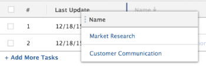

# 修改欄寬和順序

以下是欄寬在Adobe Workfront中如何運作的准則：

* Workfront預設會定義清單和報表中的欄寬。
* Workfront會根據 `valueformat`除非在欄的文字模式中另有指定，否則在所有清單和報表中顯示資訊。

   >[!NOTE]
   >
   >Workfront不會根據 `valueformat` 「設定」和「報表」區域中可用清單中的資訊。

   此 `valueformat` 值定義欄中顯示的資訊類型。 例如，顯示數字的列比顯示「說明」欄位的列窄。

* 您可以根據要在欄中顯示的資訊類型，自訂Workfront清單和報表中的欄寬度以符合您的需求。

   您可以在檢視清單或報表時暫時修改欄寬，或在檢視產生器中調整欄寬，借此永久修改欄寬。 有關暫時修改列寬的資訊，請參閱 [暫時修改欄的寬度和順序時的考量事項](#considerations-when-temporarily-modifying-the-width-and-order-of-columns) 一節。

* 內建檢視中顯示的欄，會有先前由Workfront定義並加上硬式編碼的寬度。 若要修改這些寬度，您必須在檢視產生器中使用文字模式手動更新這些欄的寬度。

   有關在文本模式下修改列的資訊，請參見 [查看：永久編輯欄的寬度](../../../reports-and-dashboards/reports/custom-view-filter-grouping-samples/view-edit-column-width-permanently.md).

## 存取需求

您必須具備下列存取權，才能執行本文中的步驟：

<table style="table-layout:auto"> 
 <col> 
 <col> 
 <tbody> 
  <tr> 
   <td role="rowheader"><strong>Adobe Workfront計畫*</strong></td> 
   <td> 
任何
 </td> 
  </tr> 
  <tr> 
   <td role="rowheader"><strong>Adobe Workfront授權*</strong></td> 
   <td> 
計劃 
 </td> 
  </tr> 
  <tr> 
   <td role="rowheader"><strong>訪問級別配置*</strong></td> 
   <td> 
編輯對篩選器、檢視、群組的存取
 
編輯對報表、控制面板、日曆的存取，以編輯報表中的檢視
 
注意：如果您仍無權存取，請洽詢您的Workfront管理員，他們是否在您的存取層級設定其他限制。 如需Workfront管理員如何修改您的存取層級的詳細資訊，請參閱 <a href="../../../administration-and-setup/add-users/configure-and-grant-access/create-modify-access-levels.md" class="MCXref xref">建立或修改自訂存取層級</a>.
 </td> 
  </tr> 
  <tr> 
   <td role="rowheader"><strong>物件權限</strong></td> 
   <td> 
管理報表權限以編輯報表中的檢視
 
管理檢視的權限以進行編輯
 
有關請求其他訪問的資訊，請參閱 <a href="../../../workfront-basics/grant-and-request-access-to-objects/request-access.md" class="MCXref xref">請求對對象的訪問 </a>.
 </td> 
  </tr> 
 </tbody> 
</table>

&#42;若要了解您擁有的計畫、授權類型或存取權，請聯絡您的Workfront管理員。

## 修改欄寬和順序

您可以透過下列方式修改報表中欄的寬度和順序：

* [暫時修改列的寬度和順序](#modify-width-and-order-of-columns-temporarily)
* [永久修改欄的寬度和順序](#modify-width-and-order-of-columns-permanently)

### 暫時修改列的寬度和順序 {#modify-width-and-order-of-columns-temporarily}

您可以拖曳欄邊界來調整欄的大小，並拖放欄來暫時重新排序整個Workfront網站中大多數清單中的欄。 這包括報告、視圖、控制面板報告和甘特視圖。

如需Workfront清單的詳細資訊，請參閱文章 [開始使用Adobe Workfront中的清單](../../../workfront-basics/navigate-workfront/use-lists/view-items-in-a-list.md).

* [暫時修改欄的寬度和順序時的考量事項](#considerations-when-temporarily-modifying-the-width-and-order-of-columns)
* [暫時調整列大小](#resize-columns-temporarily)
* [暫時重新排序列](#reorder-columns-temporarily)

#### 暫時修改欄的寬度和順序時的考量事項 {#considerations-when-temporarily-modifying-the-width-and-order-of-columns}

您可以暫時修改清單中列的寬度和順序，而不編輯其視圖。

暫時調整欄大小和排序時，請考量下列事項：

* 調整欄大小時，新的欄大小會儲存在瀏覽器的本機儲存體中，並依預設儲存。 使用不同的瀏覽器或清除快取或瀏覽資料，會導致欄位大小回復為預設值。 重新整理頁面會保留您對欄寬度所做的變更。
* 重新排序欄時，您選擇的順序只會維持，直到您離開清單導覽，或您重新整理瀏覽器頁面為止。 離開清單導覽或重新整理瀏覽器頁面後，欄會回到預設順序。
* 為獲得最佳效能，要重新排序的欄清單中不應超過100個項目。
* 調整列大小時，更改將僅應用於當前使用的視圖，並且只對您可見。 與其他使用者共用檢視時，不會共用您已定義的欄位大小。
* 將欄的邊框拖曳至右側，以調整欄的大小後，除下列項目外，相鄰欄的寬度會保留：

   * 設定區域
   * 報表區域
   * 文檔清單和報告

   >[!NOTE]
   >
   >不能將列的左邊框移到任何清單中相鄰列的左邊框上。

* 如果將任何清單導出到檔案，列的臨時順序不會轉移到導出的檔案。 導出的檔案顯示原始清單中列的順序，然後對列重新排序。

如需從清單和報表匯出資料的詳細資訊，請參閱文章 [匯出資料](../../../reports-and-dashboards/reports/creating-and-managing-reports/export-data.md).

#### 暫時調整列大小 {#resize-columns-temporarily}

1. 移至您要修改的清單。
1. 拖曳欄的邊框，直到欄達到所需大小。\
   

#### 暫時重新排序列 {#reorder-columns-temporarily}

1. 前往您要修改的清單。
1. 按一下要移動到其他位置的列以選擇該列。
1. 將欄拖曳至正確位置。
1. 將欄拖放到位置中以移動。

   

>[!TIP]
>
>這在同時查看甘特圖和清單視圖時特別有用。 查看甘特圖時，列可能會隱藏。 要在顯示甘特圖時查看列，只需拖動要查看的列，使其顯示在頁面的左側。

### 永久修改欄的寬度和順序 {#modify-width-and-order-of-columns-permanently}

若要永久重新排序欄，請參閱區段 [建立或自訂標準檢視](../../../reports-and-dashboards/reports/reporting-elements/views-overview.md#customizing-a-standard-view) 在文章中 [Adobe Workfront中的檢視概觀](../../../reports-and-dashboards/reports/reporting-elements/views-overview.md).

您只能使用文字模式來永久修改欄的寬度。

如需使用文字模式和永久修改欄寬的詳細資訊，請參閱文章 [文字模式常見用途概觀](../../../reports-and-dashboards/reports/text-mode/understand-common-uses-text-mode.md).
