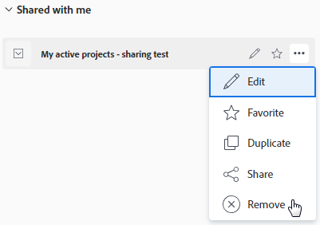

# 移除篩選器、檢視和群組

如果您已建立或已與您共用清單和報表，則可以從清單和報表中移除篩選、檢視或分組。 您無法移除預設篩選器、檢視或群組。

## 存取需求

您必須具備下列條件：

<table style="table-layout:auto"> 
 <col> 
 </col> 
 <col> 
 </col> 
 <tbody> 
  <tr> 
   <td role="rowheader"><strong>Adobe Workfront計畫*</strong></td> 
   <td> 
任何 
 </td> 
  </tr> 
  <tr> 
   <td role="rowheader"><strong>Adobe Workfront授權*</strong></td> 
   <td> 
要求或更高版本
 </td> 
  </tr> 
  <tr> 
   <td role="rowheader"><strong>訪問級別配置*</strong></td> 
   <td> 
檢視或更高存取篩選器、檢視、群組
 
注意：如果您仍無權存取，請洽詢您的Workfront管理員，他們是否在您的存取層級設定其他限制。 如需Workfront管理員如何修改您的存取層級的詳細資訊，請參閱 <a href="../../../administration-and-setup/add-users/configure-and-grant-access/create-modify-access-levels.md" class="MCXref xref">建立或修改自訂存取層級</a>.
 </td> 
  </tr> 
  <tr> 
   <td role="rowheader"><strong>物件權限</strong></td> 
   <td> 
檢視可共用至您要移除之篩選器、檢視或分組的權限
 
有關請求其他訪問的資訊，請參閱 <a href="../../../workfront-basics/grant-and-request-access-to-objects/request-access.md" class="MCXref xref">請求對對象的訪問 </a>.
 </td> 
  </tr> 
 </tbody> 
</table>

&#42;若要了解您擁有的計畫、授權類型或存取權，請聯絡您的Workfront管理員。

## 使用標準產生器移除篩選、檢視或分組

您可以使用標準產生器介面，移除所有物件清單的篩選器、檢視或分組。

### 移除篩選器、檢視和群組的相關考量事項

如何移除報表元素取決於您是最初建立報表元素，還是與您共用。

移除群組時，會出現下列情況：

* **如果已建立分組，並將其刪除**，則會從Workfront系統中移除分組。 您先前已與之共用的任何使用者都無法再使用分組。
* **如果已與您共用分組，而您將其移除**，則僅會為您移除群組。 最初建立此群組的使用者以及已共用給的任何其他使用者，仍可存取群組。

### 使用標準產生器移除篩選、檢視或分組

1. 移至物件清單或報表。
1. （條件性）從清單中按一下 **篩選**, **檢視**，或 **分組** 圖示，然後將游標暫留在您要移除的篩選器、檢視或分組上，按一下 **更多** 圖示 ，然後 **移除**. 篩選器、檢視或分組會遭到移除。
1. （條件性）在報表中按一下 **分組**, **篩選**，或 **檢視** 下拉式功能表，然後選取 **移除分組**, **移除篩選**，或 **刪除視圖**.

   此 **我的群組**, **我的過濾器，** 或 **我的檢視** 對話框。

   您有權移除的所有報表元素都可移除。 其他報表元素則會以灰色顯示。

1. 按一下 **x** 圖示（位於您要移除的任何報表元素旁）。
1. （有條件）按一下 **是，刪除它** 如果您選取刪除您建立的篩選器、檢視或群組，以及之後與他人共用的篩選器、檢視或群組。 這會刪除Workfront系統中的篩選器、檢視或分組。

   >[!TIP]
   >
   >移除您建立的篩選器、檢視或分組而未與其他人共用，則會從系統中移除，而不要求確認。

1. 按一下 **完成**.

## 使用測試版產生器移除或刪除篩選器

您可以使用測試版產生器介面，從專案、工作或問題清單中移除與您共用的篩選器。 測試版產生器介面不適用於任何其他物件或檢視或群組。

您也可以使用測試版產生器介面，從專案、工作或問題清單中刪除您擁有的篩選器。

無法刪除或刪除系統預設篩選器。

### 使用測試版產生器移除或刪除篩選器的考量事項

移除或刪除篩選器時，會出現下列情況：

* 如果已與您共用篩選器，而您將其移除，則只會為您移除篩選器。 最初建立該篩選器的使用者以及已共用給的任何其他使用者，仍可存取篩選器。
* 如果您擁有篩選器，並將其刪除，則篩選器會從Workfront系統中移除。 您先前已與之共用篩選器的任何使用者都無法再使用篩選器。
* 如果您是Workfront管理員，則可以刪除篩選器，並且會為所有使用者（包括擁有者）永久刪除篩選器。

### 使用測試版產生器移除篩選

1. 移至專案、工作或問題清單。
1. 按一下 **篩選** 圖示  並視需要啟用測試版產生器。
1. 將滑鼠暫留在下方的篩選器上 **與我共用**，按一下 **更多** 功能表 ，然後按一下 **移除**.

   

1. 選擇 **移除** 在確認訊息上，以永久移除篩選器。

### 使用測試版產生器刪除篩選器

1. 移至專案、工作或問題清單。
1. 按一下 **篩選** 圖示  並視需要啟用測試版產生器。
1. 將滑鼠指標暫留在您有可刪除權限的篩選器上，按一下 **更多** 功能表 ，然後按一下 **刪除**.

   

1. （選用）按一下 **取消** 填入確認訊息，以避免刪除並返回篩選器清單。
1. 按一下 **刪除** 確認訊息以確認刪除。

   系統會為您和擁有篩選器權限的所有使用者刪除篩選器。

