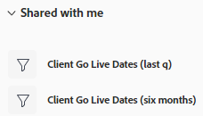
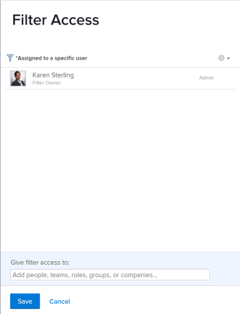

# 共用篩選器、視圖或分組

<!--

(NOTE: CONSIDER SPLITTING THIS in three articles for each reporting element?)

(NOTE: This is linked from the TOC article in WF Basics > permissions section)&nbsp;

-->

您的Adobe Workfront管理員在用戶分配訪問級別時授予他們查看或編輯對象的訪問權限。 有關授予對象訪問權限的詳細資訊，請參見 [建立或修改自定義訪問級別](../../../administration-and-setup/add-users/configure-and-grant-access/create-modify-access-levels.md)。

除了授予用戶的訪問級別之外，您還可以授予用戶查看或編輯您建立或有權共用的特定對象的權限。 有關訪問級別和權限的詳細資訊，請參見 [訪問級別和權限如何協同工作](../../../administration-and-setup/add-users/access-levels-and-object-permissions/how-access-levels-permissions-work-together.md)。

您可以與其他用戶共用您有權查看的篩選器、視圖和分組。

在與您共用篩選器、視圖或分組時，您可以將該篩選器、視圖或分組應用到清單。 根據授予您的訪問權限，您可能可以修改它並與其他用戶共用它。

有關如何建立篩選器、視圖或分組的資訊，請參閱以下文章：

* [篩選器概述Adobe Workfront](../../../reports-and-dashboards/reports/reporting-elements/filters-overview.md)
* [Adobe Workfront視圖概述](../../../reports-and-dashboards/reports/reporting-elements/views-overview.md)
* [Adobe Workfront分組概覽](../../../reports-and-dashboards/reports/reporting-elements/groupings-overview.md)

## 訪問要求

您必須具有以下功能：

<table style="table-layout:auto"> 
 <col> 
 <col> 
 <tbody> 
  <tr> 
   <td role="rowheader"><strong>Adobe Workfront計畫</strong></td> 
   <td> 
任何 
 </td> 
  </tr> 
  <tr> 
   <td role="rowheader"><strong>Adobe Workfront許可證*</strong></td> 
   <td> 
請求或更高
 </td> 
  </tr> 
  <tr> 
   <td role="rowheader"><strong>訪問級別配置*</strong></td> 
   <td> 
查看或更高權限訪問篩選器、視圖、分組
 
注：如果您仍然沒有訪問權限，請詢問您的Workfront管理員是否在您的訪問級別設定了其他限制。 有關Workfront管理員如何修改您的訪問級別的資訊，請參見 <a href="../../../administration-and-setup/add-users/configure-and-grant-access/create-modify-access-levels.md" class="MCXref xref">建立或修改自定義訪問級別</a>。
 </td> 
  </tr> 
  <tr> 
   <td role="rowheader"><strong>對象權限</strong></td> 
   <td> 
查看或更高權限，有權共用視圖、篩選器或分組
 
有關請求附加訪問的資訊，請參見 <a href="../../../workfront-basics/grant-and-request-access-to-objects/request-access.md" class="MCXref xref">請求訪問對象 </a>。
 </td> 
  </tr> 
 </tbody> 
</table>

&#42;要瞭解您擁有的計畫、許可證類型或訪問權限，請與您的Workfront管理員聯繫。

## 共用篩選器、視圖或分組

<!--

(NOTE: when the beta filters/ groupings come out either consider splitting this in different kinds of FVGs or splitting this article in FVGs for showing sharing on each one of them??)

-->

在選擇清單中共用篩選器的方式與共用篩選器所使用的介面不同：標準或傳統。 有關構建篩選器介面類型的資訊，請參見 [在Adobe Workfront建立或編輯篩選器](/help/quicksilver/reports-and-dashboards/reports/reporting-elements/create-filters.md)。

您只能在舊式介面中共用視圖和分組。

### 使用標準生成器介面共用篩選器

您可以在標準介面中從項目、任務、問題、包、程式、用戶、模板或組的清單中共用篩選器。 篩選器的標準生成器介面不可用於任何其他對象，也不可用於視圖或分組。

使用標準生成器介面共用篩選器：

1. 轉到項目、任務或問題的清單。
1. 按一下 **篩選** 表徵圖 。

   

1. 查看以下篩選器清單：

   <table style="table-layout:auto">
   <col>
   <col>
   <tbody>
   <tr>
   <td role="rowheader"><strong>已新增至最愛</strong></td>
   <td>標籤為收藏夾的篩選器。 當您收藏濾鏡時，其原始位置顯示在濾鏡名稱下方，除非您將其作為收藏夾刪除，否則它將隱藏在原始清單中。</td>
   </tr>
   <tr>
   <td role="rowheader"><strong>已儲存</strong></td>
   <td>您自己構建並保存的篩選器。 預設情況下，此清單按最近保存的順序顯示已保存的篩選器，但可以拖動篩選器名稱以手動重新排序清單。</td>
   </tr>
   <tr>
   <td role="rowheader"><strong>系統預設值</strong></td>
   <td>Workfront系統預設篩選器，以及Workfront管理員在系統級別或佈局模板中添加到篩選器清單的篩選器。</td>
   </tr>
   <tr>
   <td role="rowheader"><strong>與我共用</strong></td>
   <td>其他人建立並與您共用的或在系統範圍內共用的篩選器。</td>
   </tr>
   </tbody>
   </table>

1. 將滑鼠懸停在您至少有權查看和共用的篩選器上，然後按一下 **更多** 菜單 ，然後按一下 **共用**。

   

   將顯示「篩選器共用」框。

1. 啟用 **查看系統範圍** 的子菜單。 這給了Workfront的任何人查看過濾器的權限。

   >[!IMPORTANT]
   >
   >謹慎使用此設定。 為所有用戶添加許多篩選器會使篩選器體驗變得混亂，使篩選器更難找到。

   或開始在中鍵入要共用的用戶、團隊、角色、組或公司的名稱 **授予訪問權限** 的子菜單。

   

1. （可選）按一下實體名稱旁邊的右箭頭以編輯其對篩選器的權限，然後啟用 **視圖** 或 **管理** 的雙曲餘切值。 **視圖** 。

   

1. （可選）通過執行以下操作之一啟用或禁用實體的附加權限：

   1. 按一下 **視圖** 並禁用 **共用** 的雙曲餘切值。 預設情況下啟用它。
   1. 按一下 **管理** 禁用 **共用** 或 **刪除** 的雙曲餘切值。 預設情況下，它們處於啟用狀態。

      >[!NOTE]
      >
      >如果使用「刪除」選項啟用「管理」訪問，則這些用戶將能夠從所有用戶中刪除篩選器，即使他們不擁有篩選器。
   >[!TIP]
   >
   >用戶無法獲得比其訪問級別更高的權限。 如果他們在訪問級別中沒有編輯篩選器的權限，則他們無法獲得管理篩選器的權限。 Workfront為這些用戶禁用「管理」選項，該選項將暗顯。

1. 按一下 **共用**。 篩選器與指定的實體共用。

   >[!TIP]
   >
   >與組共用使篩選器有權訪問組和所有子組的成員。

   您共用的篩選器顯示在 **與我共用** 的子菜單。

   

### 使用舊介面共用篩選器、視圖和分組

在舊式介面中共用篩選器、視圖和分組是相同的。

1. 轉到對象清單或報告。
1. （條件）在清單中，按一下 **篩選**。 **視圖**&#x200B;或 **分組** 表徵圖，然後懸停在要共用的篩選器、視圖或分組上，按一下 **更多** 表徵圖 ，則 **共用**。

   在報告中，按一下 **篩選**。 **視圖**&#x200B;或 **分組** 下拉菜單，然後選擇要共用的篩選器、視圖或分組。

1. （條件）如果從報表共用，請按一下 **篩選**。 **視圖**&#x200B;或 **分組** 再次下拉菜單，然後按一下 **共用篩選器**。 **共用視圖**&#x200B;或 **共用分組**。\
   的 **篩選訪問**。 **查看訪問**&#x200B;或 **分組訪問** 對話框。

   

1. 根據您要與誰共用，完成以下任一操作：

   **要與單個用戶、團隊、角色、組或公司共用：** 在提供的欄位中，開始鍵入要共用的用戶、團隊、角色、組或公司的名稱，然後在該名稱出現在下拉清單中時按一下該名稱。\
   重複此過程可與多個用戶、團隊、角色、組或公司共用訪問權限。

   >[!TIP]
   >
   >與組共用為篩選器、查看或分組提供了權限，可訪問組和所有子組的成員。

   **要與系統中的所有用戶共用：** 按一下 **設定** 表徵圖，然後按一下 **使此可見系統範圍**。\
   管理員必須選擇「共用系統」選項才能使此選項可用。 有關詳細資訊，請參閱文章 [建立或修改自定義訪問級別](../../../administration-and-setup/add-users/configure-and-grant-access/create-modify-access-levels.md) 和 [共用報表、儀表板和日曆](../../../workfront-basics/grant-and-request-access-to-objects/permissions-reports-dashboards-calendars.md)。

1. （條件）如果要與單個用戶、團隊、角色、組或公司共用，請按一下下拉菜單以定義要授予的訪問級別。

   可以從以下選項中選擇：

   <table style="table-layout:auto"> 
    <col> 
    <col> 
    <tbody> 
     <tr> 
      <td role="rowheader"><strong>檢視它</strong></td> 
      <td> 
選擇此選項可僅允許共用收件人使用共用篩選器、視圖或分組。 選中此選項後，收件人無法對共用項目進行任何修改。
 </td> 
     </tr> 
     <tr> 
      <td role="rowheader"><strong>管理它</strong></td> 
      <td> 
選擇此選項可允許共用收件人使用和修改共用篩選器、視圖或分組。
 </td> 
     </tr> 
     <tr> 
      <td role="rowheader"><strong>共用</strong></td> 
      <td> 
按一下 <strong>高級設定</strong>，然後選擇或清除 <strong>共用</strong> 選項，具體取決於是否希望收件人能夠與其他人共用。
 </td> 
     </tr> 
    </tbody> 
   </table>

1. 按一下&#x200B;**儲存**。

   與您共用篩選器、視圖或分組的用戶可以通過按一下 **篩選**。 **視圖**&#x200B;或 **分組** 下拉菜單或表徵圖，然後向下滾動到 **與我共用** 的子菜單。

