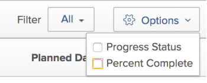

# 使用里程碑檢視

<!-- Audited: 11/2024 -->

<!--remove Preview and Production mentions from the article when this comes out live-->

本頁醒目提示的資訊指出尚未普遍可用的功能。 它僅在預覽環境中可供所有客戶使用。 從預覽版開始的一週起，生產環境中也將提供相同功能給所有客戶。

如需詳細資訊，請參閱[介面現代化](/help/quicksilver/product-announcements/product-releases/interface-modernization/interface-modernization.md)。

您可以將「里程碑」檢視套用至專案清單或報告。 您可以使用「里程碑」檢視來檢視與您所檢視專案中任務相關聯的所有里程碑。

使用里程碑檢視之前，必須存在下列元素：

* 里程碑路徑已設定。 如需詳細資訊，請參閱[建立里程碑路徑](../../../administration-and-setup/customize-workfront/configure-approval-milestone-processes/create-milestone-path.md)。
* 專案需要新增里程碑路徑。 如需詳細資訊，請參閱[編輯專案](/help/quicksilver/manage-work/projects/manage-projects/edit-projects.md)。
* 里程碑與任務相關聯。 如需詳細資訊，請參閱[將里程碑與任務關聯](../../../manage-work/tasks/manage-tasks/associate-milestones-with-tasks.md)。

檢視專案清單或專案報告時，里程碑檢視可供使用。 以下各節說明如何檢視和使用里程碑檢視。

## 存取需求

+++ 展開以檢視本文中功能的存取需求。

<table style="table-layout:auto"> 
 <col> 
 <col> 
 <tbody> 
  <tr> 
   <td role="rowheader">Adobe Workfront套件</td> 
   <td> 
任何
 </td> 
  </tr> 
  <tr> 
   <td role="rowheader">Adobe Workfront授權</strong></td> 
   <td> 
    
標準

    
工作或更高

   </td>
  </tr> 
  <tr> 
   <td role="rowheader">存取層級設定</td> 
   <td> 
檢視或更高的報告、儀表板、行事曆存取權

   </td> 
  </tr> 
  <tr> 
   <td role="rowheader">物件許可權</td> 
    <td> 
檢視專案報告的許可權以套用里程碑檢視到報告
</td> 
   </td> 
  </tr> 
 </tbody> 
</table>

如需有關此表格的詳細資訊，請參閱Workfront檔案中的[存取需求](/help/quicksilver/administration-and-setup/add-users/access-levels-and-object-permissions/access-level-requirements-in-documentation.md)。

+++

## 切換到里程碑檢視 {#switch-to-the-milestone-view}

{{step1-to-projects}}

1. 按一下&#x200B;**檢視**&#x200B;下拉式功能表，然後按一下&#x200B;**里程碑**。

   清單或報告會顯示在「里程碑」檢視中。

   如需有關里程碑檢視的資訊，請參閱本文中的[里程碑檢視概觀](#milestone-view-overview)一節。

## 里程碑檢視總覽 {#milestone-view-overview}

里程碑檢視適用於專案清單和專案報告。 您可以快速檢視與您所檢視專案中任務相關聯的所有里程碑。

>[!NOTE]
>
>「里程碑」檢視不適用於下列區域：
>
>* 時程表，在新增專案時顯示在專案清單中。

如需有關如何切換到里程碑檢視的資訊，請參閱本文中的[切換到里程碑檢視](#switch-to-the-milestone-view)一節。

### 里程碑檢視區段

將「里程碑」檢視套用至專案清單時，專案會顯示在以下區段中：

* 與里程碑路徑關聯的專案會先顯示，列在其各自里程碑路徑的名稱下。

  Workfront會依下列順序來排序第一區段中的專案：

   1. 里程碑路徑ID。 您可以在里程碑路徑報告中檢視里程碑路徑ID。

   2. 在您選取里程碑檢視之前，在先前套用至專案清單的檢視中，選取作為專案清單第一個排序欄位的欄位。

* 未與里程碑路徑相關聯的專案會顯示於下一個的「未指派」區段中。 在您選取「里程碑」檢視之前，Workfront會依先前套用至專案清單之檢視中，專案清單的第一個排序欄位所選取的欄位，來排序「未指派」區段中的專案。

### 里程碑檢視中的專案資訊

在「里程碑」檢視中檢視專案清單或專案報告時，可使用下列資訊：

* **計畫日期或預計日期：**&#x200B;指定您要在[里程碑]檢視中顯示計畫日期或預計日期。\
  會顯示專案的開始和完成日期，以及里程碑路徑中每個里程碑任務的完成日期。

  如果您正在檢視「預計日期」，則無法編輯日期。 專案日期由Workfront計算，且無法手動變更。

  如果您正在檢視計畫日期，並且您也擁有專案的「管理」存取權，您可以直接從「里程碑」檢視編輯下列日期：

   * **專案開始日期：**&#x200B;如果專案是從開始日期開始排程，您可以手動變更專案的計劃開始日期，然後計算計畫完成日期。
   * **專案完成日期：**&#x200B;如果專案是從計畫完成日期開始排程，您可以手動變更專案的計畫完成日期，然後計算計劃開始日期。
   * **任務完成日期：**&#x200B;您可以直接從[里程碑]檢視手動更新任務的規劃完成日期。

* **完成百分比：**&#x200B;顯示每個任務和專案的完成百分比。

  您可以停用完成百分比的顯示，如本文中[設定里程碑檢視](#configure-what-information-displays-in-the-milestone-view)中顯示的資訊一節所述。

  您可以直接從「里程碑」檢視調整完成百分比，如本文中「里程碑」檢視[中之任務的調整完成百分比](#adjust-percent-complete-for-tasks-in-the-milestone-view)小節所述。

* **任務進度狀態圖示：**&#x200B;根據您用來檢視里程碑檢視的環境而定，下列是表示任務進度狀態的圖示：

   * 在生產環境中，以下狀態圖示會顯示在「里程碑」檢視中的每個專案和任務旁：

      * 準時\
        

      * 滞後\
        

      * 有風險\
        

      * 遲到\
        

     <!--get new screen shots or hide them for preview or production - could not display all in devtest; idea: use color dots from Task Details tab - New status is blue; Some concerns condition is yellow etc-->

  

   * 在「預覽」環境中，「里程碑」檢視的每個專案與任務旁會顯示下列彩色圓圈：

      * 準時 — 綠色
      * 滯後 — 黃色
      * 有風險 — 藍色
      * 延遲 — 紅色

  

  您可以停用這些狀態圖示的顯示，如本文中[設定里程碑檢視](#configure-what-information-displays-in-the-milestone-view)中顯示的資訊一節所述。

  如需每種狀態型別的詳細資訊，請參閱文章[任務進度狀態概觀](../../../manage-work/tasks/task-information/task-progress-status.md)。

* **已完成任務的任務狀態著色**：任務被標籤為「完成」之後，任務的背景會在「里程碑」檢視中著色，以指出任務是準時完成還是延遲完成：

   * **工作資料行**&#x200B;的紅色陰影：當進度狀態為&#x200B;**延遲**&#x200B;時，工作的背景為紅色。

   * **工作資料行**&#x200B;的綠色陰影：當進度狀態為&#x200B;**開啟時間**&#x200B;時，工作的背景為綠色。

* **專案開始和完成資料行的專案狀態陰影效果**：

   * **專案開始欄**：專案開始欄的背景為紅色或綠色，但必須填入實際開始日期：

      * **專案開始資料行**&#x200B;的紅色陰影：專案進度狀態為&#x200B;**延遲**&#x200B;時，專案開始資料行的背景為紅色。

      * **專案開始資料行**&#x200B;的綠色陰影：專案進度狀態為&#x200B;**開啟時間**&#x200B;時，專案開始資料行的背景為綠色。

     >[!TIP]
     >
     >您必須移至專案詳細資訊頁面才能檢視專案的實際開始日期。

   * **專案完成欄**： 「專案完成」欄的背景為紅色或綠色，但必須填入實際完成日期：

      * **專案完成資料行的紅色陰影**：專案進度狀態為&#x200B;**延遲**&#x200B;時，專案完成資料行的背景為紅色。

      * **專案完成資料行的綠色陰影**：專案進度狀態為&#x200B;**準時**&#x200B;時，專案完成資料行的背景為綠色。

     >[!TIP]
     >
     >您必須移至專案詳細資訊頁面才能檢視專案的實際完成日期。

   * 當任務的進度狀態為「有風險」或「落後」時，不會為「開始」和「完成」欄指定顏色陰影。

  <!--add new screen shot for preview or production release; logged a bug as this is not happening in the new view - if at prod this is still missing, hide this screen shot-->

  

* **專案名稱**：專案名稱會顯示專案的連結。
* **專案狀態圖示**：根據您從下列指標存取「里程碑」檢視的環境而定，會顯示專案狀態：

   * 在生產環境中，專案名稱旁會顯示圖示，指出專案的狀況。 專案的狀況可能是下列其中一項：

      * 達成目標
      * 有風險
      * 陷入困境

  

   * 在「預覽」環境中，每個專案旁邊會顯示一個彩色圓形條件圖示。 可能的專案條件和圓形顏色包括：

      * 準時 — 綠色
      * 有風險 — 黃色
      * 存在問題 — 紅色

     

## 設定里程碑檢視中顯示的資訊 {#configure-what-information-displays-in-the-milestone-view}

您可以配置是否在「里程碑」檢視中顯示下列元素：

* 進度狀態圖示
* 專案與任務的完成百分比

依預設，會顯示進度狀態圖示以及專案與任務的完成百分比。

您對這些選項所做的任何變更只會套用到您；其他使用者則不受影響。 您所做的變更會在下次登入Workfront時保留。

若要設定是否顯示專案狀態圖示和專案的完成百分比，請執行下列動作：

{{step1-to-projects}}

1. 按一下&#x200B;**檢視**&#x200B;下拉式功能表，然後按一下&#x200B;**里程碑**。

1. 在生產環境中，按一下「里程碑」檢視右上角的&#x200B;**選項**，然後從下一個步驟的選項中選取。

   

   
在「預覽」環境中，從「里程碑」檢視的右上角選取下一個步驟中的選項。

   <!--at Production release, replace this screen shot and adjust the Production/ Preview text above-->

1. 從下列選項中選取：

   <table style="table-layout:auto"> 
    <col> 
    <col> 
    <tbody> 
     <tr> 
      <td role="rowheader">進度狀態</td> 
      <td> 
選取此選項可在每個專案與任務旁顯示進度狀態圖示。
 
此選項預設為啟用。
 </td> 
     </tr> 
     <tr> 
      <td role="rowheader">完成百分比</td> 
      <td> 
選取此選項可在每個專案與任務旁顯示完成百分比。
 
此選項預設為啟用。
 </td> 
     </tr> 
    </tbody> 
   </table>

## 調整「里程碑」檢視中任務的完成百分比 {#adjust-percent-complete-for-tasks-in-the-milestone-view}

您可以在「里程碑」檢視中調整任務的完成百分比。 您無法調整父系任務（包含子任務的任務）或專案的完成百分比。

若要在「里程碑」檢視中調整任務的完成百分比：

{{step1-to-projects}}

1. 按一下&#x200B;**檢視**&#x200B;下拉式功能表，然後按一下&#x200B;**里程碑**。

1. （視條件而定）如果完成百分比未顯示在里程碑檢視中，請啟用檢視任務和專案的完成百分比，如本文中[設定里程碑檢視](#configure-what-information-displays-in-the-milestone-view)中顯示的資訊一節所述。

1. 在生產環境中，按一下任務下方的完成百分比，指定新百分比，然後按Enter鍵。

   
在「預覽」環境中，將「完成百分比」投影片移動至新完成百分比以進行更新。 

