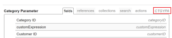

# 使用EXISTS陳述式建立複雜的文字模式篩選器

<!-- Audited: 01/2024 -->

<!--

(NOTE: do not EVER&nbsp;delete this article as long as Text Mode still exists in the system.&nbsp;Google ordered this article to be written and we wrote it with the help of consultants, so the use case is very complex and very hard to understand without this. It is also very much used by many customers)

-->

<!--

(NOTE:&nbsp;Alina: **~ Replace screen shot of icons when list/ reporting UI changes)

-->

>[!IMPORTANT]
>
>本文需要透徹瞭解Adobe Workfront API和文字模式報表介面。 如需Workfront API的相關資訊，請參閱 [API基本概念](../../../wf-api/general/api-basics.md).\
>如需有關使用文字模式的資訊，請參閱 [文字模式概觀](../../../reports-and-dashboards/reports/text-mode/understand-text-mode.md).

## Workfront中的物件關係概觀

所有物件都會連結至Workfront資料庫中的其他物件。

瞭解物件的階層與相依性，有助於您找出哪些物件可在報表中參照。

如需有關哪些物件在Workfront中及其階層與相依性的資訊，請參閱 [Adobe Workfront物件總覽](../../../workfront-basics/navigate-workfront/workfront-navigation/understand-objects.md).

建立濾鏡時，您可以使用標準報表介面，在最多2層關係中參照連線到濾鏡物件的其他物件。

例如，您可以在問題篩選器中參考PortfolioID，以使用標準介面僅顯示與特定投資組合相關聯之專案上的問題。 在此情況下，產品組合與問題相差2個層級。

但是，您不能在使用標準介面的問題篩選器中參考Portfolio所有者，以僅顯示與所有者為特定使用者的專案組合相關聯的問題。 您必須使用文字模式來存取「Portfolio擁有者名稱」欄位，此欄位與問題相隔三個層級。

如需Workfront中物件的完整清單，請參閱 [API總管](../../../wf-api/general/api-explorer.md).

如需有關如何瀏覽API Explorer和尋找物件的資訊，請參閱 [使用API總管](../../../wf-api/general/using-api-explorer.md).

建立篩選器時，您必須在文字模式介面中建立複雜陳述式，以參考這些型別的物件。

如需有關建立複雜篩選器的資訊，請參閱 [使用EXISTS陳述式的複雜文字模式篩選器概觀](#overview-of-complex-text-mode-filters-that-use-exists-statements) 一節。

## 使用EXISTS陳述式的複雜文字模式篩選器概觀 {#overview-of-complex-text-mode-filters-that-use-exists-statements}

建立跨越物件階層中多個層級的篩選或篩選遺失物件時，請考量下列事項：

* 當您想要參照未直接連線至濾鏡物件的物件時，必須建立複雜的濾鏡。
* 您必須使用EXISTS陳述式來執行下列動作：

   * 建立跨越多個層級的篩選器。
   * 建立可尋找遺失物件的篩選器。\
     例如，在建立使用者報表時，您可以篩選在特定時段內未記錄時間的使用者。

在篩選中使用EXISTS陳述式時，請考慮下列規則：

* 在EXISTS篩選中，您可以參考三個物件：

   * 濾鏡的物件（原始物件）。
   * 您要參考其欄位的物件（目標物件）。
   * 連線原始物件與目標物件的物件（如果它們未直接連線在一起，則為連結物件）。

* 使用EXISTS的篩選器包含兩個以等號連結的個別陳述式：

   * 等號之前的陳述式是指您參考的物件（連結或目標物件）。
   * 等號後的陳述式是指您參考的物件（原始物件）。

* 您必須使用連結物件的物件程式碼來連線您的陳述式。\
  您可以在API Explorer中找到所有物件的物件程式碼。\
  如需API Explorer的相關資訊，請參閱 [API總管](../../../wf-api/general/api-explorer.md).

* 當連結物件因原始物件與目標物件直接連線而遺失時，您可以使用目標物件的物件程式碼，而非連結物件。
* 您可以參照相同物件（目標物件）上的多個欄位（目標欄位），在這種情況下，您必須使用AND連線參照欄位的行。\
  如需篩選屬於目標物件的多個欄位的範例，請參閱 [範例4：依多個欄位篩選：依「Portfolio擁有者名稱」和「Portfolio對齊計分卡ID」的任務](#example-4-filter-by-multiple-fields-tasks-by-portfolio-owner-name-and-portfolio-alignment-scorecard-id) 一節。

* EXISTS陳述式唯一支援的修飾詞是NOTEXISTS。

## 存取需求

您必須具有下列存取權才能執行本文中的步驟：

<table style="table-layout:auto"> 
 <col> 
 <col> 
 <tbody> 
  <tr> 
   <td role="rowheader">Adobe Workfront計畫</td> 
   <td> 
任何
 </td> 
  </tr> 
  <tr> 
   <td role="rowheader">Adobe Workfront授權</td> 
   <td>
新增：標準

       
或

       
目前：計畫
 </td> 
  </tr> 
  <tr> 
   <td role="rowheader">存取層級設定*</td> 
   <td> 
編輯對篩選器、檢視、群組的存取權
 
編輯報告、儀表板、行事曆的存取權，以編輯報告中的篩選器
</td> 
  </tr> 
  <tr> 
   <td role="rowheader">物件許可權</td> 
   <td> 
管理報表的許可權，以編輯報表中的篩選器
 
管理篩選器的許可權以編輯它
</td> 
  </tr> 
 </tbody> 
</table>

如需有關此表格的詳細資訊，請參閱 [Workfront檔案中的存取需求](/help/quicksilver/administration-and-setup/add-users/access-levels-and-object-permissions/access-level-requirements-in-documentation.md).

## 建立跨越物件階層中多個層級的複雜文字模式篩選器

<!--

(NOTE: Alina: ***[This information is somewhat duplicated from the section below: Create Text-Mode Filters for Missing Objects])

-->

您可以建置一個篩選器，該篩選器會參照物件在物件階層的多個層級中的物件，而篩選器物件就存在於這些層級中。 例如，您可以針對與特定Portfolio擁有者無關聯的專案上的問題，建立問題篩選器。

您必須一律使用EXISTS陳述式和文字模式介面來建立此篩選器。

如需篩選器的範例，請參閱 [範例1：依Portfolio擁有者名稱篩選問題](#example-1-filter-for-issues-by-portfolio-owner-name) 一節。

若要建立跨越物件階層中多個層級的篩選器：

1. 識別篩選的物件。 我們將此物件稱為「原始物件」。\
   例如，「問題」。

1. 識別您要作為篩選依據的欄位。 我們將此物件稱為屬於目標物件的目標欄位。\
   例如，所有者ID欄位（目標欄位），它屬於Portfolio（目標物件）。

1. （視條件而定）如果原始物件（問題）與目標欄位（所有者ID）未直接連結，您必須找到第三個物件，即連結它們的連結物件（專案）。 連結物件必須至少有一個從原始物件的「欄位」或「參照」(References)標籤中參照的欄位（「連結欄位」顯示在原始物件上），而且它也必須有一個目標物件的連結欄位，顯示在「連結物件」的「欄位」或「參照」(References)標籤中。 連結物件上顯示的連結欄位（或連結物件上顯示的連結欄位）必須與目標欄位相符。

   例如，（專案） ID （顯示在原始物件上的連結欄位）是從問題（原始物件）中參考的。 (Portfolio) ownerID （連結欄位至目標物件）會顯示在專案（連結物件）的「欄位」標籤中。 PortfolioownerID也是目標物件(Portfolio)上的欄位。 連結物件上的連結欄位符合目標欄位。\
   

1. 使用API Explorer識別 **物件程式碼** 連結物件（專案）的。\
   例如，專案的物件程式碼是PROJ。\
   

1. 為原始物件建立濾鏡。\
   例如，建立問題篩選器。\
   如需建立篩選的詳細資訊，請參閱 [篩選器概觀](../../../reports-and-dashboards/reports/reporting-elements/filters-overview.md).

1. 按一下 **切換到文字模式**.
1. 將下列公式範例貼到新篩選器的文字模式介面中，並用正確的物件和欄位取代範例文字：

   `EXISTS:A:$$OBJCODE=<Object code of the Linking Object>`

   `EXISTS:A:<Linking Field on the Linking Object>=FIELD:<Linking Field displayed on the Original Object>`

   `EXISTS:A:<Target Object>:<Target Field>=<Your value for the Target Field>`

   如需使用上述欄位的範例，請參閱 [範例1：依Portfolio擁有者名稱篩選問題](#example-1-filter-for-issues-by-portfolio-owner-name) 一節。

1. 按一下 **儲存篩選器**.

## 為遺失的物件建立複雜文字模式篩選器

<!--

(NOTE: Alina: **^[This information is somewhat duplicated from the section above: Create Text-Mode Filters that Span Multiple Levels in the Object Hierarchy])

-->

您可以建立參照遺失物件的篩選器。 例如，您可以建立使用者篩選器，顯示哪些使用者尚未在Workfront中記錄時數。

您必須一律使用 *存在* 陳述式與文字模式介面以建立此篩選器。

如需遺失物件的篩選範例，請參閱本文中的下列章節：

* [範例2：篩選缺少的物件：未出現在任何自訂表單中的自訂欄位](#example-2-filter-for-missing-objects-custom-fields-that-do-not-appear-in-any-custom-forms)
* [範例3：篩選缺少的物件：在特定時段內未記錄時間的使用者](#example-3-filter-for-missing-objects-users-who-did-not-log-time-for-a-certain-period-of-time)

若要建立參照遺失物件的篩選條件：

1. 識別篩選的物件。 我們將此物件稱為「原始物件」。\
   例如，引數或自訂欄位。

1. 識別您要作為篩選依據的欄位。 我們將此物件稱為屬於目標物件的目標欄位。\
   例如，categoryID欄位（目標欄位），它屬於類別（目標物件）。

1. 由於「原始物件」（引數）和「目標欄位」(categoryID)之間沒有直接連線，因此您必須找到第三個物件，即連線它們的連結物件（類別引數）。 連結物件必須至少有一個從原始物件的「欄位」或「參照」(References)標籤中參照的欄位（「連結欄位」顯示在原始物件上），而且它也必須有一個目標物件的連結欄位，顯示在「連結物件」的「欄位」或「參照」(References)標籤中。 連結物件上顯示的連結欄位（或連結物件上顯示的連結欄位）必須與目標欄位相符。

   例如，類別引數（顯示在原始物件上的連結欄位）的ID是從引數（原始物件）中參照的。 parameterID （連結欄位至目標物件）會顯示在類別引數（連結物件）的「欄位」標籤中。 連結物件上顯示的連結欄位與目標欄位相符。

1. 使用API Explorer識別 **物件程式碼** 連結物件（類別引數）的。\
   例如，類別引數的物件程式碼為CTGYPA。\
   

1. 為原始物件建立濾鏡。\
   例如，建立「引數」篩選器。\
   如需建立篩選的詳細資訊，請參閱 [篩選器概觀](../../../reports-and-dashboards/reports/reporting-elements/filters-overview.md).

1. 按一下 **切換到文字模式**.
1. （視條件而定）如果您要篩選缺少的物件，請將下列公式範例貼到新篩選器的文字模式介面，並以正確的物件和欄位取代範例文字：

   `EXISTS:A:$$OBJCODE=<Object code of the Linking Object>`

   `EXISTS:A:<Linking Field displayed on the Linking Object>=FIELD:<Linking Field displayed on the Original Object> EXISTS:A:$$EXISTSMOD=NOTEXISTS`

   如需有關未與自訂Forms相關聯之自訂欄位的報告範例，請參閱 [範例2：篩選缺少的物件：未出現在任何自訂表單中的自訂欄位](#example-2-filter-for-missing-objects-custom-fields-that-do-not-appear-in-any-custom-forms) 一節。

1. 按一下 **儲存篩選器**.

## 橫跨物件階層中多個層級的文字模式篩選器範例

使用這些範例來建置含有EXISTS陳述式的文字模式篩選器。

### 範例1：依Portfolio擁有者名稱篩選問題 {#example-1-filter-for-issues-by-portfolio-owner-name}

使用文字模式介面，您可以建立問題清單的篩選器，以僅顯示與所有者為特定使用者的專案組合相關聯的問題。

若要依Portfolio擁有者名稱篩選問題：

1. 建立問題篩選器。\
   如需建立篩選的詳細資訊，請參閱 [篩選器概觀](../../../reports-and-dashboards/reports/reporting-elements/filters-overview.md).

1. 按一下 **切換到文字模式**.
1. 請參閱下列一般程式碼：

   `EXISTS:A:$$OBJCODE=<Object code of the Linking Object>`

   `EXISTS:A:<Linking Field on the Linking Object>=FIELD:<Linking Field displayed on the Original Object> EXISTS:A:<Target Object>:<Target Field>=<Your value for the Target Field>`

1. 將下列程式碼貼入 **設定報告的篩選規則** 區域以取代上述一般程式碼：

   `EXISTS:A:$$OBJCODE=PROJ`

   `EXISTS:A:ID=FIELD:projectID`

   `EXISTS:A:portfolio:ownerID=4d94d7da001699b19edf50de15682221`

   >[!NOTE]
   >
   >* 原始物件是報告的物件：問題
   >* 目標物件Portfolio。
   >* 連結物件為專案。
   >* 「目標欄位」和「連結欄位」參照自「連結物件」的目標物件為ownerID。
   >* 此處連結物件的物件程式碼為PROJ。
   >* 原始物件上顯示的連結欄位是projectID，而連結欄位是ID。

1. 將上一個陳述式中目標欄位(ownerID)的值取代為您環境中的使用者ID。
1. 按一下 **儲存篩選器**.

### 範例2：篩選缺少的物件：未出現在任何自訂表單中的自訂欄位 {#example-2-filter-for-missing-objects-custom-fields-that-do-not-appear-in-any-custom-forms}

使用文字模式介面，您可以建立篩選器以檢視與自訂Forms （類別）無關聯的自訂欄位（引數）。 此篩選會將引數連結至類別，這些類別會透過另一個物件（類別引數）連結。 由於這兩個欄位未直接連線到彼此，而且您正在篩選遺漏的資訊，因此您必須使用EXISTS陳述式。

>[!IMPORTANT]
>
>引數是存在於自訂表單中參考的欄位資料庫中的欄位。 類別引數是出現在特定表單上的欄位版本。 例如，如果5個表單中出現相同欄位，Workfront資料庫中將有1個引數和5個類別引數。

若要篩選未與自訂表單相關聯的自訂欄位：

1. 建立引數或自訂欄位篩選器。\
   如需建立篩選的詳細資訊，請參閱 [篩選器概觀](../../../reports-and-dashboards/reports/reporting-elements/filters-overview.md).

1. 按一下 **切換到文字模式**.
1. 請參閱下列一般程式碼：

   `EXISTS:A:$$OBJCODE=<Object code of the Linking Object>`

   `EXISTS:A:<Linking Field displayed on the Linking Object>=FIELD:<Linking Field displayed on the Original Object> EXISTS:A:$$EXISTSMOD=NOTEXISTS`

1. 將下列程式碼貼入 **設定報告的篩選規則** 區域以取代上述一般程式碼：

   `EXISTS:A:$$OBJCODE=CTGYPA`

   `EXISTS:A:parameterID=FIELD:ID`

   `EXISTS:A:$$EXISTSMOD=NOTEXISTS`

   >[!NOTE]
   >
   >* 原始物件是報表的物件：引數。
   >* 目標物件為「類別」。
   >* 連結物件為類別引數。
   >* 連結物件的物件程式碼為CTGYPA。
   >* 連結物件的欄位是parameterID，因為parameterID同時存在於連結物件表格和目標物件表格中。
   >* 在原始物件上顯示的連結欄位是ID （類別引數的）。

1. 按一下 **儲存篩選器**.

### 範例3：篩選缺少的物件：在特定時段內未記錄時間的使用者 {#example-3-filter-for-missing-objects-users-who-did-not-log-time-for-a-certain-period-of-time}

使用文字模式介面，您可以建立篩選器以檢視在特定時段內未記錄時間的使用者。 此篩選器會將使用者連結至小時，這些小時會直接相互連線。 不過，您必須使用EXISTS陳述式和文字模式介面，才能篩選遺漏的資訊。

若要篩選上週未記錄時間的使用者：

1. 建立使用者篩選器。\
   如需建立篩選的詳細資訊，請參閱 [篩選器概觀](../../../reports-and-dashboards/reports/reporting-elements/filters-overview.md).

1. 按一下 **切換到文字模式**.
1. 請參閱下列一般程式碼：

   `EXISTS:A:$$OBJCODE=<Object code of the Linking Object>`

   `EXISTS:A:<Linking Field displayed on the Linking Object>=FIELD:<Linking Field displayed on the Original Object> EXISTS:A:$$EXISTSMOD=NOTEXISTS`

1. 將下列程式碼貼入 **設定報告的篩選規則** 區域以取代上述一般程式碼：

   `EXISTS:A:$$OBJCODE=HOUR EXISTS:A:ownerID=FIELD:ID EXISTS:A:entryDate=$$TODAYb-1w EXISTS:A:entryDate_Range=$$TODAYe-1w EXISTS:A:entryDate_Mod=between EXISTS:A:$$EXISTSMOD=NOTEXISTS`

   >[!NOTE]
   >
   >* 「原始物件」是報表的物件：「使用者」。
   >* 目標物件是小時。
   >* 在此範例中，您不需要連結物件，因為使用者和時數會直接連線至Workfront資料庫。
   >* 因為沒有連結物件，您必須使用目標物件的物件程式碼： HOUR。
   >* 連結至目標物件的欄位是ownerID （顯示在原始物件上；缺少連結物件）。
   >* 顯示在原始物件上的連結欄位是ID （小時） （顯示在目標物件上；缺少連結物件）。
   >* 存在:A:entryDate陳述式是指定義Target物件(Hour)的欄位，並使用與一般篩選陳述式相同的語法。 這可確保只顯示在特定時段（在此例中為上一週）未記錄時間的使用者。
   >* NOTEXISTS修飾元指出我們正在尋找報表物件（使用者）不存在的專案（小時）。

1. 按一下 **儲存篩選器**.

### 範例4：依多個欄位篩選：依「Portfolio擁有者名稱」和「Portfolio對齊計分卡ID」的任務 {#example-4-filter-by-multiple-fields-tasks-by-portfolio-owner-name-and-portfolio-alignment-scorecard-id}

使用文字模式介面，您可以建立參照目標物件上多個欄位的篩選器。 在此情況下，參考目標欄位的篩選陳述式必須使用AND連線。

例如，您可以篩選任務清單，以僅顯示符合以下條件的任務：

* 他們位在與擁有者是特定使用者的投資組合相關聯的專案上。
* 他們位在與投資組合相關聯的專案中，其專案未與特定一致性計分卡相關聯。

若要依Portfolio擁有者名稱與Portfolio一致性計分卡ID來篩選工作：

1. 建立任務篩選器。\
   如需建立篩選的詳細資訊，請參閱 [篩選器概觀](../../../reports-and-dashboards/reports/reporting-elements/filters-overview.md).

1. 按一下 **切換到文字模式**.
1. 將下列程式碼貼入 **設定報告的篩選規則** 區域：

   `EXISTS:A:$$OBJCODE=PROJ`
   `EXISTS:A:ID=FIELD:projectID`
   `EXISTS:A:portfolio:ownerID=4d80ce5200000528787d57807732a33f`
   `AND:A:EXISTS:A:$$EXISTSMOD=NOTEXISTS`
   `AND:A:EXISTS:A:$$OBJCODE=PROJ`
   `AND:A:EXISTS:A:ID=FIELD:projectID`
   `AND:A:EXISTS:A:portfolio:alignmentScoreCardID=4da387b00001cbc732bb259355c33dad`

   >[!NOTE]
   >
   >* 「原始物件」是濾鏡的物件：「任務」。
   >* 目標物件Portfolio。
   >* 第一個目標欄位是ownerID。
   >* 第二個目標欄位是一致性計分卡ID。
   >* 連結物件為專案。
   >* 連結物件的物件程式碼為PROJ。
   >* 連結欄位至目標物件是Portfolio的ID。
   >* 原始物件上顯示的連結欄位是projectID。
   >* 以您環境中的使用者ID取代ownerID。

1. 按一下 **儲存篩選器**.
