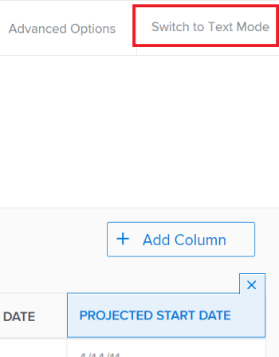

# 使用文字模式編輯檢視

<!--

NOTE: add a section in this article: /Content/Reports and Dashboards/Reports/Reporting Elements/create-customize-views.html *** Also, draft this area in the Text Mode overview article) 

-->

您可以使用文字模式來編輯清單或報表中的檢視，以存取標準介面中無法使用的欄位，並建立更複雜的檢視。

## 存取需求

您必須具有下列存取權才能執行本文中的步驟：

<table style="table-layout:auto"> 
 <col> 
 <col> 
 <tbody> 
  <tr> 
   <td role="rowheader">Adobe Workfront計畫*</td> 
   <td> 
任何
 </td> 
  </tr> 
  <tr> 
   <td role="rowheader">Adobe Workfront授權*</td> 
   <td> 
計劃 
 </td> 
  </tr> 
  <tr> 
   <td role="rowheader">存取層級設定*</td> 
   <td> 
編輯對篩選器、檢視、群組的存取權
 
編輯報告、儀表板、行事曆的存取權，以編輯報告中的報告元素
 
注意：如果您還是沒有存取權，請詢問您的Workfront管理員，他們是否在您的存取層級中設定其他限制。 如需有關Workfront管理員如何修改您的存取層級的資訊，請參閱 <a href="../../../administration-and-setup/add-users/configure-and-grant-access/create-modify-access-levels.md" class="MCXref xref">建立或修改自訂存取層級</a>.
 </td> 
  </tr> 
  <tr> 
   <td role="rowheader">物件許可權</td> 
   <td> 
管理報表的許可權，以編輯報表中的檢視
 
管理檢視的許可權以進行編輯
 
如需請求其他存取許可權的詳細資訊，請參閱 <a href="../../../workfront-basics/grant-and-request-access-to-objects/request-access.md" class="MCXref xref">要求物件的存取權 </a>.
 </td> 
  </tr> 
 </tbody> 
</table>

&#42;若要瞭解您擁有的計畫、授權型別或存取權，請聯絡您的Workfront管理員。

## 先決條件

在報表或清單中開始使用文字模式之前，請務必熟悉Workfront文字模式語法。

如需詳細資訊，請參閱：

* [文字模式概觀](../../../reports-and-dashboards/reports/text-mode/understand-text-mode.md)
* [文字模式語法概觀](../../../reports-and-dashboards/reports/text-mode/text-mode-syntax-overview.md)
* [自訂檢視、篩選和分組範例：文章索引](../../../reports-and-dashboards/reports/custom-view-filter-grouping-samples/custom-view-filter-grouping-samples.md)

## 在檢視中編輯文字模式

對於報告和清單，使用文字模式編輯檢視是相同的。 從報表或清單存取檢視表的方式會有所不同。

>[!TIP]
>
>建議您在標準模式中建立儘可能多的檢視，然後將其轉換為文字模式以進行編輯。

如需有關建立檢視的資訊，請參閱 [Adobe Workfront中的檢視概觀](../../../reports-and-dashboards/reports/reporting-elements/views-overview.md).

如需建立報表的相關資訊，請參閱 [建立自訂報表](../../../reports-and-dashboards/reports/creating-and-managing-reports/create-custom-report.md).

1. 執行下列其中一項：

   1. 若要從報表存取檢視，請移至報表，然後按一下 **報表動作** > **編輯** > **欄（檢視）** 標籤。
   1. 若要從清單存取檢視，請移至清單並從 **檢視** 下拉式功能表，將滑鼠移至您要修改的檢視上，然後按一下 **編輯** 圖示 .

      檢視產生器隨即開啟。

1. 在檢視中選取欄。

   或

   選取 **欄（檢視）** 標籤，然後選取欄。

   >[!TIP]
   >
   >若要使用文字模式編輯檢視，您必須一次編輯一欄。

1. 按一下 **切換到文字模式** 建立器的右上角。

   >[!NOTE]
   >
   >當您以文字模式編輯欄時，Workfront會新增 `textmode=true` 欄的程式碼行。 這表示在文字模式中修改了欄。

   

   下表概述文字模式檢視中的關鍵行：

   <!--
   
(NOTE: make this a snippet and add it to the grouping article too)

   -->

   <table style="table-layout:auto"> 
    <col> 
    <col> 
    <thead> 
     <tr> 
      <th>範例行</th> 
      <th>說明</th> 
     </tr> 
    </thead> 
    <tbody> 
     <tr> 
      <td> 
<strong>valuefield</strong>=
 </td> 
      <td> 
這是物件或欄位在資料庫中顯示的名稱。 如需有關物件和欄位如何在資料庫中顯示的詳細資訊，請參閱 <a href="../../../wf-api/general/api-explorer.md" class="MCXref xref">API總管</a>.
 
存在下列情況：
 
       <ol> 
        <li value="1"> 
 如果您顯示的欄位名稱是短語而不是單一名詞，則必須使用駝峰式大小寫語法 <code>valuefield</code>. 例如，對於任務的計劃開始日期，程式碼為： 
 
Example: </b>"><b>範例： </b><code>valuefield=plannedStartDate</code> 
 </li> 
        <li value="2"> 
如果您想要顯示自訂欄位，請 <code>valuefield</code> value是欄位的實際名稱，如您在介面中所見。 例如，對於名為「更多資訊」的自訂欄位，程式碼為：
 
Example: </b>"><b>範例： </b><code>valuefield=More information</code> 
 </li> 
        <li value="3"> 
如果您想要顯示與檢視中其他物件相關的物件，請使用 <code>valuefield</code> 程式碼行物件名稱和屬性會以冒號分隔。 
 
例如，在任務檢視中顯示「Portfolio擁有者」名稱的欄具有下列valuefield行的值：
 
Example: </b>"><b>範例： </b><code>valuefield=project:portfolio:owner:name</code> 
 
這表示您可以從報表（工作）的物件存取下一個相關物件（專案），從那裡，您可以從專案（專案組合）存取下列相關物件，接著存取專案組合擁有者（擁有者），然後存取其名稱（名稱）。 
 </li> 
       </ol> 
如需物件如何彼此連線的詳細資訊，請參閱區段 <a href="../../../workfront-basics/navigate-workfront/workfront-navigation/understand-objects.md#understanding-interdependency-and-hierarchy-of-objects" class="MCXref xref">物件的相依性和階層</a> 在 <a href="../../../workfront-basics/navigate-workfront/workfront-navigation/understand-objects.md" class="MCXref xref">瞭解Adobe Workfront中的物件</a>.
 
備註：如果您在文字模式中選擇的欄位在標準介面中無效，則無法切換回欄位中的標準介面。
 </td> 
     </tr> 
     <tr> 
      <td><strong>值格式=</strong> </td> 
      <td> 
此線條代表用來顯示 <code>valuefield</code>. 此 <code>valueformat</code> 會識別物件或欄位是否顯示為文字、數字、百分比或日期。
 
我們建議使用 <code>HTML</code> 針對您的 <code>valueformat</code>，尤其是使用 <code>valueexpression</code>，確保以最精確的方式顯示您的資訊。 
 
如需此行的其他值相關資訊，請參閱 <a href="../../../reports-and-dashboards/reports/text-mode/use-conditional-formatting-text-mode.md" class="MCXref xref">在文字模式中使用條件式格式</a>.
 </td> 
     </tr> 
     <tr> 
      <td> 
<strong>valueexpression=</strong> 
 </td> 
      <td> 
您可以新增此行來取代 <code>valuefield</code>，則會在欄中顯示計算欄位。
 
您必須將 <code>valuefield</code> 括弧內的物件，每次在 <code>valueexpression</code>.
 
存在下列情況： 
 
       <ol> 
        <li value="1"> 
如果您想要以大寫在欄中顯示欄位，請使用：
 
Example: </b>"><b>範例： </b><code>valueexpression=UPPER({valuefield})</code> 
 
此 <code>valuefield</code> 在API Explorer中顯示的物件會拼寫。 
 </li> 
        <li value="2">如果您想要新增多個 <code>valuefields</code> 藉由將它們串連在一起，您必須以句點分隔它們。</li> 
        <li value="3"> 
例如，如果您想使用顯示任務的主要受指派人名稱 <code>valueexpression</code>，您會使用：
 
Example: </b>"><b>範例： </b><code>valueexpreesion={assignedTo}.{name}</code> 
 </li> 
        <li value="4"> 
如果您想在中使用自訂欄位 <code>valueexpression</code> 欄位名稱的前面必須加一行 <code>DE:</code> 以指示它是一個自訂欄位。 欄位名稱在介面中顯示時拼寫。 
 
重要：若您使用的自訂欄位位位位位於某些使用者許可權有限的自訂表單區段中，則當這些使用者在報表中檢視此計算時，值運算式的計算為空白。 如需有關調整自訂表格區段許可權的資訊，請參閱 <a href="../../../administration-and-setup/customize-workfront/create-manage-custom-forms/create-or-edit-a-custom-form.md" class="MCXref xref">建立或編輯自訂表單</a>.
 
例如，如果您有一個標示為「開發人員名稱」的自訂欄位，並且您想在欄中以大寫顯示此欄位，您可以使用以下專案 <code>valueexpression</code> 以表示此訊息：
 
Example: </b>"><b>範例： </b><code>valueexpression=UPPER({DE:Developer Name}</code>) 
 
參照「預先輸入」型別自訂欄位時，請使用下列運算式來參照在標示為「開發人員名稱」的欄位中選取的物件名稱：
 
<code>valueexpression=UPPER({DE:Developer Name:name})</code> 
 </li> 
       </ol> </td> 
     </tr> 
     <tr> 
      <td> 
<strong>descriptionkey= / description=</strong> 
 </td> 
      <td> 
當您將滑鼠移到欄的名稱上時，此行會定義工具提示的文字。 在此案例中，它使用索引鍵來翻譯說明文字中的名稱值。 如果您要修改說明，請將此行變更為以下內容： 
 
Example: </b>"><b>範例： </b><code>description=Your Value</code>.
 </td> 
     </tr> 
     <tr> 
      <td><strong>namekey= / name=</strong> </td> 
      <td> 
此行定義欄標籤。 在此情況下，它會使用根據索引鍵的縮寫值。
 
如果要修改欄名稱，可將此值變更為： 
 
Example: </b>"><b>範例： </b><code>name=Your Value</code> 
 
<code>Name</code> 可讓您為欄名稱輸入任何文字，而<code>namekey</code> 需要您輸入用來轉譯欄名稱的索引鍵。
 
若要變更欄名稱，您也可以新增 <code>displayname </code>行（如果不存在）。
 </td> 
     </tr> 
     <tr> 
      <td><strong>displayname =</strong> </td> 
      <td> 
您可以新增下列行來變更欄的名稱，這會暫停 <code>namekey/name</code> 值：
 
Example: </b>"><b>範例： </b><code>displayname=Your Value</code> 
 </td> 
     </tr> 
     <tr> 
      <td><strong>querysort=</strong> </td> 
      <td>此行定義在按一下欄標題時如何排序結果。 如果欄不存在，則無法在報表執行後排序該欄。</td> 
     </tr> 
     <tr> 
      <td><strong>寬度=</strong> </td> 
      <td> 
此線條代表用於欄的畫素數。 如果省略該行或設為0 （零），則該欄不會出現在檢視中。
 
當您在文字模式中手動修改此欄位時，您也必須新增 <code>usewidths=true</code> 值至您的欄。
 </td> 
     </tr> 
     <tr> 
      <td><strong>usewidths=true</strong> </td> 
      <td> 
除了以下專案外，您還必須使用此行： <code>width=</code> 自訂欄寬時的線條。 
 </td> 
     </tr> 
     <tr> 
      <td><strong>makeFieldEditable=</strong> </td> 
      <td> 
此行定義欄中顯示的值是否可內嵌編輯。 如果此行等於 <strong>true</strong>，欄中的值可內嵌編輯。 如果此行等於 <code>false</code>，欄中的值不可內嵌編輯。
 </td> 
     </tr> 
     <tr> 
      <td><strong>link.valuefield=</strong> </td> 
      <td> 
只有在您希望欄中顯示的值連結到與其關聯的物件時，才插入此行。 連結會開啟物件的詳細資訊頁面。 此值應符合 <code>valuefield=</code> 行。 當您插入此專案時，您也必須新增 <code>link.valueformat=</code> 行。 
 
 例如，您可以插入 <code>link.valuefield=priority</code> 在問題檢視中，和問題的優先順序會顯示為連結。 按一下此連結會開啟問題頁面。
 </td> 
     </tr> 
     <tr> 
      <td><strong>link.valueformat=</strong> </td> 
      <td> 
只有在您已插入 <code>link.valuefield</code> 行，將連結新增至欄中的值。 連結會開啟物件的詳細資訊頁面。 此值應符合 <code>valueformat=</code> 行並指示用來顯示 <code>valuefield</code>. 
 
重要：在內建欄（也包含連結）中檢視文字模式時，您會注意到有多行文字參考該連結。 當您在文字模式中建立自己的自訂欄並將連結陳述式新增到其中時，其中某些行可能不再受支援或不必要。 新增連結值時必須使用的行包括<code> link.valuefield</code> 和 <code>link.valueformat</code>. 
 </td> 
     </tr> 
     <tr> 
      <td><strong>aggregator.function=</strong> </td> 
      <td> 
這指的是彙總各欄值的方式。 有多行開頭為 <code>aggregator.</code> 而且他們都引用摘要列出欄結果的彙總。 
 
一般而言， <code>aggregator.</code> 行與欄物件的行相符。 
 
       
Example: </b>">
        <b>範例： </b> 
        
任務報告中按「總和」彙總的「計畫時數」欄可能如下所示： 
 
        

         <pre>textmode=true</pre>
         <pre>valuefield=workRequired</pre>
         <pre>valueformat=compound</pre>
         <pre>aggregator.function=SUM</pre>
         <pre>aggregator.valuefield=workRequired</pre>
         <pre>aggregator.displayformat=minutesAsHoursString</pre>
         <pre>aggregator.valueformat=compound</pre>
         <pre>namekey=workRequired</pre>
         <pre>shortview=false</pre> 
        
 
       
 
       

        此 <code>aggregator. </code>行可以包含 <code>valuefield </code>或 <code>valueexpression</code>
       
 </td> 
     </tr> 
    </tbody> 
   </table>

1. 按一下 **套用** 如果您要儲存變更並繼續編輯檢視。
1. 按一下 **儲存+關閉** 以儲存報表。

   或

   按一下 **儲存檢視** 將檢視儲存在清單中。
