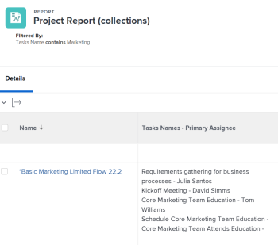

# 報表中的參考集合

在Adobe Workfront中建立報表可讓您以清單、格線或圖表格式顯示一組物件、其個別欄位或連結物件。

如需在Workfront中建立報表的詳細資訊，請參閱 [建立自訂報表](../../../reports-and-dashboards/reports/creating-and-managing-reports/create-custom-report.md).

## 存取需求

您必須具有下列存取權才能執行本文中的步驟：

<table style="table-layout:auto"> 
 <col> 
 <col> 
 <tbody> 
  <tr> 
   <td role="rowheader">Adobe Workfront計畫*</td> 
   <td> <p>任何</p> </td> 
  </tr> 
  <tr> 
   <td role="rowheader">Adobe Workfront授權*</td> 
   <td> <p>計劃 </p> </td> 
  </tr> 
  <tr> 
   <td role="rowheader">存取層級設定*</td> 
   <td> <p>編輯對篩選器、檢視、群組的存取權</p> <p>編輯報告、儀表板、行事曆的存取權</p> <p>注意：如果您還是沒有存取權，請詢問您的Workfront管理員，他們是否在您的存取層級中設定其他限制。 如需有關Workfront管理員如何修改您的存取層級的資訊，請參閱 <a href="../../../administration-and-setup/add-users/configure-and-grant-access/create-modify-access-levels.md" class="MCXref xref">建立或修改自訂存取層級</a>.</p> </td> 
  </tr> 
  <tr> 
   <td role="rowheader">物件許可權</td> 
   <td> <p>管理報表的許可權</p> <p>管理檢視、篩選或分組的許可權 </p> <p>如需請求其他存取許可權的詳細資訊，請參閱 <a href="../../../workfront-basics/grant-and-request-access-to-objects/request-access.md" class="MCXref xref">要求物件的存取權 </a>.</p> </td> 
  </tr> 
 </tbody> 
</table>

若要瞭解您擁有的計畫、授權型別或存取權，請聯絡您的Workfront管理員。

## 瞭解集合

集合是連結至其他物件的物件清單。

Workfront中的物件之間有下列兩種關係：

* **一對一的關係**：一個物件一次只能連結至另一個物件。\
  例如，一個專案一次只能連結到一個投資組合。

* **一對多關係**：一個物件一次可連結至多個其他物件。\
  例如，一個專案可以有多個任務。 在這種情況下，任務清單會形成專案的集合。

>[!IMPORTANT]
>
>您可以使用標準Report Builder建立顯示物件間一對一關係的報表。 不過，您只能使用Report Builder中的文字模式介面，建立顯示物件間一對多關係的報表。

如需在標準Report Builder中建立報表的詳細資訊，請參閱 [建立自訂報表](../../../reports-and-dashboards/reports/creating-and-managing-reports/create-custom-report.md).

如需使用文字模式介面建立報表的詳細資訊，請參閱：

* [文字模式概觀](../../../reports-and-dashboards/reports/text-mode/understand-text-mode.md)
* [文字模式的常見用途概觀](../../../reports-and-dashboards/reports/text-mode/understand-common-uses-text-mode.md).
* [文字模式語法概觀](../../../reports-and-dashboards/reports/text-mode/text-mode-syntax-overview.md)

## 在API Explorer中尋找集合物件及其欄位 {#find-collection-objects-and-their-fields-in-the-api-explorer}

並非所有集合都可以報告。

若要瞭解哪些物件可以與其他的集合相關聯，您必須使用API Explorer。\
如需API Explorer表格的詳細資訊，請參閱 [API總管](../../../wf-api/general/api-explorer.md).

若要瞭解可報告哪些集合：

1. 前往 [API總管](../../../wf-api/general/api-explorer.md).
1. 尋找報表的物件。
1. 選取 **集合** 標籤。

   >[!NOTE]
   >
   >只有此標籤上列出的物件才能在報表中表示為您所選物件的集合。

1. 按一下收藏集的物件以將其展開。
1. 按一下顯示的連結，移至集合的物件。\
   如此將可開啟 **欄位** 物件的標籤。

   >[!NOTE]
   >
   >只有此標籤上列出的欄位才能在集合報表中引用，或是與物件相關聯的欄位列在此標籤上。

## 報表中的參考集合

您可以在下列報表元素中參照集合中的物件：

* 檢視
* 篩選器
* 提示

您無法在下列報表元素中參照集合中的物件：

* 群組
* 圖表

例如，您可以從專案報告參考任務或問題集合，以在專案層級顯示任務或問題資訊。

* [在報表檢視中參考集合](#reference-a-collection-in-the-view-of-a-report)
* [在報表的篩選中參考集合](#reference-a-collection-in-the-filter-of-a-report)
* [在報表的自訂提示中參考集合](#reference-a-collection-in-the-custom-prompt-of-a-report)

### 在報表檢視中參考集合 {#reference-a-collection-in-the-view-of-a-report}

您可以參照報表檢視中的物件集合，以顯示與報表物件相關聯的物件屬性。

例如，您可以在專案報告中顯示任務或問題資訊，方法是在報告檢視中建立任務或問題的收集欄。

您可以在集合檢視中顯示任務或問題的相關資訊，例如名稱、日期、主要受指派人、完成百分比等。

檢視以清單格式顯示任務或問題資訊，清單的每一行代表任務或問題的相關資訊。 任務或問題清單及其欄位會出現在與任務或問題所屬專案相同的行上。\


* [在報表檢視中新增集合欄](#add-a-collection-column-in-a-report-view)
* [瞭解文字模式中集合檢視的行](#understand-the-lines-of-a-collection-view-in-text-mode)
* [集合檢視的限制](#limitations-of-a-collection-view)

### 在報表檢視中新增集合欄 {#add-a-collection-column-in-a-report-view}

若要在報表檢視中新增集合欄：

1. 按一下 **主要** 功能表 ，然後按一下 **報表**.
1. 按一下 **新報告**.
1. 選取報表的物件。
1. 從您的報告導覽離開，並使用 [API總管](../../../wf-api/general/api-explorer.md)，決定您為報表選取的物件可使用哪些集合。

   如需有關選取集合物件的詳細資訊，請參閱區段 [在API Explorer中尋找集合物件及其欄位](#find-collection-objects-and-their-fields-in-the-api-explorer) 本文章內容。\
   記下集合的物件名稱。

1. 使用 [API總管](../../../wf-api/general/api-explorer.md)，前往您要在集合中顯示的物件欄位清單。

   如需尋找集合物件欄位的詳細資訊，請參閱區段 [在API Explorer中尋找集合物件及其欄位](#find-collection-objects-and-their-fields-in-the-api-explorer) 本文章內容。

   記下您要在集合中顯示的欄位名稱。

1. 導覽回您的報表，並在 **欄（檢視）** 標籤，按一下 **新增欄**.
1. 按一下 **切換到文字模式**.
1. 將滑鼠移到對話方塊上，然後按一下 **按一下以編輯文字**.
1. 選取「 」中的 **文字模式** 對話方塊並移除它，然後貼上下列程式碼（如果您參照的是集合物件的欄位）：

   ```
   valueformat=HTML
   textmode=true
   type=iterate
   listdelimiter=<p>
   displayname=Column Name
   listmethod=nested(collection object name).lists
   valuefield=collection object field
   ```

1. 取代 **欄名稱** ，並將您的欄名稱放在 `displayname` 行。
1. 取代 **集合物件名稱**&#x200B;將您的集合物件名稱置於 `listmethod` 行，如它在 [API總管](../../../wf-api/general/api-explorer.md).

1. 取代 **集合物件欄位** ，且您的集合物件在 `valuefield` 行，如它在 [API總管](../../../wf-api/general/api-explorer.md).

   您可以取代 **valuefield** 替換為 **值運算式**，以在檢視中建立自訂運算式。

   如需有關計算自訂運算式的詳細資訊，請參閱 [計算資料運算式的概觀](../../../reports-and-dashboards/reports/calc-cstm-data-reports/calculated-data-expressions.md).

   例如，如果您想在專案報告中顯示任務清單。 此集合使用 `valuefield` 用於引用任務名稱的行。

   執行下列任一項作業：

   * 使用以下程式碼來建置欄：

     ```
     valueformat=HTML
     textmode=true
     type=iterate
     listdelimiter=<p>
     displayname=Project Tasks Names
     listmethod=nested(tasks).lists
     valuefield=name
     ```

   * 使用下列程式碼來顯示報告中的問題清單：

     ```
     displayname=Project Issues Names
     listdelimiter=<p>
     listmethod=nested(issues).lists
     textmode=true
     type=iterate
     valuefield=name
     valueformat=HTML
     ```

     請注意，在集合中，您必須使用 **問題** 針對 **listmethod** 行，而非 **opTasks** 這是問題的資料庫名稱。 關於何時使用的資訊 **問題** 以及何時使用 **op任務** 若需參考問題，請參閱 [參考問題時使用「opTask」和「issue」](../../../manage-work/issues/issue-information/use-optask-instead-of-issue.md).

   * 如果您想要在專案報告中顯示任務清單及其主要受指派人，您可使用 **值運算式** 用於參照與其主要受指派人名稱相鄰的工作名稱行，而不是 **valuefield**.

     使用以下程式碼來建置欄：

     ```
     valueformat=HTML
     textmode=true
     type=iterate
     listdelimiter=<p>
     displayname=Tasks Names - Primary Assignee
     listmethod=nested(tasks).lists
     valueexpression=CONCAT({name},' - ',{assignedTo}.{name})
     ```

1. 以下欄會顯示在專案報告中，列出每個專案中的所有任務及其主要受指派人：

   

1. 按一下&#x200B;**儲存**。
1. （選用）繼續編輯報表。

   或

   按一下 **儲存+關閉** 以儲存報表。

#### 瞭解文字模式中集合檢視的行

下表列出集合的文字模式檢視中的行：

<table style="table-layout:auto"> 
 <col> 
 <col> 
 <thead> 
  <tr> 
   <th><strong>範例行</strong> </th> 
   <th><strong>說明</strong> </th> 
  </tr> 
 </thead> 
 <tbody> 
  <tr> 
   <td><code>valueformat=HTML</code> </td> 
   <td> <p>您可以對此行使用各種值，但我們建議 <code style="font-weight: normal;">valueformat</code> 集合清單應為 <strong>HTML。</strong></p>
   </td> 
  </tr> 
  <tr> 
   <td><code>textmode=true</code> </td> 
   <td> <p>此行表示欄已使用文字模式設定。 如果您移除此行，Workfront會依預設將其新增回。</p> </td> 
  </tr> 
  <tr> 
   <td><code>type=iterate</code> </td> 
   <td> <p>此 <code>type</code> 清單的清單永遠是 <code>iterate</code>，建立檢視時。</p> </td> 
  </tr> 
  <tr> 
   <td><code>listdelimiter=&lt;p&gt;</code> </td> 
   <td> <p>這是用來分隔清單中值的分隔字元。<br>我們建議使用 <code>&lt;p&gt;</code> 會在值之間新增分行符號。</p> <p>您也可以使用下列專案：</p> <p><code>&amp;zwj;</code> （零寬度聯結器）。 集合的值之間沒有分隔符號。<br><strong>，</strong> =逗號分隔符號。 集合的值以逗號分隔，後跟空格。<br><strong>/</strong> =斜線分隔符號。 集合的值以斜線分隔。<br><strong>-</strong> =破折號分隔符號。 集合的值以破折號分隔。<br>依照預設，將此行留空會在集合的值之間新增逗號，後跟空格。</p> </td> 
  </tr> 
  <tr> 
   <td><code>displayname=</code><em>欄名稱</em> </td> 
   <td> <p>取代 <strong>欄名稱</strong> 新欄的實際名稱。</p> </td> 
  </tr> 
  <tr> 
   <td><code>listmethod=nested(collection object name).list</code> </td> 
   <td> <p> 此行會定義您正在參照的集合。</p> <p>取代 <strong>集合物件名稱</strong> 與您在集合中參照的物件名稱相同，它會顯示在 <a href="../../../wf-api/general/api-explorer.md" class="MCXref xref">API總管</a>. 此值通常是集合物件名稱的多種形式。</p> </td> 
  </tr> 
  <tr> 
   <td><code>valuefield=collection object field</code> </td> 
   <td> <p>這行會定義您從集合物件參照的欄位。</p> <p>取代 <strong>集合物件欄位</strong> 與您在集合中參照之物件的欄位名稱相同，它會顯示在 <a href="../../../wf-api/general/api-explorer.md" class="MCXref xref">API總管</a>.</p> <p>您可以將此行取代為：</p> <p><strong>值運算式</strong>=計算的集合物件欄位/欄位</p> <p>使用 <strong>值運算式</strong>，您即可在欄中顯示計算的自訂運算式。</p> <p>如需格式化的詳細資訊 <strong>值運算式</strong> 行，請參閱 <a href="../../../reports-and-dashboards/reports/text-mode/text-mode-syntax-overview.md" class="MCXref xref">文字模式語法概觀</a>.</p> </td> 
  </tr> 
 </tbody> 
</table>

#### 集合檢視的限制 {#limitations-of-a-collection-view}

建立集合檢視時，請考量下列限制：

* 您無法控制集合資料的顯示順序。
* 您無法套用條件式格式至集合檢視。
* 您無法讓集合中的物件成為可點按的連結。
* 您無法建立其他集合的集合檢視。\
  例如，您無法在專案報告中顯示每個任務的所有受指派人。 您只能在專案檢視中的每個任務上顯示主要受指派人。

### 在報表的篩選中參考集合 {#reference-a-collection-in-the-filter-of-a-report}

您可以參照報表篩選中的物件集合，以篩選與報表物件關聯的物件屬性。

例如，您可以在篩選陳述式中使用專案上任務或問題屬性的參照，來篩選專案報告中的任務或問題資訊。

若要在報表篩選器中新增集合的參考：

1. 按一下 **主要** 功能表 ，然後按一下 **報表**.
1. 按一下 **新報告**.
1. 選取報表的物件。
1. 從您的報告導覽離開，並使用 [API總管](../../../wf-api/general/api-explorer.md)，決定您為報表選取的物件可使用哪些集合。

   如需有關選取集合物件的詳細資訊，請參閱區段 [在API Explorer中尋找集合物件及其欄位](#find-collection-objects-and-their-fields-in-the-api-explorer) 本文章內容。

   記下集合的物件名稱。

1. 使用 [API總管](../../../wf-api/general/api-explorer.md)，前往您要在集合中顯示的物件欄位清單。

   如需尋找集合物件欄位的詳細資訊，請參閱區段 [在API Explorer中尋找集合物件及其欄位](#find-collection-objects-and-their-fields-in-the-api-explorer) 本文章內容。

   記下您要在集合中顯示的欄位。

1. 導覽回您的報表，並在 **篩選器** 標籤，按一下 **切換到文字模式**.

1. 在 **設定報告的篩選規則** 區域，貼上下列程式碼：

   ```
   collection object name:collection object field=collection object value
   collection object name:collection object field_Mod=value of the modifier
   ```

1. 取代 **集合物件名稱** 與您的集合物件名稱相同，該名稱會顯示在 [API總管](../../../wf-api/general/api-explorer.md). 此值通常是集合物件名稱的多種形式。

1. 取代 **集合物件欄位** ，並將您的集合物件之欄位名稱置於中，因為該欄位會顯示在 [API總管](../../../wf-api/general/api-explorer.md).

1. 取代 **集合物件值** 收集物件的值會顯示在Workfront中。
1. 取代 **修飾元的值** 具有有效的修飾元。

   如需修飾元的清單，請參閱 [篩選和條件修飾元](../../../reports-and-dashboards/reports/reporting-elements/filter-condition-modifiers.md).\
   例如，若要建置僅顯示名稱中有「行銷」之任務的專案的專案報告，請使用下列程式碼：

   ```
   tasks:name=Marketing
   tasks:name_Mod=cicontains
   ```

   此報表只會顯示至少一項任務名稱中有「行銷」字樣的專案。

   

1. 若要篩選問題的名稱，請使用下列程式碼：

   ```
   issues:name=Marketing
   issues:name_Mod=cicontains
   ```

   >[!TIP]
   >
   >請注意，您必須使用 `issues` 集合物件名稱，而非 `optask` 問題在API Explorer中的顯示方式。

1. 按一下 **完成**.
1. （選用）繼續編輯報表。

   或

   按一下 **儲存+關閉** 以儲存報表。

### 在報表的自訂提示中參考集合 {#reference-a-collection-in-the-custom-prompt-of-a-report}

您可以在報表的自訂提示中參照物件集合，以篩選報表結果，找出與報表物件關聯的物件屬性。

例如，您可以在專案報告中使用專案上任務屬性的參照，在報告的自訂提示中提示任務資訊。

>[!NOTE]
>
>您無法在標準提示中參考集合。

自訂提示是一種自訂篩選器，其中陳述式由&amp;符號聯結。 建議您先在篩選器中建立陳述式，然後使用&amp;符號聯結陳述式的各行。

如需以集合參考建立篩選陳述式的詳細資訊，請參閱區段 [在報表的篩選中參考集合](#reference-a-collection-in-the-filter-of-a-report) 本文章內容。

若要在報表的自訂提示中新增集合的參考：

1. 按一下 **主要** 功能表 ，然後按一下 **報表**.
1. 按一下 **新報告**.
1. 選取報表的物件。
1. 使用集合參考建立篩選器，如區段所述 [在報表的篩選中參考集合](#reference-a-collection-in-the-filter-of-a-report) 本文章內容。
1. 按一下 **報表設定**.
1. 按一下 **報告提示**.
1. 按一下 **新增提示**.
1. 按一下 **自訂提示**.
1. 在「 」中指定提示的名稱 **Field****name** 欄位。

1. 指定 **下拉式清單專案標籤**.
1. 在「 」中指定以下專案 **條件** 欄位：

   ```
   collection object name:collection object field_Mod=value of the modifier
   ```

1. （選擇性）指定此選擇是否預設顯示在提示中。
1. 取代 **集合物件名稱** 與您的集合物件名稱相同，該名稱會顯示在 [API總管](../../../wf-api/general/api-explorer.md). 此值通常是集合物件名稱的多種形式。
1. 取代 **集合物件欄位** 與您的集合物件之欄位名稱搭配使用，它會顯示在 [API總管](../../../wf-api/general/api-explorer.md).
1. 取代 **集合物件值** 收集物件的值會顯示在Workfront中。

   例如，如果您要篩選工作名稱包含「行銷」的專案，請取代 **集合物件值** 替換為 **行銷**.

1. 取代 **修飾元的值** 具有有效的修飾元。

   如需修飾元的清單，請參閱  [篩選和條件修飾元](../../../reports-and-dashboards/reports/reporting-elements/filter-condition-modifiers.md).

   **範例：** 例如，若要使用自訂提示建立專案報告，其中您只想顯示至少有一個任務指派給特定使用者的專案，請使用下列程式碼：

   ```
   tasks:assignedToID=57cf1b7a000077c9f02f66cb09c8f86c&tasks:assignedToID_Mod=in
   ```

   這會產生一個報表，其中列出的所有專案都至少指派了一個任務給GUID為57cf1b7a000077c9f02f66cb09c8f86c的使用者。

   >[!NOTE]
   >
   >您無法參照任務的主要受指派人名稱（「指派至」欄位），根據 [API總管](../../../wf-api/general/api-explorer.md). 您只能參考主要受指派人的ID。

   例如，若要篩選將任何專案問題指派給特定使用者的任何專案，請使用以下程式碼作為自訂提示：

   ```
   issues:assignedToID=57cf1b7a000077c9f02f66cb09c8f86c&issues:assignedToID_Mod=in
   ```

   這會產生一份報告，其中列出的所有專案都至少有一個問題指派給GUID為57cf1b7a000077c9f02f66cb09c8f86c的使用者。

   >[!NOTE]
   >
   請注意，您必須使用 **問題** 集合物件名稱的。 API總管目前未針對問題提供集合物件名稱。

1. 按一下 **完成**.
1. （選用）繼續編輯報表。

   或

   按一下 **儲存+關閉** 以儲存報表。
