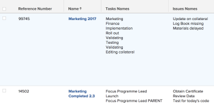

# 報表中的參考集合

<!-- Audited: 1/2025 -->

在Adobe Workfront中建立報表可讓您以清單、格線或圖表格式顯示一組物件、其個別欄位或連結物件。

如需在Workfront中建立報表的詳細資訊，請參閱[建立自訂報表](../../../reports-and-dashboards/reports/creating-and-managing-reports/create-custom-report.md)。

## 存取需求

+++ 展開以檢視本文中功能的存取需求。

您必須具備下列條件：

<table style="table-layout:auto"> 
 <col> 
 <col> 
 <tbody> 
  <tr> 
   <td role="rowheader">Adobe Workfront計畫</td> 
   <td> <p>任何</p> </td> 
  </tr> 
  <tr> 
   <td role="rowheader">Adobe Workfront授權</td> 
   <td> 
      <p>新增：</p>
         <ul>
         <li><p>標準</p></li>
         </ul>
      <p>目前：</p>
         <ul>
         <li><p>規劃</p></li>
         </ul>
   </td>
  </tr> 
  <tr> 
   <td role="rowheader">存取層級設定</td> 
   <td> <p>編輯對篩選器、檢視、群組的存取權</p> <p>編輯報告、儀表板、行事曆的存取權</p> </td> 
  </tr> 
  <tr> 
   <td role="rowheader">物件許可權</td> 
   <td> <p>管理報表的許可權</p> <p>管理檢視、篩選或分組的許可權 </p> </td> 
  </tr> 
 </tbody> 
</table>

如需詳細資訊，請參閱Workfront檔案中的[存取需求](/help/quicksilver/administration-and-setup/add-users/access-levels-and-object-permissions/access-level-requirements-in-documentation.md)。

+++

## 瞭解集合

集合是連結至其他物件的物件清單。

Workfront中的物件之間有下列兩種關係：

* **一對一的關係**：一個物件一次只能連結到另一個物件。\
  例如，一個專案一次只能連結到一個投資組合。

* **一對多關係**：一個物件可以一次連結到多個其他物件。\
  例如，一個專案可以有多個任務。 在這種情況下，任務清單會形成專案的集合。

>[!IMPORTANT]
>
>您可以使用標準Report Builder建立顯示物件間一對一關係的報表。 不過，您只能使用Report Builder中的文字模式介面，建立顯示物件間一對多關係的報表。

如需在標準Report Builder中建立報表的詳細資訊，請參閱[建立自訂報表](../../../reports-and-dashboards/reports/creating-and-managing-reports/create-custom-report.md)。

如需使用文字模式介面建立報表的詳細資訊，請參閱：

* [文字模式概觀](../../../reports-and-dashboards/reports/text-mode/understand-text-mode.md)
* [文字模式的常見使用概述](../../../reports-and-dashboards/reports/text-mode/understand-common-uses-text-mode.md)。
* [文字模式語法概觀](../../../reports-and-dashboards/reports/text-mode/text-mode-syntax-overview.md)

## 在API Explorer中尋找集合物件及其欄位 {#find-collection-objects-and-their-fields-in-the-api-explorer}

並非所有集合都可以報告。

若要瞭解哪些物件可以與其他的集合相關聯，您必須使用API Explorer。\
如需API總管表格的詳細資訊，請參閱[API總管](../../../wf-api/general/api-explorer.md)。

若要瞭解可報告哪些集合：

1. 移至[API總管](../../../wf-api/general/api-explorer.md)。
1. 尋找報表的物件。
1. 選取&#x200B;**集合**&#x200B;索引標籤。

   >[!NOTE]
   >
   >只有此標籤上列出的物件才能在報表中表示為您所選物件的集合。

1. 按一下收藏集的物件以將其展開。
1. 按一下顯示的連結，移至集合的物件。\
   這會開啟集合物件的&#x200B;**欄位**&#x200B;標籤。

   >[!NOTE]
   >
   >只有此標籤上列出的欄位才能在集合報表中引用，或是與物件相關聯的欄位列在此標籤上。

## 報表中的參考集合

您可以在以下報告元素中從集合引用物件：

* 檢視
* 篩選器
* 提示

不能從以下報告元素中的集合引用物件：

* 群組
* 圖表

例如，可以從專案報表引用任務或問題集合，以顯示專案級別的任務或問題資訊。

* [在報表的檢視中引用集合](#reference-a-collection-in-the-view-of-a-report)
* [在報表篩選中參照集合](#reference-a-collection-in-the-filter-of-a-report)
* [在報表的自訂提示中參考集合](#reference-a-collection-in-the-custom-prompt-of-a-report)

### 在報表檢視中參考集合 {#reference-a-collection-in-the-view-of-a-report}

您可以參照報表檢視中的物件集合，以顯示與報表物件相關聯的物件屬性。

例如，您可以在專案報告中顯示任務或問題資訊，方法是在報告檢視中建立任務或問題的收集欄。

您可以在集合檢視中顯示任務或問題的相關資訊，例如名稱、日期、主要受指派人、完成百分比等。

檢視以清單格式顯示任務或問題資訊，清單的每一行代表任務或問題的相關資訊。 任務或問題清單及其欄位會出現在與任務或問題所屬專案相同的行上。

{width=400}

* [在報表檢視中新增集合欄](#add-a-collection-column-in-a-report-view)
* [瞭解文字模式中集合檢視的行](#understand-the-lines-of-a-collection-view-in-text-mode)
* [集合檢視的限制](#limitations-of-a-collection-view)

### 在報表檢視中新增集合欄 {#add-a-collection-column-in-a-report-view}

若要在報表檢視中新增集合欄：

1. 按一下&#x200B;**主要**&#x200B;功能表，然後按一下&#x200B;**報表**。
1. 按一下&#x200B;**新報告**。
1. 選取報表的物件。
1. 離開您的報告，使用[API Explorer](../../../wf-api/general/api-explorer.md)決定您為報告選取的物件有哪些可用的集合。

   如需有關選取集合物件的詳細資訊，請參閱本文章的[尋找集合物件及其在API總管](#find-collection-objects-and-their-fields-in-the-api-explorer)中的欄位。

   記下集合的物件名稱。

1. 使用[API Explorer](../../../wf-api/general/api-explorer.md)，前往您要顯示在集合中的物件欄位清單。

   如需尋找集合物件欄位的詳細資訊，請參閱本文章的[尋找集合物件及其在API總管](#find-collection-objects-and-their-fields-in-the-api-explorer)中的欄位。

   記下您要在集合中顯示的欄位名稱。

1. 導覽回您的報告，然後在&#x200B;**欄（檢視）**&#x200B;索引標籤中按一下&#x200B;**新增欄**。
1. 按一下&#x200B;**切換到文字模式**。
1. 按一下&#x200B;**編輯文字模式**。
1. 在&#x200B;**文字模式**&#x200B;對話方塊中選取所有文字並將其移除，然後如果您參照的是集合物件的欄位，請貼上下列程式碼：

   ```
   valueformat=HTML
   textmode=true
   type=iterate
   listdelimiter=<p>
   displayname=Column Name
   listmethod=nested(collection object name).lists
   valuefield=collection object field
   ```

1. 將&#x200B;**資料行名稱**&#x200B;取代為`displayname`行中的資料行名稱。
1. 將&#x200B;**集合物件名稱**&#x200B;取代為您在`listmethod`行中的集合物件名稱，因為它出現在[API Explorer](../../../wf-api/general/api-explorer.md)中。

1. 將&#x200B;**集合物件欄位**&#x200B;取代為您在`valuefield`行中的集合物件欄位名稱，因為它出現在[API Explorer](../../../wf-api/general/api-explorer.md)中。

   如果您要在檢視中建立自訂運算式，可以將&#x200B;**valuefield**&#x200B;取代為&#x200B;**valueexpression**。

   如需有關計算自訂運算式的詳細資訊，請參閱[計算資料運算式概觀](../../../reports-and-dashboards/reports/calc-cstm-data-reports/calculated-data-expressions.md)。

   例如，如果您想在專案報告中顯示任務清單。 此集合使用`valuefield`行來參照工作的名稱。

   執行下列其中一項：

   * 使用以下程式碼來建置欄：

     ```
     valueformat=HTML
     textmode=true
     type=iterate
     listdelimiter=<p>
     displayname=Project Tasks Names
     listmethod=nested(tasks).lists
     valuefield=name
     ```

   * 使用下列程式碼來顯示報告中的問題清單：

     ```
     displayname=Project Issues Names
     listdelimiter=<p>
     listmethod=nested(issues).lists
     textmode=true
     type=iterate
     valuefield=name
     valueformat=HTML
     ```

     請注意，在集合中，您必須對&#x200B;**listmethod**&#x200B;行使用&#x200B;**問題**，而不是使用&#x200B;**opTasks** （問題的資料庫名稱）。 如需關於何時使用&#x200B;**問題**&#x200B;以及何時在參考問題時使用&#x200B;**opTask**&#x200B;的資訊，請參閱[在參考問題時使用&quot;opTask&quot;和&quot;issue&quot;](../../../manage-work/issues/issue-information/use-optask-instead-of-issue.md)。

   * 如果您想要在專案報告中顯示任務清單及其主要受指派人，您可以使用&#x200B;**valueexpression**&#x200B;行來參照與其主要受指派人名稱相鄰的任務名稱，而不是&#x200B;**valuefield**。

     使用以下程式碼來建置欄：

     ```
     valueformat=HTML
     textmode=true
     type=iterate
     listdelimiter=<p>
     displayname=Tasks Names - Primary Assignee
     listmethod=nested(tasks).lists
     valueexpression=CONCAT({name},' - ',{assignedTo}.{name})
     ```

1. 以下欄會顯示在專案報告中，列出每個專案中的所有任務及其主要受指派人：

   {width=400}

1. 按一下「**儲存**」。
1. （選用）繼續編輯報表。

   或

   按一下&#x200B;**儲存+關閉**&#x200B;以儲存報告。

#### 瞭解文字模式中集合檢視的行

下表列出集合的文字模式檢視中的行：

<table style="table-layout:auto"> 
 <col> 
 <col> 
 <thead> 
  <tr> 
   <th><strong>範例行</strong> </th> 
   <th><strong>說明</strong> </th> 
  </tr> 
 </thead> 
 <tbody> 
  <tr> 
   <td><code>valueformat=HTML</code> </td> 
   <td> <p>您可以為此行使用各種值，但我們建議集合清單的<code style="font-weight: normal;">valueformat</code>應為<strong>HTML。</strong></p>
   </td> 
  </tr> 
  <tr> 
   <td><code>textmode=true</code> </td> 
   <td> <p>此行指示列已使用文字模式進行配置。 如果刪除此行，Workfront 預設會將其重新添加。</p> </td> 
  </tr> 
  <tr> 
   <td><code>type=iterate</code> </td> 
   <td> <p>建立檢視時，清單的<code>type</code>一律為<code>iterate</code>。</p> </td> 
  </tr> 
  <tr> 
   <td><code>listdelimiter=&lt;p&gt;</code> </td> 
   <td> <p>這是用來分隔清單中值的分隔字元。<br>我們建議使用<code>&lt;p&gt;</code>，在值之間新增分行符號。</p> <p>您也可以使用下列專案：</p> <p><code>&zwj;</code> （零寬度連接器）。 集合的值之間沒有分隔符號。<br><strong>，</strong> =逗號分隔符。集合的值之間以逗號分隔，後面沒有空格。<br><strong>/</strong> = 斜線分隔符。集合的值用斜杠分隔。<br><strong>-</strong> = 破折號分隔符。 集合的值之間用虛線隔開。<br>默認情況下，將此行留空會在集合值之間添加一個逗號，後跟一個空格。</p> </td> 
  </tr> 
  <tr> 
   <td><code>displayname=</code><em>欄名稱</em> </td> 
   <td> <p>將<strong>資料行名稱</strong>取代為您新資料行的實際名稱。</p> </td> 
  </tr> 
  <tr> 
   <td><code>listmethod=nested(collection object name).list</code> </td> 
   <td> <p> 此行會定義您正在參照的集合。</p> <p>將<strong>集合物件名稱</strong>取代為您在集合中參照的物件名稱，如同它出現在<a href="../../../wf-api/general/api-explorer.md" class="MCXref xref">API Explorer</a>中一樣。 此值通常是集合物件名稱的多種形式。</p> </td> 
  </tr> 
  <tr> 
   <td><code>valuefield=collection object field</code> </td> 
   <td> <p>這行會定義您從集合物件參照的欄位。</p> <p>將<strong>集合物件欄位</strong>取代為您在集合中參考之物件的欄位名稱，如同<a href="../../../wf-api/general/api-explorer.md" class="MCXref xref">API Explorer</a>中所示。</p> <p>您可以將此行取代為：</p> <p><strong>valueexpression</strong>=計算的集合物件欄位/欄位</p> <p>使用<strong>valueexpression</strong>，您可以  在欄中顯示計算的自訂運算式。</p> <p>如需有關如何格式化<strong>valueexpression</strong>行的詳細資訊，請參閱<a href="../../../reports-and-dashboards/reports/text-mode/text-mode-syntax-overview.md" class="MCXref xref">文字模式語法概述</a>。</p> </td> 
  </tr> 
 </tbody> 
</table>

#### 集合檢視的限制 {#limitations-of-a-collection-view}

建立集合檢視時，請考量下列限制：

* 您無法控制集合資料的顯示順序。
* 您無法套用條件式格式至集合檢視。
* 您無法讓集合中的物件成為可點按的連結。
* 您無法建立其他集合的集合檢視。\
  例如，您無法在專案報告中顯示每個任務的所有受指派人。 您只能在專案檢視中的每個任務上顯示主要受指派人。

### 在報表的篩選中參考集合 {#reference-a-collection-in-the-filter-of-a-report}

您可以參照報表篩選中的物件集合，以篩選與報表物件關聯的物件屬性。

例如，您可以在篩選陳述式中使用專案上任務或問題屬性的參照，來篩選專案報告中的任務或問題資訊。

>[!NOTE]
>
>當套用至包含多個值的欄位時（例如專案內的附註集合），篩選器會依照下列方式決定包含：
>
>* 如果集合中的所有專案都包含指定的值，則從結果中排除整個記錄。
>* 如果集合中至少有一個專案不包含指定的值，則記錄會保留在結果中。


若要在報表篩選器中新增集合的參考：

1. 按一下&#x200B;**主要**&#x200B;功能表，然後按一下&#x200B;**報表**。
1. 按一下&#x200B;**新報告**。
1. 選取報表的物件。
1. 離開您的報告，使用[API Explorer](../../../wf-api/general/api-explorer.md)決定您為報告選取的物件有哪些可用的集合。

   如需有關選取集合物件的詳細資訊，請參閱本文章的[尋找集合物件及其在API總管](#find-collection-objects-and-their-fields-in-the-api-explorer)中的欄位。

   記下集合的物件名稱。

1. 使用[API Explorer](../../../wf-api/general/api-explorer.md)，前往您要顯示在集合中的物件欄位清單。

   如需尋找集合物件欄位的詳細資訊，請參閱本文章的[尋找集合物件及其在API總管](#find-collection-objects-and-their-fields-in-the-api-explorer)中的欄位。

   記下您要在集合中顯示的欄位。

1. 導覽回您的報告，在&#x200B;**篩選器**&#x200B;索引標籤中，按一下&#x200B;**切換到文字模式**&#x200B;然後&#x200B;**編輯文字模式**。

1. 在&#x200B;**設定報表**&#x200B;的篩選規則區域中，貼上下列程式碼：

   ```
   collection object name:collection object field=collection object value
   collection object name:collection object field_Mod=value of the modifier
   ```

1. 將&#x200B;**集合物件名稱**&#x200B;取代為您在[API Explorer](../../../wf-api/general/api-explorer.md)中顯示的集合物件名稱。 此值通常是集合物件名稱的多種形式。

1. 將&#x200B;**集合物件欄位**&#x200B;取代為您在[API Explorer](../../../wf-api/general/api-explorer.md)中顯示的集合物件欄位名稱。

1. 以Workfront中顯示的集合物件值取代&#x200B;**集合物件值**。
1. 以有效的修飾元取代修飾元&#x200B;**的**&#x200B;值。

   如需修飾元清單，請參閱[篩選和條件修飾元](../../../reports-and-dashboards/reports/reporting-elements/filter-condition-modifiers.md)。\
   例如，若要建置僅顯示名稱中有「行銷」之任務的專案的專案報告，請使用下列程式碼：

   ```
   tasks:name=Marketing
   tasks:name_Mod=cicontains
   ```

   此報表只會顯示至少一項任務名稱中有「行銷」字樣的專案。

   {width=400}

1. 若要篩選問題的名稱，請使用下列程式碼：

   ```
   issues:name=Marketing
   issues:name_Mod=cicontains
   ```

   >[!TIP]
   >
   >請注意，您必須使用`issues`作為集合物件名稱，而不是使用`optask`，問題在API Explorer中的顯示方式。

1. 按一下&#x200B;**完成**。
1. （選用）繼續編輯報表。

   或

   按一下&#x200B;**儲存+關閉**&#x200B;以儲存報告。

### 在報表的自定義提示中引用集合 {#reference-a-collection-in-the-custom-prompt-of-a-report}

可以在報表的自定義提示中引用物件的集合，以篩選報表結果中與報表對象關聯的物件的屬性。

例如，通過在報表的自定義提示中使用對專案任務屬性的引用，可以在專案報表中提示輸入任務資訊。

>[!NOTE]
>
>您無法在標準提示中參考集合。

自訂提示是一種自訂篩選器，其中陳述式由&amp;符號聯結。 建議您先在篩選器中建立陳述式，然後使用&amp;符號聯結陳述式的各行。

有關使用集合引用生成篩選器語句的詳細資訊，請參閱本文報表篩選[&#128279;](#reference-a-collection-in-the-filter-of-a-report)中的引用集合部分。

要在報表的自訂提示中添加對集合的引用，請執行以下作：

1. 按兩下主&#x200B;**&#x200B;**&#x200B;選單主選單，然後按一下&#x200B;**報表**。
1. 按一下新 **報表**。
1. 選擇報表的物件。
1. 使用集合參考建立篩選器，如本文中[參考報表](#reference-a-collection-in-the-filter-of-a-report)的篩選器中的集合一節所述。
1. 按一下&#x200B;**報表設定**。
1. 按一下&#x200B;**報告提示**。
1. 按一下&#x200B;**新增提示**。
1. 按一下&#x200B;**自訂提示**。
1. 在&#x200B;**欄位**&#x200B;**名稱**&#x200B;欄位中指定提示的名稱。

1. 指定&#x200B;**下拉式清單專案標籤**。
1. 在&#x200B;**條件**&#x200B;欄位中指定下列專案：

   ```
   collection object name:collection object field_Mod=value of the modifier
   ```

1. （選擇性）指定此選擇是否預設顯示在提示中。
1. 將&#x200B;**集合物件名稱**&#x200B;取代為您在[API Explorer](../../../wf-api/general/api-explorer.md)中顯示的集合物件名稱。 此值通常是集合物件名稱的多種形式。
1. 將&#x200B;**集合物件欄位**&#x200B;取代為您集合物件之欄位的名稱，因為它出現在[API Explorer](../../../wf-api/general/api-explorer.md)中。
1. 以Workfront中顯示的集合物件值取代&#x200B;**集合物件值**。

   例如，如果您正在篩選工作名稱包含「行銷」的專案，請將&#x200B;**集合物件值**&#x200B;取代為&#x200B;**行銷**。

1. 以有效的修飾元取代修飾元&#x200B;**的**&#x200B;值。

   如需修飾元清單，請參閱[篩選和條件修飾元](../../../reports-and-dashboards/reports/reporting-elements/filter-condition-modifiers.md)。

   **範例：**&#x200B;例如，若要使用自訂提示建立專案報告，其中您只想顯示至少有一個指派給特定使用者的專案，請使用下列程式碼：

   ```
   tasks:assignedToID=57cf1b7a000077c9f02f66cb09c8f86c&tasks:assignedToID_Mod=in
   ```

   這會產生一個報表，其中列出的所有專案都至少指派了一個任務給GUID為57cf1b7a000077c9f02f66cb09c8f86c的使用者。

   >[!NOTE]
   >
   >根據[API總管](../../../wf-api/general/api-explorer.md)，您無法參考任務的主要受指派人（「受指派人」欄位）的名稱。 您只能參考主要受指派人的ID。

   例如，若要篩選將任何專案問題指派給特定使用者的任何專案，請使用以下程式碼作為自訂提示：

   ```
   issues:assignedToID=57cf1b7a000077c9f02f66cb09c8f86c&issues:assignedToID_Mod=in
   ```

   這會產生一份報告，其中列出的所有專案都至少有一個問題指派給GUID為57cf1b7a000077c9f02f66cb09c8f86c的使用者。

   >[!NOTE]
   >
   >請注意，您必須使用&#x200B;**問題**&#x200B;作為集合物件名稱。 API總管目前未針對問題提供集合物件名稱。

1. 按一下&#x200B;**完成**。
1. （選用）繼續編輯報表。

   或

   按一下&#x200B;**儲存+關閉**&#x200B;以儲存報告。
