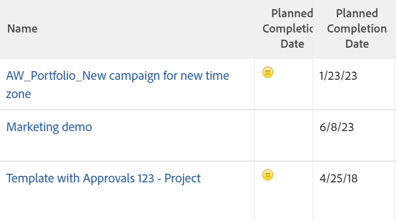

# 在文字模式中使用條件式格式

<!--Audited: 01/2024-->

<!--
(NOTE: Alina: this article might need to be split in its sections. Tony asked that numbers and dates should be in separate articles (??))
-->

標準介面產生器在建立報表元素時，會提供各種彈性以符合您組織的需求。

您可以使用標準介面，在檢視中套用條件式格式。\
如需將條件式格式套用至檢視的詳細資訊，請參閱 [在檢視中使用條件式格式](../../../reports-and-dashboards/reports/reporting-elements/use-conditional-formatting-views.md).

## 存取需求

+++ 展開以檢視本文中功能的存取需求。

您必須具有下列存取權才能執行本文中的步驟：

<table style="table-layout:auto"> 
 <col> 
 <col> 
 <tbody> 
  <tr> 
   <td role="rowheader">Adobe Workfront計畫</td> 
   <td> <p>任何</p> </td> 
  </tr> 
  <tr> 
   <td role="rowheader">Adobe Workfront授權</td> 
   <td> <p>新增：標準 </p> 
   <p>或</p>
   <p>目前：計畫</p> 
   </td> 
  </tr> 
  <tr> 
   <td role="rowheader">存取層級設定*</td> 
   <td> <p>編輯對篩選器、檢視、群組的存取權</p> <p>編輯報告、儀表板、行事曆的存取權，以編輯報告中的檢視</p> </td> 
  </tr> 
  <tr> 
   <td role="rowheader">物件許可權</td> 
   <td> <p>管理報表的許可權，以編輯報表中的檢視</p> <p>管理檢視的許可權以進行編輯</p> </td> 
  </tr> 
 </tbody> 
</table>

如需有關此表格的詳細資訊，請參閱 [Workfront檔案中的存取需求](/help/quicksilver/administration-and-setup/add-users/access-levels-and-object-permissions/access-level-requirements-in-documentation.md).

+++


## 文字模式中的條件式格式

文字模式可讓您使用標準介面中無法使用的欄位，來建立更複雜的檢視、篩選器、群組和提示。

如需所有可報告欄位的完整清單，請參閱  [API總管](../../../wf-api/general/api-explorer.md).

如需有關使用文字模式語法的詳細資訊，請參閱 [文字模式語法概觀](../../../reports-and-dashboards/reports/text-mode/text-mode-syntax-overview.md).

您也可以使用文字模式來格式化報表和清單中的檢視。 使用條件式格式，您可以變更報表中結果的字型型別和背景，以及圖示和旗標，以變更報表的檢視。 建議您一律先使用標準介面建置檢視，並在絕對必要時才切換至文字模式介面。

>[!NOTE]
>
> 不支援使用CSS樣式來自訂條件式格式。 您必須改用Adobe Workfront中提供的預先設計格式選項。

## 新增條件式格式至檢視

如需將條件式格式套用至標準產生器介面中的檢視的詳細資訊，請參閱 [在檢視中使用條件式格式](../../../reports-and-dashboards/reports/reporting-elements/use-conditional-formatting-views.md).

若要在文字模式介面中新增條件式格式至檢視：

1. 移至物件清單。
1. 展開您要新增條件式格式之檢視的下拉式功能表。
1. 按一下 **自訂檢視**.
1. 在檢視中按一下要套用條件式格式的欄。
1. 按一下 **切換到文字模式**.
1. 在 **顯示在此欄：** 區域，按一下 **按一下以編輯文字**.
1. 新增中提供的程式碼範例 [使用文字模式格式化檢視](#format-views-using-text-mode) 位於所選欄文字底部。
1. 按一下 **儲存**，然後按一下 **儲存檢視**.

## 使用文字模式格式化檢視 {#format-views-using-text-mode}

您可以在檢視中將下列元件新增至欄，以有條件地以文字模式設定其格式：

* [欄設定](#column-settings)
* [欄規則](#column-rules)
* [有條件地格式化值運算式](#conditionally-format-a-valueexpression)

### 欄設定 {#column-settings}

您必須熟悉文字模式介面，才能在檢視中新增條件式格式。

在檢視中使用條件式格式時，您可以自訂欄的下列元素：

* [欄標題](#column-headers)
* [日期格式](#format-dates)
* [數字格式](#format-numbers)

#### 欄標題 {#column-headers}

若要變更顯示的欄標題，請新增下列程式碼至您的欄： `displayname= [Name of column]`. 例如，若要將欄命名為「專案所有者」，文字代碼如下所示：

`displayname=Project Owner`

#### 日期格式 {#format-dates}

日期可以設定為以各種格式顯示。

如需詳細資訊，請參閱 [文字模式報表中的日期格式](../../../reports-and-dashboards/reports/text-mode/format-dates-in-text-mode-reports.md).

<!--
<div data-mc-conditions="QuicksilverOrClassic.Draft mode"> 
<p data-mc-conditions="QuicksilverOrClassic.Draft mode">(NOTE: this is drafted and replaced by the article linked above)</p>
<p>To establish a date format, you must modify the <code>valueformat</code> line of the text mode code in the column.</p>
<pre>valueformat= [new date format]</pre>
<p>For example, if you wanted the Projected Completion Date to be displayed as MM/DD/YY the code would look like:</p>
<pre>valueformat=atDate<br>valuefield=projectedCompletionDate </pre>
<p>If you wanted to show the Planned Completion Date as <em>Mth, DD, Year</em>, the code would look like:</p>
<pre>valueformat=mediumAtdate<br>valuefield=plannedCompletionDate</pre>
<p>You can format dates using the following <code>valueformat</code> text mode values:</p>
<table style="table-layout:auto">
<col>
<col>
<col>
<thead>
<tr>
<th scope="col"><strong>Format</strong> </th>
<th scope="col">Example </th>
<th scope="col"><em><strong>valueformat=</strong></em> </th>
</tr>
</thead>
<tbody>
<tr>
<td>MM/DD/YY</td>
<td>10/11/18</td>
<td><pre>atDate</pre> </td>
</tr>
<tr>
<td>MM/DD/YY Time</td>
<td>10/11/18 12:00pm</td>
<td><pre>longAtDate</pre> </td>
</tr>
<tr>
<td>MM/DD/YY</td>
<td>10/11/18</td>
<td><pre>shortAtDate</pre> </td>
</tr>
<tr>
<td>Mth, DD, YR</td>
<td>Oct, 11, 2018</td>
<td><pre>mediumAtDate</pre> </td>
</tr>
<tr>
<td>DW, Mth, Day, YR</td>
<td>Mon, Oct, 11, 2018</td>
<td><pre>partialAtDate</pre> </td>
</tr>
<tr>
<td>DW, Mth, Day, YR Time</td>
<td>Mon, Oct, 11, 2018 12:00 pm</td>
<td><pre>fullAtDate</pre> </td>
</tr>
</tbody>
</table>
</div>
-->

#### 數字格式 {#format-numbers}

您可以格式化數值，以顯示最適合您報告需求的資訊。

如需詳細資訊，請參閱 [格式化文字模式報表中的數字、貨幣和百分比值](../../../reports-and-dashboards/reports/text-mode/format-numbers-in-text-mode-reports.md).

<!--
<div data-mc-conditions="QuicksilverOrClassic.Draft mode">
<p>To modify the format of a numeric value, you must edit the <strong>valueformat</strong> line of your column.</p> 
<p data-mc-conditions="QuicksilverOrClassic.Draft mode">(NOTE: this is drafted and replaced by the article linked above) </p>
<p>For example, if you wanted to display the Budget column as $1000, the value format line would look like:</p>
<pre>valueformat=currencyStringCurrencyRounded<br>valuefield=budget</pre>
<p>You can format numbers using the following values for the <code>valueformat</code> line of your column:</p>
<table border="2" cellspacing="15" cellpadding="1">
<col>
<col>
<thead>
<tr>
<th scope="col"><strong>Example</strong> </th>
<th scope="col"><em><code>valueformat=</code></em> </th>
</tr>
</thead>
<tbody>
<tr>
<td>1234</td>
<td><pre>doubleAsString</pre> or <pre>int</pre></td>
</tr>
<tr>
<td>1,234</td>
<td><pre>doubleAsInt</pre> </td>
</tr>
<tr>
<td>$1,234</td>
<td><pre>currencyStringCurrencyRounded</pre> </td>
</tr>
<tr>
<td>1234.56</td>
<td><pre>doubleAsDouble</pre> </td>
</tr>
<tr>
<td>$1,234.56</td>
<td><pre>currencyStringCurrency</pre> </td>
</tr>
<tr>
<td>12%</td>
<td><pre>doubleAsPercentRounded</pre> </td>
</tr>
<tr>
<td>12.34%</td>
<td><pre>doubleAsPercent</pre> </td>
</tr>
<tr>
<td>(1,234.56)</td>
<td><pre>doubleAsFinancial</pre> </td>
</tr>
<tr>
<td>(1,234)</td>
<td><pre>doubleAsFiancialRounded</pre> </td>
</tr>
</tbody>
</table>
</div>
-->

### 欄規則 {#column-rules}

欄規則允許在檢視中新增影像、顏色、格式和文字覆寫。 欄規則可以獨立建立，也可以包含欄的多個條件。

* [條件式格式](#conditional-formatting)
* [多個條件式格式](#multiple-conditional-formats)
* [套用文字](#apply-text)
* [套用列格式](#apply-row-formats)
* [套用影像](#apply-images)

#### 條件式格式設定 {#conditional-formatting}

在合併顏色或格式化文字時，必須套用特定的文字模式陳述式。

>[!NOTE]
>
>合併的欄可能不支援條件式格式。\
>如需有關將欄與文字模式合併的詳細資訊，請參閱 [檢視：合併一個共用欄中多個欄的資訊](../../../reports-and-dashboards/reports/custom-view-filter-grouping-samples/view-merge-columns.md).

在您要新增條件式格式的任何欄中插入下列程式碼：

```
styledef.case.0.comparison.leftmethod= [field name]
styledef.case.0.comparison.lefttext= [field name]
styledef.case.0.comparison.righttext= [field value]
styledef.case.0.comparison.operator= [qualifier]
styledef.case.0.comparison.operatortype= [data type]
styledef.case.0.comparison.icon=false
styledef.case.0.comparison.truetext= 
styledef.case.0.comparison.trueproperty.0.name= [format option]
styledef.case.0.comparison.trueproperty.0.value= [format style]
```

>[!NOTE]
>
>此 `styledef.case.0.comparison.icon` 除非使用圖示，否則行一律為false。
>
>此 `styledef.case.0.comparison.truetext` 行一律保持空白，直到使用覆寫文字為止。
>
>此 `styledef.case.0.comparison.righttext` 當限定詞非空白時，明細行為空白。

例如，如果我們想在專案報告中以綠色文字顯示公司名稱，您可以使用下列程式碼：

```
styledef.case.0.comparison.leftmethod=company:name
styledef.case.0.comparison.lefttext=company:name ;
styledef.case.0.comparison.righttext= 
styledef.case.0.comparison.operator=notblank
styledef.case.0.comparison.operatortype=string
styledef.case.0.comparison.icon=false
styledef.case.0.comparison.truetext=
styledef.case.0.comparison.trueproperty.0.name=textcolor
styledef.case.0.comparison.trueproperty.0.value=03a219
```

>[!NOTE]
>
>* 雖然此陳述式可套用至「公司名稱」欄，但也可套用至報表上的任何其他欄。 只有在專案有關聯的公司時，才會顯示綠色文字。 記住 `[field name]`， `[value]`、和 `[qualifier]` 驅動條件是否最終顯示在欄上。
>* 使用限定詞時，我們建議使用 `cicontains` 而非 `equal`. 根據預設， `equal` 尋找ID號碼。 使用 `cicontains` 限定元，您可以依其名稱存取專案。


無論文字顏色、對齊方式、字型樣式或背景顏色套用至文字模式，都會使用相同的陳述式（如上所示）。

必須修改下列各行，以反映欄所需的對應格式：

```
styledef.case.0.comparison.trueproperty.0.name= [format option]
styledef.case.0.comparison.trueproperty.0.value= [format style]
```

使用下清單格來識別必須修改哪些行，以及您應該指定哪些值來定義欄的格式樣式：

| **文字色彩** | **線條： textcolor=** |
|---|---|
| 黑色 | `000000` |
| 深藍色 | `0c6aca` |
| 藍綠色 | `1b878c` |
| 綠色 | `03a219` |
| 紫色 | `6408c4` |
| 灰色 | `767676` |
| 紅色 | `d30519` |
| 黃色 | `e19503` |

{style="table-layout:auto"}

| **對齊方式** | **直線： align=** |
|---|---|
| 靠左對齊 | `left` |
| 靠右對齊 | `right` |
| 置中對齊 | `center` |

{style="table-layout:auto"}

| 字型 | 行： ***字型樣式=*** |
|---|---|
| 粗體 | `bold` |
| 斜體 | `italic` |

{style="table-layout:auto"}

| **背景顏色** | **線條：bgcolor=** |
|---|---|
| 藍綠色 | `dcf6f7` |
| 綠色 | `def6e2` |
| 灰色 | `e8e8e8` |
| 藍色 | `e8f1ff` |
| 紫色 | `e9def4` |
| 紅色 | `eac6c9` |
| 黃色 | `feecc8` |
| 白色 | `ffffff` |

{style="table-layout:auto"}

#### 多個條件式格式 {#multiple-conditional-formats}

您可以套用多個格式樣式至陳述式。 核心陳述式將維持不變，而任何其他格式運算式將會新增至陳述式中。

例如，使用先前的陳述式，以綠色粗體文字包含公司名稱。 陳述式會使用以下程式碼撰寫：

```
styledef.case.0.comparison.leftmethod=company:name
styledef.case.0.comparison.lefttext=company:name
styledef.case.0.comparison.righttext=
styledef.case.0.comparison.operator=notblank
styledef.case.0.comparison.operatortype=string
styledef.case.0.comparison.icon=false
styledef.case.0.comparison.truetext= 
styledef.case.0.comparison.trueproperty.0.name=textcolor
styledef.case.0.comparison.trueproperty.0.value=03a219
styledef.case.0.comparison.trueproperty.1.name=fontstyle
styledef.case.0.comparison.trueproperty.1.value=bold
```

>[!NOTE]
>
>包含多個條件式格式運算式時，必須在數值上識別陳述式中的每個運算式。 請注意，已識別運算式0和運算式1。

#### 套用文字 {#apply-text}

如果您想要以您選擇的值取代填入欄中的預設值，則可以在將文字套用至欄時這樣做。

例如，在專案報告上，設定計劃開始日期欄的值為不顯示專案的計劃開始日期，而是顯示「非今天」文字。 對「計劃開始日期」欄使用下列程式碼：

```
case.0.comparison.leftmethod=plannedStartDate
case.0.comparison.lefttext=plannedStartDate
case.0.comparison.righttext=2013-04-10T10:45:00:000
case.0.comparison.operator=ne
case.0.comparison.operatortype=date
case.0.comparison.icon=false
case.0.comparison.truetext=not today
styledef.case.0.comparison.leftmethod=plannedStartDate
styledef.case.0.comparison.lefttext=plannedStartDate
styledef.case.0.comparison.righttext=2013-04-10T10:45:00:000 
styledef.case.0.comparison.operator=ne
styledef.case.0.comparison.operatortype=date&
styledef.case.0.comparison.icon=false
styledef.case.0.comparison.truetext=not today
```

>[!NOTE]
>
>開頭為的行 `case.0.` 使用案例比較來識別文字的使用。 開頭為的行 `styledef.case.0.` 是早期的條件式格式陳述式，我們透過以下說明來識別文字的使用 `truetext` 運算式。 請務必設定 `truetext` 至一個值，而不是保留為空白。


#### 套用列格式 {#apply-row-formats}

如果您想要將條件套用至整列，請使用下列程式碼搭配欄程式碼：


```
styledef.case.0.comparison.icon=false
styledef.case.0.comparison.isrowcase=true
styledef.case.0.comparison.leftmethod= [field name]
styledef.case.0.comparison.lefttext= [field name]
styledef.case.0.comparison.operator= [qualifier]
styledef.case.0.comparison.operatortype= [data type]
styledef.case.0.comparison.righttext= [field value]
styledef.case.0.comparison.trueproperty.0.name= [format option]
styledef.case.0.comparison.trueproperty.0.value= [format style]
styledef.case.0.comparison.truetext=
row.0.styledef.applyallcases=true
row.0.styledef.case.0.comparison.icon=false
row.0.styledef.case.0.comparison.isrowcase=true
row.0.styledef.case.0.comparison.leftmethod= [field name]
row.0.styledef.case.0.comparison.lefttext= [field name]
row.0.styledef.case.0.comparison.operator= [qualifier]
row.0.styledef.case.0.comparison.operatortype= [data type]
row.0.styledef.case.0.comparison.righttext= [field value]
row.0.styledef.case.0.comparison.trueproperty.0.name= [format option]
row.0.styledef.case.0.comparison.trueproperty.0.value= [format style]
row.0.styledef.case.0.comparison.truetext=
```


#### 套用影像 {#apply-images}

與使用文字格式類似，影像也可用來在報表中顯示資訊。 Workfront有許多內建影像，可在報表設定中傳達視覺資訊。 若要在條件式格式設定中使用影像，需要下列陳述式：

```
image.case.0.comparison.leftmethod= [field name]
image.case.0.comparison.lefttext= [field name]
image.case.0.comparison.righttext= [field value]
image.case.0.comparison.operator= [qualifier]
image.case.0.comparison.operatortype= [data type]
image.case.0.comparison.icon=true
image.case.0.comparison.truetext=
```

例如，在專案報告上，您想要建立一個欄，其中您會針對不等於今天日期的每個「規劃完成日期」顯示皺眉。 使用以下文字模式程式碼，將圖示新增至欄：


```
image.case.0.comparison.leftmethod=plannedCompletionDate
image.case.0.comparison.lefttext=plannedCompletionDate
image.case.0.comparison.righttext=2013-04-10T13:00:00:000 
image.case.0.comparison.operator=ne 
image.case.0.comparison.operatortype=date
image.case.0.comparison.icon=true
image.case.0.comparison.truetext=/interface/images/v4_redux/icons/casebuilder/emoticon_frown.gif
```

>[!NOTE]
>
>請注意，陳述式會使用 `icon=true` 運算式。 此陳述式也與其他條件式格式陳述式不同，因為它不使用 `style.def` 格式，但不是唯一的影像格式。




若要使用可用的影像，請套用下列程式碼和值：

| **圖示** | **折線： image.case.0.comparison.truetext=** |
|---|---|
| 皺眉臉  | =`/interface/images/v4_redux/icons/casebuilder/emoticon_frown.gif` |
| 快樂的臉  | =`/interface/images/v4_redux/icons/casebuilder/emoticon_smile.gif` |
| 藍色旗標   | =`/interface/images/v4_redux/icons/casebuilder/flag_blue.gif` |
| 綠色旗標   | =`/interface/images/v4_redux/icons/casebuilder/flag_green.gif` |
| 紅色旗標   | =`/interface/images/v4_redux/icons/casebuilder/flag_red.gif` |
| 黃色旗標   | =`/interface/images/v4_redux/icons/casebuilder/flag_yellow.gif` |
| 黑色圓形   | =`/interface/images/v4_redux/icons/casebuilder/light_black.gif` |
| 藍色圓形  | =`/interface/images/v4_redux/icons/casebuilder/light_blue.gif` |
| 灰色圓形  | =`/interface/images/v4_redux/icons/casebuilder/light_grey.gif` |
| 綠色圓形  | =`/interface/images/v4_redux/icons/casebuilder/light_green.gif` |
| 橘色圓形  | =`/interface/images/v4_redux/icons/casebuilder/light_orange.gif` |
| 粉紅色圓形  | =`/interface/images/v4_redux/icons/casebuilder/light_pink.gif` |
| 紫色圓形  | =`/interface/images/v4_redux/icons/casebuilder/light_purple.gif` |
| 紅色圓形  | =`/interface/images/v4_redux/icons/casebuilder/light_red.gif` |
| 白色圓形  | =`/interface/images/v4_redux/icons/casebuilder/light_white.gif` |
| 黃色圓形  | =`/interface/images/v4_redux/icons/casebuilder/light_yellow.gif` |

{style="table-layout:auto"}

### 有條件地格式化 `valueexpression` {#conditionally-format-a-valueexpression}

若要在欄中顯示計算值，您可以取代 `valuefield` 欄中的程式碼行，帶有 `valueexpression`. 計算值可讓您根據相同物件上兩個現有欄位之間的計算，顯示物件的新值。

如需如何格式化的詳細資訊， `valueexpression line`，請參閱 [文字模式語法概觀](../../../reports-and-dashboards/reports/text-mode/text-mode-syntax-overview.md).

您無法有條件地格式化包含 `valueexpression` 程式碼行。 反之，您可以將計算的自訂欄位新增到自訂表單，並將其與報表中顯示的物件相關聯。 然後，您可以有條件地格式化顯示此欄位的欄。

如需有關計算自訂欄位的詳細資訊，請參閱 [新增計算資料至自訂表單](../../../administration-and-setup/customize-workfront/create-manage-custom-forms/add-calculated-data-to-custom-form.md).

## 在文字模式欄中新增彙總值

我們建議您先在產生器介面中建立欄、在其中新增彙總值，然後在文字模式中編輯欄。

在「文字模式」中將彙總器新增至欄時，請考量下列事項：

* 欄中的值必須具有可以摘要的格式。 例如，它們必須具有下列其中一種格式：

   * 數字
   * 日期
   * 貨幣

* 您可以將彙總器新增至顯示計算的欄。 彙總值會顯示在檢視或報表的分組中。 如需詳細資訊，請參閱 [分組：顯示分組中多個計算值的彙總結果](../../../reports-and-dashboards/reports/custom-view-filter-grouping-samples/grouping-calculation-between-two-fields-aggregated-in-grouping.md).
* 用於定義欄的程式碼行必須與引入彙總器的程式碼行相同，並且前面必須加上「彙總」。 例如，如果您有在專案中顯示計畫時數的欄，則該欄主要行的文字模式為：

```
  valuefield=workRequired
  valueformat=compound
```

當您想要彙總檢視分組中所有行的值時，我們可以新增下列程式碼來新增彙總值：

`aggregator.valuefield=workRequired` (此 `aggregator.valuefield` 行必須與 `valuefield` 描述欄)

`aggregator.valueformat=compound` (此 `aggregator.valueformat` 行的值必須與 `valueformat` 描述欄)

`aggregator.function=SUM` （這是指示您要如何彙總欄的強制行，在此情況下，您要將所有個別計畫時數新增到分組行中的一個數字）

`aggregator.displayformat=minutesAsHoursString` (因為時數會以分鐘為單位儲存在Workfront中，因此我們想要指出 `displayformat` 當資料以分鐘儲存時代表小時)
