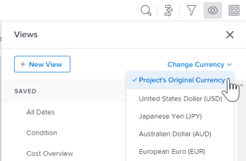

# 報表常見問題集

<!--

(NOTE: Alina: ***This is the ONE anchor article for all FAQs about Reporting. Add a new FAQ in the TOC at the top first, then add the answer as a section at the bottom.)

-->

以下是關於報告的常見問題。

## 存取需求

您必須具有下列存取權才能執行本文中的步驟：

<table style="table-layout:auto"> 
 <col> 
 </col> 
 <col> 
 </col> 
 <tbody> 
  <tr> 
   <td role="rowheader">Adobe Workfront計畫*</td> 
   <td> 
任何
 </td> 
  </tr> 
  <tr> 
   <td role="rowheader">Adobe Workfront授權*</td> 
   <td> 
計畫、工作
 </td> 
  </tr> 
  <tr> 
   <td role="rowheader">存取層級設定*</td> 
   <td> 
編輯報告、儀表板、行事曆的存取權
 
注意：如果您還是沒有存取權，請詢問您的Workfront管理員，他們是否在您的存取層級中設定其他限制。 如需有關Workfront管理員如何修改您的存取層級的資訊，請參閱 <a href="../../../administration-and-setup/add-users/configure-and-grant-access/create-modify-access-levels.md" class="MCXref xref">建立或修改自訂存取層級</a>.
 </td> 
  </tr> 
  <tr> 
   <td role="rowheader">物件許可權</td> 
   <td> 
管理報表的許可權
 
如需請求其他存取許可權的詳細資訊，請參閱 <a href="../../../workfront-basics/grant-and-request-access-to-objects/request-access.md" class="MCXref xref">要求物件的存取權 </a>.
 </td> 
  </tr> 
 </tbody> 
</table>

&#42;若要瞭解您擁有的計畫、授權型別或存取權，請聯絡您的Workfront管理員。

## 為什麼我針對時數差異的自訂計算沒有在欄中顯示正確結果？

在專案報告上，我有一個計算從計畫時數(4)減去實際時數(2)。 我得到的結果是120，而它應該是2。\
我的計算方式為：
<pre>valueexpression=SUB(workRequired，actualWorkRequired)</pre>

### 回答

在Workfront中使用時數的欄位會以分鐘為單位儲存。 在計算中使用欄位時，結果將以分鐘為單位。 若要以小時取得結果，您必須將計算結果除以60。

正確的計算方式為：

<pre>valueexpression=SUB(workRequired，actualWorkRequired)/60</pre>

## 為什麼報表中每個圖表元素的值沒有顯示在圖表上？

### 回答

如果報表圖表中有超過50個圖表元素，圖表不會顯示每個元素的值。

當圖表中有少於50個元素時，每個元素的值都會顯示在圖表中。 請考慮新增篩選器或修改報表中的群組，以限制您在圖表每個元素中顯示的專案數量。

## 為什麼我的報告傳回的結果太多，無法顯示圖表？

當我執行含有圖表的報表時，會看到錯誤訊息「哇……此報告傳回「大量」資料，導致圖表無法讀取。 請考慮新增篩選器或變更圖表中的分組來縮小結果範圍。」

### 回答

此錯誤表示您的圖表最多包含618個不同的結果，例如長條圖中有超過618個長條。 若要解決顯示問題，您需要修改目前的篩選和群組選取專案，以縮小結果範圍。

如需有關修改篩選器和群組的資訊，請參閱文章 [Adobe Workfront中的篩選器概觀](../../../reports-and-dashboards/reports/reporting-elements/filters-overview.md) 和 [Adobe Workfront中的群組概觀](../../../reports-and-dashboards/reports/reporting-elements/groupings-overview.md).

## 當我存取與同事相同的報表（或行事曆）時，為什麼我可以看到我的任務（或問題），而他們反而會看到他們的任務？

### 回答

報告或行事曆可能有萬用字元篩選變數，指向已登入的使用者。 在此情況下，報表會根據登入的使用者顯示資訊。 調整篩選器以移除指向登入使用者的萬用字元。\

如需使用者型萬用字元篩選器變數概述的完整清單，請參閱 [萬用字元篩選器變數概觀](../../../reports-and-dashboards/reports/reporting-elements/understand-wildcard-filter-variables.md).

## 為什麼我的報告中的資料不完整？

### 回答

在大多數情況下，如果您有存取許可權而無法看到系統中的專案，就會發生這種情況。 此外，您想要看到的專案不會與您共用。

報告的建立者可以編輯報告，以便透過系統管理員的存取許可權或任何有權檢視資料的「計畫」使用者來執行報告。

如需詳細資訊，請參閱 [執行並傳遞具有其他使用者存取許可權的報告](../../../reports-and-dashboards/reports/creating-and-managing-reports/run-deliver-report-access-rights-another-user.md).

## 我如何報告指派給我的任務（或問題），無論我是否為這些任務的所有者？

### 回答

若要檢視指派給您的所有任務或問題(無論您是否為所有者（或主要受指派人）)，請在任務或問題報告中使用下列篩選器：

1. 存取任務或問題報告。
1. 在 **篩選器** 標籤，按一下 **新增篩選器規則**.

1. 在 **開始輸入欄位名稱……** 欄位，開始輸入 **指派使用者名稱**，然後在其出現在清單中時選取它。

   >[!NOTE]
   >
   >請勿使用 **指派至名稱** 欄位，因為這只會篩選您為主要受指派人或擁有者的任務和問題。

1. 選取 **等於** 修飾元。
1. 開始輸入 *$$USER.ID* ，並從出現的下拉式清單中選取它。\
   這可確保您看到指派給登入使用者的所有任務和問題。 您可以使用特定使用者名稱來取代萬用字元。\
   

1. 按一下 **儲存+關閉**.

## 為什麼新增問題/新增任務連結沒有出現在專案的問題和任務清單底部？

### 回答

首先，確保您擁有正確的存取權和許可權，可將問題和任務新增至專案。 在此情況下，您應該會看到 **新增問題** 和 **新增任務** 位於底部的連結 **問題** 和 **任務** 清單。

不過，有些事項可能會阻止這些連結顯示：

* 如果您將快速篩選套用至這些清單，連結不會顯示。 移除快速篩選器，且連結應會顯示出來，這樣您才能將問題和任務新增至專案。\
  如需快速篩選的詳細資訊，請參閱 [開始使用Adobe Workfront中的清單](../../../workfront-basics/navigate-workfront/use-lists/view-items-in-a-list.md).

* 如果您擁有 **分組** 套用至這些清單時，連結不會顯示。 移除 **分組** 而且連結應該會顯示，這樣您就可以將問題和任務新增到專案。\
  如需有關建立群組的資訊，請參閱 [Adobe Workfront中的群組概觀](../../../reports-and-dashboards/reports/reporting-elements/groupings-overview.md).

* 如果您擁有 **檢視** 若套用至這些清單的貨幣已選取而不是專案的預設貨幣，則連結不會顯示。 變更 **檢視** 至 **專案原始貨幣** 而且連結應該會顯示，這樣您就可以將問題和任務新增到專案。\
  如需有關在檢視中變更貨幣的詳細資訊，請參閱 [建立具有唯一匯率的財務資料報表](../../../reports-and-dashboards/reports/creating-and-managing-reports/create-financial-data-reports-unique-exchange-rates.md).

## 我的報表或儀表板中的資訊會自動重新整理嗎？

### 回答

報表或儀表板中的資訊不會自動重新整理。

快取報表中的資訊可以手動重新整理。\
如需重新整理快取報表的詳細資訊，請參閱 [執行報告](../../../reports-and-dashboards/reports/creating-and-managing-reports/run-report.md).

可以在快取儀表板中手動重新整理資訊。\
如需重新整理快取儀表板的詳細資訊，請參閱區段 [顯示儀表板](../../../reports-and-dashboards/dashboards/understanding-dashboards/get-started-dashboards.md#running-dashboards) 在文章中 [開始使用儀表板](../../../reports-and-dashboards/dashboards/understanding-dashboards/get-started-dashboards.md).

## 我可以變更報表的擁有者嗎？

### 回答

您無法變更報表的擁有者。 但是，建立報表的使用者可允許其他使用者編輯報表。 您允許使用者編輯報表的方式取決於您所屬的使用者型別。

* 系統管理員可允許擁有計畫授權的使用者編輯報告，方法是設定報告列中的編輯選項以包含建立報告的存取權。\
  如需詳細資訊，請參閱 [授予對報告、儀表板和行事曆的存取權](../../../administration-and-setup/add-users/configure-and-grant-access/grant-access-reports-dashboards-calendars.md).

* 任何有權建立和共用報告的一般使用者都可以允許其他人編輯個別報告，方法是共用報告並授予其他使用者管理報告的許可權。\
  如需詳細資訊，請參閱 [在Adobe Workfront中共用報表](../../../reports-and-dashboards/reports/creating-and-managing-reports/share-report.md).

如果您有檢視或管理報告的許可權，也可以製作報告的副本，然後您預設會成為該報告的擁有者。 若要進一步瞭解複製報告，請參閱 [建立報告副本](../../../reports-and-dashboards/reports/creating-and-managing-reports/create-copy-report.md).

## 為何無法存取已停用使用者所擁有的報表？

### 回答

有時候，報表的擁有者也會是中指定的 **透過以下存取許可權運行此報告：** 欄位。 如果 **透過以下存取許可權運行此報告：** 使用者已停用，該報表不再顯示給已與他們共用報表的使用者。 發生此情況時，您可以離開 **透過以下存取許可權運行此報告：** 空白或在欄位中輸入作用中的使用者。

若要進一步瞭解 **透過以下存取許可權運行此報告：** 欄位，請參閱 [執行並傳遞具有其他使用者存取許可權的報告](../../../reports-and-dashboards/reports/creating-and-managing-reports/run-deliver-report-access-rights-another-user.md). 如需識別已停用使用者所擁有之所有報表的資訊，請參閱 [建立報告活動的報告](../../../reports-and-dashboards/reports/report-usage/create-report-reporting-activities.md).

## 如何存取包含已刪除使用者所擁有報表的儀表板？

### 回答

當您刪除使用者時，您仍可存取使用者建立的任何報告，但是，包含該報告的任何儀表板也會一併刪除。 這表示您無法再存取下列專案：

* 包含報表的控制面板
* 包含報表儀表板的自訂區段

若要進一步瞭解刪除使用者可能造成的後果，請參閱 [刪除使用者](../../../administration-and-setup/add-users/create-and-manage-users/delete-a-user.md).

如果您擁有報表的「檢視」存取權，可以執行下列動作：

1. 建立報表副本。\
   若要瞭解如何建立報告復本，請參閱 [建立報告副本](../../../reports-and-dashboards/reports/creating-and-managing-reports/create-copy-report.md).

1. 更新控制面板以包含複製的報告。\
   若要瞭解如何編輯儀表板，請參閱 [編輯儀表板](../../../reports-and-dashboards/dashboards/creating-and-managing-dashboards/edit-dashboard.md).
