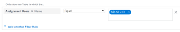

# 報表常見問題集

<!--

(NOTE: Alina: ***This is the ONE anchor article for all FAQs about Reporting. Add a new FAQ in the TOC at the top first, then add the answer as a section at the bottom.)

-->

以下是關於報表的常見問題。

## 存取需求

您必須具備下列存取權，才能執行本文中的步驟：

<table style="table-layout:auto"> 
 <col> 
 </col> 
 <col> 
 </col> 
 <tbody> 
  <tr> 
   <td role="rowheader">Adobe Workfront計畫*</td> 
   <td> 
任何
 </td> 
  </tr> 
  <tr> 
   <td role="rowheader">Adobe Workfront授權*</td> 
   <td> 
計畫，工作
 </td> 
  </tr> 
  <tr> 
   <td role="rowheader">訪問級別配置*</td> 
   <td> 
編輯對報表、控制面板、日曆的存取
 
注意：如果您仍無權存取，請洽詢您的Workfront管理員，他們是否在您的存取層級設定其他限制。 如需Workfront管理員如何修改您的存取層級的詳細資訊，請參閱 <a href="../../../administration-and-setup/add-users/configure-and-grant-access/create-modify-access-levels.md" class="MCXref xref">建立或修改自訂存取層級</a>.
 </td> 
  </tr> 
  <tr> 
   <td role="rowheader">物件權限</td> 
   <td> 
管理報表權限
 
有關請求其他訪問的資訊，請參閱 <a href="../../../workfront-basics/grant-and-request-access-to-objects/request-access.md" class="MCXref xref">請求對對象的訪問 </a>.
 </td> 
  </tr> 
 </tbody> 
</table>

&#42;若要了解您擁有的計畫、授權類型或存取權，請聯絡您的Workfront管理員。

## 為什麼我的小時差自訂計算在欄中沒有顯示正確的結果？

在專案報表中，我的計算方式是從計畫小時數(4)減去實際小時數(2)。 我得到的結果是120，而應該是2。\
我的計算是：
<pre>valueexpression=SUB(workRequired,actualWorkRequired)</pre>

### 回答

Workfront中使用小時的欄位會以分鐘為單位儲存。 在計算中使用欄位時，結果將以分鐘為單位。 若要在數小時內得到結果，必須將計算結果除以60。

正確的計算是：

<pre>valueexpression=SUB(workRequired,actualWorkRequired)/60</pre>

## 為什麼報表中我的每個圖表元素的值沒有顯示在圖表上？

### 回答

如果報表圖表中有50個以上的圖表元素，圖表中不會顯示每個元素的值。

當圖表中的元素少於50個時，圖表中會顯示每個元素的值。 請考慮新增篩選器或修改報表中的分組，以限製圖表每個元素中顯示的項目數量。

## 為什麼我的報表傳回太多結果而無法顯示圖表？

當我執行含有圖表的報表時，我看到錯誤訊息「哇……此報表傳回大量資料，使圖表無法讀取。 請考慮新增篩選器或變更圖表中的群組，以縮小結果範圍。」

### 回答

此錯誤表示您的圖表包含最多618個不重複的結果，例如長條圖中超過618個長條。 若要解決顯示問題，您需要修改目前的篩選條件和分組選取項目，以精簡結果。

如需修改篩選器和群組的相關資訊，請參閱文章 [Adobe Workfront中的篩選器概觀](../../../reports-and-dashboards/reports/reporting-elements/filters-overview.md) 和 [Adobe Workfront中的群組概觀](../../../reports-and-dashboards/reports/reporting-elements/groupings-overview.md).

## 當我存取與同事相同的報表（或日曆），而他們卻看到其工作時，為何會看到我的工作（或問題）?

### 回答

報表或日曆中可能有萬用字元篩選變數，指向已登入的使用者。 在此情況下，報表會根據登入的使用者顯示資訊。 調整篩選器以移除指向登入使用者的萬用字元。\

如需使用者型萬用字元篩選變數的完整清單，請參閱 [萬用字元篩選變數](../../../reports-and-dashboards/reports/reporting-elements/understand-wildcard-filter-variables.md).

## 為什麼我報表中的資料似乎不完整？

### 回答

如果您的存取權限有限，而無法在系統中看到項目，多數情況下都會發生此情況。 此外，您要查看的項目不會與您共用。

報表的建立者可以編輯報表，以使用系統管理員或任何有權查看資料的計畫使用者的存取權限執行報表。

如需詳細資訊，請參閱 [使用其他使用者的存取權限執行並傳送報表](../../../reports-and-dashboards/reports/creating-and-managing-reports/run-deliver-report-access-rights-another-user.md).

## 如何報告分配給我的任務（或問題），無論我是否是任務的所有者？

### 回答

要查看分配給您的所有任務或問題，無論您是所有者（還是主要受託人），請在任務或問題報告中使用以下篩選器：

1. 訪問任務或問題報告。
1. 在 **篩選器** 按一下 **新增篩選規則**.

1. 在 **開始鍵入欄位名稱……** 欄位，開始鍵入 **分配用戶名**，然後在清單中出現時選取它。

   >[!NOTE]
   >
   >請勿使用 **指派給名稱** 欄位，因為此欄位僅篩選您是主要受託人或擁有者的任務和問題。

1. 選取 **等於** 修飾詞。
1. 開始鍵入 *$$USER.ID* 在文本框中，從出現的下拉清單中選擇它。\
   這可確保您查看指派給登入使用者的所有工作和問題。 您可以用特定的用戶名替換通配符。\
   

1. 按一下 **儲存+關閉**.

## 為什麼「新增問題/新增任務」連結沒有出現在專案的「問題和任務」清單底部？

### 回答

首先，請確定您擁有將問題和任務新增至專案的正確存取權和權限。 在此情況下，您應會看到 **新增問題** 和 **添加任務** 連結 **問題** 和 **工作** 清單。

不過，有些項目可能會阻止這些連結顯示：

* 如果您將快速篩選套用至這些清單，則不會顯示連結。 移除快速篩選器，應會顯示連結，以便您將問題和工作新增至專案。\
   如需快速篩選的相關資訊，請參閱 [開始使用Adobe Workfront中的清單](../../../workfront-basics/navigate-workfront/use-lists/view-items-in-a-list.md).

* 如果您有 **分組** 若套用至這些清單，連結將不會顯示。 移除 **分組** 且應會顯示連結，以便您將問題和工作新增至專案。\
   如需建立群組的詳細資訊，請參閱 [Adobe Workfront中的群組概觀](../../../reports-and-dashboards/reports/reporting-elements/groupings-overview.md).

* 如果您有 **檢視** 若套用至已選取項目預設貨幣以外的貨幣清單，則不會顯示連結。 變更 **檢視** to **項目的原始貨幣** 且應會顯示連結，以便您將問題和工作新增至專案。\
   如需在檢視中變更貨幣的詳細資訊，請參閱 [使用獨特的匯率建立財務資料報告](../../../reports-and-dashboards/reports/creating-and-managing-reports/create-financial-data-reports-unique-exchange-rates.md).

## 我的報表或控制面板中的資訊會自動重新整理嗎？

### 回答

報表或控制面板中的資訊不會自動重新整理。

可在快取報告中手動重新整理資訊。\
如需重新整理快取報表的詳細資訊，請參閱 [執行報表](../../../reports-and-dashboards/reports/creating-and-managing-reports/run-report.md).

可在快取控制面板中手動重新整理資訊。\
如需重新整理快取控制面板的詳細資訊，請參閱區段 [顯示控制面板](../../../reports-and-dashboards/dashboards/understanding-dashboards/get-started-dashboards.md#running-dashboards) 在文章中 [控制面板快速入門](../../../reports-and-dashboards/dashboards/understanding-dashboards/get-started-dashboards.md).

## 我可以變更報表的擁有者嗎？

### 回答

您無法變更報表的擁有者。 不過，建立報表的使用者可允許其他使用者編輯報表。 允許使用者編輯報表的方式取決於您的使用者類型。

* 系統管理員可以配置「報表」行中的「編輯」選項，以包括「建立報表」的存取權，讓具有「計畫」許可的使用者能夠編輯報表。\
   如需詳細資訊，請參閱 [授予對報表、控制面板和日曆的存取權](../../../administration-and-setup/add-users/configure-and-grant-access/grant-access-reports-dashboards-calendars.md).

* 任何有權建立和共用報表的一般使用者，都可透過共用個別報表並給予其他使用者管理權限，來允許其他人編輯個別報表。\
   如需詳細資訊，請參閱 [在Adobe Workfront中共用報表](../../../reports-and-dashboards/reports/creating-and-managing-reports/share-report.md).

如果您有檢視或管理報表的權限，您也可以製作報表副本，接著您就會預設為報表的擁有者。 若要進一步了解複製報表，請參閱 [建立報表副本](../../../reports-and-dashboards/reports/creating-and-managing-reports/create-copy-report.md).

## 為何無法存取已停用使用者擁有的報表？

### 回答

有時，報表的擁有者也是 **以下列權限運行此報告：** 欄位。 若 **以下列權限運行此報告：** 使用者已停用，則與他們共用報表的使用者將不再顯示報表。 發生此情況時，您可以將 **以下列權限運行此報表：** 空白或在欄位中輸入作用中使用者。

若要進一步了解 **以下列權限運行此報表：** 欄位，請參閱 [使用其他使用者的存取權限執行並傳送報表](../../../reports-and-dashboards/reports/creating-and-managing-reports/run-deliver-report-access-rights-another-user.md). 如需識別已停用使用者擁有之所有報表的相關資訊，請參閱 [建立報告活動的報告](../../../reports-and-dashboards/reports/report-usage/create-report-reporting-activities.md).

## 如何存取包含已刪除使用者所擁有報表的控制面板？

### 回答

刪除使用者後，您仍可存取其建立的任何報表，但是，包含報表的任何控制面板也會一併刪除。 這表示您無法再存取下列項目：

* 包含報表的控制面板
* 包含報表控制面板的自訂區段

若要進一步了解刪除使用者的可能性，請參閱 [刪除使用者](../../../administration-and-setup/add-users/create-and-manage-users/delete-a-user.md).

如果您有報表的「檢視」存取權，您可以執行下列動作：

1. 建立報表副本。\
   若要了解如何建立報表副本，請參閱 [建立報表副本](../../../reports-and-dashboards/reports/creating-and-managing-reports/create-copy-report.md).

1. 更新控制面板以包含複製的報表。\
   若要了解如何編輯控制面板，請參閱 [編輯控制面板](../../../reports-and-dashboards/dashboards/creating-and-managing-dashboards/edit-dashboard.md).
