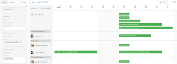

# 不再使用Adobe Workfront中的資源排程工具

>[!IMPORTANT]
>  
>自2023年1月的23.1版開始，本文所述的排程功能已遭取代，並已從Adobe Workfront中移除。   
>  
>  2023年初，23.1版發行後不久，也將移除本文。 此時，建議您據以更新任何書籤。 
> 
> 您現在可以使用工作負載平衡器來調度資源的工作。 
>  
> 有關使用工作負載平衡器調度資源的資訊，請參見一節 [工作負載平衡器](../../resource-mgmt/workload-balancer/workload-balancer.md). 

<!--
We are currently in the process of removing all Scheduling tools from Adobe Workfront and replacing them with the Workload Balancer.

>[!IMPORTANT]
>
>We are no longer implementing new feature functionality for the current Scheduling solution and we no longer consider nor prioritize defects for a fix in this area of Adobe Workfront.

This article describes the timeline for this deprecation and it compares the functionality of the Scheduling tools and that of the Workload Balancer to indicate which Scheduling capabilities are already supported in the Workload Balancer. 

We have been announcing a more exact timeline through the Announcement Center at key milestones during the deprecation process and this article has been updated as this process continues.

>[!NOTE]
>
>The changes described in this article do not affect any other resource management tools. For example, they do not affect the [!UICONTROL Resource Planner] or the [!UICONTROL Utilization] report.
-->

## 您應如何準備

有關如何準備在調度和工作負載平衡器之間進行過渡的詳細資訊，請參見 [從資源調度遷移到工作負載平衡器](../../resource-mgmt/resource-mgmt-overview/migrate-resource-scheduling-to-workload-balancer.md).

如果您當前使用「調度工具」，建議您停止這些工具，然後開始使用工作負載平衡器。

以前在「調度」區域中可用的幾乎所有功能現在都可在工作負載平衡器中使用。 如需詳細資訊，請參閱 [功能可用性](#feature-availability) 這篇文章。 您可以繼續在工作負載平衡器中排程資源，以便專門工作。

## 不傳輸到工作負載平衡器的資訊

下列資訊將不會從調度工具傳輸到工作負載平衡器：

* **用戶的每日分配**:您不應同時使用調度和工作負載平衡器來調整相同的用戶分配。 如果您在調度工具中管理了用戶分配，則調整後的每日分配不會轉移到工作負載平衡器。 同樣，如果已在工作負載平衡器中調整了用戶分配，則這些分配不會傳輸到調度工具。 我們強烈建議您確保每日分配在工作負載平衡器中準確，以便為此轉變做好準備。 如需詳細資訊，請參閱 [在工作負載平衡器中管理用戶分配](../workload-balancer/manage-user-allocations-workload-balancer.md).
* **篩選器**:如果已在「調度」區域中保存了篩選器，則這些篩選器不會傳輸到工作負載平衡器。 必須在工作負載平衡器中重新建立篩選器。 如需詳細資訊，請參閱 [篩選工作負載平衡器中的資訊](../workload-balancer/filter-information-workload-balancer.md).

## 淘汰時間表重點

>[!IMPORTANT]
>
>請參考本文，了解淘汰排程工具的最新時間表。 本文和公告中心報文將介紹對此時間表的任何更新。

以下是資源調度工具的淘汰過程的時間表：

* [2020.4版（2020年11月）](#2020-4-release-november-2020)
* [2021.4版（2021年10月）](#2021-4-release-october-2021)
* [2022.4 - 2023.1版（2022年10月 — 2023年1月）](#2022-4-2023-1-releases)

### 2020.4版（2020年11月） {#2020-4-release-november-2020}

* 排程解決方案不再實作新功能
* 只有高嚴重性和嚴重性缺陷才會優先進行修復
* Workfront新增了新的工作負載平衡器功能

### 2021.4版（2021年10月） {#2021-4-release-october-2021}

* 對於Workfront的任何首次用戶，工作負載平衡器都設定為預設
* 可共用的增強篩選器，並包含其他欄位

### 2022.4 - 2023.1版（2022年10月 — 2023年1月） {#2022-4-2023-1-releases}

* 在2022.4或2023.1版發行期間和之後，不會為修復設定優先順序
* 所有排程區域都會從預覽環境中移除(**2022年10月20日**)
* 所有排程區域都會從生產環境中移除(**2023年1月**)
* 工作負載平衡器是Workfront中唯一可用的資源調度工具(在 **2023年1月**)

## 功能可用性 {#feature-availability}

除非另有指定，否則所有資源調度功能已經或將在工作負載平衡器中可用。 有關工作負載平衡器的資訊，請參見 [工作負載平衡器概述](../../resource-mgmt/workload-balancer/overview-workload-balancer.md).

除了現有功能外，工作負載平衡器還具有或將具有資源調度工具中不存在的新功能，如下表所示：

<table style="table-layout:auto"> 
 <col> 
 <col> 
 <col> 
 <col> 
 <col> 
 <tbody> 
  <tr> 
   <td rowspan="2"><b>功能</b> </td> 
   <td rowspan="2"> <b>資源調度工具功能可用性</b></td> 
   <td colspan="3"><b>工作負載平衡器功能可用性</b></td> 
  </tr> 
  <tr> 
   <td><b>現已推出</b></td> 
   <td><b>即將推出</b></td> 
   <td><b>未計畫</b></td> 
  </tr> 
  <tr> 
   <td> 
從資源區訪問工具
 </td> 
   <td>✓</td> 
   <td>✓</td> 
   <td> </td> 
   <td> </td> 
  </tr> 
  <tr> 
   <td>為未分配和已分配的工作分區</td> 
   <td>✓</td> 
   <td>✓</td> 
   <td> </td> 
   <td> </td> 
  </tr> 
  <tr> 
   <td>為未分配和已分配的工作應用和建立篩選器</td> 
   <td>✓</td> 
   <td>✓</td> 
   <td> </td> 
   <td> </td> 
  </tr> 
  <tr> 
   <td>直接從工具存取工作項目</td> 
   <td>✓</td> 
   <td>✓</td> 
   <td> </td> 
   <td> </td> 
  </tr> 
  <tr> 
   <td>手動指派或取消指派工作和問題</td> 
   <td>✓</td> 
   <td>✓</td> 
   <td> </td> 
   <td> </td> 
  </tr> 
  <tr> 
   <td>調整個別分配</td> 
   <td>✓</td> 
   <td>✓</td> 
   <td> </td> 
   <td> </td> 
  </tr> 
  <tr> 
   <td>包括發行時間</td> 
   <td>✓</td> 
   <td>✓</td> 
   <td> </td> 
   <td> </td> 
  </tr> 
  <tr> 
   <td>顯示預計日期 </td> 
   <td>✓</td> 
   <td>✓</td> 
   <td> </td> 
   <td> </td> 
  </tr> 
  <tr> 
   <td>顯示已完成的工作</td> 
   <td>✓</td> 
   <td>✓</td> 
   <td> </td> 
   <td> </td> 
  </tr> 
  <tr> 
   <td>顯示用戶休假時間、週末和計畫例外</td> 
   <td>✓</td> 
   <td>✓</td> 
   <td> </td> 
   <td> </td> 
  </tr> 
  <tr data-mc-conditions=""> 
   <td>根據角色快速指派使用者* </td> 
   <td>✓</td> 
   <td>✓ </td> 
   <td> </td> 
   <td> </td> 
  </tr> 
  <tr data-mc-conditions=""> 
   <td>快速更換用戶* </td> 
   <td>✓</td> 
   <td>✓ </td> 
   <td> </td> 
   <td> </td> 
  </tr> 
  <tr data-mc-conditions=""> 
   <td>快速取消指派使用者* </td> 
   <td>✓</td> 
   <td>✓ </td> 
   <td> </td> 
   <td> </td> 
  </tr> 
  <tr> 
   <td>團隊的存取工具 </td> 
   <td>✓</td> 
   <td>✓ </td> 
   <td> </td> 
   <td> </td> 
  </tr> 
  <tr> 
   <td>從專案存取工具 </td> 
   <td>✓</td> 
   <td>✓ </td> 
   <td> </td> 
   <td> </td> 
  </tr> 
  <tr>
   <td>工作許可用戶在從項目訪問工作負載平衡器時可以調整用戶分配 </td> 
   <td>✓</td> 
   <td>✓</td> 
   <td></td> 
   <td></td> 
  </tr> 
  <tr> 
   <td>在「未分配的工作」區域中顯示問題</td> 
   <td>✓</td> 
   <td>✓</td> 
   <td></td> 
   <td></td> 
  </tr> 
  <tr> 
   <td>拖放以指派和取消指派工作和問題* </td> 
   <td>✓</td> 
   <td>✓ </td> 
   <td> </td> 
   <td> </td> 
  </tr> 
  <tr> 
   <td>可顯示給所有計畫用戶，而不指定項目上的資源管理器。</td> 
   <td> </td> 
   <td>✓</td> 
   <td> </td> 
   <td> </td> 
  </tr> 
  <tr> 
   <td>按項目分組資訊</td> 
   <td> </td> 
   <td>✓</td> 
   <td> </td> 
   <td> </td> 
  </tr> 
  <tr> 
   <td>與無權訪問資源區的用戶共用工作負載平衡器</td> 
   <td> </td> 
   <td>✓</td> 
   <td> </td> 
   <td> </td> 
  </tr> 
  <tr> 
   <td>按周顯示和調整分配</td> 
   <td> </td> 
   <td>✓</td> 
   <td> </td> 
   <td> </td> 
  </tr> 
  <tr> 
   <td>直接從工具存取使用者</td> 
   <td> </td> 
   <td>✓</td> 
   <td> </td> 
   <td> </td> 
  </tr> 
  <tr data-mc-conditions=""> 
   <td>使用「摘要」面板，無需離開瀏覽即可存取有關工作項目的詳細資訊*</td> 
   <td> </td> 
   <td>✓</td> 
   <td> </td> 
   <td> </td> 
  </tr> 
  <tr> 
   <td>以百分比值顯示和調整分配 </td> 
   <td> </td> 
   <td>✓</td> 
   <td> </td> 
   <td> </td> 
  </tr> 
  <tr> 
   <td>顯示可用時間和已分配時間之間的差異</td> 
   <td> </td> 
   <td>✓</td> 
   <td> </td> 
   <td> </td> 
  </tr> 
  <tr> 
   <td>在圖表中顯示用戶可用性</td> 
   <td> </td> 
   <td>✓</td> 
   <td> </td> 
   <td> </td> 
  </tr> 
  <tr> 
   <td>按項目狀態顯示的工作項和項目顏色代碼</td> 
   <td> </td> 
   <td>✓</td> 
   <td> </td> 
   <td> </td> 
  </tr> 
  <tr> 
   <td>在調整用戶分配時自動更新計畫小時數（對於具有簡單持續時間類型的任務）</td> 
   <td> </td> 
   <td>✓</td> 
   <td> </td> 
   <td> </td> 
  </tr> 
  <tr> 
   <td>根據用戶的分配模式、現有角色或團隊分配建議分配 </td> 
   <td> </td> 
   <td>✓ </td> 
   <td> </td> 
   <td> </td> 
  </tr> 
  <tr> 
   <td>可共用的增強篩選器，並包含其他欄位</td> 
   <td> </td> 
   <td>✓</td> 
   <td> </td> 
   <td> </td> 
  </tr> 
  <tr> 
   <td>進行高級分配 </td> 
   <td> </td> 
   <td>✓ </td> 
   <td> </td> 
   <td> </td> 
  </tr>

<tr> 
   <td>按項目和項目狀態顯示工作項的顏色代碼 </td> 
   <td> </td> 
   <td>✓ </td> 
   <td> </td> 
   <td> </td>

<tr> 
   <td>將用戶添加到項目組(重新定位到 <b>人員</b> 頁簽) </td> 
   <td>✓</td> 
   <td>✓</td> 
   <td></td> 
   <td> </td>

</tr>
   <tr> 
   <td>自動指派工作和問題</td> 
   <td>✓</td> 
   <td> </td> 
   <td> </td> 
   <td>✓</td> 
  </tr>

</tbody> 
</table>

*這些功能僅適用於新的Adobe Workfront體驗。
