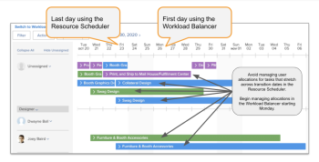

# 從資源遷移 [!UICONTROL 排程] 到 [!UICONTROL 工作負載平衡器]

本頁強調顯示的資訊指的是尚未普遍提供的功能。 它僅在預覽環境中可用。

<!-- drafted for res scheduling deprecation blurb for PREVIEW release - Oct 2022 - CHANGE THIS BLURB TO SOMETHING ELSE AT PRODUCTION:-->

>[!CAUTION]
>  
>  
> 排程區域已從預覽環境中移除，並將從 **2023年1月**. \
>  在2023年1月之後，必須在工作負載平衡器中安排資源。 
>  
> 有關使用工作負載平衡器調度資源的資訊，請參見一節 [工作負載平衡器](../../resource-mgmt/workload-balancer/workload-balancer.md).

只有在您已管理資源中的資源排程時，本文中的資訊才適用於您 [!UICONTROL 排程] Adobe Workfront地區。 Workfront開始淘汰 [!UICONTROL 排程] 工具，並已取代為 [!UICONTROL 工作負載平衡器].

有關的 [!UICONTROL 資源計畫] 工具和時間表，以 [!UICONTROL 工作負載平衡器]，請參閱 [不再使用Adobe Workfront中的資源排程工具](../../resource-mgmt/resource-mgmt-overview/deprecate-resource-scheduling.md).

我們希望您能協助您設計移轉計畫，盡可能減少工作中斷。 下列步驟將協助您接受訓練，並決定切換至的最佳時機 [!UICONTROL 工作負載平衡器].

## 查找資源調度工具

您和您的團隊可能會使用部分資源 [!UICONTROL 排程] 工具(位於Workfront的下列區域):

* 此 [!UICONTROL 排程] 區段 [!UICONTROL 資源] 區域
* 此 [!UICONTROL 排程] 項目部分
* 此 [!UICONTROL 排程] 小組

經過此淘汰後， [!UICONTROL 工作負載平衡器] 取代全部  [!UICONTROL 資源計畫] 工具。

## 步驟1:讓您的團隊接受訓練

參加培訓 [新Adobe Workfront體驗的資源管理計畫](https://one.workfront.com/s/resource-management-program-nwe) （75分鐘）Workfront一號。

如果您登錄或訪問本課程時遇到困難，請聯繫客戶支援。 如需詳細資訊，請參閱 [聯絡客戶支援](../../workfront-basics/tips-tricks-and-troubleshooting/contact-customer-support.md).

## 步驟2:決定移轉的最佳時機 {#step-2-determine-the-best-time-to-migrate}

請依照下列步驟，判斷何時適合您進行移轉：

1. 確定資源中的哪些功能 [!UICONTROL 排程] 您的團隊最常使用的工具，並確定這些功能可在 [!UICONTROL 工作負載平衡器]. 如需目前可用功能的相關資訊，請參閱 [!UICONTROL 工作負載平衡器]，請參閱文章的「功能可用性」一節 [不再使用Adobe Workfront中的資源排程工具](../../resource-mgmt/resource-mgmt-overview/deprecate-resource-scheduling.md).

   >[!IMPORTANT]
   >
   >現在，幾乎所有調度工具的功能都在工作負載平衡器中。

1. 確定您的團隊是否管理分配的用戶分配。 調整或修改用戶分配意味著在工作項的整個持續時間內修改每個用戶的每天計畫小時數。

   在「調度工具」中編輯的分配不會傳輸到工作負載平衡器。 預設情況下，系統會在項目的整個持續時間內平均分配工作項的總計畫小時數。

   您必須在工作負載平衡器中手動管理分配，以確保分配與調度工具中的分配匹配。 如需詳細資訊，請參閱 [在工作負載平衡器中管理用戶分配](../workload-balancer/manage-user-allocations-workload-balancer.md).

1. 調度區域中任何保存的篩選器都不會自動傳輸到工作負載平衡器。 請花時間在工作負載平衡器中建立可能需要的任何篩選器。 有關在工作負載平衡器中建立篩選器的資訊，請參見 [篩選工作負載平衡器中的資訊](../workload-balancer/filter-information-workload-balancer.md).

<!--
1. Using the information gathered from Steps 1 and Step 2, decide which version of Step 3 you should continue with based on the needs of your organization.
-->

## 步驟3:移轉至 [!UICONTROL 工作負載平衡器]{#step-3-migrate-to-the-workload-balancer}

根據您在步驟2中的發現，我們已為此步驟識別了下列版本：

* [步驟3a:您或您的團隊會使用 [!UICONTROL 排程] 工具，但不修改用戶配置](#step-3a-you-or-your-teams-use-the-scheudling-tools-but-do-not-modify-user-allocation)
* [步驟3b:您或您的團隊會在 [!UICONTROL 排程] 工具](#step-3b-you-or-your-teams-manage-user-allocations-in-the-scheduling-tools)

### 步驟3a:您或您的團隊會使用 [!UICONTROL 排程] 工具，但不修改用戶配置

如果您或您的團隊未修改工作分配上的每日小時分配，則可以將計畫資源切換到 [!UICONTROL 工作負載平衡器].

執行下列動作：

* 選擇轉變日期。

   >[!TIP]
   >
   >在轉換日期之前，請為您的團隊提供一些時間來完成有關使用工作負載平衡器的培訓。 有關培訓的資訊，請參閱 [從資源調度遷移到工作負載平衡器](#migrate-from-resource-uicontrol-scheduling-to-the-uicontrol-workload-balancer) 這篇文章。

* 請依照下列准則協助您的團隊：

   * 鼓勵您的團隊造訪 [概觀 [!UICONTROL 工作負載平衡器]](../../resource-mgmt/workload-balancer/overview-workload-balancer.md) 頁面和從該頁面連結的所有頁面，以深入了解 [!UICONTROL 工作負載平衡器] 工作。
   * 在轉換前的一週內為您的團隊舉辦常見問題集會議，以回答問題、切換，然後再舉行其他常見問題集會議以回答後續問題。
   * 使用頂端工具列的「意見回饋」按鈕，將意見提交至Workfront。 我們的產品開發人員總是有興趣了解您的使用案例，以了解如何 [!UICONTROL 工作負載平衡器] 提供更多價值。

### 步驟3b:您或您的團隊會在 [!UICONTROL 排程] 工具

如果您的工作流程符合此案例，您在轉換計畫中應更具策略性。 顯示於 [!UICONTROL 排程] 工具儲存在與顯示在 [!UICONTROL 工作負載平衡器]. 這表示您在資源中進行的每日分配的調整 [!UICONTROL 排程] 工具不會轉移至 [!UICONTROL 工作負載平衡器].

>[!CAUTION]
>
>您必須等到 **2023年1月** 以確保從「計畫」區域分配的用戶與生產環境中的工作負載平衡器中的用戶分配匹配。 屆時，我們會從生產環境中移除排程工具。 必須手動調整工作負載平衡器中的分配，以匹配調度工具中的分配。 排程工具已從預覽環境中移除。

在轉換至 [!UICONTROL 工作負載平衡器] 當您使用 [!UICONTROL 排程] 功能：

* 暫停管理 [!UICONTROL 排程] 在資源管理員進行切換時使用工具。 要執行此操作：

   * 了解當前項目中任務的平均持續時間，並在確定需要保留管理用戶分配的時間時考慮這一點。

      >[!TIP]
      >
      >您只需查看當前或規劃項目，即您的團隊正在為這些項目主動進行分配和管理日常分配的項目。

   * 建立任務報告，在視圖中添加任務持續時間欄位，並按項目名稱對其進行分組。 依平均值匯總檢視中的持續時間欄，然後儲存您的報表。

      如需建立報表的相關資訊，請參閱 [建立自訂報表](../../reports-and-dashboards/reports/creating-and-managing-reports/create-custom-report.md) .

   * 分析任務報告。 例如，如果您的平均任務持續時間為3天，則一週的轉變可能是最佳選擇。 讓團隊停止管理一週的使用者分配。 在下一週，將團隊轉換至 [!UICONTROL 工作負載平衡器] 並開始管理下週的用戶分配。
   >[!NOTE]
   >
   >如果平均任務持續時間超過刪除計畫工具之前剩餘的時間，則此建議可能無效。

   

   >[!TIP]
   >
   >在過渡期間，您可以繼續進行任務和問題分配。 已完成的分配將反映在資源調度器和 [!UICONTROL 工作負載平衡器].

* 如果您是較大型的組織，且有團隊管理數百個專案的資源，您可以考慮從 [!UICONTROL 排程] 工具 [!UICONTROL 工作負載平衡器] 一次一個產品組合。 在 [!UICONTROL 工作負載平衡器] 一次查看一個特定的產品組合。

* 允許您的資源經理進行組合：有一個人員審核分配  [!UICONTROL 資源計畫] 工具，並對工具進行適當調整 [!UICONTROL 工作負載平衡器]. 一旦兩個調解團隊將這兩項工具都整合後，請他們將工作流程移至 [!UICONTROL 工作負載平衡器].

## 需要更多協助

如果您在此移轉作業中需要其他資訊，請聯絡自訂支援。 如需聯絡支援的相關資訊，請參閱 [聯絡客戶支援](../../workfront-basics/tips-tricks-and-troubleshooting/contact-customer-support.md).
