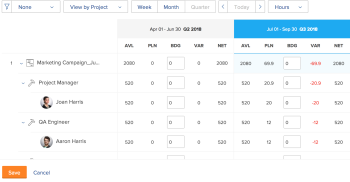

# 使用「項目」和「職責」視圖在資源計畫器中使用預算資源

<!--
<p data-mc-conditions="QuicksilverOrClassic.Draft mode">(NOTE: broken off of another larger article (Planning in the RP); reformat, restructure, relink)</p>
-->

資源計畫員的主要功能是為必須在項目上完成的工作預算資源。

>[!IMPORTANT]
>
>只有在套用 **依專案檢視** 或 **按角色查看** 視圖。

在開始對資源計畫員中的資訊進行預算之前，請參閱以下物料：

* [資源計畫員概覽](../../resource-mgmt/resource-planning/get-started-resource-planner.md)
* [獲得Adobe Workfront預算資源所需資源](../../resource-mgmt/resource-planning/access-needed-to-budget-resources.md)
* [資源計畫員的「項目」和「職責」視圖中的小時數、FTE和成本資訊概覽](../../resource-mgmt/resource-planning/overview-of-planner-hour-fte-cost-information-in-role-project-views.md)

## 存取需求

您必須具備下列存取權，才能執行本文中的步驟：

<table style="table-layout:auto"> 
 <col> 
 <col> 
 <tbody> 
  <tr> 
   <td role="rowheader">Adobe Workfront計畫*</td> 
   <td> <p>Pro及更高版本</p> </td> 
  </tr> 
  <tr> 
   <td role="rowheader">Adobe Workfront授權*</td> 
   <td> <p>計劃 </p> </td> 
  </tr> 
  <tr> 
   <td role="rowheader">訪問級別配置*</td> 
   <td> <p>編輯對資源管理的訪問，包括對資源計畫員中「編輯優先順序」和「預算小時數」的訪問</p> <p>按成本編輯對預算資源的財務資料的訪問</p> <p>編輯專案和使用者的存取權</p> <p><b>附註</b>

如果您仍無權存取，請洽詢您的Workfront管理員，他們是否在您的存取層級設定其他限制。 如需Workfront管理員如何變更您的存取層級的詳細資訊，請參閱 <a href="../../administration-and-setup/add-users/configure-and-grant-access/create-modify-access-levels.md" class="MCXref xref">建立或修改自訂存取層級</a>.</p> </td>
</tr> 
  <tr> 
   <td role="rowheader">物件權限</td> 
   <td> <p>管理您要預算的專案的權限</p> <p>有關請求其他訪問的資訊，請參閱 <a href="../../workfront-basics/grant-and-request-access-to-objects/request-access.md" class="MCXref xref">請求對對象的訪問 </a>.</p> </td> 
  </tr> 
 </tbody> 
</table>

&#42;若要了解您擁有的計畫、授權類型或存取權，請聯絡您的Workfront管理員。

## 資源計畫員中的預算資源

* [「項目」視圖中的預算資源](#budget-resources-in-the-project-view)
* [「角色」視圖中的預算資源](#budget-resources-in-the-role-view)
* [大量預算資源](#budget-resources-in-bulk)

### 「項目」視圖中的預算資源 {#budget-resources-in-the-project-view}

<!--
<p data-mc-conditions="QuicksilverOrClassic.Draft mode">(NOTE: this section is linked to the Budgeting Project Resources in the Business Case article)</p>
-->

1. 按一下 **主菜單** 圖示  在Adobe Workfront的右上角。

1. 按一下 **資源**.
1. 此 **計畫員** 預設顯示。
1. （條件性）選取 **依專案檢視** 檢視。
1. 展開專案和工作角色，以管理專案、工作角色或使用者的分配。
1. 要為用戶分配預算，請執行以下操作之一：

   * 在 **BDG** 欄中，手動指定用戶的預算小時數、FTE或成本。

   * 按一下 **更多** 功能表，然後按一下 **將用戶的計畫小時數設定為預算值**.\
      每個使用者的預算小時數使用下列公式計算：

      ```
      User Budgeted Hours = User Planned Hours
      ```

1. 要為任務角色分配預算，請執行以下操作之一：

   * 在 **BDG** 欄中，手動指定任務角色的預算小時數、FTE或成本。

      >[!NOTE]
      >
      >角色預算小時數將添加到項目預算小時數中。

   * （條件性）如果您已為使用者編列預算小時數，請按一下 **更多** 功能表，然後按一下 **角色的使用者預算總時數**.\
      每個角色的預算小時數使用以下公式計算：

      ```
      Role Budgeted Hours = SUM(User Budgeted Hours)
      ```

   * 按一下 **更多** ，然後按一下 **將角色的計畫小時數設定為預算**.\
      每個角色的預算小時數使用以下公式計算：\
      *

      ```
      Role Budgeted Hours = Role Planned Hours
      ```

      >[!NOTE]
      >   
      >* 角色預算小時數將添加到項目預算小時數中。
      >* 可為主要角色和其他（或次要）角色編入預算。
      >* 此 **FTE可用性百分比** 對於用戶的角色，「可用小時數」的值必須不同於0%，才能在任務角色的「資源計畫器」中顯示值。 如果使用者與角色相關聯，且角色為0% **FTE可用性百分比**，該工作角色的「可用時數」值為零。 在此情況下，角色可能會顯示為負面 **淨值**.\
         >如需 **FTE可用性百分比** 有關職務角色，請參閱文章 [編輯使用者的設定檔](../../administration-and-setup/add-users/create-and-manage-users/edit-a-users-profile.md).


   * 在 **BDG** 欄，手動指定項目的預算小時數、FTE或成本。 這會將項目預算小時數分配給項目下的每個角色。 存在下列情況：

      * 如果您指定的「項目預算小時數」等於「項目計畫小時數」，則「角色預算小時數」與「角色計畫小時數」匹配。
      * 如果指定的「項目預算小時數」不等於「項目計畫小時數」，則將根據每個職責所需的「計畫小時數」百分比來分配「職責預算小時數」。\
         例如，如果項目有20個計畫小時，並且分配給兩個職務（顧問需要12個計畫小時，工程師需要8個計畫小時），而您為項目預算了30個小時，則這些小時分配如下：顧問角色接收18個預算小時，工程師角色接收12個預算小時。

1. 要為項目分配預算，請執行以下操作之一：

   * 依照步驟7所述，對專案下的角色進行預算。\
      項目預算小時數按以下公式計算：

      ```
      Project Budgeted Hours = SUM(Role Budgeted Hours)
      ```

   * 在 **BDG** 欄，手動指定項目的預算小時數、FTE或成本。\
      如步驟7所述，這會更新角色預算小時數。\
      

1. 按一下&#x200B;**儲存**。\
   在資源計畫器中預算資源後，資源的預算小時數以及與資源關聯的任何成本將列在每個項目的「業務案例」中。\
   有關了解業務案例的「資源預算編製」區域的詳細資訊，請參閱文章中的「資源預算編製」一節 [業務案例領域概述](../../manage-work/projects/define-a-business-case/areas-of-business-case.md).

1. （可選）選擇「用戶」視圖，以注意每個用戶在「可用」和「計畫小時數」之間的任何用戶過度分配或利用率不足。 「用戶」視圖中不顯示預算的小時數。

   如需Workfront如何計算使用者可用性的詳細資訊，請參閱 [配置資源管理首選項](../../administration-and-setup/set-up-workfront/configure-system-defaults/configure-resource-mgmt-preferences.md).

### 「角色」視圖中的預算資源 {#budget-resources-in-the-role-view}

<!--
<div data-mc-conditions="QuicksilverOrClassic.Draft mode">
<p>(NOTE: THIS IS WRONG - I LOGGED A BUG TO FIX THIS LINK - IT SHOULD GO TO"ACCESS NEEDED TO BUDGET IN THE RP":</p>
<p>Planning in the resource planner has links to the UI - ensure Flare notes are there for this: https://workfront.zendesk.com/hc/en-us/articles/115006356928 - the "Budgeting resources in the role view" is linked to this tooltip: ***This is linked to the product in the RP when the user does not have Manage rights on one of the projects under the role. This tool tip is linked here: "You don't have Manage permissions for all projects. Budget hours by individual project instead. Learn more...")</p>
</div>
-->

您必須具有對項目的「編輯」訪問權限和「財務資料」和「管理財務」權限，才能在資源計畫器中預算資源。 如果您只有「查看」權限才能訪問一個職務角色下列的至少一個項目，則無法在「職責」視圖中為該職責分配預算。 您仍可以對擁有「管理」權限的專案進行預算分配。

有關預算資源所需的訪問權限的資訊，請參閱文章 [獲得Adobe Workfront預算資源所需資源](../../resource-mgmt/resource-planning/access-needed-to-budget-resources.md).

要在「職責」視圖中預算分配，****請執行以下操作：

1. 按一下 **主菜單** 圖示  在Adobe Workfront的右上角。

1. 按一下 **資源**.
1. 此 **計畫員** 預設顯示。
1. （條件性）選取 **按角色查看** 檢視。
1. 展開作業角色和項目以管理項目、作業角色或用戶的分配。
1. 要為用戶分配預算，請執行以下操作之一：

   * 在 **BDG** 欄中，手動指定用戶的預算小時數、FTE或成本。
   * 按一下 **更多** ，然後按一下 **將用戶的計畫小時數設定為預算值**.\
      每個使用者的預算小時數使用下列公式計算：

      ```
      User Budgeted Hours = User Planned Hours
      ```

1. 要為任務角色分配預算，請執行以下操作之一：

   * 在 **BDG** 欄，手動指定任務角色的預算小時數、FTE或成本。\
      這會將職責預算小時數分配給您有權管理的項目的項目預算小時數。

   * 按一下 **更多** 功能表，然後按一下**「將專案的計畫小時數設為預算」。**職責預算小時數使用以下公式計算：\
      *

      ```
      Role Budgeted Hours = SUM(Project Budgeted Hours)
      ```

      *項目預算小時數使用以下公式計算：

      ```
      Project Budgeted Hours = Project Planned Hours
      ```

   * 在 **BDG** 欄中，手動指定任務角色下列項目的預算小時數、FTE或成本。\
      這會將項目預算小時數添加到角色中。
   >[!NOTE]
   >
   >可為主要角色和其他（或次要）角色編入預算。 此 **FTE可用性百分比** 對於用戶的角色，「可用小時數」的值必須不同於0%，才能在任務角色的「資源計畫器」中顯示值。 如果使用者與角色相關聯，且角色為0% **FTE可用性百分比**，該工作角色的「可用時數」值為零。 在此情況下，角色可能會顯示為負面 **淨值**.\
   >如需 **FTE可用性百分比** 有關職務角色，請參閱文章 [編輯使用者的設定檔](../../administration-and-setup/add-users/create-and-manage-users/edit-a-users-profile.md).

1. 要為項目分配預算，請執行以下操作之一：

   * 在 **BDG** 欄，手動指定項目的預算小時數、FTE或成本。\
      這也會更新項目所列角色的預算小時數。

   * 按一下 **更多** 功能表，然後按一下 **將項目的計畫小時數設定為預算**.\
      項目預算小時數按以下公式計算：

      ```
      Project Budgeted Hours = Project Planned Hours
      ```

      項目預算小時數將添加到角色預算小時數中。

   * （視條件而定）如果您已為使用者預算小時數，請按一下 **更多** ，然後按一下 **專案的使用者預算小時數總計**.\
      項目預算小時數使用以下公式計算：

      ```
      Project Budgeted Hours = SUM(User Budgeted Hours)
      ```

      

1. 按一下&#x200B;**儲存**。\
   在資源計畫器中預算資源後，資源的預算小時數以及與資源關聯的任何成本將列在每個項目的「業務案例」中。\
   有關了解業務案例的「資源預算」區域的詳細資訊，請參閱文章 [業務案例中的預算資源](../../manage-work/projects/define-a-business-case/budget-resources-in-business-case.md).

1. （選用）選取 **按用戶查看** 查看，以注意每個用戶的可用小時數和計畫小時數之間用戶的過度分配或利用率不足。 「按用戶查看」視圖中不顯示預算小時數。

### 大量預算資源 {#budget-resources-in-bulk}

使用快速連結時，您可以大量預算資源的分配。 快速連結僅適用於「專案」和「角色檢視」。


>[!NOTE]
>
>使用資源預算分配的快速連結時，預算只會自動應用於螢幕上顯示的時段。 如果項目的時間軸跨越的時間超過螢幕上顯示的時間軸，則必須從左到右滾動，然後使用快速連結自動為資源預算預算。

若要大量預算資源：

1. 前往。\
   有關訪問資源計畫員的詳細資訊，請參閱文章中的「訪問資源計畫員」部分 [資源計畫員概覽](../../resource-mgmt/resource-planning/get-started-resource-planner.md).\
   清單中會顯示您可管理的專案清單。

1. （可選）展開每個專案，查看與其相關聯的工作角色清單。\
   或
1. （選用）選取 **按角色查看**，然後展開每個角色，查看與其相關聯的專案清單。
1. 將滑鼠移到專案或工作角色的名稱上。
1. 按一下 **更多** 圖示 顯示在專案或角色名稱的最右側。

1. 按一下其中一個可用選項可自動指定其他對象的預算小時數(BDG)。

   根據您是按一下專案或角色的「更多」圖示，預算選項會大量不同。 下表說明了可用於項目和角色的選項：

   <table style="table-layout:auto"> 
    <col> 
    <col> 
    <col> 
    <tbody> 
     <tr> 
      <td> </td> 
      <td><strong>專案檢視</strong> </td> 
      <td><strong>角色視圖</strong> </td> 
     </tr> 
     <tr> 
      <td>專案選項</td> 
      <td> 
       <ul> 
        <li><strong>將角色的計畫小時數設定為預算</strong>:選擇此選項可使角色的「預算小時數」與其「計畫小時數」相同。 將顯示「項目預算小時數」角色的「預算小時數」合計。 </li> 
        <li><strong>調整預算日期</strong> :選擇此選項可將預算小時數移至其他時間範圍。<br>有關調整預算日期的詳細資訊，請參閱 <a href="../../resource-mgmt/resource-planning/adjust-budgeting-dates.md" class="MCXref xref">在資源計畫器中調整預算日期</a>.</li> 
       </ul> </td> 
      <td> 
       <ul> 
        <li><strong>將用戶的計畫小時數設定為預算值</strong>:選擇此選項可使用戶的預算小時數與其計畫小時數相同。 </li> 
        <li><strong>專案的使用者預算小時數總計</strong>:選擇此選項可將所有用戶預算小時數一起添加，並將合計顯示為項目和角色的預算小時數。 建議您在手動為使用者編入預算或先使用上一個選項後，再使用此選項。 </li> 
       </ul> </td> 
     </tr> 
     <tr> 
      <td>角色選項</td> 
      <td> 
       <ul> 
        <li><strong>將用戶的計畫小時數設定為預算值</strong>:選擇此選項可使用戶的預算小時數與其計畫小時數相同。 </li> 
        <li><strong>角色的使用者預算總時數</strong>:選擇此選項可將用戶的所有預算小時數一起添加，並將合計顯示為角色和項目的預算小時數。 建議您在手動為使用者編入預算或先使用上一個選項後，再使用此選項。 </li> 
       </ul> </td> 
      <td> 
       <ul> 
        <li><strong>將項目的計畫小時數設定為預算</strong>:選擇此選項可使項目預算小時數與項目計畫小時數相同。 </li> 
       </ul> </td> 
     </tr> 
    </tbody> 
   </table>

   >[!NOTE]
   >
   >如果缺少在資源規劃器中工作的某些先決條件，則可能不會顯示某些選項。
   >
   >
   >有關在Oracle Resource Planner中準確編製預算所必須滿足的先決條件的詳細資訊，請參閱 [資源計畫員概覽](../../resource-mgmt/resource-planning/get-started-resource-planner.md) 文章。\
   >例如，下列案例可能不會顯示某些選項：
   >
   >   
   >   
   >   * 當項目未與資源池關聯時
   >   * 與項目關聯的資源池不包含用戶時
   >   * 當與項目關聯的資源池包含沒有與其關聯的作業角色的用戶時。

