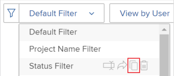

# 在資源規劃工具中篩選資訊

<!--

(AL:*Iterate on this article: filtering by custom data. Other enhancements? Special characters caveat might change - follow the story to know when. It originally came in Beta 3 17.3.)

-->

使用篩選條件，您可以從儲存在系統中的所有資訊修改顯示在「資源規劃工具」中的資訊。

## 存取需求

+++ 展開以檢視本文中功能的存取需求。

<table style="table-layout:auto"> 
 <col> 
 <col> 
 <tbody> 
  <tr> 
  <tr> 
   <td>Adobe Workfront套件</td> 
   <td>
任何
</td>
  </tr> 
  <tr> 
   <td>Adobe Workfront授權</td> 
   <td>
淺色或更高

       
評論或以上
</td> 
  </tr> 
  <tr> 
   <td>存取層級設定</td> 
   <td> 
檢視專案、使用者和資源管理的存取權或以上許可權
</td> 
  </tr> 
  <tr> 
   <td>物件許可權</td> 
   <td> 
檢視專案或更高的許可權
</td> 
  </tr> 
 </tbody> 
</table>

如需詳細資訊，請參閱Workfront檔案中的[存取需求](/help/quicksilver/administration-and-setup/add-users/access-levels-and-object-permissions/access-level-requirements-in-documentation.md)。

+++

## 資源規劃工具篩選器概要

為了將資源規劃工具中顯示的資訊量減到最少，Adobe Workfront提供了具有預先設定條件的預設篩選器。 如需有關預設篩選的資訊，請參閱本文的[資源規劃工具](#overview-of-the-default-filter-in-the-resource-planner)中預設篩選的概觀一節。

您也可以建置自訂的篩選器。 如需在資源規劃工具中自訂篩選器的資訊，請參閱本文中的[建立資源規劃工具篩選器](#create-resource-planner-filters)小節。

在資源規劃工具中使用篩選器時，請考慮下列事項：

* 您建立的篩選器只對您可見。 您可以共用篩選器，以供其他使用者使用。
* 身為Workfront管理員，您只能看見自己建立或與您共用的篩選器。
* 當您為資源規劃工具選取不同的檢視時，篩選的結果不會變更。\
  如需有關變更資源規劃工具中檢視的詳細資訊，請參閱[資源規劃工具導覽概觀](../../resource-mgmt/resource-planning/resource-planner-navigation.md)中的「專案/角色/使用者檢視」選取區段。

* 套用篩選器不會變更專案、角色或使用者之資源規劃工具中的配置和可用性資料。 篩選器只會變更您在資源規劃工具中看到的物件數目。
* 篩選會套用至同時顯示在「資源規劃工具」中的所有物件。 例如，如果您篩選特定使用者，「資源規劃工具」只會顯示下列結果：

   * 若專案中，該使用者屬於資源集區（針對專案和角色檢視）或擁有專案指派（針對使用者檢視）
   * 在這些專案中與使用者關聯的角色\
     使用者關聯的專案上的其他角色或使用者不會顯示。

## 資源規劃工具中的預設篩選器概要 {#overview-of-the-default-filter-in-the-resource-planner}

當您第一次開啟資源規劃工具時，Workfront會套用預設篩選器。 您可以編輯「預設」篩選器，僅篩選您要顯示的專案。 如需修改篩選器的詳細資訊，請參閱本文的[在資源規劃工具](#edit-a-filter-in-the-resource-planner)中編輯篩選器一節。

使用預設篩選器時，請考量下列事項：

* 預設篩選器只會從具有以下特性的專案擷取資訊：

   * 發生在本月第一個日期之後的計畫完成日期
   * 計劃開始日期在目前日期起第四個月的最後一天之前
   * 目前或規劃的狀態

  >[!IMPORTANT]
  >
  >預設篩選器會從從始自當月第一天的4個月內始終發生的專案中擷取資訊，無論您選擇要在資源規劃工具中顯示的時間範圍為何。

* 在「使用者檢視」中，會顯示系統中的所有使用者，但只有與已篩選專案相關聯的使用者會顯示時數資訊。
* 您可以編輯預設篩選器中的資訊而不儲存篩選器。
* 您可以複製並編輯「預設」篩選器的副本、變更其中所需的條件，然後儲存為新篩選器。
* 您無法刪除或共用預設篩選器。

  

## 建立資源規劃工具篩選器 {#create-resource-planner-filters}

<!--

(Alina: **^ This section is somewhat duplicated (format more than content) from the "Filtering Utilization Information" section in "Viewing Utilization Information for Projects, Programs, and Portfolios.")

-->

在所有檢視中，在資源規劃工具中建立篩選器是相同的。

在建立篩選之前，請確定在「資源規劃工具」中檢視正確資訊的必要條件已準備就緒。\
如需有關滿足使用資源規劃工具必要先決條件的資訊，請參閱[資源規劃工具概觀](../../resource-mgmt/resource-planning/get-started-resource-planner.md)文章中的「在資源規劃工具中工作的先決條件」一節。

建立篩選時，請考量下列事項：

* 您可以同時篩選的物件數目沒有限制。
* 您可以新增到篩選器中的可用欄位，會根據您套用至資源規劃工具的檢視物件而改變。 例如，您可以僅在「使用者檢視」中篩選問題或工作列位，因為這些物件僅顯示在「使用者檢視」中。 如果您在使用者檢視中建立問題或任務的篩選器，然後將其套用於專案或角色檢視，則會忽略它，因為欄位不存在於專案或角色檢視中。 在此情況下，篩選器會顯示為無法使用。

若要在資源規劃工具中建立篩選器：

{{step1-to-resourcing}}

依預設會顯示&#x200B;**規劃師**。

根據預設，第一次存取資源規劃工具時，會套用<strong>預設篩選器</strong>。 如需預設篩選的詳細資訊，請參閱本文的「資源規劃工具」中的<a href="#overview-of-the-default-filter-in-the-resource-planner" class="MCXref xref">預設篩選概述</a>一節。

1. 在的左上角，按一下&#x200B;**篩選器**圖示。
   
或
展開**篩選器**&#x200B;下拉式功能表，然後按一下&#x200B;**新增篩選器**。
   

1. 若要使用內建條件建立篩選器，請指定下列任一欄位：

   * **Portfolio**：開始輸入包含您要納入資源規劃工具之資訊的投資組合名稱，然後在其出現在清單中時按一下該名稱。\
     重複此過程以包含來自多個產品組合的資訊。

   * **專案狀態**：展開[專案狀態]下拉式功能表，並選取清單中可用的一個或多個專案狀態。
   * **團隊**：開始輸入一或多個團隊的名稱，這些團隊與指派給您要檢視專案中之任務的使用者相關聯。
   * **工作角色**：開始輸入一或多個工作角色的名稱，這些工作角色與指派給您要檢視專案中工作的使用者相關聯。
   * **集區**：開始輸入與專案（針對專案檢視）、使用者（針對使用者檢視），或與您要檢視的專案和使用者（針對角色檢視）相關聯的一或多個資源集區的名稱。
   * **群組**：開始輸入與您要檢視之使用者（在使用者檢視中）或專案（在專案和角色檢視中）相關聯的一或多個群組名稱。

1. 按一下&#x200B;**新增篩選規則**，然後開始在&#x200B;**輸入以篩選專案**&#x200B;方塊中輸入您要篩選的欄位名稱。 如果欄位可供使用，則會針對可與其關聯的每個物件填入欄位。

   >[!IMPORTANT]
   >
   >當參考自訂欄位時，您必須輸入欄位名稱，而不是欄位標籤。 欄位標籤會顯示在附加至物件的自訂表單上。 如需標籤與自訂欄位名稱之間差異的詳細資訊，請參閱[建立自訂表單](/help/quicksilver/administration-and-setup/customize-workfront/create-manage-custom-forms/form-designer/design-a-form/design-a-form.md)。

1. 當欄位出現在清單中時，按一下欄位名稱可將其新增到篩選器中。\
   如需清單中欄位的詳細資訊，請參閱[Adobe Workfront術語辭彙表](../../workfront-basics/navigate-workfront/workfront-navigation/workfront-terminology-glossary.md)。

1. （選擇性）選取篩選的篩選和條件修飾元。 可用的修飾元在[篩選和條件修飾元](../../reports-and-dashboards/reports/reporting-elements/filter-condition-modifiers.md)中說明。

   您可以使用基於使用者或基於日期的萬用字元來篩選與登入使用者相關聯的資訊。\
   如需篩選器支援的萬用字元相關資訊，請參閱[萬用字元篩選器變數總覽](../../reports-and-dashboards/reports/reporting-elements/understand-wildcard-filter-variables.md)。

1. 按一下&#x200B;**儲存**&#x200B;以儲存篩選規則。
1. （選擇性）按一下&#x200B;**新增篩選器規則**，為其他物件或欄位新增規則。
1. 按一下&#x200B;**套用**&#x200B;以套用篩選器而不儲存它。

   或

   按一下&#x200B;**儲存篩選器**&#x200B;以儲存篩選器。\
   

1. （視條件而定）按一下&#x200B;**儲存**&#x200B;之後，請在&#x200B;**儲存篩選器**&#x200B;對話方塊內的&#x200B;**篩選器名稱**&#x200B;方塊中指定篩選器的名稱。 這是必填欄位。\
   

   >[!NOTE]
   >
   >如果您的篩選名稱包含特殊字元，則只能使用下列字元：
   >
   >* 逗號
   >* 斜線
   >* 連字型大小
   >* 底線

1. 按一下「**儲存**」。

   資源規劃工具中的結果現在會依您包含在篩選規則中的資訊進行篩選。

## 套用現有篩選器

當您或有權存取資源規劃工具的人儲存篩選器時，每個人都可以使用資源規劃工具。

若要套用現有篩選：

1. 前往資源規劃工具。
1. 在左上角，展開&#x200B;**篩選器**&#x200B;下拉式功能表。

   您可以在此功能表中檢視您建立或其他建立並與您共用的篩選器。\
   

1. 在下拉式選單中選取篩選器。 您可以在此功能表中檢視您或其他使用者建立的篩選器。\
   當您選取篩選器時，它會自動減少資源規劃工具中顯示的資訊量。

## 在資源規劃工具中編輯篩選器 {#edit-a-filter-in-the-resource-planner}

您可以執行下列任一項作業，在「資源規劃工具」中編輯篩選器：

* [重新命名篩選器](#rename-a-filter)
* [在篩選器中編輯資訊](#edit-the-information-in-a-filter)
* [複製篩選器](#duplicate-a-filter)

當您編輯篩選器時，系統中所有有權存取資源規劃工具的使用者都會更新該篩選器。

### 重新命名篩選器 {#rename-a-filter}

您可以在不變更篩選器條件的情況下變更其名稱。 我們建議讓系統中的其他使用者知道此變更，因為其他使用者可以看到篩選器。 此變更會影響到能看見資源規劃工具之所有人的篩選器清單。

1. 前往「資源規劃工具」，並展開&#x200B;**篩選器**&#x200B;下拉式功能表以選取已儲存的篩選器。
1. 展開&#x200B;**篩選器**&#x200B;下拉式功能表。 找到您要重新命名的篩選器，並將滑鼠游標停留在篩選器名稱上。
1. 選取篩選器名稱旁的&#x200B;**重新命名篩選器**&#x200B;圖示。

   

1. 在&#x200B;**篩選名稱**&#x200B;方塊中指定篩選的新名稱。
1. 按一下「**儲存**」。\
   篩選器中包含的資訊相同，且名稱會更新。

### 編輯篩選器中的資訊 {#edit-the-information-in-a-filter}

您可以變更包含在篩選器中的資訊，而不變更其名稱。 我們建議讓系統中的其他使用者知道此變更，因為他們可以看見篩選器。 此變更會影響到能看見資源規劃工具之所有人的篩選器清單。

1. 前往「資源規劃工具」，並展開左上角的&#x200B;**篩選器**&#x200B;下拉式功能表。
1. 選取要編輯的現有篩選器。
1. 按一下&#x200B;**篩選器**&#x200B;圖示。\
   

1. 新增欄位至篩選器。\
   如需建立篩選的詳細資訊，請參閱[建立資源規劃工具篩選器](#create-resource-planner-filters)。

1. 暫留在為篩選器選取的現有欄位上，然後按一下&#x200B;**編輯**&#x200B;圖示以選取其他欄位，或按一下&#x200B;**刪除**&#x200B;圖示以刪除欄位。\
   

1. （選擇性）按一下&#x200B;**新增篩選器規則**&#x200B;以新增欄位至篩選器。\
   如需定義篩選條件的詳細資訊，請參閱[建立資源規劃工具篩選器](#create-resource-planner-filters)。

1. 按一下&#x200B;**套用**&#x200B;以套用篩選器而不儲存它。

   或

   按一下&#x200B;**儲存**&#x200B;以儲存篩選。\
   篩選器會以相同名稱儲存，但具有新的篩選條件。

### 複製篩選器 {#duplicate-a-filter}

您可以複製現有篩選器。 原始篩選條件在複製的篩選器中保持相同，您可以用新名稱儲存新篩選器。

1. 前往「資源規劃工具」，並展開左上角的&#x200B;**篩選器**&#x200B;下拉式功能表。
1. 將游標停留在您要複製的已儲存篩選器的名稱上。
1. 按一下&#x200B;**複製**&#x200B;圖示。

   \
   隨即顯示「重複篩選」方塊。

1. 在&#x200B;**篩選器名稱**&#x200B;欄位中，為重複的篩選器指定新名稱。\
   新篩選器的預設名稱為&#x200B;*`<Original Filter Name>`（副本）*。

1. 按一下「**儲存**」。建立新篩選器時，會使用與原始篩選器相同的條件，並使用新名稱。

   >[!NOTE]
   >
   >雖然您可以有2個名稱相同、條件相同的篩選器，我們建議您在「資源規劃工具」中儲存具有唯一篩選條件和名稱的篩選器，以避免混淆。

## 刪除篩選器

您可以刪除不再需要的篩選器。 您無法刪除預設篩選器。

如需預設篩選器的相關資訊，請參閱本文的「資源規劃工具」中的[預設篩選器概述](#overview-of-the-default-filter-in-the-resource-planner)一節。

當您刪除篩選器時，有權存取資源規劃工具之所有Workfront使用者的篩選器都會刪除。 在移除篩選器之前，請確定在資源規劃工具中工作的其他任何人員都不再使用您要移除的篩選器。 已刪除的篩選器無法復原。

若要移除篩選器：

1. 前往資源規劃工具。
1. 展開&#x200B;**篩選器**&#x200B;下拉式功能表。
1. 找到您要移除的篩選器，並將滑鼠游標停留在篩選器名稱上。
1. 選取篩選器名稱旁的&#x200B;**刪除篩選器**&#x200B;圖示。

   

1. 在&#x200B;**刪除篩選器**&#x200B;對話方塊中，按一下&#x200B;**刪除**。

1. 篩選器已從資源規劃工具中刪除並移除。

## 共用篩選器

您可以共用您建立或有權與其他使用者共用的篩選器。 您無法共用預設篩選器，但可以複製篩選器並共用副本。

>[!NOTE]
>
>所有使用者(包括Workfront管理員)都只能存取已建立或已與其共用的篩選器。 您可以與特定使用者共用篩選器，讓所有資源規劃工具使用者都可使用該篩選器。

如需預設篩選器的相關資訊，請參閱本文的「資源規劃工具」中的[預設篩選器概述](#overview-of-the-default-filter-in-the-resource-planner)一節。

如需有關複製篩選器的資訊，請參閱本文中的[複製篩選器](#duplicate-a-filter)一節。

1. 前往資源規劃工具。
1. 展開&#x200B;**篩選器**&#x200B;下拉式功能表。
1. 找到您要共用的篩選器，並將滑鼠游標停留在篩選器名稱上。
1. 選取篩選器名稱旁的&#x200B;**共用篩選器**&#x200B;圖示。

   

   「篩選存取權」對話方塊隨即顯示。

1. （選擇性）若要讓篩選器可供所有資源規劃工具使用者使用，請按一下&#x200B;**設定**&#x200B;圖示，然後選取&#x200B;**讓此在整個系統內可見**。

   

1. 在&#x200B;**將資源規劃工具篩選存取權授予：**&#x200B;方塊中，開始輸入您要共用篩選的使用者、團隊、角色、群組或公司名稱。
1. 從下列許可權層級中選取：

   * 檢視
   * 管理

     如需Workfront中許可權的相關資訊，請參閱[物件許可權共用概述](../../workfront-basics/grant-and-request-access-to-objects/sharing-permissions-on-objects-overview.md)

1. （選擇性）按一下&#x200B;**進階設定**，選取每個層級以新增許可權，取消選取每個層級以移除許可權。

   

1. 按一下「**儲存**」。

   此篩選器與您選取的實體共用，並出現在&#x200B;**與我共用**&#x200B;區域。

   
