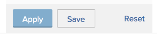
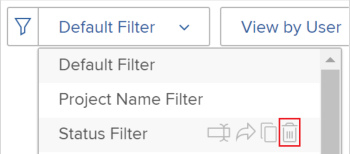
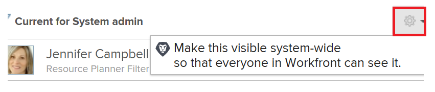

# 在資源計畫器中篩選資訊

<!--

(AL:*Iterate on this article: filtering by custom data. Other enhancements? Special characters caveat might change - follow the story to know when. It originally came in Beta 3 17.3.)

-->

使用篩選器，您可以根據儲存在系統中的所有資訊修改資源計畫器中顯示的資訊。

## 存取需求

您必須具備下列條件：

<table style="table-layout:auto"> 
 <col> 
 <col> 
 <tbody> 
  <tr> 
   <td role="rowheader">Adobe Workfront計畫*</td> 
   <td> 
Pro及更高版本
 </td> 
  </tr> 
  <tr> 
   <td role="rowheader">Adobe Workfront授權*</td> 
   <td> 
審核或更高版本<!--
      <MadCap:conditionalText data-mc-conditions="QuicksilverOrClassic.Draft mode">
        (this seems to be the case in NWE only, not classic. Waiting on Vazgen's response for this)
      </MadCap:conditionalText>
     -->
 </td> 
  </tr> 
  <tr> 
   <td role="rowheader">訪問級別配置*</td> 
   <td> 
查看或更高權限訪問項目、用戶和資源管理 
 
<b>附註</b>

如果您仍無權存取，請洽詢您的Workfront管理員，他們是否在您的存取層級設定其他限制。 如需Workfront管理員如何變更您的存取層級的詳細資訊，請參閱 <a href="../../administration-and-setup/add-users/configure-and-grant-access/create-modify-access-levels.md" class="MCXref xref">建立或修改自訂存取層級</a>.
 </td>
</tr> 
  <tr> 
   <td role="rowheader">物件權限</td> 
   <td> 
檢視專案的權限或更高版本
 
有關請求其他訪問的資訊，請參閱 <a href="../../workfront-basics/grant-and-request-access-to-objects/request-access.md" class="MCXref xref">請求對對象的訪問 </a>.
 </td> 
  </tr> 
 </tbody> 
</table>

*若要了解您擁有的計畫、授權類型或存取權，請聯絡您的Workfront管理員。

## 資源計畫器篩選器概覽

為了將資源計畫器中顯示的資訊量最小化，Adobe Workfront提供了預配置標準的預設篩選器。 如需預設篩選器的相關資訊，請參閱區段 [資源計畫員中的預設篩選器概覽](#overview-of-the-default-filter-in-the-resource-planner) 這篇文章。

您也可以建立自訂的篩選。 有關在資源計畫器中自定義篩選器的資訊，請參閱 [建立資源計畫器篩選器](#create-resource-planner-filters) 這篇文章。

在資源計畫器中使用篩選器時，請考慮以下事項：

* 您建立的篩選器只會顯示給您。 您可以共用篩選器，讓其他使用者也能使用。
* 身為Workfront管理員，您只能看到您所建立或已共用給您的篩選器。
* 為資源計畫員選擇其他視圖時，篩選結果不會更改。\
   有關在資源計畫器中更改視圖的詳細資訊，請參閱 [資源計畫員導航概覽](../../resource-mgmt/resource-planning/resource-planner-navigation.md).

* 應用篩選器不會更改項目、角色或用戶的資源計畫器中的分配和可用性資料。 篩選器只更改您在資源計畫器中看到的對象數。
* 篩選適用於同時顯示在資源計畫器中的所有對象。 例如，如果您為特定用戶進行篩選，則資源計畫器只顯示以下結果：

   * 其中該用戶是資源池的一部分（用於「項目」和「角色」視圖）或在項目上具有分配（用於「用戶」視圖）的項目
   * 與這些專案上的使用者相關聯的角色\
      使用者關聯之專案上的其他角色或使用者不會顯示。

## 資源計畫員中的預設篩選器概覽 {#overview-of-the-default-filter-in-the-resource-planner}

當您首次開啟「資源規劃器」時，Workfront將應用「預設」篩選器。 您可以編輯「預設」篩選器，僅篩選您要顯示的項目。 如需修改篩選器的詳細資訊，請參閱區段 [在資源計畫器中編輯篩選器](#edit-a-filter-in-the-resource-planner) 這篇文章。

使用預設篩選時，請考量下列事項：

* 預設篩選器只會從具有下列項目擷取資訊：

   * 計畫完成日期，即當月的第一個日期之後
   * 計劃開始日期，在從當前日期開始的第四個月的最後一天之前
   * 當前或計畫的狀態

   >[!IMPORTANT]
   >
   >預設篩選器會從始於當月第一天的四個月內發生的項目中檢索資訊，而不管您選擇在資源計畫器中顯示的時間範圍。

* 在「使用者檢視」中，系統中的所有使用者都會顯示，但只有與篩選專案相關聯的使用者會顯示小時資訊。
* 您可以在預設篩選器中編輯資訊，而不儲存篩選器。
* 您可以複製和編輯預設篩選器的復本、變更其中所需的條件，然後儲存為新篩選器。
* 您無法刪除或共用預設篩選器。

   

## 建立資源計畫器篩選器 {#create-resource-planner-filters}

<!--

(Alina: **^ This section is somewhat duplicated (format more than content) from the "Filtering Utilization Information" section in "Viewing Utilization Information for Projects, Programs, and Portfolios.")

-->

在「資源計畫器」中建立篩選器對所有視圖都是相同的。

在建立篩選器之前，請確保在資源計畫器中查看正確資訊的先決條件已就緒。\
有關滿足使用資源計畫員的必要先決條件的資訊，請參閱 [資源計畫員概覽](../../resource-mgmt/resource-planning/get-started-resource-planner.md) 文章。

建立篩選器時，請考量下列事項：

* 一次可篩選的物件數量沒有限制。
* 您可以根據應用於資源計畫員的視圖對象，將可用欄位添加到篩選器更改中。 例如，您只能在「用戶視圖」中篩選「問題」或「任務」欄位，因為這些對象只顯示在「用戶視圖」中。 如果您在「用戶」視圖中為「問題」或「任務」構建篩選器，然後將其應用於「項目」或「角色」視圖，則會忽略該篩選器，因為「項目」或「角色」視圖中不存在這些欄位。 在這種情況下，篩選器似乎不可用。

要在資源計畫器中建立篩選器，請執行以下操作：

1. 按一下 **主菜單** 圖示  在Adobe Workfront的右上角。

1. 按一下 **資源**.

   此 **計畫員** 預設顯示。

   預設情況下，首次訪問資源計畫員時， <strong>預設篩選</strong> 中所有規則的URL區段。 如需「預設」篩選器的詳細資訊，請參閱 <a href="#overview-of-the-default-filter-in-the-resource-planner" class="MCXref xref">資源計畫員中的預設篩選器概覽</a> 一節。

1. 在的左上角，按一下 **篩選** 表徵圖。\
   \
   或\
   展開 **篩選** 下拉式功能表，然後按一下 **新增篩選器**.\
   

1. 若要使用內建條件建立篩選器，請指定下列任一欄位：

   * **Portfolio**:開始鍵入包含要包括在資源規劃器中的資訊的產品組合的名稱，然後在名稱出現在清單中時按一下該名稱。\
      重複此程式以包含來自多個產品組合的資訊。

   * **專案狀態**:展開「專案狀態」下拉式功能表，然後選取清單中可用的一或多個專案狀態。
   * **團隊**:開始鍵入一個或多個團隊的名稱，這些團隊與分配給要查看的項目中任務的用戶相關聯。
   * **工作角色**:開始鍵入一個或多個作業角色的名稱，這些角色與分配給要查看的項目中任務的用戶相關聯。
   * **池**:開始鍵入與項目（「項目視圖」）、用戶（「用戶視圖」）相關聯或與要查看的項目和用戶（「角色視圖」）相關聯的一個或多個資源池的名稱。
   * **群組**:開始鍵入與要查看的用戶（在「用戶」視圖中）或項目（在「項目」和「角色」視圖中）相關聯的一個或多個組的名稱。

1. 按一下 **新增篩選規則**，然後開始在 **要篩選項的類型** 框。 如果欄位可用，則會填入每個物件的關聯位置。

   >[!IMPORTANT]
   >
   >參考自訂欄位時，您必須輸入欄位名稱，而非欄位標籤。 欄位標籤會顯示在附加至物件的自訂表單上。 如需自訂欄位名稱與標籤之間差異的詳細資訊，請參閱  [建立或編輯自訂表單](../../administration-and-setup/customize-workfront/create-manage-custom-forms/create-or-edit-a-custom-form.md) .

1. 按一下欄位名稱，將其顯示在清單中時新增至篩選器。\
   如需清單中所顯示欄位的詳細資訊，請參閱 [Adobe Workfront術語表](../../workfront-basics/navigate-workfront/workfront-navigation/workfront-terminology-glossary.md).

1. （可選）為篩選選擇篩選條件修飾元。 可用修改量在 [篩選條件修飾元](../../reports-and-dashboards/reports/reporting-elements/filter-condition-modifiers.md).

   您可以使用使用者或日期萬用字元來篩選與登入使用者相關聯的資訊。\
   如需篩選器中支援萬用字元的相關資訊，請參閱 [萬用字元篩選變數](../../reports-and-dashboards/reports/reporting-elements/understand-wildcard-filter-variables.md).

1. 按一下 **儲存**&#x200B;來儲存篩選規則。
1. （選用）按一下 **新增篩選規則** 為其他對象或欄位添加新規則。
1. 按一下 **套用** 來套用篩選而不儲存。

   或

   按一下 **儲存篩選** 來儲存篩選器。\
   

1. （條件性）按一下 **儲存**，請在 **篩選器名稱** 框 **儲存篩選** 對話框。 這是必填欄位。\
   

   >[!NOTE]
   >
   >如果您的篩選器名稱包含特殊字元，則僅使用下列字元：
   >
   >* 逗號
   >* 斜線
   >* 連字型大小
   >* 底線

1. 按一下&#x200B;**儲存**。

   現在，資源計畫器中的結果將根據包含在篩選規則中的資訊進行篩選。

## 套用現有篩選

當您或某個具有資源計畫員訪問權限的人保存篩選器時，該篩選器將可供使用資源計畫員的每個人使用。

若要套用現有篩選器：

1. 轉至資源計畫器。
1. 在左上角，展開 **篩選** 下拉式功能表。

   您可以在此功能表中看到您建立的篩選器，或其他建立並與您共用的篩選器。\
   

1. 在下拉式選單中選取篩選器。 您可以看到您或其他使用者在此功能表中建立的篩選器。\
   選擇篩選器時，它會自動減少在資源計畫器中顯示的資訊量。

## 在資源計畫器中編輯篩選器 {#edit-a-filter-in-the-resource-planner}

您可以通過執行以下操作之一，在資源計畫器中編輯篩選器：

* [重新命名篩選器](#rename-a-filter)
* [編輯篩選器中的資訊](#edit-the-information-in-a-filter)
* [複製篩選器](#duplicate-a-filter)

當您編輯篩選器時，系統中所有有權訪問資源規劃器的用戶都會更新篩選器。

### 重新命名篩選器 {#rename-a-filter}

您可以變更篩選器的名稱，而不變更其條件。 建議讓系統中的其他使用者知道這項變更，因為其他使用者可以看到篩選器。 此更改會影響可查看資源計畫員的每個人的篩選器清單。

1. 轉至資源計畫器並展開 **篩選** 下拉式選單中選取儲存的篩選。
1. 展開 **篩選** 下拉式功能表。 找出您要重新命名的篩選器，並將游標暫留在其名稱上。
1. 選取 **重新命名篩選器** 圖示。

   

1. 在 **篩選器名稱** 框。
1. 按一下&#x200B;**儲存**。\
   篩選器中包含的資訊相同，且名稱會更新。

### 編輯篩選器中的資訊 {#edit-the-information-in-a-filter}

您可以變更包含在篩選器中的資訊，而不變更其名稱。 建議您讓系統中的其他使用者知道這項變更，因為他們可以看到篩選器。 此更改會影響可查看資源計畫員的每個人的篩選器清單。

1. 轉至資源計畫器並展開 **篩選** 左上角的下拉式功能表。
1. 選取您要編輯的現有篩選器。
1. 按一下 **篩選** 表徵圖。\
   

1. 新增欄位至篩選器。\
   如需建立篩選器的相關資訊，請參閱 [建立資源計畫器篩選器](#create-resource-planner-filters).

1. 將滑鼠指標暫留在為篩選器選取的現有欄位上，然後按一下 **編輯** 圖示來選取其他欄位，或 **刪除** 圖示以刪除欄位。\
   

1. （選用）按一下 **新增篩選規則** 新增欄位至篩選器。\
   如需定義篩選條件的詳細資訊，請參閱 [建立資源計畫器篩選器](#create-resource-planner-filters).

1. 按一下 **套用** 來套用篩選而不儲存。

   或

   按一下 **儲存** 來儲存篩選器。\
   篩選器會以相同名稱儲存，但會使用新的篩選條件。

### 複製篩選器 {#duplicate-a-filter}

您可以複製現有篩選器。 原始篩選條件在複製的篩選中維持不變，您可以依新名稱儲存新篩選。

1. 轉至資源計畫器並展開 **篩選** 左上角的下拉式功能表。
1. 將滑鼠指標暫留在您要複製之已儲存篩選器的名稱上。
1. 按一下 **複製** 表徵圖。

   \
   「複製篩選」方塊隨即顯示。

1. 在 **篩選器名稱** 欄位，為複製的篩選指定新名稱。\
   新篩選器的預設名稱為 *`<Original Filter Name>`（複製）*.

1. 按一下&#x200B;**儲存**。系統會以與原始篩選器相同的條件建立新篩選器，並使用新名稱。

   >[!NOTE]
   >
   >雖然您可以有2個具有相同名稱和相同條件的篩選器，但建議您在資源規劃器中保存具有唯一篩選條件和名稱的篩選器，以避免混淆。

## 刪除篩選器

您可以刪除不再需要的篩選器。 您無法刪除預設篩選器。

如需預設篩選器的相關資訊，請參閱 [資源計畫員中的預設篩選器概覽](#overview-of-the-default-filter-in-the-resource-planner) 一節。

刪除篩選器時，將刪除所有具有資源計畫員訪問權限的Workfront用戶的篩選器。 在刪除篩選器之前，請確保在資源計畫器中工作的其他人不再使用您要刪除的篩選器。 無法恢復已刪除的篩選器。

若要移除篩選器：

1. 轉至資源計畫器。
1. 展開 **篩選** 下拉式功能表。
1. 找出您要移除的篩選器，並將游標暫留在其名稱上。
1. 選取 **刪除篩選器** 圖示。

   

1. 按一下 **刪除** 在 **刪除篩選器** 對話框。

1. 篩選器將從資源計畫器中刪除。

## 共用篩選器

您可以共用您建立的篩選器，或您有權與其他使用者共用的篩選器。 您無法共用預設篩選，但可以複製並共用副本。

>[!NOTE]
>
>所有使用者(包括Workfront管理員)都只能存取已建立或已與他們共用的篩選器。 您可以與特定用戶共用篩選器，以便所有資源規劃器用戶都能使用篩選器。

如需預設篩選器的相關資訊，請參閱 [資源計畫員中的預設篩選器概覽](#overview-of-the-default-filter-in-the-resource-planner) 一節。

如需複製篩選器的相關資訊，請參閱 [複製篩選器](#duplicate-a-filter) 一節。

1. 轉至資源計畫器。
1. 展開 **篩選** 下拉式功能表。
1. 找出您要共用的篩選器，並將游標暫留在其名稱上。
1. 選取 **共用篩選器** 圖示。

   

   篩選存取對話方塊隨即顯示。

1. （可選）要使篩選器可供所有資源計畫員用戶使用，請按一下 **設定** 圖示，然後選取 **使此可見系統範圍**.

   

1. 在 **授予資源計畫器篩選器訪問權限：** 框中，開始鍵入要共用篩選器的用戶、團隊、角色、組或公司的名稱。
1. 從下列權限層級中選取：

   * 檢視
   * 管理

      如需Workfront權限的相關資訊，請參閱 [對象共用權限概述](../../workfront-basics/grant-and-request-access-to-objects/sharing-permissions-on-objects-overview.md)

1. （選用）按一下 **進階設定**&#x200B;可借由選取層級來新增每個層級的權限，或透過取消選取來移除每個層級的權限。

   

1. 按一下&#x200B;**儲存**。

   篩選器會與您選取的實體共用，且會顯示在 **與我共用** 的上界。

   
