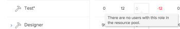

# 資源規劃工具概觀

<!--

(Alina: this used to be the beginning of Planning in the Resource Planner - consider restructuring it further? Merging some of this information with information about Understanding Navigation in the RP?!)

-->

您可以使用「資源規劃工具」，估計並預算資源配置給所指派的專案，並預測未來工作的可用性。

如需Adobe Workfront資源規劃的一般概述，請參閱文章 [開始使用資源規劃](../../resource-mgmt/resource-planning/get-started-resource-planning.md).

## 資源規劃工具概觀

您可以使用資源規劃工具輕鬆瞭解使用者和工作角色的可用性，以及完成專案工作所需的計畫時間。 然後，您可以決定如何根據使用者的可用時間，將使用者及其職位角色分配給指派給他們的專案。

>[!IMPORTANT]
>
>您無法使用資源規劃工具將實際工作（任務和問題）指派給使用者。 您只能估計使用者或工作角色完成專案所需的時間，不論他們被指派的任務和問題為何。\
>若要將實際工作指派給使用者，您必須使用工作負載平衡器。 如需有關工作負載平衡器的詳細資訊，請參閱 [工作負載平衡器總覽](../../resource-mgmt/workload-balancer/overview-workload-balancer.md).

您可以使用三個不同的檢視在資源規劃工具中檢視資訊。 您可以使用每個檢視來達成下列其中一個目的：

* 為需要使用「專案」與「角色」檢視完成的工作預算您的資源時間或成本。 這是資源規劃工具的主要用途。\
  如需有關資源規劃工具中預算的詳細資訊，請參閱文章 [使用專案和角色檢視的資源規劃工具中的預算資源](../resource-planning/budget-resources-project-role-views-resource-planner.md).

* 若要使用「使用者」檢視來檢視下列資訊：

   * 使用者根據其排程的可用性
   * 根據專案計畫完成工作所需的計畫時間量。
   * 使用者已登入實際工作專案的時間。

  如需有關檢視資源規劃工具中使用者的可用、計畫和實際時數或FTE的更多資訊，請參閱文章 [使用使用者檢視時檢視資源規劃工具中的可用、計畫和實際時數或FTE](../../resource-mgmt/resource-planning/view-hours-fte-user-view-resource-planner.md#using).

## 資源規劃工具考量事項

* 您可以優先處理您正在處理的專案，並根據優先順序來編列資源配置的預算，以確保先將資源配置給最重要的專案。

  如需有關在資源規劃工具中排定專案優先順序的資訊，請參閱 [排定資源規劃工具中專案的優先順序](../../resource-mgmt/resource-planning/prioritize-projects-resource-planner.md).

* 您可以顯示專案之任務和問題的時數、約當全職人數和成本資訊。

  >[!NOTE]
  >
  >任務和問題未顯示在資源規劃工具。 但是，來自任務上資源配置的小時、FTE和成本資訊在資源規劃工具中顯示為專案的總數。

* 父系任務的小時、FTE和成本資訊會從資源規劃工具中顯示的專案中排除。 如果您想在資源規劃工具中管理這些資源的時間或成本，我們建議僅將資源指派給子系任務。

  如需有關父系任務的資訊，請參閱下列文章：

   * [任務總覽](../../manage-work/tasks/task-information/tasks-overview.md)
   * [建立子任務](../../manage-work/tasks/create-tasks/create-subtasks.md)

  >[!TIP]
  >
  >父系任務會顯示子系任務的小時與成本總計。 因此，從子任務和父任務計算時數、FTE和成本時，會將這些金額計算兩次。 這就是將父系任務資訊從資源規劃工具中排除的原因。

* 您無法在團隊擁有資源規劃工具中任務或問題的專案上管理團隊配置。
* 您可以使用「資源規劃工具」一次為多個專案編列資源預算，或使用「業務案例」的「資源預算」區域為單一專案編列資源預算。 您為一個專案編列預算的資訊也會顯示在資源規劃工具。

  如需如何為單一專案編列資源預算的相關資訊，請參閱文章 [業務案例中的預算資源](../../manage-work/projects/define-a-business-case/budget-resources-in-business-case.md).

  如需如何在資源規劃工具中一次為多個專案編列資源預算的資訊，請參閱文章中的「資源規劃工具中的預算資源」一節 [使用專案和角色檢視的資源規劃工具中的預算資源](../../resource-mgmt/resource-planning/budget-resources-project-role-views-resource-planner.md).

## 在資源規劃工具中工作的先決條件 {#prerequisites-for-working-in-the-resource-planner}

<!--

(<b>THIS SECTION IS LINKED TO ALL RES PLANNING ARTICLES. DO NOT RENAME OF DELETE THIS!</b> - do NOT ADD the variable here, because it might break this link!)

-->

若要成功使用「資源規劃工具」來編列資源預算，您必須先確定您、專案和作業符合一組先決條件。 這些先決條件對於在資源規劃工具中顯示正確的資訊以及準確管理您的資源是必要的。

>[!IMPORTANT]
>
>如果遺失下列任一先決條件，您可能會發現有關配置或資源可用性的某些資訊遺失或具有零值。\
>如需瞭解欄位為何遺失資料或零值的詳細資訊，請將滑鼠游標停留在欄位上。

>[!NOTE]
>
>只有在依專案或依職務角色檢視「資源規劃工具」，或在專案的「業務案例」中編列資源預算時，才需要下列先決條件。

在依專案或依角色檢視資源規劃工具時，需要下列型別的先決條件，才能使其功能正確：

* [使用者必要條件](#user-prerequisites)
* [專案先決條件](#project-prerequisites)
* [任務和問題先決條件](#tasks-and-issues-prerequisites)
* [系統層級的先決條件](#system-level-prerequisites)

### 使用者必要條件 {#user-prerequisites}

開始使用資源規劃工具之前，請確認下列使用者設定已存在：

* 您擁有預算資源的正確存取權。

  如需有關預算資源所需存取權的資訊，請參閱文章 [在Adobe Workfront中預算資源所需的存取權](../../resource-mgmt/resource-planning/access-needed-to-budget-resources.md).

* 指派給任務的使用者會新增至與專案關聯的資源集區。

  如需有關將使用者新增至資源集區的資訊，請參閱 [將資源集區與使用者建立關聯](../../resource-mgmt/resource-planning/resource-pools/associate-resource-pools-with-users.md).

  >[!NOTE]
  >
  >當使用者未新增到資源集區時，可能會存在以下情況：
  >
  >   
  >   
  >   * 儘管這些使用者可能被指派給專案上的任務，但他們未出現在資源規劃工具中。
  >   * 如果它們關聯的任務具有計畫時數，這些時數不會顯示在資源規劃工具中的專案，除非使用者也與這些任務的工作角色相關聯。
  >   * 如果使用者與專案上任務的工作角色相關聯，計畫時數會顯示在工作角色的資源規劃工具，但無法編列工作角色的預算。
  >   
  >

* 被指派到工作和資源集區的使用者必須具有與其設定檔相關聯的排程和工作角色。

  有關將排程和工作角色與使用者關聯的資訊，請參閱 [編輯使用者設定檔](../../administration-and-setup/add-users/create-and-manage-users/edit-a-users-profile.md).

  >[!NOTE]
  >
  >與排程沒有關聯但位於專案資源集區中的使用者，無法在資源規劃工具中編列預算。

* 如需準確的「可用時數」資訊，請確定與使用者關聯的排程已更新排程例外與休假。

  >[!NOTE]
  >
  >若使用者未與排程建立關聯，就資源規劃工具而言，您的Workfront系統的「預設排程」預設會與使用者建立關聯。

  如需有關建立排程的資訊，請參閱文章 [建立排程](../../administration-and-setup/set-up-workfront/configure-timesheets-schedules/create-schedules.md).

* 如果您要按「成本」預算資源，則必須將「職務角色」與「成本/小時」建立關聯。 費率。 與指派給資源集區中使用者的工作角色相關的成本用於計算專案的預算勞力成本和預算成本。\
  如需將職務角色與費率建立關聯的資訊，請參閱本文 [建立和管理職位角色](../../administration-and-setup/set-up-workfront/organizational-setup/create-manage-job-roles.md).\
  如需有關計算預算勞力成本的資訊，請參閱文章 [瞭解專案的預算勞力成本和預算時數](../../manage-work/projects/project-finances/budgeted-labor-cost.md).\
  如需有關計算預算成本的資訊，請參閱文章 [計算預算成本](../../manage-work/projects/project-finances/budgeted-cost.md).

### 專案先決條件 {#project-prerequisites}

開始使用資源規劃工具之前，請確認下列專案設定已存在：

* 您的專案與資源集區相關聯。\
  如需將資源集區新增至專案的詳細資訊，請參閱 [將資源集區與專案和範本建立關聯](../../resource-mgmt/resource-planning/resource-pools/associate-resource-pools-with-projects-and-templates.md).

  >[!IMPORTANT]
  >
  >沒有資源集區的專案不會在資源規劃工具中顯示計畫時數或工作分派資訊。

### 任務和問題先決條件 {#tasks-and-issues-prerequisites}

雖然您無法在資源規劃工具中顯示任務和問題，但它們的資訊會傳輸到資源規劃工具中顯示的專案。

在資源規劃工具中開始編列資源預算之前，請確認下列任務和問題設定存在：

* 您正在為其編列預算資源的專案上的任務或問題，會指派給下列其中一個實體：

   * 專案資源集區中亦與工作角色相關聯的使用者
   * 職務角色

  >[!NOTE]
  >
  >指派給工作角色的任務和問題的計畫時數會顯示在資源規劃工具，但是這些時數無法編列預算，除非與工作角色相關聯的使用者列在與專案關聯的資源集區中。

* 您不應將父系任務指派給使用者或角色。

  若要在「資源規劃工具」中顯示與父系任務相關聯的使用者或角色的小時資訊，您也必須將其指派給子系任務。 資源規劃工具不顯示父系任務的資訊。

* 任務和問題的計畫時數值大於零。
* 任務和問題的持續時間值大於零。
* 問題的計畫日期在專案的時間表內。

### 系統層級的先決條件 {#system-level-prerequisites}

您必須瞭解您的Workfront執行個體如何根據系統中的資源管理偏好設定計算使用者可用性。 Workfront可以使用使用者的「使用者設定檔」頁面中定義的使用者排程，或您系統的「預設排程」，來計算使用者可用性。

您的Workfront管理員會設定您的資源管理偏好設定。

如需詳細資訊，請參閱 [設定資源管理喜好設定](../../administration-and-setup/set-up-workfront/configure-system-defaults/configure-resource-mgmt-preferences.md).

## 找到資源規劃工具

<!--

(This became another standalone article; drfat this section here when article is live.)

-->

您可以在Workfront的兩個區域中找到資源規劃工具，這取決於您是要為多個專案還是僅一個專案預算資源。

如需有關尋找資源規劃工具的資訊，請參閱 [找到資源規劃工具](../../resource-mgmt/resource-planning/locate-resource-planner.md).

<!--

(this is drafted and moved to its own article: locate-resource-planner) 

Ensure that all prerequisites are met before starting to use the Resource Planner. This way, you ensure that the Resource Planner displays the correct information before you start budgeting your resources. For information about the prerequisites that must be met before you can start using the Resource Planner, see the <a href="#prerequisites-for-working-in-the-resource-planner" class="MCXref xref">Prerequisites for working in the Resource Planner</a> section in this article. 

You can locate the Resource Planner in two areas of Workfront, depending on whether you want to budget your resources for multiple projects, or for just one project.

<ul>
<li><a href="#use-the-resource-planner-for-multiple-projects" class="MCXref xref">Use the Resource Planner for multiple projects</a> </li>
<li> 
<a href="#use-the-resource-planner-for-one-project" class="MCXref xref">Use the Resource Planner for one project</a> 
 </li>
</ul>

<strong>Use the Resource Planner for multiple projects</strong>

When using the Resource Planner for multiple projects, the allocation numbers for your resources represent numbers across multiple projects. 

To access the  Planner section  in the  Resourcing area: 

<ol>
<li value="1">  Click the <strong>Main Menu</strong> icon  in the upper-right corner of Adobe Workfront.  </li>
<li value="2"> 
  Click <strong>Resourcing</strong>. The Resource Planner displays by default.  For information about budgeting resources in the Resource Planner, see the article <a href="../../resource-mgmt/resource-planning/budget-resources-project-role-views-resource-planner.md" class="MCXref xref">Budget resources in the Resource Planner using the Project and Role views</a>. 
 
  
 </li>
<li value="3">  Hover over the left panel, and click <strong>Resource Pools</strong>.  For information about creating new resource pools, see <a href="../../resource-mgmt/resource-planning/resource-pools/create-resource-pools.md" class="MCXref xref">Create resource pools</a>.</li>
</ol>

<strong>Use the Resource Planner for one project</strong>

When using the Resource Planner for one project, the allocation numbers for your resources represent numbers for the selected project. 

<ol>
<li value="1"> 
Go to a project you want to budget resources for.
 </li>
<li value="2"> 
Click <strong>Business Case</strong> in the left panel.
 </li>
<li value="3"> 
Scroll to the <strong>Resource Budgeting</strong> section of the Business Case.
 </li>
<li value="4"> 
Click <strong>Edit Resource Budgeting</strong> to add resource pools to your project and start budgeting your resources. 
 <note type="tip">
You can only add a resource pool in the Resource Budgeting area of the Business Case when the project has no resource pools associated with it. When the project already has a resource pool, the users in the pool and their job roles display in the Resource Budgeting area by default.
</note> 
  
 
For information about budgeting resources for one project, see the article <a href="../../manage-work/projects/define-a-business-case/budget-resources-in-business-case.md" class="MCXref xref">Budget resources in the Business Case</a>.
 </li>
</ol>

-->

## 資源規劃工具區域

您可以在「資源規劃工具」中檢視下列資訊或執行下列動作：

* 有關在一般時間表資源規劃工具中指派給您專案的資源的資訊。
* 資源規劃工具中的資源過度配置或利用不足。
* 以手動或自動方式為資源編列工作預算。

如需有關哪些區域顯示在「資源規劃工具」中以及如何設定哪些資訊顯示在這些區域的詳細資訊，請參閱文章 [資源規劃工具導覽概觀](../../resource-mgmt/resource-planning/resource-planner-navigation.md).

## 在資源規劃工具中顯示資訊的限制

為了改善效能，Workfront會限制您可在資源規劃工具中顯示的專案數量。

如需這些限制的詳細資訊，請參閱文章 [資源規劃工具顯示限制](../../resource-mgmt/resource-planning/resource-planner-display-limitations.md) .

## 在資源規劃工具中計算FTE

您可以在「資源規劃工具」中顯示時數、約當全職人數或成本的可用性、配置及計畫值。

如需有關變更顯示在資源規劃工具中的資訊的詳細資訊，請參閱區段 [依小時、約當全職人數或成本檢視資訊](../../resource-mgmt/resource-planning/resource-availability-allocation-resource-planner.md#display-by-hour-or-fte-menu) 在文章中 [使用Adobe Workfront資源規劃工具檢閱資源可用性和配置](../../resource-mgmt/resource-planning/resource-availability-allocation-resource-planner.md).

如需有關如何在Workfront中計算使用者和角色的時數和FTE的詳細資訊，請參閱文章 [計算資源規劃工具中使用者和角色的時數和FTE的概觀](../../resource-mgmt/resource-planning/calculate-hours-fte-for-users-roles-resource-planner.md).

## 在資源規劃工具中計算成本

您必須擁有專案上財務資料的檢視存取權和檢視財務許可權，才能在資源規劃工具中按成本檢視資訊。

除了在時數與約當全職人數的「資源規劃工具」中顯示可用性、配置及計畫值之外，您也可以依成本顯示它們。

>[!TIP]
>
>您必須將您的使用者和職務角色與每小時成本費率建立關聯，才能在資源規劃工具中依成本顯示資訊。

如需將每小時成本費率與工作角色產生關聯的詳細資訊，請參閱文章 [建立和管理職位角色](../../administration-and-setup/set-up-workfront/organizational-setup/create-manage-job-roles.md).\
如需將每小時成本費率與使用者產生關聯的詳細資訊，請參閱文章 [編輯使用者設定檔](../../administration-and-setup/add-users/create-and-manage-users/edit-a-users-profile.md).

在「資源規劃工具」中依「成本」檢視資訊時，請考量下列事項：

* 每種時數型別（計畫、可用、預算、使用者、角色或專案的實際值）的成本都是使用不同的成本費率來計算。
* 計畫成本受專案上任務的「成本型別」影響。
* 將「使用者檢視」套用至「資源規劃工具」時，您無法依「成本」顯示配置與可用性資訊。

如需有關如何在「資源規劃工具」中為使用者和角色計算成本的詳細資訊，請參閱文章 [在資源規劃工具中計算成本](../../resource-mgmt/resource-planning/calculate-costs-resource-planner.md).

<!--

<h2>Use the User View to view Available, Planned, and Actual Hours or FTE </h2>

(this information is repeated from above where it exists in shorter form. Drafted to simplify the amount of info of this article.) 

You can use the User View of the Resource Planner to display information about the Planned, Available, and Actual Hours or FTE values for projects and resources. 

For information about using the Resource Planner to review the Available, Planned, and Actual Hours and FTE for resources, see the article <a href="../../resource-mgmt/resource-planning/view-hours-fte-user-view-resource-planner.md" class="MCXref xref">View Available, Planned, and Actual Hours or FTE in the Resource Planner when using the User view</a>.

<strong>Use the Project and Role Views to budget resources </strong>

 The main function of the Resource Planner is to budget your resources for the work that needs to be completed on the projects that you can manage. 

 You can budget your resources only if you apply the <strong>View by Project</strong> or <strong>View by Role</strong> views to the Resource Planner.

For information about budgeting resources using the Project and Role views in the Resource Planner, see the article <a href="../../resource-mgmt/resource-planning/budget-resources-project-role-views-resource-planner.md"><a href="../../resource-mgmt/resource-planning/budget-resources-project-role-views-resource-planner.md" class="MCXref xref">Budget resources in the Resource Planner using the Project and Role views</a></a>.

-->

## 在資源規劃工具中篩選資訊

您可以透過建立篩選器來減少顯示在資源規劃工具中的專案、角色或使用者的數量。\
如需詳細資訊，請參閱文章 [在資源規劃工具中篩選資訊](../../resource-mgmt/resource-planning/filter-resource-planner.md).
