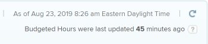

# 資源規劃工具預算時數報告

您可以使用資源規劃工具，為您的專案編列資源預算。 如需有關使用Adobe Workfront資源規劃工具編列資源預算的資訊，請參閱使用專案和角色檢視的資源規劃工具中的文章[預算資源](../../resource-mgmt/resource-planning/budget-resources-project-role-views-resource-planner.md)。

編列預算資源表示您定義（或編列預算）專案上的資源完成其在專案上的工作所需的特定時數。 若要與其他可能沒有資源規劃工具存取權的使用者共用您在「資源規劃工具」中輸入的預算時數資訊，您可以建置預算時數報表。 如需詳細資訊，請參閱[報告：預算時數](../../reports-and-dashboards/reports/custom-view-filter-grouping-samples/report-budgeted-hour.md)。

<!--

(NOTE: this is all drafted - below - same content as the one in the standalone Report: Budgeted Hour article - consider deleting that and just keeping the infomation here?!)

-->

<!--

When you want to share Budgeted Hour information with other users who do not have access to the Resource Planner, you can do so by building a Budgeted Hour report. You can then share the report with them.

>[!IMPORTANT]
>
>
Budgeted Hours are updated every hour in the Adobe Workfront database. Refreshing the report does not necessarily refresh the hour information in it. You can view the time lapsed since the last update in the upper-right corner of every Budgeted Hour report. Refreshing the report refreshes the information in it only when there has been more than one hour since the last update. 
>
>
>
  
>

  <li data-mc-conditions="QuicksilverOrClassic.Draft mode"><a href="#build-a-budgeted-hour-report" class="MCXref xref"> Build a Budgeted Hour report</a> </li>
-->

<!--
  <li data-mc-conditions="QuicksilverOrClassic.Draft mode"><a href="#review-the-budgeted-hour-report" class="MCXref xref">Review the Budgeted Hour report</a> </li>
  -->

<!--
<h2 data-mc-conditions="QuicksilverOrClassic.Draft mode" id="build-a-budgeted-hour-report"> Build a Budgeted Hour report</h2>
-->

<!--
   <li value="1" data-mc-conditions="QuicksilverOrClassic.Draft mode"> Click the <strong>Main Menu</strong> in the upper-right corner, then click <strong>Reports</strong>.  </li>
   -->

<!--
   
Click <strong>New Report> Budgeted Hour</strong>.

   -->

<!--
   
The default view is applied to the report.

   -->

<!--
   
(Optional) To make the report easier to read, click the <strong>Budgeted Hours</strong> column, then <strong>Switch to Text Mode</strong>, then change the <code>valuefield </code>line to <code>valueexpreesion </code>and enter the rounding expression. This rounds the number of Budgeted Hours to a number of decimals that you specify.

   -->

<!--
   
For information about how to round a number in Workfront, see the article <a href="../../reports-and-dashboards/reports/calc-cstm-data-reports/condition-operators-calculated-custom-expressions.md" class="MCXref xref">Condition operators in calculated custom expressions</a>.

   -->

<!--
   <li value="4" data-mc-conditions="QuicksilverOrClassic.Draft mode">(Optional) Click <strong>Add Column</strong> to add additional columns. </li>
   -->

<!--
   
(Optional) To make the report easier to read, we recommend that you add a grouping to it. We suggest the following grouping: 

   -->

<!--
   
Click the <strong>Groupings</strong> tab, then do one or several of the following:

   -->

<!--   
   <li value="1" data-mc-conditions="QuicksilverOrClassic.Draft mode">Click <strong>Add Grouping</strong> and start typing "Project Name", then select it when it appears in the list.</li>   
   -->

<!--   
   <li value="2" data-mc-conditions="QuicksilverOrClassic.Draft mode">Click <strong>Add Grouping</strong> and start typing "Job Role Name", then select it when it appears in the list.</li>   
   -->

<!--   
   
Click <strong>Add Grouping</strong> and start typing <strong>Allocation Date</strong>, select it when it appears in the list, and then select the timeframe you want to group by from the <strong>Group Dates by</strong> field. 
   
   -->

<!--
   <li value="6" data-mc-conditions="QuicksilverOrClassic.Draft mode">(Optional) Click <strong>Filters</strong> to add filters to the report.</li>
   -->

<!--
   <li value="7" data-mc-conditions="QuicksilverOrClassic.Draft mode">(Optional) Click <strong>Chart</strong> to add a chart to the report.</li>
   -->

<!--
   <li value="8" data-mc-conditions="QuicksilverOrClassic.Draft mode">Click <strong>Save + Close</strong>. </li>
   -->

<!--
<h2 data-mc-conditions="QuicksilverOrClassic.Draft mode" id="review-the-budgeted-hour-report">Review the Budgeted Hour report</h2>
-->

<!--

The following information is available in the Budgeted Hour report by default:

-->

<!--
<table style="table-layout:auto">
<col>
<col>
<tbody>
<tr>
<td role="rowheader" data-mc-conditions="QuicksilverOrClassic.Draft mode">Project </td>
<td data-mc-conditions="QuicksilverOrClassic.Draft mode">This is the name of the project associated with the Budgeted Hour. </td>
</tr>
<tr>
<td role="rowheader">

Job Role

</td>
<td data-mc-conditions="QuicksilverOrClassic.Draft mode">This is the name of the job role associated with the Budgeted Hour. </td>
</tr>
<tr>
<td role="rowheader" data-mc-conditions="QuicksilverOrClassic.Draft mode">User</td>
<td data-mc-conditions="QuicksilverOrClassic.Draft mode">This is the name of the user associated with the Budgeted Hour. </td>
</tr>
<tr>
<td role="rowheader" data-mc-conditions="QuicksilverOrClassic.Draft mode">Alloc. Date</td>
<td>

This is the Allocation Date. It is the first day (a Sunday) of the week for which you budgeted the hours. 

<note type="tip">

If a week spans for two months, this generates two rows in the report: one corresponding to the first day of the week (the Sunday of the week which is during the first month), and a second one corresponding with the first day of the second month (and which could be any day of the week.) 

For example, if you budget 8 hours for a user for the week of June 30 (Sunday) - July 6 (Saturday), the two rows show an Allocation Date of June 30, and July 1. 

</note> </td>
</tr>
<tr>
<td role="rowheader" data-mc-conditions="QuicksilverOrClassic.Draft mode">Bud. Hours</td>
<td data-mc-conditions="QuicksilverOrClassic.Draft mode">These are the Budgeted Hours allocated to the User in the Resource Planner. </td>
</tr>
<tr>
<td role="rowheader" data-mc-conditions="QuicksilverOrClassic.Draft mode">Pln. Bud. Hours</td>
<td data-mc-conditions="QuicksilverOrClassic.Draft mode">These are the Budgeted Hours allocated to the Job Role or the Project in the Resource Planner. </td>
</tr>
<tr>
<td role="rowheader" data-mc-conditions="QuicksilverOrClassic.Draft mode"> </td>
<td data-mc-conditions="QuicksilverOrClassic.Draft mode"> </td>
</tr>
</tbody>
</table>
-->
