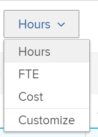

# 使用Adobe Workfront資源規劃工具檢閱資源可用性和配置

您可以在資源規劃工具中檢視資源的可用性，以及專案的計畫或預算工作量。 這些值會以「時數」、「約當全職人數」或「成本」金額顯示，並以欄位組織。

## 存取需求

+++ 展開以檢視本文中功能的存取需求。

您必須具有下列存取權才能執行本文中的步驟：

<table style="table-layout:auto"> 
 <col> 
 <col> 
 <tbody> 
  <tr> 
   <td role="rowheader">Adobe Workfront計畫</td> 
   <td>
新增：任何

       
或

       
目前：Pro或更高
 </td> 
  </tr> 
  <tr> 
   <td role="rowheader">Adobe Workfront授權</td> 
   <td>
新增：淺色或更高

       
或

       
目前：檢閱或以上
</td>
  </tr> 
  <tr> 
   <td role="rowheader">存取層級設定</td> 
   <td> 
檢視以下專案或更高存取權：
 
    <ul> 
     <li> 
資源管理
 </li> 
     <li> 
財務資料
 </li> 
     <li> 
使用者
 </li> 
     <li> 
專案
 </li> 
    </ul> </td> 
  </tr> 
  <tr> 
   <td role="rowheader">物件許可權</td> 
   <td> 
檢視或更高許可權給您要在資源規劃工具中檢視的專案
 </td> 
  </tr> 
 </tbody> 
</table>

如需有關此表格的詳細資訊，請參閱Workfront檔案中的[存取需求](/help/quicksilver/administration-and-setup/add-users/access-levels-and-object-permissions/access-level-requirements-in-documentation.md)。

+++

## 先決條件

您必須符合使用資源規劃工具所需的所有先決條件。 如需詳細資訊，請參閱[資源規劃工具概觀](../../resource-mgmt/resource-planning/get-started-resource-planner.md)。

>[!IMPORTANT]
>
>如果缺少資源規劃工具正確功能所需的任何先決條件，某些數字可能為零，或預算時數可能變暗。

## 資源的可用性與配置

顯示資源可用性與配置的欄位會根據您套用至「資源規劃工具」的檢視而變更。 如需依專案、角色或使用者在資源規劃工具中顯示資訊的相關資訊，請參閱[資源規劃工具導覽概觀](../../resource-mgmt/resource-planning/resource-planner-navigation.md)。

將您的檢視變更為「資源規劃工具」時，請考量下列事項：

* 當您套用&#x200B;**依專案檢視**&#x200B;或&#x200B;**依角色檢視**&#x200B;檢視時，您可以看到下列資料行：

  <!--
  <MadCap:conditionalText data-mc-conditions="QuicksilverOrClassic.Draft mode">
  (NOTE: Alina: (some of the information in this area is also covered in Calculating Costs in the RP - https://workfront.zendesk.com/hc/en-us/articles/115004186433 - update this article also, when changes here occur)
  </MadCap:conditionalText>
  -->

   * 可用時數、FTE或成本
   * 計畫時數、FTE或成本
   * 預算時數、約當全職人數或成本
   * 時數、約當全職人數或成本差額
   * 淨時數、約當全職人數或成本

* 當您套用&#x200B;**依使用者檢視**&#x200B;檢視時，您可以看到下列資料行：

   * 可用時數或FTE
   * 計畫時數或FTE
   * 小時或約當全職人數差異
   * 計畫時數分配百分比

>[!TIP]
>
>將&#x200B;**依使用者**&#x200B;檢視套用至資源規劃工具時，資訊無法當做成本使用。
>
>如需有關每個欄顯示內容的詳細資訊，請將滑鼠移至顯示編號的欄名稱上。\
>
>
>如需各欄顯示資料的詳細資訊，請參閱下列文章：
>
>* [資源規劃工具專案與角色檢視中的時數、約當全職人數及成本資訊概觀](../../resource-mgmt/resource-planning/overview-of-planner-hour-fte-cost-information-in-role-project-views.md)
>* 使用使用者檢視時[在資源規劃工具中檢視可用、計畫和實際時數或FTE](../../resource-mgmt/resource-planning/view-hours-fte-user-view-resource-planner.md)
>

## 依小時、約當全職人數或成本檢視資訊

1. 前往資源規劃工具。

   依預設，資訊會依「時數」顯示在「資源規劃工具」中。

1. 展開下拉式功能表。\
   

1. 從下列選項中選取：

   <table style="table-layout:auto"> 
    <col> 
    <col> 
    <tbody> 
     <tr> 
      <td role="rowheader">時數</td> 
      <td>以小時顯示使用狀態和配置資訊。</td> 
     </tr> 
     <tr> 
      <td role="rowheader">FTE</td> 
      <td> 
以FTE顯示使用狀態和配置資訊。
 
如需有關如何在資源規劃工具中計算FTE的詳細資訊，請參閱<a href="../../resource-mgmt/resource-planning/calculate-hours-fte-for-users-roles-resource-planner.md" class="MCXref xref">計算資源規劃工具中使用者和角色的時數和FTE的概觀</a>。 
 </td> 
     </tr> 
     <tr> 
      <td role="rowheader">成本</td> 
      <td> 
如果您在「專案」或「角色」檢視中檢視「資源規劃工具」，則依成本顯示可用性與配置資訊。 此資訊會以您系統的貨幣顯示值。 您的Workfront管理員會定義系統貨幣。 如需在Workfront中設定系統貨幣的詳細資訊，請參閱<a href="../../administration-and-setup/manage-workfront/exchange-rates/set-up-exchange-rates.md" class="MCXref xref">設定匯率</a>。
 
<b>附註</b>

   您必須將使用者和職位角色與每小時成本費率相關聯，才能在資源規劃工具中顯示成本資訊。 如需將每小時成本費率與工作角色產生關聯的詳細資訊，請參閱<a href="../../administration-and-setup/set-up-workfront/organizational-setup/create-manage-job-roles.md" class="MCXref xref">建立和管理工作角色</a>。 如需將每小時成本費率與使用者產生關聯的詳細資訊，請參閱<a href="../../administration-and-setup/add-users/create-and-manage-users/edit-a-users-profile.md" class="MCXref xref">編輯使用者的設定檔</a>。 如需資源規劃工具中成本計算方式的詳細資訊，請參閱<a href="../../resource-mgmt/resource-planning/calculate-costs-resource-planner.md" class="MCXref xref">資源規劃工具中的成本計算</a>。
 </td>
   </tr> 
     <tr> 
      <td role="rowheader">自訂</td> 
      <td>建立顯示在資源規劃工具中的欄的自訂檢視。 選取您要顯示在「資源規劃工具」中的選項，如以下步驟所述。 </td> 
     </tr> 
    </tbody> 
   </table>

1. （視條件而定）若您選取&#x200B;**自訂**，請在&#x200B;**自訂顯示的量度**&#x200B;方塊中指出選項，以設定您的自訂檢視。

   

1. 在左側的&#x200B;**檢視型別**&#x200B;欄中，選取下列其中一個檢視：

   * 專案
   * 角色
   * 使用者

1. 在&#x200B;**顯示選取的專案**&#x200B;區段中，選取您要在選取檢視的資料行中顯示的資訊型別。 下表顯示每個檢視中可用的選項：

   | **選項** | 使用者檢視 | 專案檢視 | 角色檢視 |
   |---|---|---|---|
   | 可用 | ✔ | ✔ | ✔ |
   | 計畫 | ✔ | ✔ | ✔ |
   | 已編列預算 |   | ✔ | ✔ |
   | 差額 |   | ✔ | ✔ |
   | 淨餘 |   | ✔ | ✔ |
   | 實際 | ✔ |   |   |
   | 差異 | ✔ |   |   |
   | 百分比 | ✔ |   |   |

1. 選取&#x200B;**在網路計算中使用計畫(PLN)值**&#x200B;以在計算專案和角色檢視中的網路值時使用計畫而非預算資訊。

   選取此選項時，Workfront會使用下列公式計算淨值：

   `Net = Available - Planned`

   >[!TIP]
   >
   >**只有當您選取至少一個選項，以自訂[顯示選取的專案]區段中的檢視時，才會套用此選項。**

1. 按一下「**儲存**」。

   包含您所選欄的自訂檢視隨即顯示。

   資源規劃工具在時數下拉式選單中將自訂檢視列為自訂。

   >[!NOTE]
   >
   >您只能有一個自訂檢視。

   

## 檢視使用者配置圖表

您可以在圖表中顯示使用者與其可用性的計劃分配。

若要在圖表中顯示使用者的配置：

1. 前往資源規劃工具。

   如需有關存取資源規劃工具的詳細資訊，請參閱文章[資源規劃工具概觀](../../resource-mgmt/resource-planning/get-started-resource-planner.md)中的[尋找資源規劃工具](../../resource-mgmt/resource-planning/get-started-resource-planner.md#accessing-the-resource-planner)區段。

1. 選取&#x200B;**依使用者檢視**。

   >[!TIP]
   >
   >您只能在「使用者檢視」中檢視「使用者配置圖」。

1. 按一下&#x200B;**使用者配置圖**&#x200B;圖示以顯示下列資訊：

   <table style="table-layout:auto"> 
    <col> 
    <col> 
    <tbody> 
     <tr> 
      <td role="rowheader">所有使用者皆未過度配置的可用性 %</td> 
      <td>這是一段期間內所有使用者可工作的時間，以佔其總可用時間的百分比顯示。 </td> 
     </tr> 
     <tr> 
      <td role="rowheader">所有使用者的過度配置 % </td> 
      <td> 
這是使用者在某個時段中被過度分配的時間量，以佔總可用時間的百分比顯示。
 
<b>附註</b>

   當計畫時數高於可用時數時，會發生過度配置。 
 </td>
   </tr> 
     <tr> 
      <td role="rowheader">所有使用者的使用量過低 %</td> 
      <td> 
這是一段時間內使用者利用不足的時間量，以佔全部可用時間的百分比顯示。
 
<b>附註</b>

   當計畫時數低於可用時數時，會發生使用率過低的情況。 
 </td>
   </tr> 
     <tr> 
      <td role="rowheader">此時間期間內有至少一位使用者過度配置</td> 
      <td>這表示在某個時段內至少有一個使用者過度配置，儘管該時段內所有使用者的總時間量並未過度配置。 您必須捲動使用者清單，過度分配的使用者時數會以紅色反白顯示。</td> 
     </tr> 
    </tbody> 
   </table>

   

1. （選擇性）按一下圖表中所有使用者的&#x200B;**過度配置%**&#x200B;區域。\
   所有過度配置的使用者都會以紅色反白顯示。
1. （選擇性）按一下圖表中所有使用者的&#x200B;**使用量過低%**&#x200B;區域。\
   所有未充分利用的使用者都會以藍色標示。

1. （選擇性）按一下指標圖示，顯示您至少有一個使用者過度配置的位置。\
   過度配置的使用者會以紅色反白顯示。

1. （選擇性）重新整理頁面以摺疊圖表。
