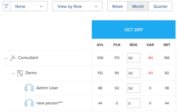
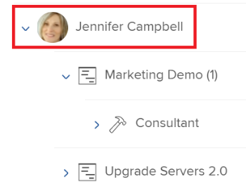

# 資源規劃工具導覽概觀

使用Adobe Workfront資源規劃工具，您可以輕鬆瞭解資源的可用性，以及完成專案工作所需的計畫時間。 然後，您可以管理使用者配置及其在指派給他們的專案中的工作角色。

>[!TIP]
>
>您無法在資源規劃工具中管理團隊在其獲指派的任務上的配置。

您必須符合完全使用資源規劃工具所需的先決條件。 如需資源規劃工具的詳細資訊，請參閱[資源規劃工具概觀](../../resource-mgmt/resource-planning/get-started-resource-planner.md)。

以下章節概述「資源規劃工具」的所有區域。

## 專案時間表

使用資源規劃工具頂端的行事曆，以瀏覽您正在檢視之專案的時間表。 依預設，時間軸從當月開始。\
如需有關變更您在「資源規劃工具」中顯示之時間軸的時間範圍詳細資訊，請參閱本文中的[時間範圍選擇](#timeframe-selection)小節。

## 時間範圍選取  {#timeframe-selection}

依預設，資源規劃工具會一次顯示三或四個月的資源資訊，從當月開始。 顯示的時段數取決於熒幕的寬度。

>[!TIP]
>
>您不能在資源規劃工具中一次顯示超過四個時間週期。

若要導覽時間軸：

1. 按一下後退和前進箭頭，在時間軸上前後移動。
1. 按一下適當的按鈕，從「資源規劃工具」中的下列日期範圍選項中選取：

   <table style="table-layout:auto"> 
    <col> 
    <col> 
    <tbody> 
     <tr> 
      <td role="rowheader">週</td> 
      <td>按周顯示資訊。 周數會顯示在欄標題中的日期旁邊。 </td> 
     </tr> 
     <tr> 
      <td role="rowheader">月</td> 
      <td> 依月份顯示資訊。</td> 
     </tr> 
     <tr> 
      <td role="rowheader">季度</td> 
      <td>依季度顯示資訊。 季數會顯示在欄標題中的日期旁邊。 自訂季度未顯示在資源規劃工具。 </td> 
     </tr> 
     <tr> 
      <td role="rowheader">今天</td> 
      <td>傳回至今天的月、周或季。</td> 
     </tr> 
    </tbody> 
   </table>

## 專案/角色/使用者檢視選擇

您可以根據您想要顯示資訊的方式，變更「資源規劃工具」中的檢視。

依預設，資源規劃工具會顯示在「使用者檢視」中。 您可以將檢視變更為「專案」或「角色檢視」。 當您將其變更為其他檢視時，您的選擇會成為您的預設檢視。

當您變更檢視時，也會變更下列資訊：

* 物件階層（資源規劃工具列中的資訊）。
* 時數配置資訊（資源規劃工具欄中的資訊）。

  如需根據您選取的檢視，在「資源規劃工具」中顯示哪些欄的詳細資訊，請參閱[使用Adobe Workfront資源規劃工具](../../resource-mgmt/resource-planning/resource-availability-allocation-resource-planner.md)檢閱資源可用性和配置。

為了在「資源規劃工具」中顯示精確的資訊，您必須符合一組先決條件。 如需有關先決條件的詳細資訊，請參閱[資源規劃工具概觀](../../resource-mgmt/resource-planning/get-started-resource-planner.md)文章中的「在資源規劃工具中工作的先決條件」一節。  若要變更資源規劃工具中的檢視：

1. 移至&#x200B;**資源規劃工具**。\
   如需有關存取資源規劃工具的詳細資訊，請參閱[資源規劃工具概觀](../../resource-mgmt/resource-planning/get-started-resource-planner.md)文章中的[尋找資源規劃工具](../../resource-mgmt/resource-planning/get-started-resource-planner.md#accessing-the-resource-planner)區段。

1. 在&#x200B;**檢視依據**&#x200B;下拉式功能表中，選取下列其中一個檢視：

   * [依專案檢視](#view-by-project)
   * [依角色檢視](#view-by-role)
   * [依使用者檢視](#view-by-user)

### 依專案檢視 {#view-by-project}

在資源規劃工具中選取「專案檢視」時，請考量下列事項：

* 您至少可以看到有檢視許可權的專案。
* 第一次存取資源規劃工具時，您可以看到依預設篩選條件篩選的專案。\
  如需有關在資源規劃工具中篩選資訊的詳細資訊，請參閱資源規劃工具中的[篩選資訊](../../resource-mgmt/resource-planning/filter-resource-planner.md)。

* 為了改善效能，您顯示或可從「專案檢視」匯出的專案數量會受到限制。\
  如需在專案檢視中檢視資源規劃工具時的限制詳細資訊，請參閱[資源規劃工具顯示限制](../../resource-mgmt/resource-planning/resource-planner-display-limitations.md)文章中專案檢視](../../resource-mgmt/resource-planning/resource-planner-display-limitations.md#project-view-limits)區段的[限制。

* 專案會在「專案檢視」中按優先順序列出。\
  如需資源規劃工具中專案優先順序的詳細資訊，請參閱本文的[專案計畫優先順序](#project-planning-priority)一節。

* 展開每個專案時，您可以顯示與其相關聯的工作角色。\
  展開每個角色時，您可以顯示與其相關聯的使用者。\
  捲動以在每個專案下載入更多角色和使用者。

* 套用此檢視時，角色時數、約當全職人數或成本將加到專案時數、約當全職人數或成本。\
  

* 您可以在「專案」檢視中檢視下列時數、約當全職人數或成本資訊：

   * 可用
   * 計畫
   * 已編列預算
   * 差額
   * 淨餘

     如需詳細資訊，請參閱資源規劃工具中使用專案和角色檢視的[預算資源](../../resource-mgmt/resource-planning/budget-resources-project-role-views-resource-planner.md)。

### 依角色檢視 {#view-by-role}

在資源規劃工具中選取「角色檢視」時，請考量下列事項：

* 您必須至少具有資源管理的檢視存取權和專案的檢視許可權，才能檢視與這些專案關聯的角色。
* 您可以展開每個角色以顯示專案清單，而每個專案會顯示可在專案上履行這些角色的使用者清單。
* 為了改善效能，您顯示或可從「角色檢視」匯出的專案數量是有限的。\
  如需在角色檢視中檢視資源規劃工具時限制的詳細資訊，請參閱[資源規劃工具顯示限制](../../resource-mgmt/resource-planning/resource-planner-display-limitations.md)中角色檢視](../../resource-mgmt/resource-planning/resource-planner-display-limitations.md#role-view-limits)區段的[限制。

* 這些專案會以與「專案檢視」中相同的優先順序列在工作角色底下。
* 套用此檢視時，專案時數、約當全職人數或成本將加總至角色時數、約當全職人數或成本。\
  

* 您可以在「角色」檢視中檢視下列小時、約當全職人數或成本資訊：

   * 可用
   * 計畫
   * 已編列預算
   * 差額
   * 淨餘

     如需詳細資訊，請參閱資源規劃工具中使用專案和角色檢視的[預算資源](../../resource-mgmt/resource-planning/budget-resources-project-role-views-resource-planner.md)。

### 依使用者檢視 {#view-by-user}

您可以在「使用者檢視」中顯示資源規劃工具，以瞭解使用者的「計畫」與「可用時數」或「約當全職人數」之間的差異，或檢視他們記錄的實際時數金額。

將使用者檢視套用至資源規劃工具時，您無法編列資源預算。 您必須使用「專案」或「角色」檢視來預算資源，並使用「使用者」檢視來檢閱與計畫工作相關的使用者配置和可用性。* *

「使用者檢視」是「資源規劃工具」的預設檢視。

在資源規劃工具中選取「使用者檢視」時，請考量下列事項：

* 您可以看到您有權檢視的所有使用者，最多2000名作用中且已至少登入Adobe Workfront一次的使用者。\
  依團隊、工作角色或集區篩選使用者清單，以檢視僅與這些實體相關聯的使用者。
* 如果您已依專案篩選使用者清單，則只有與已篩選專案相關聯的使用者才能展開並顯示時數資訊。\
  如需有關在資源規劃工具中篩選資訊的詳細資訊，請參閱[資源規劃工具中的篩選資訊](../../resource-mgmt/resource-planning/filter-resource-planner.md) 。

* 為了提高效能，您顯示或可從「使用者檢視」匯出的專案數量會受到限制。\
  如需在使用者檢視中檢視資源規劃工具時的限制詳細資訊，請參閱[資源規劃工具顯示限制](../../resource-mgmt/resource-planning/resource-planner-display-limitations.md)中使用者檢視](../../resource-mgmt/resource-planning/resource-planner-display-limitations.md#user-view-limits)區段的[限制。

* 這些專案會按照與「專案檢視」中列出的相同優先順序，列在使用者的名稱下。\
  如需資源規劃工具中專案優先順序的詳細資訊，請參閱本文的[專案計畫優先順序](#project-planning-priority)一節。

* 如果使用者沒有關聯的工作角色，則小時或FTE值會列在&#x200B;**無角色**&#x200B;區段下。
* 套用此檢視時，專案小時或FTE將加總到使用者小時或FTE。

  >[!TIP]
  >
  >您不能在「使用者檢視」中按「成本」顯示使用者的配置和可用性。

* 您對專案和任務的許可權將決定顯示在您在「使用者檢視」中看到的使用者名稱下的內容。\
  存在下列情況：

   * 當您沒有檢視專案和指派給資源規劃工具中顯示之使用者的任務或問題的許可權時，這些專案會列在&#x200B;**無法存取的專案**&#x200B;區段下。 在此情況下，**無法存取的專案**&#x200B;區段會取代專案或任務區段。

   * 如果您沒有許可權檢視專案，但您可以檢視專案上的任務或問題，則專案、任務和問題會列在指派給它們的使用者名稱下。
   * 當您有權檢視專案，但沒有專案上的任何任務或問題時，專案名稱會顯示，並且任務和問題會列在「**無法存取的專案**」區段下。\
     如需Workfront中許可權的詳細資訊，請參閱[物件許可權共用概觀](../../workfront-basics/grant-and-request-access-to-objects/sharing-permissions-on-objects-overview.md)。

     

   

* 您可以在「使用者」檢視中檢視下列時數和FTE資訊：

   * 可用
   * 計畫
   * 實際
   * 計畫與實際之間的差異
   * 計畫配置的百分比

     如需詳細資訊，請參閱[使用使用者檢視時，在資源規劃工具中檢視可用、計畫和實際時數或FTE](../../resource-mgmt/resource-planning/view-hours-fte-user-view-resource-planner.md)

## 專案名稱

您可以在資源規劃工具中檢視下列專案：

* 您有權至少檢視的專案。

  您也必須有權存取存取存取層級中至少的「檢視資源管理」。

  如需有關使用資源規劃工具所需存取權的資訊，請參閱[在Adobe Workfront中編列資源預算所需的存取權](../../resource-mgmt/resource-planning/access-needed-to-budget-resources.md)。

* 受套用至資源規劃工具之篩選條件的專案。

  如需有關在資源規劃工具中篩選資訊的詳細資訊，請參閱資源規劃工具中的[篩選資訊](../../resource-mgmt/resource-planning/filter-resource-planner.md)。

  >[!NOTE]
  >
  >我們建議使用篩選器來減少您在資源規劃工具中顯示的專案數量。

## 專案計畫優先順序 {#project-planning-priority}

專案會依優先順序列在資源規劃工具中，最重要的專案會列在頂端。 優先順序由專案名稱前面的數字表示。

您也可以啟用某項設定，以便在專案與投資組合相關聯時，根據投資組合顯示專案優先順序。 如需有關在資源規劃工具中排定專案的優先順序並顯示投資組合優先順序的資訊，請參閱[在資源規劃工具中排定專案的優先順序](../../resource-mgmt/resource-planning/prioritize-projects-resource-planner.md)。

## 職位角色名稱

資源規劃工具中列出下列職務角色類別：

* 指派給任務的工作角色。
* 未指派給任務，但與專案資源集區相關聯之使用者的主要職務角色的工作角色。
* 使用者指派給這些工作角色中任務的次要工作角色。
* 使用者在其設定檔中具有有效&#x200B;**FTE可用性百分比**&#x200B;的次要職務角色。\
  如需有關工作角色的&#x200B;**FTE可用性百分比**&#x200B;的詳細資訊，請參閱[編輯使用者的設定檔](../../administration-and-setup/add-users/create-and-manage-users/edit-a-users-profile.md) 。

>[!NOTE]
>
>啟用&#x200B;**包含問題**&#x200B;的時數設定時，也會列出指派給問題的工作角色。 如需有關在資源規劃工具中啟用問題時數的詳細資訊，請參閱[設定](#settings)區段。

## 使用者名稱

在資源規劃工具中，在專案和角色檢視中列出的使用者屬於與專案關聯的資源集區。\
如需以使用者填入資源集區的詳細資訊，請參閱[將資源集區與使用者關聯](../../resource-mgmt/resource-planning/resource-pools/associate-resource-pools-with-users.md)。

您有權存取檢視且已登入Workfront至少一次的所有使用者都會顯示在「使用者檢視」中。

在「專案與角色檢視」中，使用者可能會出現在下列工作角色型別底下：

* 他們的主要工作角色
* 其次要工作角色，在下列情況中：

   * 如果次要工作角色在其使用者設定檔中有&#x200B;**FTE可用性百分比**&#x200B;的有效數字。
   * 如果將使用者指派給這些角色中的任務。

如需有關工作角色的&#x200B;**FTE可用性百分比**&#x200B;的詳細資訊，請參閱[編輯使用者的設定檔](../../administration-and-setup/add-users/create-and-manage-users/edit-a-users-profile.md) 。

## 「無角色」和「無使用者」區段

* [「無角色」區段](#no-role-section)
* [「無使用者」區段](#no-user-section)

### 「無角色」區段  {#no-role-section}

當使用者屬於與專案相關聯的資源集區，但沒有與其相關聯的工作角色時，他們會出現在&#x200B;**無角色**&#x200B;區段，而不是顯示在特定工作角色下。

您無法為&#x200B;**無角色**&#x200B;區段中的使用者編列時數預算。 使用者必須至少有一個工作角色與其相關聯，才能為工作編列預算。\

### 「無使用者」區段  {#no-user-section}

當您將任務指派給團隊或保持未指派時，計畫時數會出現在&#x200B;**無使用者**&#x200B;區段下，該區段出現在資源規劃工具的&#x200B;**無角色**&#x200B;區段下。 使用&#x200B;**依使用者檢視**&#x200B;檢視時，這些任務未出現在資源規劃工具中。

您可以在資源規劃工具的&#x200B;**無使用者**&#x200B;區段中，看到專案上任務所歸因的計畫時數金額，但無法為這些配置編列預算。

 

## 篩選器

使用篩選器，您可以限制顯示在資源規劃工具中的資訊。

如需有關在資源規劃工具中篩選的詳細資訊，請參閱[資源規劃工具中的篩選資訊](../../resource-mgmt/resource-planning/filter-resource-planner.md) 。

## 設定 {#settings}

在「設定」區域中，您可以啟用或停用在「資源規劃工具」中顯示或隱藏資訊的選項。

若要啟用資源規劃工具中的設定：

1. 開啟資源規劃工具。
1. 按一下&#x200B;**設定**&#x200B;圖示。

   

   資源規劃工具設定方塊隨即顯示。

   

1. 啟用&#x200B;**包括問題的時數**&#x200B;設定，以顯示資源規劃工具中問題的計畫時數。 此設定預設為停用。

   啟用此設定時，請考量下列事項：

   * 指派給問題的使用者名稱會顯示在問題中與他們相關聯的工作角色下，並且您可以在「專案」和「角色」檢視中指定使用者和工作角色的預算時數。
   * 指派給使用者的問題列在「使用者」檢視中的工作角色名稱下。

     >[!IMPORTANT]
     >
     >**當問題計劃開始和完成日期在專案的時間表以外時，問題的計畫時數會根據問題日期顯示。 例如，如果專案時間表介於1月至3月之間，但問題的時間表是8月，則問題的計畫時數會顯示在8月期間。**

1. （條件式與選擇性）如果您選取「專案」檢視，請啟用「顯示Portfolio優先順序」設定，以根據指派給它們的Portfolio來顯示專案優先順序。 根據其投資組合的專案優先順序顯示在資源規劃工具優先順序旁邊。 此設定預設為停用。

   如需有關在資源規劃工具中排定專案優先順序的資訊，請參閱[在資源規劃工具中排定專案的優先順序](../../resource-mgmt/resource-planning/prioritize-projects-resource-planner.md)。

## 全熒幕選項

您可以全熒幕顯示資源規劃工具，以放大畫面上可檢視的資訊量。

以全熒幕檢視資訊的選項適用於資源規劃工具的所有檢視。

若要以全熒幕顯示資源規劃工具：

1. 移至&#x200B;**資源規劃工具**。
1. 按一下&#x200B;**全熒幕圖示**&#x200B;以全熒幕檢視資源規劃工具。\
   \
   資源規劃工具會展開以佔據整個瀏覽器視窗，而圖示會變更為&#x200B;**關閉全熒幕**&#x200B;檢視選項。

1. （選擇性）按一下&#x200B;**關閉全熒幕圖示**&#x200B;以還原到先前的顯示。

## 匯出選項

您可以從資源規劃工具的任何檢視將資訊匯出到Excel (.xlsx)檔案。\
如需有關從資源規劃工具匯出資訊的資訊，請參閱[從資源規劃工具匯出資訊](../../resource-mgmt/resource-planning/export-resource-planner.md)。

您可以管理資訊量以及匯出檔案的顯示。\
如需有關您可以從資源規劃工具匯出哪些資訊，以及如何管理匯出檔案的外觀和感覺的資訊，請參閱[資源規劃工具顯示限制](../../resource-mgmt/resource-planning/resource-planner-display-limitations.md)。
