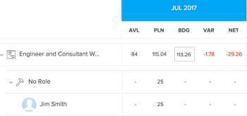

# 資源計畫員導航概覽

通過使用Adobe Workfront資源規劃器，您可以輕鬆了解資源的可用性以及完成項目工作所需的計畫時間。 然後，您就可以管理使用者的分配，以及他們在被指派給專案中的工作角色。

>[!TIP]
>
>您無法管理在資源計畫員中分配給它們的任務的團隊分配。

您必須滿足充分使用資源規劃器所需的先決條件。 有關資源計畫員的詳細資訊，請參閱 [資源計畫員概覽](../../resource-mgmt/resource-planning/get-started-resource-planner.md).

以下各節將概述資源規劃器的所有區域。

## 專案時間表

使用資源規劃器頂部的日曆來定位您正在查看的項目的時間軸。 依預設，時間軸以今天的月份開始。\
有關更改在資源計畫器中顯示的時間表的時間表的時間表的詳細資訊，請參閱 [時間範圍選擇](#timeframe-selection) 這篇文章。

## 時間範圍選擇  {#timeframe-selection}

預設情況下，資源計畫器將從當月開始顯示一次3個月或4個月的資源資訊。 顯示的時段數視畫面寬度而定。

>[!TIP]
>
>在Oracle Resource Planner中，一次不能顯示超過四個時段。

要導航時間軸：

1. 按一下上下箭頭，在時間軸上向後移動。
1. 通過按一下相應按鈕，從資源計畫器中的以下日期範圍選項中進行選擇：

   <table style="table-layout:auto"> 
    <col> 
    <col> 
    <tbody> 
     <tr> 
      <td role="rowheader">週</td> 
      <td>按周顯示資訊。 周數會顯示在欄標題中的日期旁。 </td> 
     </tr> 
     <tr> 
      <td role="rowheader">月</td> 
      <td> 按月顯示資訊。</td> 
     </tr> 
     <tr> 
      <td role="rowheader">季度</td> 
      <td>按季度顯示資訊。 季度數會顯示在欄標題中的日期旁。 自定義季度不會顯示在資源計畫器中。 </td> 
     </tr> 
     <tr> 
      <td role="rowheader">今天</td> 
      <td>返回今天的月、周或季。</td> 
     </tr> 
    </tbody> 
   </table>

## 項目/角色/用戶視圖選擇

您可以根據要顯示資訊的方式更改資源計畫員中的視圖。

預設情況下，資源計畫器將顯示在「用戶視圖」中。 您可以將檢視變更為專案或角色檢視。 當您將其變更為其他檢視時，您的選項會變成預設檢視。

變更檢視時，下列資訊也會變更：

* 對象層次結構（資源規劃器行中的資訊）。
* 小時分配資訊（資源計畫員列中的資訊）。

   有關在資源計畫器中顯示哪些列的詳細資訊（取決於您選擇的視圖），請參閱 [使用Adobe Workfront資源計畫器複查資源可用性和分配](../../resource-mgmt/resource-planning/resource-availability-allocation-resource-planner.md).

為了在資源計畫器中顯示準確資訊，您必須滿足一組先決條件。 有關先決條件的詳細資訊，請參閱 [資源計畫員概覽](../../resource-mgmt/resource-planning/get-started-resource-planner.md) 文章。  要更改資源計畫員中的視圖，請執行以下操作：

1. 前往 **資源計畫員**.\
   有關訪問資源計畫員的詳細資訊，請參閱 [查找資源計畫員](../../resource-mgmt/resource-planning/get-started-resource-planner.md#accessing-the-resource-planner) 區段 [資源計畫員概覽](../../resource-mgmt/resource-planning/get-started-resource-planner.md) 文章。

1. 在&#x200B;**檢視依據** 下拉式功能表中，選取下列其中一個檢視：

   * [依專案檢視](#view-by-project)
   * [依角色檢視](#view-by-role)
   * [依使用者檢視](#view-by-user)

### 依專案檢視 {#view-by-project}

在資源計畫員中選擇「項目視圖」時，請考慮以下事項：

* 您至少可以看到您擁有檢視權限的專案。
* 當您首次訪問資源規劃器時，可以查看按預設篩選器篩選的項目。\
   有關在資源計畫器中篩選資訊的詳細資訊，請參閱 [在資源計畫器中篩選資訊](../../resource-mgmt/resource-planning/filter-resource-planner.md).

* 您顯示或可從「專案檢視」匯出的項目數目有限，以提升效能。\
   有關在「項目視圖」中查看資源計畫程式時的限制的詳細資訊，請參閱 [專案檢視的限制](../../resource-mgmt/resource-planning/resource-planner-display-limitations.md#project-view-limits) 區段 [資源計畫器顯示限制](../../resource-mgmt/resource-planning/resource-planner-display-limitations.md) 文章。

* 項目在「項目視圖」中按其優先順序列出。\
   有關資源計畫器中項目優先順序的詳細資訊，請參閱 [項目計畫優先順序](#project-planning-priority) 一節。

* 展開每個專案時，您可以顯示與其相關聯的工作角色。\
   當您展開每個角色時，可以顯示與其相關聯的使用者。\
   捲動以在每個專案下載入更多角色和使用者。

* 應用此視圖時，職責小時數、FTE或成本加總到項目小時數、FTE或成本。\
   

* 您可以在「項目」視圖中查看以下小時、FTE或成本資訊：

   * 可用
   * 計畫
   * 已編列預算
   * 差額
   * 淨餘

      如需詳細資訊，請參閱 [使用「項目」和「職責」視圖在資源計畫器中使用預算資源](../../resource-mgmt/resource-planning/budget-resources-project-role-views-resource-planner.md).

### 依角色檢視 {#view-by-role}

在資源計畫員中選擇「職責視圖」時，請考慮以下事項：

* 您至少必須具有「查看資源管理」的訪問權限，並且要查看與這些項目關聯的角色，必須具有對項目的權限。
* 您可以展開每個角色以顯示專案清單，並展開每個專案以顯示可在專案上履行這些角色的使用者清單。
* 您顯示或可從角色檢視匯出的項目數有限，以改善效能。\
   有關在「角色視圖」中查看資源計畫器時的限制的詳細資訊，請參閱 [角色檢視的限制](../../resource-mgmt/resource-planning/resource-planner-display-limitations.md#role-view-limits) 區段 [資源計畫器顯示限制](../../resource-mgmt/resource-planning/resource-planner-display-limitations.md) .

* 項目按優先順序列在作業角色下，與「項目視圖」中列出的項目相同。
* 應用此視圖時，項目小時數、FTE或成本加總為職責小時數、FTE或成本。\
   

* 您可以在「職責」視圖中查看以下小時、FTE或成本資訊：

   * 可用
   * 計畫
   * 已編列預算
   * 差額
   * 淨餘

      如需詳細資訊，請參閱 [使用「項目」和「職責」視圖在資源計畫器中使用預算資源](../../resource-mgmt/resource-planning/budget-resources-project-role-views-resource-planner.md).

### 依使用者檢視 {#view-by-user}

您可以在「用戶視圖」中顯示資源計畫員，以了解用戶的計畫小時數和可用小時數或FTE之間的差異，或查看他們記錄的實際小時數。

在將用戶視圖應用到資源計畫器時，無法對資源進行預算。 您必須使用「項目」或「角色」視圖來預算資源，並使用「用戶」視圖來複查與計畫工作相關的用戶分配和可用性。*

用戶視圖是資源計畫員的預設視圖。

在資源計畫員中選擇「用戶視圖」時，請考慮以下事項：

* 您可以看見所有您擁有檢視權限的使用者，最多2000位使用者，他們處於作用中狀態且至少已登入Adobe Workfront一次。\
   按團隊、作業角色或池篩選用戶清單，以查看僅與這些實體關聯的用戶。
* 如果您已依專案篩選使用者清單，則只能展開與已篩選專案相關聯的使用者，並顯示小時資訊。\
   有關在資源計畫器中篩選資訊的詳細資訊，請參閱 [在資源計畫器中篩選資訊](../../resource-mgmt/resource-planning/filter-resource-planner.md) .

* 您顯示或可從「使用者檢視」匯出的項目數目有限，以提升效能。\
   有關在「用戶視圖」中查看資源計畫時限制的詳細資訊，請參見 [使用者檢視的限制](../../resource-mgmt/resource-planning/resource-planner-display-limitations.md#user-view-limits) 區段 [資源計畫器顯示限制](../../resource-mgmt/resource-planning/resource-planner-display-limitations.md) .

* 項目以用戶名下列出，其優先順序與「項目視圖」中列出的項目相同。\
   有關資源計畫器中項目優先順序的詳細資訊，請參閱 [項目計畫優先順序](#project-planning-priority) 一節。

* 如果用戶沒有與他們關聯的工作角色，則小時數或FTE值將列在 **無角色** 區段。
* 應用此視圖時，項目小時數或FTE加總為用戶小時數或FTE。

   >[!TIP]
   >
   >您不能在「用戶視圖」中按成本顯示用戶的分配和可用性。

* 您對專案和工作的權限會決定在「使用者檢視」中看到之使用者名稱下方顯示的內容。\
   存在下列情況：

   * 如果您沒有查看項目的權限以及分配給資源計畫員中顯示的用戶的任務或問題，則這些項目將列在 **無法訪問的項** 區段。 此 **無法訪問的項** 在本例中，區段會取代「專案」或「任務」區段。

   * 當您沒有查看項目的權限，但有權查看項目上的任務或問題時，項目、任務和問題將列在分配給它們的用戶名下。
   * 如果您有查看專案的權限，但沒有專案上的任務或問題，專案名稱隨即顯示，且工作和問題會列在 **無法訪問的項** 區段。\
      如需Workfront權限的詳細資訊，請參閱 [對象共用權限概述](../../workfront-basics/grant-and-request-access-to-objects/sharing-permissions-on-objects-overview.md).

      
    

* 您可以在「用戶」視圖中查看以下小時和FTE資訊：

   * 可用
   * 計畫
   * 實際
   * 計畫與實際之間的差異
   * 計劃分配百分比

      如需詳細資訊，請參閱 [使用「用戶」視圖時，查看資源計畫員中的可用小時數、計畫小時數和實際小時數或FTE](../../resource-mgmt/resource-planning/view-hours-fte-user-view-resource-planner.md)

## 專案名稱

您可以在資源計畫器中查看以下項目：

* 您至少擁有檢視權限的專案。

   您還必須在訪問級別中至少具有查看資源管理的訪問權限。

   有關使用資源計畫員所需訪問的資訊，請參閱 [獲得Adobe Workfront預算資源所需資源](../../resource-mgmt/resource-planning/access-needed-to-budget-resources.md).

* 受應用於資源計畫員的篩選器限制的項目。

   有關在資源計畫器中篩選資訊的詳細資訊，請參閱 [在資源計畫器中篩選資訊](../../resource-mgmt/resource-planning/filter-resource-planner.md).

   >[!NOTE]
   >
   >建議使用篩選器來減少在資源計畫器中顯示的項目數。

## 項目計畫優先順序 {#project-planning-priority}

在Oracle Resource Planner中，按優先順序列出項目，而最重要的項目在頂部。 優先順序以項目名稱前面的數字表示。

您也可以啟用設定，以在項目與產品組合關聯時，根據其產品組合顯示項目優先順序。 有關在資源規劃器中排定項目優先順序和顯示產品組合優先順序的資訊，請參閱 [在資源計畫器中排列項目優先順序](../../resource-mgmt/resource-planning/prioritize-projects-resource-planner.md).

## 職位角色名稱

Oracle Resource Planner中列出了以下職務職責類別：

* 分配給任務的作業角色。
* 未分配給任務的作業角色，但是是與項目資源池關聯的用戶的主要作業角色。
* 分配給這些作業角色中任務的用戶的輔助作業角色。
* 具有有效 **FTE可用性百分比** 在他們的個人資料中。\
   如需 **FTE可用性百分比** 有關作業角色，請參閱 [編輯使用者的設定檔](../../administration-and-setup/add-users/create-and-manage-users/edit-a-users-profile.md) .

>[!NOTE]
>
>當 **包括發出時間** 設定。 有關在資源計畫器中啟用發放小時數的詳細資訊，請參閱 [設定](#settings) 區段。

## 使用者名稱

在「資源規劃器」的「項目」和「角色」視圖中列出的用戶屬於與項目關聯的資源池。\
有關使用者填入資源池的詳細資訊，請參閱 [將資源池與用戶關聯](../../resource-mgmt/resource-planning/resource-pools/associate-resource-pools-with-users.md).

所有您有權存取「檢視」且已至少登入Workfront一次的使用者，都會顯示在「使用者檢視」中。

在「項目」和「角色」視圖中，用戶可能顯示在以下類型的作業角色下：

* 他們的主要工作角色
* 在以下情況下，其輔助作業角色：

   * 如果輔助作業角色具有 **FTE可用性百分比** 在其使用者設定檔中。
   * 如果將用戶分配給這些角色中的任務。

如需 **FTE可用性百分比** 如需工作角色，請參閱 [編輯使用者的設定檔](../../administration-and-setup/add-users/create-and-manage-users/edit-a-users-profile.md) .

## 「無角色」和「無用戶」部分

* [「無角色」部分](#no-role-section)
* [「無用戶」部分](#no-user-section)

### 「無角色」部分  {#no-role-section}

當用戶屬於與項目關聯的資源池，但沒有與其關聯的作業角色時，它們會顯示在 **無角色** 區段，而非特定工作角色下。

您無法為 **無角色** 區段。 用戶必須至少具有與其關聯的一個職務角色，以便為其工作編入預算。\

### 「無用戶」部分  {#no-user-section}

當您將任務分配給某個團隊，或者將其保留為未分配任務時，計畫小時數將顯示在 **無用戶** 顯示在 **無角色** 部分。 使用 **按用戶查看** 檢視。

您可以在 **無用戶** 部分，但無法為這些分配預算。

 

## 篩選器

使用篩選器，您可以限制在資源計畫器中顯示的資訊。

有關在資源計畫器中進行篩選的詳細資訊，請參閱 [在資源計畫器中篩選資訊](../../resource-mgmt/resource-planning/filter-resource-planner.md) .

## 設定 {#settings}

從「設定」區域，您可以啟用或禁用選項以在資源計畫器中顯示或隱藏資訊。

要在資源計畫器中啟用設定，請執行以下操作：

1. 開啟資源計畫器。
1. 按一下 **設定** 表徵圖。

   

   「資源計畫器設定」框隨即顯示。

   

1. 啟用 **包括來自問題的小時數** 設定以在「資源計畫員」中顯示「來自問題的計畫小時數」。 預設會停用此設定。

   啟用此設定時，請考量下列事項：

   * 分配給問題的用戶名稱顯示在與問題相關聯的作業角色下，您可以在「項目」和「角色」視圖中為用戶指定「預算小時數」和作業角色。
   * 在「用戶」視圖中，作業角色的名稱下會列出分配給用戶的問題。

      >[!IMPORTANT]
      >
      >**當問題計劃開始日期和完成日期超出項目時間軸時，系統會根據問題日期顯示問題的計畫時數。 例如，如果項目時間表是在1月和3月之間，但問題的時間表是8月，則問題的「計畫時間」將顯示在8月的時段中。**

1. （條件式和可選）如果您選擇了「項目」視圖，請啟用「顯示Portfolio優先順序」設定，以根據項目的Portfolio顯示項目優先順序。 根據項目組合的優先順序顯示在「資源規劃器」優先順序旁。 預設會停用此設定。

   有關在資源計畫器中排定項目優先順序的資訊，請參閱 [在資源計畫器中排列項目優先順序](../../resource-mgmt/resource-planning/prioritize-projects-resource-planner.md).

## 全螢幕選項

您可以全螢幕顯示「資源計畫員」，以擴大可在螢幕上查看的資訊量。

以全螢幕查看資訊的選項適用於資源計畫員的所有視圖。

要以全螢幕顯示資源計畫器，請執行以下操作：

1. 前往 **資源計畫員**.
1. 按一下 **全螢幕圖示** 以全螢幕查看資源計畫器。\
   \
   「資源規劃器」展開以佔用整個瀏覽器窗口，表徵圖將變為 **關閉全螢幕** 檢視選項。

1. （選用）按一下 **關閉全螢幕表徵圖** 回復到上一個顯示。

## 匯出選項

您可以從資源規劃器的任何檢視將資訊匯出至Excel(.xlsx)檔案。\
有關從資源計畫器導出資訊的資訊，請參閱 [從資源計畫員導出資訊](../../resource-mgmt/resource-planning/export-resource-planner.md).

您可以管理資訊量和匯出檔案的顯示。\
有關可從資源規劃器導出哪些資訊以及如何管理導出檔案的外觀和風格的資訊，請參閱 [資源計畫器顯示限制](../../resource-mgmt/resource-planning/resource-planner-display-limitations.md).
