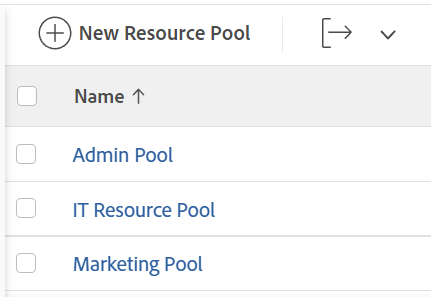
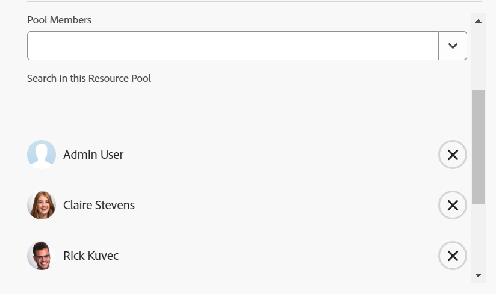

# 建立資源集區

{{highlighted-preview}}

資源集區是使用者的集合，可協助您更輕鬆地在Adobe Workfront中管理資源。 如需資源集區的詳細資訊，請參閱[資源集區概觀](../../../resource-mgmt/resource-planning/resource-pools/work-with-resource-pools.md)。

## 存取需求

+++ 展開以檢視本文中功能的存取需求。

您必須具備下列條件：

<table style="table-layout:auto"> 
 <col> 
 <col> 
 <tbody> 
  <tr> 
   <td role="rowheader">Adobe Workfront計畫*</td> 
   <td> 
專業及更高版本
 </td> 
  </tr> 
  <tr> 
   <td role="rowheader">Adobe Workfront授權*</td> 
   <td> 
計劃 
 </td> 
  </tr> 
  <tr> 
   <td role="rowheader">存取層級設定*</td> 
   <td> 
編輯對資源管理的存取權，包括管理資源集區的存取權
 
編輯使用者、專案和範本的存取權
 
注意：如果您還是沒有存取權，請詢問您的Workfront管理員，他們是否在您的存取層級中設定其他限制。 如需Workfront管理員如何變更存取層級的詳細資訊，請參閱<a href="../../../administration-and-setup/add-users/configure-and-grant-access/create-modify-access-levels.md" class="MCXref xref">建立或修改自訂存取層級</a>。
 </td> 
  </tr> 
  <tr data-mc-conditions=""> 
   <td role="rowheader">物件許可權</td> 
   <td> 
管理您要與資源集區建立關聯的專案和範本的許可權
 
如需請求其他存取權的資訊，請參閱<a href="../../../workfront-basics/grant-and-request-access-to-objects/request-access.md" class="MCXref xref">請求物件</a>的存取權。
 </td> 
  </tr> 
 </tbody> 
</table>

&#42;若要瞭解您擁有的計畫、授權型別或存取權，請連絡您的Workfront管理員。

+++

## 建立資源集區 {#create-a-resource-pool}

{{step1-to-resourcing}}

1. 按一下左側面板中的&#x200B;**資源集區**。

   預覽環境中的範例影像：
   

   生產環境中的影像範例：
   

1. 按一下&#x200B;**新增資源集區**。
1. 指定下列專案：

   <table style="table-layout:auto">
    <col>
    <col>
    <tbody>
     <tr>
      <td role="rowheader"><strong>姓名</strong></td>
      <td>這是資源集區的名稱。</td>
     </tr>
     <tr>
      <td role="rowheader"><strong>說明</strong></td>
      <td>這是此資源集區的簡短說明。 例如，您可以指定其使用目的。</td>
     </tr>
     <tr>
      <td role="rowheader"><strong>集區成員</strong></td>
      <td>
 個別新增使用者至資源集區。 或 一次新增大量使用者至資源集區。 您可以新增下列與使用者或使用者集合相關聯的實體之一：
        <ul>
         <li><strong>團隊</strong>：團隊的所有成員都已新增至資源集區。</li>
         <li><strong>群組</strong>：群組的所有成員都已新增至資源集區。</li>
         <li><strong>角色</strong>：所有與該角色相關聯的使用者都已新增至資源集區。</li>
         <li><strong>公司</strong>：公司中的所有使用者都已新增至資源集區。</li>
        </ul>
秘訣：您只能新增作用中使用者、團隊、角色、或公司。
 您可能需要在對話方塊中向下捲動才能檢視資源集區中的所有使用者。
        
備註：若使用者成為群組、專案團隊、公司的成員，或在群組、專案團隊、公司或工作角色新增至資源集區後，成為工作角色的相關聯者，則新成員不會自動新增至資源集區。  如果使用者屬於您新增的團隊、群組、公司和工作角色，則使用者只會新增一次到資源集區。 加入資源集區後停用的使用者在使用者清單中會變暗並標示為停用。

</td>
     </tr>
    </tbody>
   </table>

1. （選擇性）使用&#x200B;**還原**&#x200B;連結來移除透過群組、團隊、公司或工作角色新增的使用者。 （「預覽」環境中暫時無法使用「復原」功能。）

   >[!NOTE]
   >
   >資源集區中的使用者數量沒有限制。 不過，我們建議不要將太多使用者新增至資源集區，否則資源管理可能會變成一項挑戰。 使用者清單只會顯示資源集區中的前2,000名使用者，而且會依字母順序列出。

   預覽環境中的範例影像：
   

   生產環境中的影像範例：
   

1. （可選）按一下使用者名稱右側的X圖示可移除使用者。 如需有關從資源集區移除使用者的詳細資訊，請參閱[從資源集區移除使用者](../../../resource-mgmt/resource-planning/resource-pools/remove-users-from-resource-pool.md)。
1. （選擇性）使用&#x200B;**搜尋**&#x200B;選項在資源集區中尋找使用者。
1. 按一下「**建立**」。
