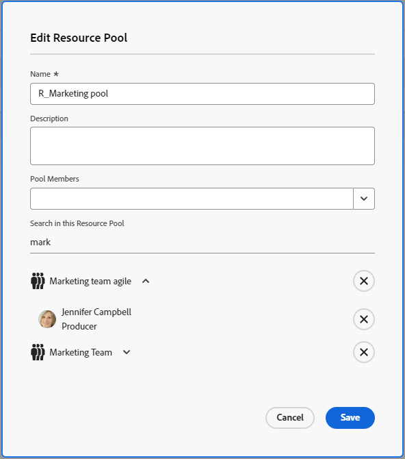

# 從資源集區中移除使用者

雖然資源集區中的使用者數量沒有限制，但使用者清單只會顯示前2000位使用者（按字母順序列出）。

建議您移除已停用或已移動角色或部門的使用者，以確保您在所有資源集區中一律擁有精確的使用者清單。

如需資源集區的詳細資訊，請參閱[資源集區概觀](../../../resource-mgmt/resource-planning/resource-pools/work-with-resource-pools.md)。

## 存取權要求

+++ 展開以檢視這篇文章中所述功能的存取權要求。

<table style="table-layout:auto"> 
 <col> 
 <col> 
 <tbody> 
  <tr> 
   <td>Adobe Workfront 封裝</td> 
   <td>
任何
</td> 
  </tr> 
  <tr> 
   <td>Adobe Workfront授權</td> 
   <td>
標準

   
規劃
</td>
  </tr> 
  <tr> 
   <td>存取層級設定</td> 
   <td> 
編輯對資源管理的存取權，包括管理資源集區的存取權
 
檢視或更高的使用者存取權
</td> 
  </tr>
 </tbody> 
</table>

如需詳細資訊，請參閱Workfront檔案中的[存取需求](/help/quicksilver/administration-and-setup/add-users/access-levels-and-object-permissions/access-level-requirements-in-documentation.md)。

+++

## 從資源集區移除使用者

當資源集區中不再需要這些使用者時，您可以從資源集區中移除這些使用者。

若要從資源集區移除使用者：

{{step1-to-resourcing}}

1. 按一下左側面板中的&#x200B;**資源集區**。
1. 選取資源集區，然後按一下&#x200B;**編輯**。
或\
   按一下資源集區的名稱。

1. 開始在&#x200B;**搜尋此資源集區**&#x200B;欄位中輸入您要移除的使用者名稱。\
   或\
   如果您想要移除與這些實體相關聯的所有使用者，請開始輸入公司、工作角色、團隊或群組的名稱。

   

1. 按一下使用者層級的X圖示，即可從資源集區移除使用者。 它們會從所有出現的清單中移除。
   <!--
   Or  
   To remove all users associated with a job role, group, team, or company, click **Remove** at the job role, group, team level, or company level. This removes all the users associated with that job role, group, team, or company from the Resource Pool.
   -->

1. 按一下「**儲存**」。
