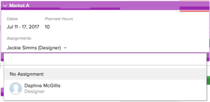

# 在「計畫」區域中自動分配未分配的任務和問題

>[!IMPORTANT]
>  
>自2023年1月的23.1版開始，本文所述的排程功能已遭取代，並已從Adobe Workfront中移除。   
>  
>  2023年初，23.1版發行後不久，也將移除本文。 此時，建議您據以更新任何書籤。 
> 
> 您現在可以使用工作負載平衡器來調度資源的工作。 
>  
> 有關使用工作負載平衡器調度資源的資訊，請參見一節 [工作負載平衡器](../../resource-mgmt/workload-balancer/workload-balancer.md). 

<!-- 

>[!CAUTION] 
> 
> 
> The information in this article refers to the Adobe Workfront's Scheduling tools. The Scheduling areas have been removed from the Preview environment and will be removed from the Production environment in **January 2023**.  
>  Instead, you can schedule resources in the Workload Balancer.  
> 
>*  For information about scheduling resources using the Workload Balancer, see the section [The Workload Balancer](../../resource-mgmt/workload-balancer/workload-balancer.md). 
> 
>*  For more information about the deprecation and removal of the Scheduling tools, see [Deprecation of Resource Scheduling tools in Adobe Workfront](../../resource-mgmt/resource-mgmt-overview/deprecate-resource-scheduling.md). 
-->

使用「計畫工具」時，您可以允許Adobe Workfront分析可用用戶的當前工作分配，並為任何尚未分配的任務或問題提出智慧的邏輯分配。 您可以在完成任何建議的分配之前對其進行修改。

Workfront會查看目前所選日期範圍內「未指派」區域中可用的任務和問題，並一次為每個項目建議分配。 您可以建立篩選器以限制「未指派」區域中可用的項目數。

您的系統管理員決定Workfront如何計算系統層級的資源可用性（考慮小時數和FTE可用性）。 根據此系統範圍的設定，資源可用性是使用預設計畫或用戶的計畫來計算的。 如需詳細資訊，請參閱 [配置Workfront如何計算計畫區域的資源小時數和FTE可用性](../../resource-mgmt/resource-scheduling/calculate-hours-fte-scheduling-area.md).

## 存取需求

您必須具備下列存取權，才能執行本文中的步驟：

<table style="table-layout:auto"> 
 <col> 
 <col> 
 <tbody> 
  <tr> 
   <td role="rowheader">Adobe Workfront計畫*</td> 
   <td> 
任何
 </td> 
  </tr> 
  <tr> 
   <td role="rowheader">Adobe Workfront授權*</td> 
   <td> 
工作或更高
 </td> 
  </tr> 
  <tr> 
   <td role="rowheader">存取層級*</td> 
   <td> 
查看或更高程度地訪問項目、任務和問題
 
<strong>附註</strong>

如果您仍無權存取，請洽詢您的Workfront管理員，他們是否在您的存取層級設定其他限制。 如需Workfront管理員如何變更您的存取層級的詳細資訊，請參閱 <a href="../../administration-and-setup/add-users/configure-and-grant-access/create-modify-access-levels.md" class="MCXref xref">建立或修改自訂存取層級</a>.
 </td>
</tr> 
  <tr> 
   <td role="rowheader">物件權限</td> 
   <td> 
將權限或更高版本提供給項目、任務和問題，以更新分配
 
有關請求其他訪問的資訊，請參閱 <a href="../../workfront-basics/grant-and-request-access-to-objects/request-access.md" class="MCXref xref">請求對對象的訪問 </a>.
 </td> 
  </tr> 
 </tbody> 
</table>

*若要了解您擁有的計畫、授權類型或存取權，請聯絡您的Workfront管理員。

## 必要條件 {#prerequisites}

Workfront使用專有演算法來決定指派方案。 為方便取得最佳結果，請確保下列資訊在Workfront中準確無誤：

* 任務和問題資訊，包括：

   * 角色分配\
      沒有為未分配給角色的任務和問題提出建議。
   * 計畫小時\
      如果任務或問題目前沒有計畫小時數，Workfront會在自動分配工作時假設每個工作日有4個計畫小時。 這些小時不會自動分配給工作項；它們只用於確保更實際的分配。
   * 計畫起始日期和計畫完成日期

* 使用者資訊，包括：

   * 用戶配置檔案上的主角色和次角色分配
   * 專案團隊資訊

## 配置角色限制

角色限制可控制具有特定角色的用戶數，這些用戶可以自動分配工作。 角色限制基於每個項目的工作，以確保基於角色的任務不會分散在大量用戶中。

以下案例概述了角色限制如何應用於項目：

* **方案1**:如果沒有為項目團隊分配用戶，則系統將使用角色限制來分配任務。\
   例如，您的專案沒有指派任何使用者給專案團隊。 此項目有10個需要分配的項目管理任務，並且您為項目經理角色設定了角色限制1。 系統將10個任務全部分配給1個項目經理，因為角色限制設定為1。

* **方案2**:如果角色限制大於分配給項目團隊的用戶數，則會為其他用戶分配任務。\
   例如，您的專案已指派一個作者給專案團隊。 此項目有12個需要分配的編寫器任務，並且為編寫器角色設定了2個角色限制。 系統在項目組編寫器和附加編寫器之間分配所有12個任務，因為角色限制設定為2。

* **方案3**:如果角色限制小於分配給項目團隊的用戶數，則覆蓋角色限制。\
   例如，您有一個專案，其中4名設計人員指派給專案團隊。 此項目有8個需要分配的設計器任務，並且您為設計器角色設定了2的角色限制。 即使角色限制設定為2，系統仍會在4個專案團隊設計人員之間分配所有8個任務。

要設定職務職責分配的限制，請執行以下操作：

1. 前往多個專案或個別專案的排程時間表：

   * **適用於多個專案**:  按一下 **主菜單** 圖示  在Workfront的右上角，按一下 **資源配置>工作負載平衡器**，然後選取 **排程** 的下拉式功能表。
   * **針對個別專案**:前往專案，按一下 **工作負載平衡器** 區段，然後選取 **排程** 從左上角的下拉式功能表。

1. 按一下 **設定** 表徵圖。\
   

1. 在「自動資源計畫」區段中，按一下 **限制** 欄內嵌於 **角色** 欄並輸入正數。\
   Workfront會自動儲存您的變更。

   >[!NOTE]
   >
   >無論角色限制設定如何，所有當前項目組成員都自動有資格從事所有建議的工作。

   

1. （選用）按一下 **顯示** 菜單，然後選擇所需的顯示選項。
1. 若要返回資源計畫區域，請按一下 **返回計畫**.

## 自動指派工作和問題

無論是在「計畫」頁簽上（為多個項目計畫資源時）還是「人員配置」頁簽上（為單個項目計畫資源時），您都可以在計畫時間表上將任務和問題分配給用戶。

要允許Workfront在「未分配」區域中自動提議任務和問題的分配，請執行以下操作：

1. 前往多個專案或個別專案的排程時間表：

   * **適用於多個專案**:  按一下 **主菜單** 圖示  在Workfront的右上角，按一下 **資源配置>工作負載平衡器**，然後選取 **排程** 的下拉式功能表。
   * **針對個別專案**:前往專案，按一下 **工作負載平衡器** 區段，然後選取 **排程** 從左上角的下拉式功能表。

1. （可選）建立篩選器以自訂排程時間軸上「未指派」區域中顯示的內容。\
   如需建立篩選器的詳細資訊，請參閱 [篩選「排程」區域中的資訊](../../resource-mgmt/resource-scheduling/filter-scheduling-area.md#creating-and-modifying-filters-on-the-scheduling-tab-for-projects) in [篩選「排程」區域中的資訊](../../resource-mgmt/resource-scheduling/filter-scheduling-area.md) [篩選「排程」區域中的資訊](../../resource-mgmt/resource-scheduling/filter-scheduling-area.md)

   >[!TIP]
   >
   >若要確保Workfront將工作指派給最符合條件的使用者：
   >
   >* 僅篩選影響「未分配」區域中顯示的任務的資訊(如Portfolio、方案、項目)。
   >* 建議您不要篩選會影響哪些使用者可在排程時間表上指派的資訊。 這樣做會限制Workfront查看所有潛在受分配者，這會導致分配不滿意。

1. （可選）修改計畫時間表上顯示的日期範圍，如 [調整計畫區域的日期範圍](../../resource-mgmt/resource-scheduling/get-started-resource-scheduling.md#adjusting-the-date-range-for-which-data-is-displayed) in [開始使用資源計畫](../../resource-mgmt/resource-scheduling/get-started-resource-scheduling.md). Workfront僅會針對排程時間表上可見日期範圍內的工作和問題進行指派。

1. 按一下 **自動** 按鈕（位於時間表的右上角）。\
   \
   Workfront會針對 **未指派** 的上界。

   >[!TIP]
   >
   >必須已將任務和問題分配給某個角色，才能提議分配。 為確保最佳結果，任務和問題應包含 [必要條件](#prerequisites).

   建議的分配在每個任務或問題周圍以虛線輪廓區分，如下所示：\
   **擬議任務分配：**

   **現有任務分配：**

1. （可選）您可以在完成分配之前修改任何建議或現有分配：

   >[!NOTE]
   >
   >如果修改現有分配，則它將更改為建議狀態。

   * 要將項目分配給其他用戶：

      * 將任務或問題從建議的用戶拖到要分配的不同用戶的行。

         <!--      
        <MadCap:conditionalText data-mc-conditions="QuicksilverOrClassic.Draft mode">      
        (NOTE: lists in this article need to be reformatted and maybe split - too many levels in)      
        </MadCap:conditionalText>      
        -->

         指定使用者每天最多會顯示10個工作。 您可以展開清單以檢視目前指派給該使用者的所有工作。 （在排程時間軸上進行指派後，可能會暫時顯示超過10個任務。）\
         拖動項目時，在釋放任務或問題並完成分配之前將顯示以下資訊：

         * 下拉指示器顯示在用戶行中。 這使您能夠在進行分配之前查看物料的分配位置。
         * 如果在計畫時間線上啟用了用戶分配，則如果完成分配會導致用戶被過度分配，則會顯示紅色的過度分配指示符。\
            如需超額分配指標的詳細資訊，請參閱 [分配指標](../../resource-mgmt/resource-scheduling/manage-allocations-scheduling-areas.md#understanding-allocation-indicators).

         * 沒有資格接收分配的用戶將呈灰色。
      * 展開要指派的任務或問題，按一下 **分配** 欄位中，開始輸入要指派的使用者名稱，然後在下拉式清單中按一下該使用者的名稱。\
         
   * 要延遲分配，請拖動任何任務或問題，以便您尚未準備好將其分配回 **未指派** 的上界。

1. 按一下 **進行分配** 按鈕，以完成任何建議的分配。\
   或\
   按一下 **取消** 將所有擬議任務交還原職。
