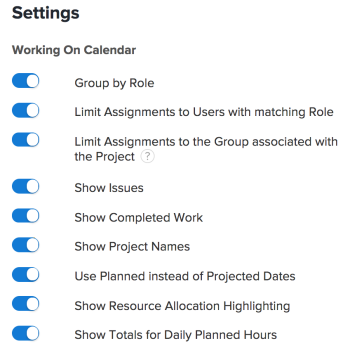

# 在排程區域中配置設定

>[!IMPORTANT]
>  
>自2023年1月的23.1版開始，本文所述的排程功能已遭取代，並已從Adobe Workfront中移除。   
>  
>  2023年初，23.1版發行後不久，也將移除本文。 此時，建議您據以更新任何書籤。 
> 
> 您現在可以使用工作負載平衡器來調度資源的工作。 
>  
> 有關使用工作負載平衡器調度資源的資訊，請參見一節 [工作負載平衡器](../../resource-mgmt/workload-balancer/workload-balancer.md). 

<!--  

>[!CAUTION] 
> 
> 
> The information in this article refers to the Adobe Workfront's Scheduling tools. The Scheduling areas have been removed from the Preview environment and will be removed from the Production environment in **January 2023**. 
>  Instead, you can schedule resources in the Workload Balancer.  
> 
>*  For information about scheduling resources using the Workload Balancer, see the section [The Workload Balancer](../../resource-mgmt/workload-balancer/workload-balancer.md). 
> 
>*  For more information about the deprecation and removal of the Scheduling tools, see [Deprecation of Resource Scheduling tools in Adobe Workfront](../../resource-mgmt/resource-mgmt-overview/deprecate-resource-scheduling.md). 
-->

您可以配置各種設定，以自訂排程時間軸中資訊的顯示方式和內容。

## 存取需求

您必須具備下列存取權，才能執行本文所述步驟：

<table style="table-layout:auto"> 
 <col> 
 <col> 
 <tbody> 
  <tr> 
   <td role="rowheader">Adobe Workfront計畫*</td> 
   <td> 
任何
 </td> 
  </tr> 
  <tr> 
   <td role="rowheader">Adobe Workfront授權*</td> 
   <td> 
工作或更高
 </td> 
  </tr> 
  <tr> 
   <td role="rowheader">存取層級*</td> 
   <td> 
查看對項目、任務和問題的訪問權限或更高權限
 
<b>附註</b>

如果您仍無權存取，請洽詢您的Workfront管理員，他們是否在您的存取層級設定其他限制。 如需Workfront管理員如何變更您的存取層級的詳細資訊，請參閱 <a href="../../administration-and-setup/add-users/configure-and-grant-access/create-modify-access-levels.md" class="MCXref xref">建立或修改自訂存取層級</a>.
 </td>
</tr> 
  <tr> 
   <td role="rowheader">物件權限</td> 
   <td> 
為專案、工作和問題貢獻權限或更高版本
 
有關請求其他訪問的資訊，請參閱 <a href="../../workfront-basics/grant-and-request-access-to-objects/request-access.md" class="MCXref xref">請求對對象的訪問 </a>.
 </td> 
  </tr> 
 </tbody> 
</table>

*若要了解您擁有的計畫、授權類型或存取權，請聯絡您的Workfront管理員。

## 設定要在排程時間軸上顯示的問題

<!--

(NOTE: ALL THE SECTIONS BELOW ARE LINKED TO PRODUCT. DO NOT CHANGE TITLES) 

-->

您可以設定除了排程時間表上的工作外，還要顯示的問題。\
在團隊的「排程」區段中排程資源時，除了工作外，預設會顯示問題。 排程專案的資源時，預設只會顯示任務。

1. 前往多個專案、個別專案或團隊的排程時間軸：

   * **適用於多個專案**:  按一下 **主菜單** 圖示  在Workfront的右上角，按一下 **資源配置>工作負載平衡器**，然後選取 **排程** 的下拉式功能表。
   * **針對個別專案**:前往專案，按一下 **工作負載平衡器** 區段，然後選取 **排程** 從左上角的下拉式功能表。
   * **團隊**:按一下 **主菜單** 圖示  在Workfront的右上角，然後按一下 **團隊**，選取團隊，按一下 **工作負載平衡器** 在左側面板中，選取 **排程** 從左上角的下拉式功能表。

1. 按一下 **設定** 圖示。

1. 在「資源計畫設定」對話框中，啟用 **顯示問題** 選項。\
   

1. 按一下 **返回計畫**. 

## 配置已完成的工作以顯示在計畫時間表上

您可以設定排程時間軸，以顯示已標示為「完成」的工作。 預設情況下，已完成的工作不會顯示在計畫時間軸上。 

1. 前往多個專案、個別專案或團隊的排程時間軸：

   * **適用於多個專案**:  按一下 **主菜單** 圖示  在Workfront的右上角，按一下 **資源配置>工作負載平衡器**，然後選取 **排程** 的下拉式功能表。
   * **針對個別專案**:前往專案，按一下 **工作負載平衡器** 區段，然後選取 **排程** 從左上角的下拉式功能表。
   * **團隊**:按一下 **主菜單** 圖示  在Workfront的右上角，然後按一下 **團隊**，選取團隊，按一下 **工作負載平衡器** 在左側面板中，選取 **排程** 從左上角的下拉式功能表。

1. 按一下 **設定** 圖示。

1. 在「資源計畫設定」對話框中，啟用 **顯示已完成的工作** 選項。\
   

1. 按一下 **返回計畫**.\
   已完成的工作在工作項的右上角顯示，並帶有複選標籤。

## 設定專案名稱以顯示在排程時間軸上 

您可以配置項目名稱以在每個任務上顯示，並在計畫時間表上顯示問題。 這可讓使用者檢視排程時間軸，以快速查看任務或問題所在專案的名稱。

當您啟用項目名稱以顯示時，每個任務和問題佔用計畫時間線上的垂直空間較多，導致在單個視圖中顯示的任務和問題較少。

依預設，排程時間軸上的任務和問題不會顯示專案名稱。

要在任務上顯示項目名稱，並在計畫時間表上顯示問題：

1. 前往多個專案或團隊的排程時間軸：

   * **適用於多個專案**:  按一下 **主菜單** 圖示  在Workfront的右上角，按一下 **資源配置>工作負載平衡器**，然後選取 **排程** 的下拉式功能表。
   * **團隊**:按一下 **主菜單** 圖示  在Workfront的右上角，然後按一下 **團隊**，選取團隊，按一下 **工作負載平衡器** 在左側面板中，選取 **排程** 從左上角的下拉式功能表。

1. 按一下 **設定** 圖示。

1. 在「資源計畫設定」對話框中，啟用選項， **顯示專案名稱**.\
   

1. 按一下 **返回計畫**.\
   計畫時間表上的每個任務和問題都顯示任務或問題所在的項目名稱。\
   

## 配置預計日期以在計畫時間表上顯示

預設情況下，計畫日期用於計畫時間表。 或者，您也可以配置計畫時間軸以使用「預計日期」。

請考慮以下有關計畫日期和預計日期的資訊：

* 任務的計畫日期可以手動設定，也可以根據任務約束和持續時間類型自動設定。 如需詳細資訊，請參閱 [任務約束概覽](../../manage-work/tasks/task-constraints/task-constraint-overview.md) 和  [任務持續時間和持續時間類型概覽](../../manage-work/tasks/taskdurtn/task-duration-and-duration-type.md) .

   問題的計畫日期由使用者手動設定。 但是，系統管理員可以限制用戶調整問題的計畫日期。

* 系統會自動設定任務和問題的預計日期。 如需預計日期的詳細資訊，請參閱相關文章 [項目、任務和問題的預計完成日期概覽](../../manage-work/projects/planning-a-project/project-projected-completion-date.md).

>[!NOTE]
>
>在計畫時間表上使用「預計日期」時，無法顯示用戶分配資訊。 如需使用者分配的詳細資訊，請參閱文章 [在「計畫」區域中手動分配未分配的任務和問題](../../resource-mgmt/resource-scheduling/manually-assign-items-scheduling-areas.md).

要配置計畫時間表以根據預計日期顯示任務和問題，請執行以下操作： 

1. 前往多個專案、個別專案或團隊的排程時間軸：

   * **適用於多個專案**:  按一下 **主菜單** 圖示  在Workfront的右上角，按一下 **資源配置>工作負載平衡器**，然後選取 **排程** 的下拉式功能表。
   * **針對個別專案**:前往專案，按一下 **工作負載平衡器** 區段，然後選取 **排程** 從左上角的下拉式功能表。
   * **團隊**:按一下 **主菜單** 圖示  在Workfront的右上角，然後按一下 **團隊**，選取團隊，按一下 **工作負載平衡器** 在左側面板中，選取 **排程** 從左上角的下拉式功能表。

1. 按一下 **設定** 圖示。

1. 在「資源計畫設定」對話框中，禁用 **使用計畫日期而非預計日期** 選項。
1. 按一下 **返回計畫**.

## 設定在排程時間表上顯示使用者的方式

>[!NOTE]
>
>本節僅適用於排程團隊的資源（來自團隊的排程區段）。 為多個項目（從「計畫」頁簽）或單個項目（從「人員配置」頁簽）計畫資源時，無法按字母順序顯示用戶；它們總是按角色組織。

在為團隊安排資源時，您可以將用戶配置為按字母順序或按角色顯示在計畫時間表上。 依預設，使用者會依字母順序顯示（不顯示角色）。

1. 按一下 **主菜單** 圖示  在Workfront的右上角，按一下「團隊」。 預設會選取團隊。

1. 按一下 **設定** 圖示。

1. 在「設定」對話方塊中，選取是否要啟用 **按角色分組** 選項。\
   停用此選項時，使用者會以字母順序顯示，而排程時間軸上不會顯示角色。\
   啟用此選項時，時間軸上會顯示角色，且使用者會分組到其各自的角色中。 如果指定的用戶在系統中定義了多個角色，則該用戶會多次出現在計畫時間表中的每個適當角色下。\
   

1. 按一下 **返回計畫**.

## 配置是否在計畫時間表上顯示父任務

<!--

(NOTE: This section is linked to the UI in a tooltip inside the Settings of the scheduler. do not rename/ remove/ edit the tag!! - Resource Scheduling (People> Scheduling>Settings>Show Parent Tasks tooltip)

-->

根據您要存取的排程時間表，父任務的顯示方式會有所不同。 

* [顯示多個項目的父任務](#display-parent-tasks-for-multiple-projects)
* [顯示項目或團隊的父任務](#display-parent-tasks-for-a-project-or-a-team)

### 顯示多個項目的父任務 {#display-parent-tasks-for-multiple-projects}

在「排程」區段中排程多個專案的資源時，是否顯示父項任務取決於下列設定：

* 項目的完成模式。
* 項目的摘要完成模式。
* 在「計畫」頁簽上顯示父任務設定。

下表概述了「計畫」頁簽中顯示父任務時，以及僅顯示子任務時。 

| **顯示父任務設定** | **項目的完成模式** | **項目的匯總完成模式** | **計畫時間表上顯示的任務類型** |
|---|---|---|---|
| 已停用 | 手動 | 自動 | 僅子任務 |
| 已停用 | 手動 | 手動 | 僅子任務 |
| 已停用 | 自動 | 自動 | 僅子任務 |
| 已停用 | 自動 | 手動 | 僅子任務 |
| 已啟用 | 自動 | 手動 | 子任務和父任務 |
| 已啟用 | 自動 | 自動 | 僅子任務 |
| 已啟用 | 手動 | 手動 | 子任務和父任務 |
| 已啟用 | 手動 | 自動 | 僅子任務 |

如需設定&#x200B;**完成模式** 和 **摘要完成模式** 欄位，請參閱文章中的「設定」一節 [編輯專案](../../manage-work/projects/manage-projects/edit-projects.md).

您可以在「排程」區段中手動設定多個專案的「顯示父項任務」設定。 

配置「顯示父任務」設定： 

1. 按一下 **主菜單** 圖示  在Workfront的右上角，按一下 **資源配置>工作負載平衡器**，然後選取 **排程** 的下拉式功能表。
1. 按一下 **設定** 圖示。

1. 在「資源調度設定」對話框中，選擇是否啟用該選項， **顯示父任務。**
啟用此選項後，所有項目的父任務將根據項目的「摘要完成模式」和「完成模式」設定顯示，如上表所述。 預設會啟用此選項。
\
   

1. 按一下 **返回計畫** 左下角。

### 顯示項目或團隊的父任務 {#display-parent-tasks-for-a-project-or-a-team}

在項目的「人員配備」部分或「計畫」部分中計畫資源時，是否顯示父任務取決於以下設定：

* 項目的完成模式。
* 項目的摘要完成模式。

如需設定 **完成模式** 和 **摘要完成模式** 欄位，請參閱文章中的「設定」一節 [編輯專案](../../manage-work/projects/manage-projects/edit-projects.md).

下表概述了「父任務」何時顯示在項目的「人員配備」部分或「計畫」部分，以及何時只顯示子任務。 

| 項目的完成模式 | 項目的匯總完成模式 | 「排程」區段中顯示的任務類型 | 「團隊計畫」部分中顯示的任務類型 |
|---|---|---|---|
| 手動 | 自動 | 僅子任務 | 僅子任務 |
| 手動 | 手動 | 子任務和父任務 | 僅子任務 |
| 自動 | 自動 | 僅子任務 | 僅子任務 |
| 自動 | 手動 | 子任務和父任務 | 僅子任務 |
| 自動 | 手動 | 子任務和父任務 | 僅子任務 |
| 自動 | 自動 | 僅子任務 | 僅子任務 |
| 手動 | 手動 | 子任務和父任務 | 僅子任務 |
| 手動 | 自動 | 僅子任務 | 僅子任務 |

## 配置是否在計畫時間表上顯示每日計畫小時數

要配置計畫時間表以顯示每個用戶的「計畫小時數」的每日合計： 

1. 前往多個專案、個別專案或團隊的排程時間軸：

   * **適用於多個專案**:  按一下 **主菜單** 圖示  在Workfront的右上角，按一下 **資源配置>工作負載平衡器**，然後選取 **排程** 的下拉式功能表。
   * **針對個別專案**:前往專案，按一下 **工作負載平衡器** 區段，然後選取 **排程** 從左上角的下拉式功能表。
   * **團隊**:按一下 **主菜單** 圖示  在Workfront的右上角，然後按一下 **團隊**，選取團隊，按一下 **工作負載平衡器** 在左側面板中，選取 **排程** 從左上角的下拉式功能表。

1. 按一下 **設定** 圖示。

1. 在「設定」對話方塊中，啟用下列選項：

   *  **顯示每日計畫小時數總計**:顯示每位使用者的每日計畫時數總計。
   * **顯示資源分配突出顯示**:反白顯示任務和問題的使用者配置，並反白顯示使用者被過度配置的日期。\
      預設會停用這些選項。\
      

1. 按一下 **返回計畫**.\
   分配給用戶的總計計畫小時數顯示每天。\
   用戶被過度分配的日期的計畫小時數將以紅色突出顯示。\
   如需使用者分配的詳細資訊，請參閱文章 [在「計畫」區域中手動分配未分配的任務和問題](../../resource-mgmt/resource-scheduling/manually-assign-items-scheduling-areas.md).

## 配置所有用戶任務是否顯示在計畫時間表上

>[!NOTE]
>
>只有在排程個別專案的資源時（來自專案的排程區段），才適用此選項。 為多個專案排程資源時（從「排程」區段）或為團隊排程資源時（從團隊的「排程」區段），無法使用此選項。

要配置分配給每個用戶的所有任務（而不只是與您正在查看的項目關聯的任務）是否顯示在計畫時間軸上：

1. 移至您要設定排程時間軸以顯示指派給每個使用者的所有工作的專案。
1. 按一下 **工作負載平衡器** 區段(可能位於 **顯示更多**)，然後選取 **排程** 從左上角的下拉式功能表。
1. 按一下 **設定** 圖示。

1. 在「設定」區域，選取是否要啟用選項， **顯示所有用戶任務**.\
   啟用此選項後，無論任務所在的項目為何，分配給每個用戶的所有任務都顯示在計畫時間表上。\
   預設會停用此選項。\
   

1. 按一下 **返回計畫**.
