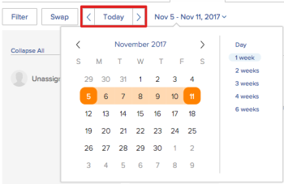

# 開始使用資源計畫

>[!IMPORTANT]
>  
>自2023年1月的23.1版開始，本文所述的排程功能已遭取代，並已從Adobe Workfront中移除。   
>  
>  2023年初，23.1版發行後不久，也將移除本文。 此時，建議您據以更新任何書籤。 
> 
> 您現在可以使用工作負載平衡器來調度資源的工作。 
>  
> 有關使用工作負載平衡器調度資源的資訊，請參見一節 [工作負載平衡器](../../resource-mgmt/workload-balancer/workload-balancer.md). 

<!--  

>[!CAUTION] 
> 
> 
> The information in this article refers to the Adobe Workfront's Scheduling tools. The Scheduling areas have been removed from the Preview environment and will be removed from the Production environment in **January 2023**.   
>  Instead, you can schedule resources in the Workload Balancer.  
> 
>*  For information about scheduling resources using the Workload Balancer, see the section [The Workload Balancer](../../resource-mgmt/workload-balancer/workload-balancer.md). 
> 
>*  For more information about the deprecation and removal of the Scheduling tools, see [Deprecation of Resource Scheduling tools in Adobe Workfront](../../resource-mgmt/resource-mgmt-overview/deprecate-resource-scheduling.md). 
-->

<!--

(NOTE: LINKED TO THE PRODUCT FROM: ALL SCHEDULING TOOLS: GLOBAL, TEAM, PROJECT STAFFING *** LINKED TO LOTS OF ARTICLES, AS WELL!) 

(NOTE: Alina: this article should be divided in multiple articles, but CAREFULLY because some sections are linked to the UI)

-->

在Adobe Workfront中使用資源排程功能時，您可以更輕鬆地將任務和問題指派給適當的使用者。 您可以考慮作業角色和使用者可用性，決定哪些使用者能完成工作或問題。

以下小節提供在Workfront中使用排程區域的詳細資訊。

## 使用Workfront中排程工具的必要條件

>[!IMPORTANT]
>
>本文所述的先決條件僅適用於Workfront的排程區域。 有關使用工作負載平衡器的最佳實踐的資訊，請參見 [工作負載平衡器概述](../../resource-mgmt/workload-balancer/overview-workload-balancer.md).

若要在Workfront中成功使用資源排程功能，您必須先確定您、您的專案以及工作和問題符合下列必要條件：

* [使用者必要條件](#user-prerequisites)
* [專案必要條件](#project-prerequisites)
* [任務和問題先決條件](#task-and-issue-prerequisites)

### 使用者必要條件 {#user-prerequisites}

您可以使用「計畫」頁簽、「人員配置」頁簽或「工作在」頁簽中提供的資源計畫工具，以滿足以下條件：

**將資源作為資源管理器進行計畫時（從「計畫」頁簽）:**

* 對於要為其管理資源的項目，您將指定為資源管理器。

   有關為項目指定資源管理員的詳細資訊，請參見文章 [為項目或模板指定資源管理器](../../manage-work/projects/planning-a-project/designate-resource-managers-for-projects-and-templates.md).

* 您是具有計畫許可證的用戶。

預設情況下，僅當在系統中定義了作業角色（主作業角色或輔助作業角色），並且該作業角色與分配給當前可見的任務或問題的作業角色匹配時，用戶才顯示在調度時間軸上 **未指派** 排程時間表上的區域。 您可以禁用此功能，以便允許將任務和問題分配給任何用戶，而不管該用戶在其用戶配置檔案上是否定義了與任務的角色分配相匹配的角色，還是分配給任務的問題。 如需詳細資訊，請參閱文章 [在「排程」區域中，無論角色和群組成員資格為何，都允許指派使用者](../../resource-mgmt/resource-scheduling/assignments-regardless-of-role-or-group-scheduling-areas.md).

預設情況下，只能對在其用戶配置檔案上定義了與指派給他們的任務或問題的角色分配相匹配的角色的用戶進行分配。

**將資源安排為項目組的成員時（從項目的「人員配置」頁簽）:**

* 您擁有檢視、貢獻或管理專案的權限
* 您擁有計畫或工作許可證

<!--
<note type="note">  If Workfront has not removed the Use New Scheduling Area option from your Scheduling settings, users must have a Plan license and Manage permissions to the project to view the Scheduling timeline. For more information about the removal of the Use New Scheduling Area option, see the article
<a href="../../product-announcements/announcements/announcement-archive/replace-flash-tools.md" class="MCXref xref">Replacement of Flash-based tools in Adobe Workfront</a>.
</note>
-->

**將資源安排為團隊成員時（從「工作日」頁簽）:**

* 您是團隊的成員\
   團隊的所有成員都顯示在計畫時間表上。 分配給團隊且未分配給用戶的任務和問題顯示在「未分配」區域中。 分配給團隊和團隊中某個用戶的任務和問題顯示在分配給他們的用戶的行中。

### 專案必要條件 {#project-prerequisites}

只有在從計畫時間表中將資源作為資源管理器時，才適用本節中介紹的項目先決條件。

您管理的項目必須處於以下狀態之一（或與這些狀態之一相等的狀態），以便在計畫時間表中顯示這些項目的工作項目：計畫、當前或已批准。 依預設，只會顯示處於「目前」狀態的專案。

如需專案狀態的詳細資訊，請參閱文章 [建立或編輯狀態](../../administration-and-setup/customize-workfront/creating-custom-status-and-priority-labels/create-or-edit-a-status.md).

<!--

(NOTE: [! I assume this doesn't apply when using the Staffing tab on a single project? The project can be in whatever status?]) 

-->

### 任務和問題先決條件 {#task-and-issue-prerequisites}

為了在Workfront中使用資源排程工具時最有效，請確定系統中的任務和問題已定義下列條件：

* 持續時間
* 計劃開始日期
* 計畫小時\
   要修改用戶分配，需要計畫小時數，如文章所述 [在「計畫」區域中管理用戶分配](../../resource-mgmt/resource-scheduling/manage-allocations-scheduling-areas.md).

   >[!NOTE]
   >
   >「資源計畫」卡中的「計畫小時數」欄位實際顯示所有workPerDay值的總和，而不是任務上的「計畫小時數」。 workPerDay值是通過將「計畫小時數」值除以「任務持續時間」來計算的。 對於非零持續時間，值通常與任務的「計畫小時數」匹配，儘管由於捨入而可能發生一些小的差異。 當持續時間為0天時，計畫小時數會顯示0小時。

* 角色分配

## 在計畫區域中查看資訊

* [在「排程」區域中找出並檢視資訊](#locate-and-view-information-in-the-scheduling-areas)
* [查看資源分配和詳細資訊](#view-resource-assignments-and-details)
* [將排程區域上的工作和問題減到最少](#minimize-tasks-and-issues-on-the-scheduling-areas)
* [調整計畫區域的日期範圍](#adjust-the-date-range-of-the-scheduling-areas)

### 在「排程」區域中找出並檢視資訊 {#locate-and-view-information-in-the-scheduling-areas}

您可以根據要排程資源的位置，在Workfront的下列區域中存取「排程時間軸」 :

* 對於多個項目，在「計畫」區域
* 針對排程區段中的專案
* 針對團隊，在「排程」區段中

1. 前往多個專案、個別專案或團隊的排程時間軸：

   * **適用於多個專案**:  按一下 **主菜單** 圖示  在Workfront的右上角，按一下 **資源配置>工作負載平衡器**，然後選取 **排程** 的下拉式功能表。
   * **針對個別專案**:前往專案，按一下 **工作負載平衡器** 區段，然後選取 **排程** 從左上角的下拉式功能表。
   * **團隊**:按一下 **主菜單** 圖示  在Workfront的右上角，然後按一下 **團隊**，選取團隊，按一下 **工作負載平衡器** 在左側面板中，選取 **排程** 從左上角的下拉式功能表。

1. （選用）按一下 **全螢幕** 圖示，位於排程時間軸的右上角。\
   \
   排程時間軸會以全螢幕模式顯示。 以全螢幕模式查看排程時間軸時，排程時間軸佔據整個螢幕；所有其他資訊都會隱藏（包括任何團隊或專案資訊、全域導覽列和瀏覽器資訊）。

1. （選用）若要退出全螢幕模式，請執行下列其中一項操作：

   * 按一下 **全螢幕** 表徵圖。
   * 按Esc鍵。

### 查看資源分配和詳細資訊 {#view-resource-assignments-and-details}

您可以查看當前資源分配以及有關計畫時間表上單個任務和問題的其他詳細資訊。

1. 前往多個專案、個別專案或團隊的排程時間軸：

   * **適用於多個專案**:  按一下 **主菜單** 圖示  在Workfront的右上角，按一下 **資源配置>工作負載平衡器**，然後選取 **排程** 的下拉式功能表。
   * **針對個別專案**:前往專案，按一下 **工作負載平衡器** 區段，然後選取 **排程** 從左上角的下拉式功能表。
   * **團隊**:按一下 **主菜單** 圖示  在Workfront的右上角，然後按一下 **團隊**，選取團隊，按一下 **工作負載平衡器** 在左側面板中，選取 **排程** 從左上角的下拉式功能表。

1. （可選）若要自訂排程時間軸上顯示的內容，請建立篩選器，如 [篩選「排程」區域中的資訊](../../resource-mgmt/resource-scheduling/filter-scheduling-area.md).
1. 展開任務或問題以查看以下資訊：

   * **專案：** 任務所在項目的名稱和連結。

   * **日期：** 與任務關聯的「開始日期」和「到期日」日期。

   * **計畫小時數：** 與任務關聯的計畫小時數。\
      只有將任務分配給用戶或作業角色時，才會顯示「計畫小時數」。

   * **前身表徵圖：** 任何與任務關聯的前置任務。 僅當有前置任務關聯時，才顯示前置任務表徵圖。 前置表徵圖在前置完成且任務已準備就緒後為綠色。

   * **分配：** 與任務關聯的任何用戶或作業角色分配。 作業角色分配以括弧顯示在用戶分配旁邊。\
      未顯示團隊分配。\
      如果您有Contribute對任務或問題的訪問權限，則可以修改任務或問題持續時間內每天分配用戶的小時數。 有關修改用戶分配的詳細資訊，請參閱文章 [在「計畫」區域中管理用戶分配](../../resource-mgmt/resource-scheduling/manage-allocations-scheduling-areas.md).

### 將排程區域上的工作和問題減到最少 {#minimize-tasks-and-issues-on-the-scheduling-areas}

將任務和問題減到最少，可讓您在單一畫面上檢視大量使用者的使用者指派。\
預設會將排程時間軸上的所有任務和問題最小化。

當任務和問題最小化時，您可以：

* 查看任務持續時間
* 檢視專案顏色
* 從「未分配」區域將任務分配給計畫時間表上的用戶

當任務和問題最小化時，您不能：

* 查看任務名
* 拖動已分配給用戶的任務並重新分配
* 展開任務以查看詳細資訊

如果啟用「顯示每日計畫小時數的總計」設定，則任務和問題最小化時，您只能：

* 檢視每位使用者的每日計畫時數總計。

如本節所述，當您將任務和問題最小化時，這些更改只會顯示給您。 在您展開工作或結束瀏覽器作業之前，工作和問題仍會最小化。 （重新整理頁面不會將最小化的工作和問題還原為展開狀態）。

在排程時間軸上，您可以將針對個別使用者、工作角色或所有使用者顯示的工作和問題降至最低。

* [將個別使用者的工作和問題減到最少](#minimize-tasks-and-issues-for-individual-users)
* [將工作角色的任務和問題減到最少](#minimize-tasks-and-issues-for-a-job-role)
* [將所有使用者的工作和問題減到最少](#minimize-tasks-and-issues-for-all-users)

#### 將個別使用者的工作和問題減到最少 {#minimize-tasks-and-issues-for-individual-users}

1. 按一下您要將其任務和問題最小化之排程時間表上，使用者旁邊的脫字元號。\
   \
   任務和問題的顯示方式取決於以下設定：

   * 如果您啟用 **顯示每日計畫小時數總計** 適用下列條件：

      * 僅顯示用戶的計畫時數
      * 隱藏任務和問題
   * 如果您啟用 **顯示每日計畫小時數總計** 將使用者的工作和問題降至最低。\
      

#### 將工作角色的任務和問題減到最少 {#minimize-tasks-and-issues-for-a-job-role}

您可以將與特定作業角色相關聯的所有使用者的任務和問題降至最低。

1. 按一下排程時間軸上作業角色旁的脫字元號，該時間軸包含您想要將其任務和問題最小化的使用者。\
   \
   如果禁用 **顯示每日計畫小時數總計** 設定。\
   系統會隱藏任務和問題，如果啟用此設定，則只會顯示使用者的「計畫時數」。\
   

#### 將所有使用者的工作和問題減到最少 {#minimize-tasks-and-issues-for-all-users}

1. 按一下 **全部折疊** （在「用戶和角色」區域的頂部）。\
   \
   或\
   在按住Shift鍵的同時，按一下計畫時間軸上任何用戶或作業角色旁邊的脫字元號。\
   \
   如果禁用 **顯示每日計畫小時數總計** 若啟用，則會隱藏工作和問題。\
   若 **顯示每日計畫小時數總計** 僅對使用者啟用「計畫小時數」。 「未分配」區域的任務和問題仍保持最小。\
   

### 調整計畫區域的日期範圍 {#adjust-the-date-range-of-the-scheduling-areas}

預設情況下，從當天開始，排程時間軸會顯示連續14天（包括週末）。

使用下列任一選項修改計畫時間表上顯示資料的日期範圍：

* **日期範圍選項：** 按一下目前的日期範圍，然後選取要在時間軸上顯示的周數。 您可以顯示「日」（單日）、「1週」（7天）、「2週」（14天）、「3週」（21天）、「4週」（28天）或「6週」（42天）。\
   調整排程時間表的日期範圍時，請考量下列事項：

   * 您選取的日期範圍選項會在您下次造訪排程時間軸時保留。

      <!--   
     
(NOTE: [! Not sure if this is going to apply to all 3 scheduling areas...]) 
   
     -->

   * 在「日」視圖中查看計畫時間表時，不顯示用戶分配。\
      

* **日曆：** 按一下目前的日期範圍，然後按一下當天之前或之後的某天。 當天與所選日期之間的時間是新範圍。\
   

* **今天：** 按一下此選項可顯示當天。 接著，當天會顯示在日期範圍的最左側。\
   按一下向左和向右箭頭，檢視過去或未來日期。

   >[!NOTE]
   >
   >重新整理頁面時，會保留您選取的時間範圍。

   

* **拖放日期範圍：** 拖曳排程時間軸頂端的日期範圍。\
   

## 在排程區域中配置設定

預設會在排程時間軸中顯示特定資訊。 您也可以配置設定以顯示其他資訊。

如需在排程時間軸中設定設定的相關資訊，請參閱下列文章：

[在排程區域中配置設定](../../resource-mgmt/resource-scheduling/configure-settings-scheduling-areas.md)

[在「排程」區域中，無論角色和群組成員資格為何，都允許指派使用者](../../resource-mgmt/resource-scheduling/assignments-regardless-of-role-or-group-scheduling-areas.md)

[在「計畫」區域中自動分配未分配的任務和問題](../../resource-mgmt/resource-scheduling/automatically-assign-items-scheduling-areas.md)

## 篩選排程區域中的資訊

您可以建立篩選器，以定義排程時間軸上顯示的內容。

如需詳細資訊，請參閱文章 [篩選「排程」區域中的資訊](../../resource-mgmt/resource-scheduling/filter-scheduling-area.md).

## 修改用戶分配和分配

* [修改用戶分配](#modify-user-assignments)
* [修改用戶分配](#modify-user-allocations)

### 修改用戶分配 {#modify-user-assignments}

您可以使用交換工具或直接從計畫時間表修改任務和問題，從「計畫」頁簽修改用戶分配（在計畫項目資源時）。 您可以直接從計畫時間軸修改任務和問題，從「工作中」頁簽修改用戶分配（當計畫團隊的資源時）。

如需詳細資訊，請參閱文章 [在「計畫」區域中手動分配未分配的任務和問題](../../resource-mgmt/resource-scheduling/manually-assign-items-scheduling-areas.md).

### 修改用戶分配 {#modify-user-allocations}

您可以確定如何為任務或問題分配計畫小時數給用戶。 「計畫小時數」可分為以下幾種：

* 在指派給任務或問題的使用者中。
* 任務或問題的整個期間。

如需詳細資訊，請參閱文章 [在「計畫」區域中管理用戶分配](../../resource-mgmt/resource-scheduling/manage-allocations-scheduling-areas.md).
