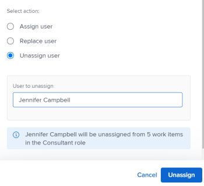

# 使用工作負載平衡器大量指派工作

<!--Audited: 07/2024-->

您可以使用Adobe Workfront工作負載平衡器大量指派資源給多個任務和問題。

如需使用工作負載平衡器指派工作給使用者的一般資訊，請參閱在工作負載平衡器](../../resource-mgmt/workload-balancer/assign-work-in-workload-balancer.md)中指派工作的總覽。[

## 存取需求

+++ 展開以檢視本文中功能的存取需求。

您必須具有下列存取權才能執行本文中的步驟：

<table style="table-layout:auto"> 
 <col> 
 <col> 
 <tbody> 
  <tr> 
   <td role="rowheader">Adobe Workfront計畫</td> 
   <td> 
任何 
 </td> 
  </tr> 
  <tr> 
   <td role="rowheader">Adobe Workfront授權</td> 
   <td>
新增：標準

       
或

       
目前：計畫，在資源區域使用工作負載平衡器時； 
       工作，使用團隊或專案的工作負載平衡器時
</td>
  </tr>
  <tr> 
   <td role="rowheader">存取層級設定</td> 
   <td> 
編輯下列專案的存取權：
 
    <ul> 
     <li>資源管理</li> 
     <li>專案</li> 
     <li>任務</li> 
     <li>問題</li> 
    </ul>
   </td> 
  </tr> 
  <tr> 
   <td role="rowheader">物件許可權</td> 
   <td>Contribute許可權或以上至專案、任務和問題，包括進行指派</td> 
  </tr> 
 </tbody> 
</table>

如需有關此表格的詳細資訊，請參閱Workfront檔案中的[存取需求](/help/quicksilver/administration-and-setup/add-users/access-levels-and-object-permissions/access-level-requirements-in-documentation.md)。

+++

## 在工作負載平衡器中進行大量指派的注意事項

* 您可以快速管理一個或多個專案中多個任務和問題的使用者指派。 指派中的變更會立即顯示在工作負載平衡器中。
* 您無法將資源指派給已完成的工作專案，或指派給已完成專案上的專案。
* 大量指派使用者時，您可以執行下列動作：

   * 將使用者指派給目前指派給工作角色的所有工作專案。
   * 取代使用者之間的使用者指派。
   * 從使用者的所有工作專案解除指派使用者。

**範例**

* 您負責為多個新專案進行使用者指派。 專案原本是從範本建立的，工作角色已指派給專案內的各種任務。 您想要將特定使用者Jackie Simms指派給目前指派給工作角色的所有任務。 您可以使用Assign函式將這些工作指派給Jackie Simms。
* 3個不同專案中的45個任務指派給Jackie Simms。 Jackie離開了組織，現在您需要將其任務重新指派給其他使用者。 您可以使用「取代」功能，將這些工作指派給新人員。
* 2個不同專案中的10個任務指派給另一位使用者Rick Kuvec。 您意識到這些任務錯誤地指派了Rick，但您不確定此時需要指派給誰。 您需要同時將Rick解除指派給所有工作。 您可以使用「取消指派」功能將Rick從這些工作中移除。

## 在工作負載平衡器中大量指派工作

1. 前往您要指派工作的工作負載平衡器。

   您可以使用資源區域、專案或團隊層級的工作負載平衡器將工作指派給使用者。 如需有關工作負載平衡器在Workfront中的位置的詳細資訊，請參閱[找到工作負載平衡器](../../resource-mgmt/workload-balancer/locate-workload-balancer.md)。

1. 按一下工作負載平衡器頂端的&#x200B;**大量指派** 。

   「批次任務」面板將在工作負載平衡器的右側開啟。

1. （視條件而定）如果您要從「資源」區域或團隊存取「工作負載平衡器」，請展開「**專案：名稱**」下拉式功能表，並使用篩選修飾元來選取要指派給您的一或多個專案。 您可以依名稱（此為預設選項）或狀態來選取專案。

   如需Workfront篩選修飾元的資訊，請參閱[篩選和條件修飾元](../../reports-and-dashboards/reports/reporting-elements/filter-condition-modifiers.md)。

   >[!NOTE]
   >
   >存取專案的工作負載平衡器時，預設會選取專案名稱。

   

1. （選擇性）按一下&#x200B;**選取專案任務**&#x200B;以選取要指派給您的任務，然後在&#x200B;**任務：名稱**&#x200B;下拉式功能表中，依名稱（此為預設選項）或狀態選取任務，並使用篩選修飾元來搜尋特定任務。

   如需Workfront篩選修飾元的資訊，請參閱[篩選和條件修飾元](../../reports-and-dashboards/reports/reporting-elements/filter-condition-modifiers.md)。

   >[!NOTE]
   >
   >您無法選取處於完成狀態的任務。

   

   >[!TIP]
   >
   >如果您想要對問題和任務進行批次指派，請將此選取項保留空白。

1. （選擇性）按一下其中一個選取條件旁的&#x200B;**刪除**&#x200B;圖示

   或

   按一下「大量任務」面板右上角的「全部清除&#x200B;****」以移除所有選取專案。

1. 選取下列其中一個選項，然後繼續下列步驟：

   * [指派使用者](#assign-user)
   * [取代使用者](#replace-user)
   * [解除指派使用者](#unassign-user)

   >[!TIP]
   >
   >如果沒有符合所選篩選條件的專案，這些選項將會變暗。

### 指派使用者 {#assign-user}

當您在工作負載平衡器，出現以下情況：

* 使用者會指派給目前指派給選定專案內指定角色的所有工作專案。
* 使用者未指派給下列型別的工作專案：

   * 已指派給使用者的專案。
   * 已完成的專案。

* 如果您選取的使用者與指定的角色沒有關聯，則該角色會由使用者主要角色中的使用者取代。

若要將使用者指派給先前指派給工作角色的工作專案，請執行下列動作：

1. 開始使用工作負載平衡器中的大量指派來指派工作專案，如上所述，並選取&#x200B;**指派**。

1. 在&#x200B;**角色指派**&#x200B;欄位中，按一下下拉箭頭，從角色清單中選擇。 只會顯示指定專案中目前指派的角色。 這是必填欄位。

   

1. 在&#x200B;**要指派的使用者**&#x200B;欄位中，按一下下拉箭頭，從建議的使用者清單中選擇，或輸入其他使用者的名稱。

   從下列區域選取使用者：

   * **建議的指派**：滿足所選角色且符合智慧指派條件的使用者。 如需詳細資訊，請參閱[智慧指派總覽](../../manage-work/tasks/assign-tasks/smart-assignments.md)。
   * **其他指派**：系統中可以履行所選角色的所有使用者。

     >[!TIP]
     >
     >只有前50名使用者會列在「其他指派」區域中。

   選取使用者後，Workfront會顯示附註，說明將指派您指定之使用者的專案數量，以及這些使用者將取代的工作角色。

   >[!TIP]
   >
   >使用者的所有角色都會顯示在清單中，且位於使用者名稱下方。

1. 按一下&#x200B;**指派**。

   指定的角色會取代為您選取的使用者。

   您會收到確認，告知您有多少個工作專案已將選取的角色取代為選取的使用者。

   

### 取代使用者 {#replace-user}

您可以在選取的專案中，以其他使用者取代已指派給工作專案的使用者。

當您在工作負載平衡器使用大量指派將使用者替換為另一個使用者時，會發生以下情況：

* 取代使用者會指派給目前指派給所選專案中原始使用者的所有工作專案。

* 新使用者未指派給任何已標示為「完成」的工作專案。
* 如果與第一使用者關聯的角色與第二使用者的任何角色都不相符，則會將第二使用者指派為其主要角色。

以其他使用者取代使用者：

1. 開始在工作負載平衡器中指派工作專案，如上所述，並選取&#x200B;**取代**。
1. 在&#x200B;**目前指派的使用者**&#x200B;欄位中，按一下下拉箭頭，從使用者清單中選擇。 僅顯示指定專案內目前指派給未完成工作專案的使用者。 這是必填欄位。

   

1. 在&#x200B;**要指派的使用者**&#x200B;欄位中，按一下下拉箭頭，從建議的使用者清單中選擇，或輸入其他使用者名稱。 依預設，清單中所列的使用者符合「智慧指派」的條件。 如需詳細資訊，請參閱[智慧指派總覽](../../manage-work/tasks/assign-tasks/smart-assignments.md)。

   Workfront會顯示一個附註，說明目前指派的使用者將取代第二個使用者的專案數量，以及這些使用者將取代哪些角色。

   

1. 按一下&#x200B;**取代**。

   所選取的第一個使用者會由所選專案中所有工作專案中的第二個使用者取代。

   您會收到確認，確認有多少工作專案已將原始使用者指派取代為所選的第二位使用者。

### 解除指派使用者 {#unassign-user}

您可以在選定專案中，將使用者從所有指派給該使用者的工作專案中取消指派。

當您使用工作負載平衡器中的大量指派從使用者的所有指派中取消指派使用者時，會發生以下情況：

* 指定的使用者會從指派給該使用者的所有工作專案中移除。
* 如果未指派的使用者與工作角色相關聯，則移除使用者後，工作角色仍會指派給工作專案。

* 如果將指定的使用者指派給已完成的工作專案，則該使用者仍會指派給這些工作專案。

如需有關使用者和工作角色指派的詳細資訊，請參閱[在工作負載平衡器](../../resource-mgmt/workload-balancer/assign-work-in-workload-balancer.md)中指派工作的總覽。

若要從所選專案中的工作專案或針對已指派使用者的所選任務或問題取消指派使用者：

1. 開始在工作負載平衡器中指派工作專案，如上所述，並選取&#x200B;**取消指派**。

1. 在&#x200B;**要取消指派的使用者**&#x200B;欄位中，按一下下拉箭頭，從使用者清單中選擇。 只有目前指派給指定專案中未完成工作專案的使用者才會顯示。 這是必填欄位。

   

   Workfront會顯示附註，說明目前指派的使用者將被取消指派的專案數量。

   

1. 按一下&#x200B;**取消指派**。\
   您會收到有關指定的使用者被移除的工作專案數目的確認。

