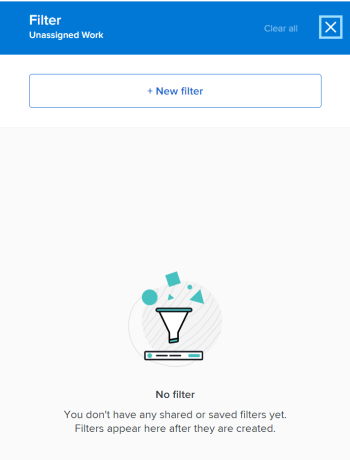

# 篩選工作負載平衡器中的資訊

<!--
(when they add custom fields to fitlering, add the caveat you added for the Resource Planner : only field NAMES and not LABELS are to be found in the drop-down >> ADD THIS IN THE STEP BELOW WHEN ADDING A FILTER)
-->

作為資源管理器，您可以使用工作負載平衡器來查看和管理用戶的工作負載。 有關工作負載平衡器的更一般資訊，請參見以下文章：

* [工作負載平衡器概述](../../resource-mgmt/workload-balancer/overview-workload-balancer.md)
* [導航工作負載平衡器](../../resource-mgmt/workload-balancer/navigate-the-workload-balancer.md)

>[!IMPORTANT]
>
>為了高效地查找工作項並將重點放在您管理的用戶或項目上，強烈建議您在工作負載平衡器中使用篩選器。 這可讓您在開始管理資源的指派之前，顯示正確的資訊。
>
>保存並應用新篩選器，然後從工作負載平衡器中導航時，即使註銷並重新登錄，該篩選器也會保留。

本文包含有關工作負載平衡器中篩選器的資訊。 如需Workfront中篩選器的相關資訊，請參閱 [Adobe Workfront中的篩選器概觀](../../reports-and-dashboards/reports/reporting-elements/filters-overview.md).

## 存取需求

您必須具備下列條件：

<table style="table-layout:auto"> 
 <col> 
 </col> 
 <col> 
 </col> 
 <tbody> 
  <tr> 
   <td role="rowheader">Adobe Workfront計畫*</td> 
   <td> 
任何計畫
 </td> 
  </tr> 
  <tr> 
   <td role="rowheader">Adobe Workfront授權*</td> 
   <td> 
在資源區中使用工作負載平衡器時進行計畫

   
使用團隊或項目的工作負載平衡器時工作

 </td> 
  </tr> 
  <tr> 
   <td role="rowheader">存取層級*</td> 
   <td> 
檢視或更高存取權：
 
    <ul> 
     <li> 
資源管理
 </li> 
     <li> 
專案
 </li> 
     <li> 
任務
 </li> 
     <li> 
問題
 </li> 
     <li data-mc-conditions="QuicksilverOrClassic.Quicksilver"> 
篩選器、檢視和群組
 </li> 
    </ul> 
在建立或編輯篩選器時，編輯對篩選器、檢視和群組的存取權 
 
<b>附註</b>

如果您仍無權存取，請洽詢您的Workfront管理員，他們是否在您的存取層級設定其他限制。 如需Workfront管理員如何變更您的存取層級的詳細資訊，請參閱 <a href="../../administration-and-setup/add-users/configure-and-grant-access/create-modify-access-levels.md" class="MCXref xref">建立或修改自訂存取層級</a>.
 </td>
</tr> 
  <tr> 
   <td role="rowheader">物件權限</td> 
   <td> 
檢視專案、工作、問題的權限或更高權限

   
管理您要編輯或刪除之篩選器的權限

     
 
有關請求其他訪問的資訊，請參閱 <a href="../../workfront-basics/grant-and-request-access-to-objects/request-access.md" class="MCXref xref">請求對對象的訪問 </a>.
 </td> 
  </tr> 
 </tbody> 
</table>

*若要了解您擁有的計畫、授權類型或存取權，請聯絡您的Workfront管理員。

## 工作負載平衡器中的篩選器概述

在工作負載平衡器中使用篩選器時，請考慮以下事項：

* 根據您從何處訪問工作負載平衡器，Workfront可能已在為您篩選資訊。 如需預先套用篩選器的相關資訊，請參閱區段 [工作負載平衡器中預先應用的篩選器](#pre-applied-filters-in-the-workload-balancer) 這篇文章。
* 您可以建立並套用篩選器而不儲存，也可以儲存篩選器以供稍後重複使用。
* 如果您未儲存篩選器，則可重新整理頁面，回復成原始清單。
* 您可以檢視您建立的篩選器，或其他使用者建立並與您共用的篩選器。
* 當您刪除或編輯共用篩選器時，也會為共用篩選器的所有人刪除或編輯篩選器。
* 在工作負載平衡器中在一個區域中建立篩選器時，這些篩選器在其他區域中不可用。

   例如，在「資源配置」區域中建立的篩選器在項目或團隊的工作負載平衡器中不可用。

   有關在何處查找工作負載平衡器的資訊，請參見 [找到工作負載平衡器](../../resource-mgmt/workload-balancer/locate-workload-balancer.md).

* 您只能查看與選定篩選器匹配的項目，這些篩選器還與工作負載平衡器螢幕上顯示的時間軸內的日期匹配。

## 工作負載平衡器中預先應用的篩選器 {#pre-applied-filters-in-the-workload-balancer}

工作負載平衡器將在兩個不同的區域中顯示資訊：

* **未分配的工作區**:尚未指派給使用者的工作項目。
* **分配的工作區**:指派給使用者的工作項目。

   如需每個區域中顯示內容的詳細資訊，請參閱 [導航工作負載平衡器](../../resource-mgmt/workload-balancer/navigate-the-workload-balancer.md).

>[!IMPORTANT]
>
>工作負載平衡器的每個區域都有各自的一組篩選器，它們彼此獨立工作。 您必須設定兩個篩選器，以指出您要在每個區域中查看的資訊。

工作負載平衡器顯示用戶及其工作項。
只有項目的日期與螢幕上顯示的時間範圍相符時，才會顯示指派給使用者的工作項目。

根據您從何處訪問工作負載平衡器，「未分配」和「已分配」區域已按某些標準進行篩選，如下表所述：

<table style="table-layout:auto"> 
 <col> 
 <col> 
 <col> 
 <tbody> 
  <tr> 
   <td role="rowheader"><strong>Workfront區域，可在此訪問Workload Balancer</strong></td> 
   <td><b>預設情況下顯示在「未分配的工作」區域中的項目</b> </td> 
   <td><b>預設情況下顯示在「已分配的工作」區域中的項目</b> </td> 
  </tr> 
  <tr> 
   <td role="rowheader">資源區</td> 
   <td>預設不會在此顯示任何項目。 您必須自定義篩選器才能查看此區域中的工作項。</td> 
   <td>屬於您任何團隊成員的使用者及其工作項目。 </td> 
  </tr> 
  <tr> 
   <td role="rowheader">團隊</td> 
   <td>指派給團隊或團隊的工作項目和工作角色。 </td> 
   <td> 
屬於所選團隊成員的用戶及其工作項。
 </td> 
  </tr> 
  <tr> 
   <td role="rowheader">專案</td> 
   <td> 
此區域中將顯示分配給所選項目中的團隊或職務角色的未分配工作項或項目。
 </td> 
   <td> 
在系統預設篩選器時，分配給選定項目上至少一個工作項及其項目上的工作項的用戶 <b>此項目的工作項</b> 中所有規則的URL。 

系統預設篩選器時 <b>此項目的工作項</b> 取消選擇，則項目的「已分配工作」區域將顯示分配給選定項目上至少一個項目的用戶的所有工作項。  
 預設會取消選取此篩選器。

<b>附註</b>

您可以在項目的工作負載平衡器中啟用「顯示所有用戶」選項，以顯示系統中的所有用戶。 如需詳細資訊，請參閱 <a href="../workload-balancer/navigate-the-workload-balancer.md" class="MCXref xref">導航工作負載平衡器</a>

</td> 
  </tr> 
 </tbody> 
</table>

## 建立工作負載平衡器篩選器

在工作負載平衡器中為「未分配的工作」和「已分配的工作」區域建立篩選器的過程是相同的，無論您從何處訪問工作負載平衡器。 有關查找工作負載平衡器的資訊，請參見 [找到工作負載平衡器](../../resource-mgmt/workload-balancer/locate-workload-balancer.md).

您可以從頭建立篩選器，或編輯其中一個預先定義的篩選器。 如需可編輯之現有篩選器的相關資訊，請參閱 [編輯工作負載平衡器中的現有篩選器](#edit-an-existing-filter-in-the-workload-balancer) 一節。

1. 轉到工作負載平衡器。

   有關訪問工作負載平衡器的資訊，請參見 [導航工作負載平衡器](../../resource-mgmt/workload-balancer/navigate-the-workload-balancer.md).

1. 按一下 **篩選** 圖示  在 **未分配的工作** 或 **已分配的工作** 區域。

   篩選器產生器方塊會顯示在右側。 為建立篩選器的區域名稱會顯示在框的標題中。

   

1. （可選和條件性）如果訪問「資源」區域中的「工作負載平衡器」，則預定義的「預設」篩選器可能已應用到「已分配的工作」區域。 您可以編輯並儲存預設篩選器的復本。

   >[!TIP]
   >
   >預設篩選器會顯示屬於您任何團隊的使用者及其工作項目。 您可以編輯此篩選器的復本。

   如果您存取 [!UICONTROL 工作負載平衡器] 來自專案，[!UICONTROL 此項目的工作項]「篩選器可能已套用。 這只會顯示指派給此專案中使用者的工作項目。 您可以複製並儲存此篩選器的復本。

   依預設， [!UICONTROL 工作負載平衡器] 顯示分配給項目上所有用戶的所有工作項。

1. 按一下 **新篩選器。**

   

1. 若要建立篩選，請執行下列動作：

   1. 在第一個下拉式選單中選取欄位名稱，或按一下 **瀏覽欄位** 開始鍵入預設不顯示的欄位名稱。

      >[!IMPORTANT]
      >
      >參考自訂欄位時，您必須輸入欄位名稱，而非欄位標籤。 欄位標籤會顯示在附加至物件的自訂表單上。 如需自訂欄位名稱與標籤之間差異的詳細資訊，請參閱 [建立或編輯自訂表單](../../administration-and-setup/customize-workfront/create-manage-custom-forms/create-or-edit-a-custom-form.md).

   1. （條件性）如果您按一下 **瀏覽欄位**，在 **搜尋** 欄位，並在清單中顯示時加以選取。

      

      >[!TIP]
      >
      >您可以從下列區段中選取欄位：
      >
      >* **最近的選擇**:您最近篩選的欄位。
      >* **建議欄位**:最常用的欄位。

   1. 從第二個下拉式選單中選取修飾詞。 如需Workfront篩選修飾元的詳細資訊，請參閱 [篩選條件修飾元](../../reports-and-dashboards/reports/reporting-elements/filter-condition-modifiers.md).
   1. 為要篩選的欄位選取或輸入值。

      >[!NOTE]
      >
      > 如果要顯示特定產品組合中的工作對象，可以應用以下篩選器：&quot;Portfolio名稱包含行銷。&quot; 這會顯示屬於名稱中包含「行銷」之任何產品組合的工作項目。
      >
      >

   1. （選用）按一下 **刪除** 圖示  來移除篩選條件。

1. （選用）按一下 **新增篩選** 若要新增其他篩選條件，請重複步驟4中的動作。

   <!--(NOTE: ensure this stays correct)-->

1. 按一下 **套用** 將篩選器的結果應用到選定的工作負載平衡器區域，而不保存它。

   左側的工作項更新清單。

   >[!IMPORTANT]
   >
   >當添加的所有篩選器語句同時為true時，結果將顯示在工作負載平衡器中。

   篩選器會保留，直到您重新整理頁面為止。

   此 **套用** 按鈕已更換為 **另存為新** 按鈕。

1. 按一下 **另存為新** 儲存篩選器以供日後使用。

   

   >[!TIP]
   >
   >按一下 **取消** 您隨時都可返回篩選器建置區。

1. 選擇 **無標題篩選** 並輸入新篩選器的名稱。
1. 從 **圖示** 下拉式功能表。

   

1. （選用）新增篩選器的說明，以指出篩選器的獨特之處。 說明會顯示在篩選器清單的篩選器名稱下。
1. 按一下&#x200B;**儲存**。

   儲存的篩選會顯示在篩選方塊的「我的篩選」區域中。

   如需套用儲存篩選器的相關資訊，請參閱區段 [刪除工作負載平衡器中保存的篩選器](#delete-a-saved-filter-in-the-workload-balancer) 這篇文章。

1. （有條件）將滑鼠移至 **篩選圖示**  在 **未分配的工作** 或 **已分配的工作** 區域可顯示工具提示，其中包含目前套用的篩選器名稱或數量。

   

## 複製篩選器

您可以複製和編輯篩選器以建立新篩選器。

1. 轉到工作負載平衡器。

   有關訪問工作負載平衡器的資訊，請參見 [導航工作負載平衡器](../../resource-mgmt/workload-balancer/navigate-the-workload-balancer.md).

1. 按一下 **篩選** 圖示  在 **未分配的工作** 或 **已分配的工作** 區域。

   篩選器產生器方塊會顯示在右側。 為建立篩選器的區域名稱會顯示在框的標題中。

1. 將滑鼠移至現有篩選器上，按一下 **更多** 功能表 ，然後按一下 **複製**.

   

   >[!TIP]
   >
   > 編輯篩選器時，您可以按一下 **更多** 按一下「編輯篩選器」框左下角的菜單 **複製**.

1. 編輯所複製篩選器的下列資訊：

   * 名稱

      依預設，新的篩選器名稱為「（原始篩選器名稱）複製」。

   * 圖示
   * 說明
   * 任何欄位、修飾元或值。

1. （選用）按一下 **新增篩選** 向複製的篩選器添加更多語句。
1. 按一下 **儲存** 若要在 **我的篩選器** 的上界。

   原始篩選器保持不變，複製的篩選器會儲存為新篩選器。

## 編輯工作負載平衡器中的現有篩選器 {#edit-an-existing-filter-in-the-workload-balancer}

您可以在工作負載平衡器中編輯保存的篩選器。

>[!TIP]
>
>當您編輯與他人共用的篩選器時，他們也會看到您所做的變更。

1. 轉到工作負載平衡器。

   有關訪問工作負載平衡器的資訊，請參見 [導航工作負載平衡器](../../resource-mgmt/workload-balancer/navigate-the-workload-balancer.md).

1. 按一下 **篩選圖示**  在 **未指派** 或 **已分配的工作** 區域。\
   篩選器產生器會顯示在右側。

1. 將滑鼠移到您要編輯的篩選器上，然後按一下 **編輯** .

   

1. 執行下列任一項作業：

   * 修改任何篩選語句
   * 按一下 **新增篩選** 添加新篩選器語句
   * 按一下 **刪除** 圖示  刪除現有篩選器語句。

1. （選用）按一下 **套用**.

   結果會在左側的工作負載平衡器中更新，以說明您對篩選器所做的更改。

1. 按一下 **儲存。**

   結果將在左側的工作負載平衡器中更新，並且篩選器將用您選擇的新資訊更新。

## 刪除工作負載平衡器中保存的篩選器 {#delete-a-saved-filter-in-the-workload-balancer}

刪除篩選器之前，請先考慮下列事項：

* 您無法復原已刪除的篩選器。
* 您無法刪除預先定義的篩選。
* 無法刪除未保存的篩選器。 在登出並重新登入Workfront後，系統會自動移除這些設定。
* 刪除共用篩選器時，也會針對共用給該篩選器的所有使用者刪除該篩選器。
* 刪除所有保存的篩選器後，工作負載平衡器將根據原始預設值顯示。

>[!NOTE]
>
>當您刪除與他人共用的篩選器時，也會為其刪除該篩選器。

1. 轉到工作負載平衡器
1. 按一下 **篩選圖示**  在 **未分配的工作** 或 **已分配的工作** 區域。\
   篩選器產生器方塊會顯示在右側。

1. 將滑鼠移到篩選器上，然後按一下 **更多** 功能表 ，然後按一下 **刪除**.
   

   >[!TIP]
   >
   >編輯篩選器時，您可以按一下 **更多** 按一下「編輯篩選器」框左下角的菜單 **刪除**.

1. （選用）按一下 **取消** 以避免刪除，並返回篩選器清單。
1. 按一下 **刪除** 以確認刪除。

   系統會為您和擁有篩選器權限的所有使用者刪除篩選器。

## 在工作負載平衡器中共用篩選器

您可以共用您建立的篩選器，或其他使用者與您共用的篩選器。

在工作負載平衡器中共用篩選器時，請考慮以下事項：

* 您可以將篩選器共用給作用中的使用者、團隊、角色和公司，或是讓這些篩選器可供Workfront例項中的每個人看見。
* 在「資源分配」區域中共用的篩選器在項目或團隊的工作負載平衡器中不可見。
* 您與其他人共用的負載平衡器篩選器，不會顯示在Workfront的其他區域中。

共用篩選器：

1. 轉到工作負載平衡器
1. 按一下 **篩選圖示**  在 **未分配的工作** 或 **已分配的工作** 區域。\
   篩選器產生器方塊會顯示在右側。

1. 將滑鼠移到篩選器上，然後按一下 **更多** 功能表 ，然後按一下 **共用。**

   

   >[!TIP]
   >
   > 編輯篩選器時，您可以按一下 **更多** 按一下「編輯篩選器」框左下角的菜單 **共用**.

   篩選器共用方塊隨即顯示。

1. 啟用 **查看全系統** 設定。 這可授予Workfront中任何人檢視篩選器的權限。

   或

   開始在中輸入要共用篩選器的使用者、團隊、角色、群組或公司的名稱 **授予** 欄位。

   

1. （選用）按一下實體名稱旁的右鍵箭頭，以編輯其對篩選器的權限，然後啟用 **檢視** 或 **管理** 選項。

   

1. （可選）執行下列任一操作，以啟用或停用實體的其他權限：

   1. 按一下 **檢視** 並停用 **共用** 選項。 預設會啟用。

   1. 按一下 **管理** 並禁用 **共用** 或 **刪除** 選項。 預設會啟用。
   >[!TIP]
   >
   >使用者的權限無法高於其存取層級。 如果使用者在存取層級沒有編輯篩選器的存取權，就無法取得管理篩選器的權限。 Workfront會停用這些使用者的「管理」選項，且選項會呈現灰色。

1. 按一下 **共用**. 篩選器會與您指定的實體共用。

   您共用的篩選器會顯示在 **與我共用** 框中。

   

<!--   

## Add a filter to your favorites list

You can mark a filter as a favorite for quicker access to it. 

The filters that you mark as a favorite do not count towards your system Favorites list. There is no limit for how many filters you can favorite. 

1. Go to the Workload Balancer
1. Click the **Filter** icon  in the upper-right corner of the **Unassigned Work** or **Assigned Work** areas. The filter builder box displays on the right. 
1. Mouse over a filter, then click the **Favorite** . 
(NOTE: insert screen shot here with Favorite as part of this menu - same as above ones but with Favorite)
1. The filter is listed in the **Favorited** section inside the filter panel. 
1. (Optional) Click the **Favorite** icon again to remove the filter from the list of favorite filters
(I logged bugs for "Favorited" and "Unfavorite" wordings - make sure these have not updated)
-->
